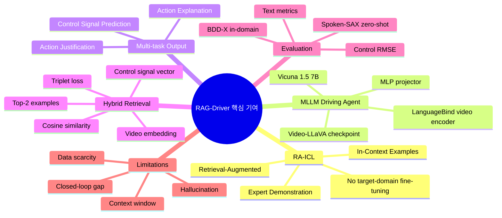
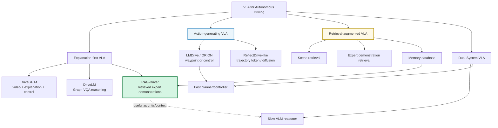
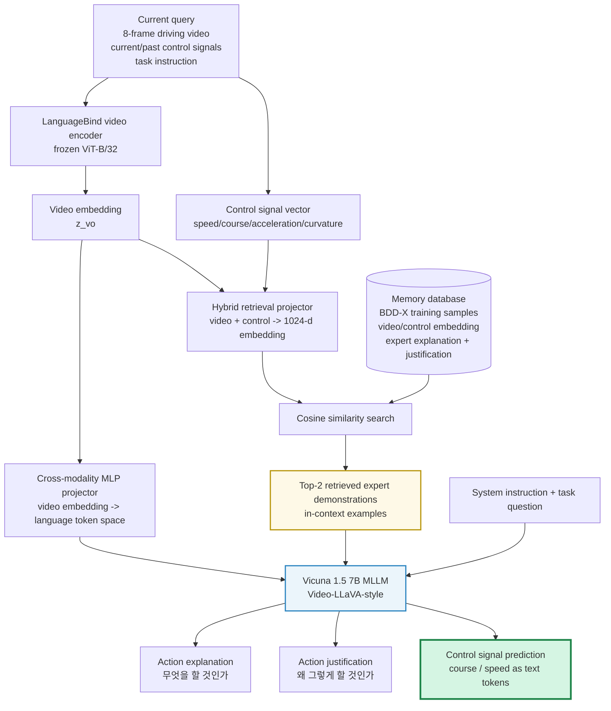
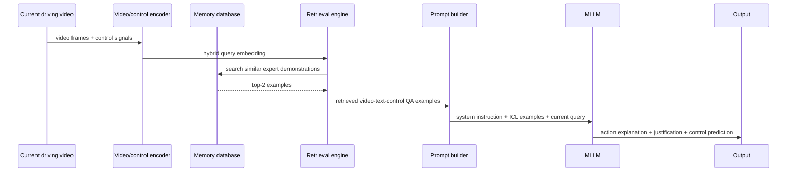
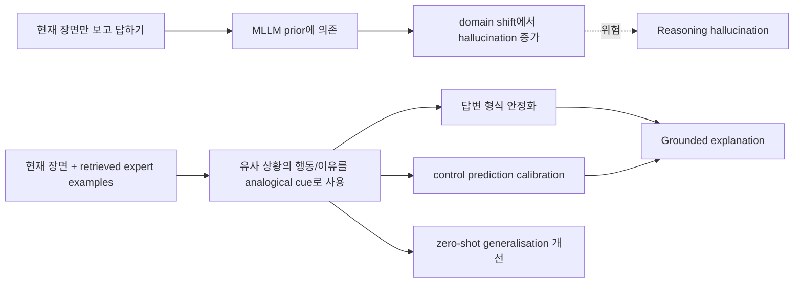
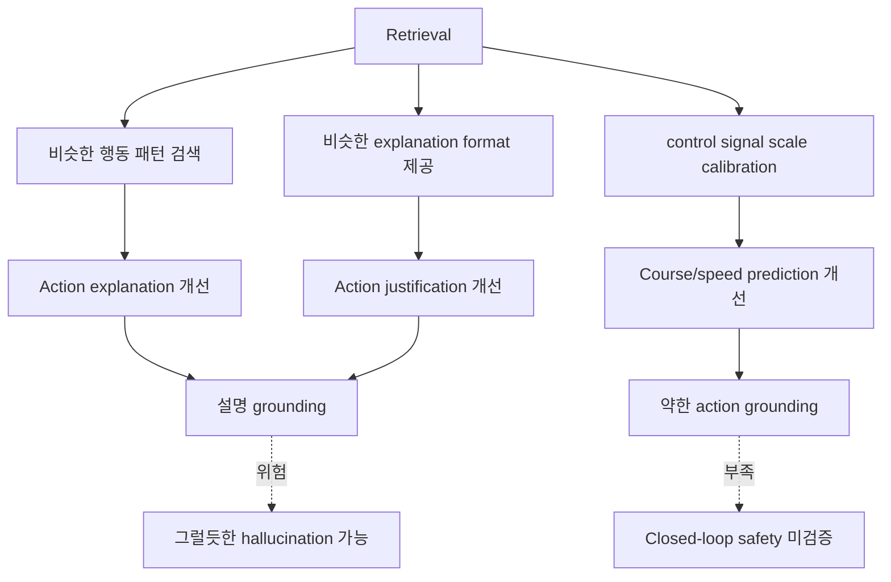
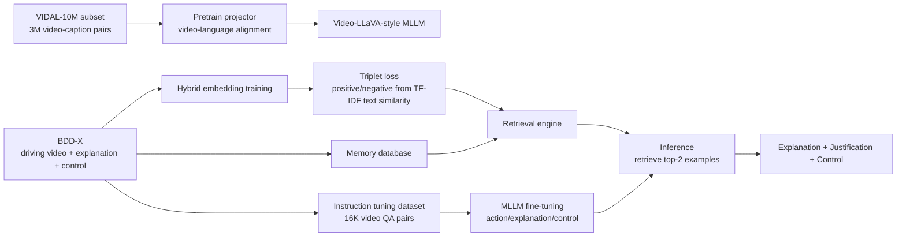
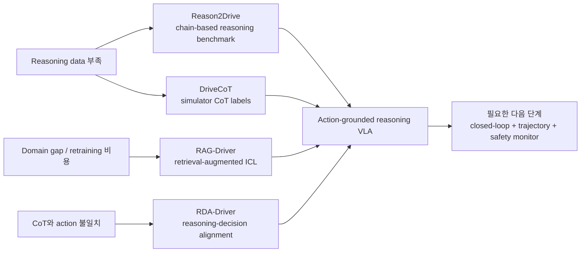
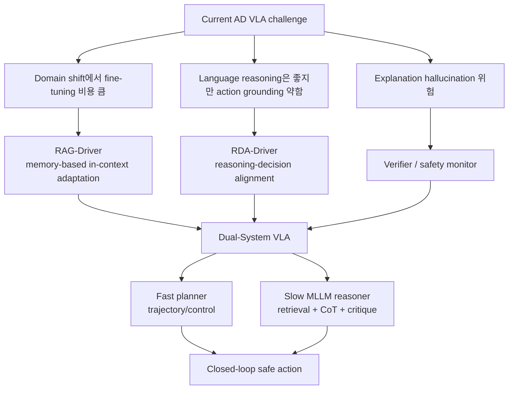
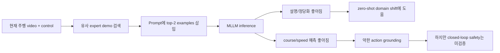

# Week 05. CoT·Retrieval·Instruction Following: RAG-Driver로 보는 “검색된 경험”이 주행 추론을 얼마나 실제 행동에 붙이는가

## Metadata

| 항목 | 내용 |
|---|---|
| Date | 2026-05-26 |
| Week | 05 / 12 |
| Original paper/source | *RAG-Driver: Generalisable Driving Explanations with Retrieval-Augmented In-Context Learning in Multi-Modal Large Language Model* |
| Korean title | **RAG-Driver: 검색 증강 In-Context Learning 기반 MLLM으로 일반화 가능한 주행 설명 만들기** |
| URL | https://arxiv.org/abs/2402.10828 |
| Version read | arXiv:2402.10828v3, arXiv API metadata + arXiv HTML full text 기반 |
| Authors | Jianhao Yuan, Shuyang Sun, Daniel Omeiza, Bo Zhao, Paul Newman, Lars Kunze, Matthew Gadd |
| Taxonomy | Retrieval-augmented explainable driving / MLLM driving agent / instruction-following VLA / explanation-first VLA |
| Reading mode | Deep read: RAG-Driver / skim: Reason2Drive, DriveCoT, RDA-Driver |
| 이번 주 focus | retrieval augmented driving, chain-of-thought, reasoning hallucination |
| Output | **Reasoning usefulness checklist** |

> 참고: 이번 노트는 PDF 전체를 줄 단위로 번역하지 않고, arXiv abstract와 HTML 본문(방법론, 실험, ablation, limitations)을 기반으로 한국어 학습 노트로 재구성했다. 수치와 구조는 논문 본문/표에서 확인한 값 위주로 사용했다.

---

## 1. 이번 주 한 문장 결론

**RAG-Driver의 핵심은 MLLM을 새 환경마다 다시 fine-tuning하지 않고, 현재 주행 video+control query와 유사한 과거 전문가 demonstration을 retrieval해서 in-context example로 넣음으로써 explanation·justification·control prediction의 일반화 성능을 끌어올리는 것이다.**

Week 04의 DriveLM이 **Graph VQA로 reasoning chain을 구조화**했다면, Week 05의 RAG-Driver는 **retrieval로 reasoning context를 보강**한다.

하지만 VLA for AD 관점에서 가장 중요한 판단은 다음이다.

> **검색된 설명은 hallucination을 줄이고 zero-shot domain shift에는 도움이 되지만, 그 자체가 closed-loop safety나 trajectory-level action grounding을 보장하지는 않는다.**

즉 RAG-Driver는 “운전하는 VLA”라기보다 **검색 기반 설명·제어 예측 MLLM**에 가깝다. 그래도 자율주행 VLA에서 retrieval을 왜, 어디에, 어떻게 넣을 수 있는지를 보여주는 좋은 기준점이다.

---

## 2. 논문 제목·Abstract 한국어 번역

### 2.1 제목 번역

- **원제**: *RAG-Driver: Generalisable Driving Explanations with Retrieval-Augmented In-Context Learning in Multi-Modal Large Language Model*
- **번역**: **RAG-Driver: 검색 증강 In-Context Learning 기반 Multi-Modal Large Language Model로 일반화 가능한 주행 설명 만들기**
- **시스템명**: **RAG-Driver**

### 2.2 Abstract 한국어 번역

우리는 종종 불투명한 AI 방법을 사용하는 로봇을 신뢰해야 한다. 그러기 위해 로봇은 스스로를 설명할 수 있어야 하며, 우리는 그 설명을 신뢰할 수 있어야 한다. 이런 관점에서 explainability는 복잡한 자율주행 상황에서 투명성과 최종 사용자 수용성을 높이는 신뢰 가능한 자율 의사결정의 핵심 역할을 한다.

최근 Multi-Modal Large Language Model(MLLM)의 발전은 control prediction과 자연어 설명을 함께 생성하는 driving agent로서 explainability를 향상시킬 가능성을 보여주었다. 그러나 annotation 비용이 높아 발생하는 심각한 데이터 부족, 서로 다른 dataset 사이의 큰 domain gap은 robust하고 generalisable한 시스템 개발을 매우 어렵게 만든다. 또한 MLLM 학습 비용이 매우 크고 catastrophic forgetting 문제가 해결되지 않았기 때문에, 배포 이후 generalisability도 제한된다.

이 문제를 해결하기 위해 저자들은 **RAG-Driver**를 제안한다. RAG-Driver는 retrieval-augmented multi-modal large language model로, in-context learning을 활용하여 고성능·설명 가능·일반화 가능한 자율주행을 수행한다. 검색된 전문가 demonstration에 grounding함으로써, RAG-Driver는 driving action explanation, justification, control signal prediction에서 state-of-the-art 성능을 달성함을 경험적으로 검증한다. 더 중요하게는 추가 학습 없이도 unseen environment에 대해 뛰어난 zero-shot generalisation 능력을 보인다.

### 2.3 Abstract를 한 문장으로 다시 쓰기

**RAG-Driver는 현재 장면과 유사한 과거 전문가 주행 사례를 검색해 prompt 안에 넣고, MLLM이 그 예시를 analogical reasoning source로 사용하게 하여 설명·정당화·control signal을 더 잘 예측하게 만드는 retrieval-augmented driving explanation system이다.**

---

## 3. 핵심 기여 3~5개

| # | 핵심 기여 | 왜 중요한가 |
|---:|---|---|
| 1 | **Retrieval-Augmented In-Context Learning(RA-ICL)을 MLLM driving에 적용** | 새 domain마다 MLLM을 재학습하지 않고, 유사 전문가 demonstration을 context로 넣어 domain gap을 줄인다. |
| 2 | **Action explanation·action justification·control signal prediction을 하나의 MLLM task로 통합** | 자연어 설명과 수치 제어 예측을 같은 prompt/instruction-following pipeline에서 다룬다. |
| 3 | **Hybrid retrieval embedding 제안** | video embedding만 보는 visual search 대신 video + control signal을 project한 hybrid embedding으로 “시각적으로 비슷한 장면”보다 “행동/이유가 비슷한 장면”을 검색하려 한다. |
| 4 | **BDD-X in-domain 및 Spoken-SAX zero-shot generalisation 실험** | 미국 BDD-X로 학습하고 런던 Spoken-SAX로 평가해 location/illumination/domain shift에서 retrieval의 효과를 보인다. |
| 5 | **Hallucination·context window·closed-loop evaluation 한계를 명시** | retrieval이 만능이 아니며, 설명 hallucination과 closed-loop 검증 부족이 여전히 핵심 risk임을 드러낸다. |

### Contribution map

---

## 4. VLA for AD taxonomy 위치

### 4.1 이번 주 taxonomy 판정

| 축 | RAG-Driver 위치 | 해석 |
|---|---|---|
| System type | **Retrieval-augmented Explainable VLA / MLLM driving explainer** | MLLM이 video와 instruction을 보고 설명·정당화·control signal을 생성한다. |
| Input modality | Driving video + past/current control signals + natural-language task instruction + retrieved examples | camera video가 주 입력이고, control signal이 retrieval과 prediction에 함께 쓰인다. |
| Output modality | action explanation text, action justification text, numerical control signal text | trajectory/waypoint가 아니라 speed/course 등 control signal 예측에 가깝다. |
| Language role | **매우 강함** | task instruction, answer format, retrieved demonstrations, explanation/justification이 모두 language 중심이다. |
| Action grounding | **중간 이하** | control signal 예측은 있지만 closed-loop execution, trajectory planning, safety envelope 검증은 없다. |
| Training recipe | video-language alignment pretrain + BDD-X instruction tuning + retrieval engine metric learning | MLLM 자체는 BDD-X로 fine-tuning하고, retrieval engine은 triplet loss로 학습한다. |
| Dataset/benchmark | BDD-X, Spoken-SAX | explanation benchmark 성격이 강하며, planning benchmark는 아니다. |
| Open-loop vs closed-loop | **open-loop 중심** | control signal RMSE/tolerant accuracy와 text metrics로 평가한다. closed-loop는 future work. |
| Safety/long-tail | domain shift에는 강점, safety proof는 부족 | retrieval은 unseen environment에 도움을 주지만 hallucination과 sim-to-real/closed-loop gap이 남는다. |

### 4.2 Taxonomy 위치도

### 4.3 Week 04 DriveLM과의 연결

| 질문 | DriveLM | RAG-Driver |
|---|---|---|
| 핵심 아이디어 | 주행 reasoning을 Graph VQA로 구조화 | 유사 전문가 demonstration을 retrieval해 in-context로 제공 |
| reasoning source | 현재 장면 내 object/question dependency | memory database의 유사 과거 장면 |
| 출력 | QA, behavior, trajectory tokens | explanation, justification, control signal |
| language role | reasoning graph node | instruction + retrieved examples + output explanation |
| action grounding | trajectory token으로 waypoint 예측 시도 | speed/course 등 control signal text 예측 |
| 일반화 전략 | graph context가 domain shift에 도움 | retrieval이 unseen environment에 도움 |
| 주요 risk | graph error propagation, latency | hallucinated retrieved analogy, context window, closed-loop gap |

---

## 5. Architecture / pipeline 시각화

### 5.1 RAG-Driver 전체 pipeline

### 5.2 Retrieval-Augmented In-Context Learning 흐름

### 5.3 “검색된 경험”이 하는 일

### 5.4 Architecture block view

| Block | 구성 | 역할 | VLA 관점 |
|---|---|---|---|
| Video encoder | LanguageBind video encoder, ViT-B/32 | video → language-aligned visual embedding | visual grounding의 시작점 |
| Cross-modality projector | 2-layer MLP | video embedding을 LLM token space로 변환 | MLLM 입력 정렬 |
| LLM backbone | Vicuna 1.5 7B | instruction-following generation | language reasoning core |
| Memory unit | BDD-X training samples | 과거 expert explanation/justification 저장 | external episodic memory |
| Retrieval engine | hybrid embedding + cosine search | 현재 query와 유사한 demonstration 검색 | domain adaptation without training |
| Output head | text generation | explanation, justification, numerical control token 생성 | action grounding의 약한 형태 |

---

## 6. Input → Reasoning → Action Grounding 분석

### 6.1 I/O map

| Stage | Input | Representation | Reasoning type | Action grounding |
|---|---|---|---|---|
| Observation | 8-frame driving video, 224×224 frames | video tokens | visual scene understanding | 없음 |
| Control context | speed, course, acceleration, curvature 등 | 28-d control vector | current driving state cue | 중간 |
| Retrieval query | video embedding + control vector | 1024-d hybrid embedding | similar experience search | 간접적 |
| ICL examples | retrieved expert demonstrations | natural-language QA-like examples | analogical reasoning / format conditioning | 간접~중간 |
| MLLM reasoning | current query + examples + instruction | decoder context | instruction following + in-context adaptation | 중간 |
| Text outputs | action explanation, justification | natural language | human-readable rationale | 설명 grounding |
| Control output | course/speed numerical token | text-tokenized float values | next control prediction | **직접적이지만 약함** |
| Closed-loop execution | controller/simulator/vehicle | 없음 | 논문 범위 밖 | 검증 안 됨 |

### 6.2 언어의 역할

| 언어 사용 | RAG-Driver에서의 역할 | VLA 관점 평가 |
|---|---|---|
| System instruction | 모델이 driving explanation/control task를 이해하게 함 | instruction-following 중심 |
| Retrieved demonstrations | 유사 장면의 reasoning 예시 제공 | retrieval-augmented reasoning |
| Action explanation | “차가 무엇을 하는가”를 자연어로 생성 | explainability 강함 |
| Action justification | “왜 그렇게 하는가”를 자연어로 생성 | 사용자 신뢰/디버깅에 도움 |
| Numerical control as text | speed/course를 language token으로 예측 | action grounding은 있으나 float tokenization 한계 |
| Hallucinated rationale | 존재하지 않는 stop sign 같은 잘못된 이유 생성 가능 | safety-critical risk |

### 6.3 Action grounding 점수표

| 항목 | 점수 | 이유 |
|---|---:|---|
| Visual grounding | 3/5 | video encoder 기반이지만 BDD-X식 front-facing video 중심이고 BEV/occupancy/3D grounding은 약하다. |
| Language reasoning | 4/5 | instruction-following + retrieved demonstrations로 explanation/justification 성능이 강하다. |
| Retrieval grounding | 4/5 | expert demonstration을 context에 넣어 hallucination과 domain shift를 줄이는 방향은 명확하다. |
| Direct action output | 2.5/5 | speed/course control signal을 예측하지만 trajectory/waypoint/planner-level action은 아니다. |
| Closed-loop evaluation | 1/5 | 논문이 closed-loop simulator evaluation을 future work로 명시한다. |
| Safety metric | 2/5 | text metric과 control RMSE 중심이라 collision/route completion/rule violation 검증은 부족하다. |
| Long-tail generalization | 3.5/5 | Spoken-SAX zero-shot으로 unseen environment generalisation을 보이나 sample 수가 작다. |
| Latency/deployability | 2/5 | single A100에서 single-round inference 약 4초로 실시간 primary planner에는 무겁다. |
| Explanation reliability | 3/5 | retrieval로 개선되지만 stop sign hallucination 같은 failure case가 남는다. |

### 6.4 RAG가 action grounding에 주는 실제 도움

---

## 7. Training recipe

### 7.1 학습 절차 요약

| 단계 | 학습 대상 | 목적 |
|---|---|---|
| 1. Video-language pretraining | cross-modality projector | VIDAL-10M subset 3M video-caption pair로 video embedding을 language token space에 정렬 |
| 2. MLLM instruction tuning | Video-LLaVA checkpoint + Vicuna 1.5 7B 기반 MLLM | BDD-X 기반 16K video Q/A pair로 explanation·justification·control prediction 학습 |
| 3. Retrieval database 구축 | BDD-X train samples | 각 sample의 video embedding, control vector, expert explanation/justification 저장 |
| 4. Hybrid retrieval projector 학습 | lightweight MLP projector | video + control signal을 1024-d hybrid embedding으로 투영 |
| 5. Metric learning | triplet loss | TF-IDF text similarity 기준으로 비슷한 action/justification sample이 가까워지게 학습 |
| 6. RA-ICL inference | top-2 retrieved examples + current query | 추가 backpropagation 없이 context를 통해 implicit adaptation 수행 |

### 7.2 Training pipeline diagram

### 7.3 구현 수치 정리

| 항목 | 논문에서 확인한 값 |
|---|---|
| Video frames | 각 driving video에서 8 frames uniform sampling |
| Frame size | 224 × 224 |
| Video encoder | LanguageBind video encoder, ViT-B/32 기반, frozen |
| LLM | Vicuna 1.5 7B |
| Context window | Vicuna 1.5 기준 4096 tokens |
| ICL examples | query당 2개 사용; 각 example이 약 1800 tokens 추가 |
| Retrieval embedding | video + control → 1024-d hybrid embedding |
| Retrieval metric | cosine similarity |
| Retrieval training | triplet loss, margin 0.5 |
| Retrieval engine training | BDD-X에서 single A100 약 0.5시간 |
| MLLM fine-tuning | 8×A100에서 약 6시간 |
| Inference time | preprocessed DB 기준 single A100에서 single round 약 4초 |

### 7.4 Training risk

- **ICL 없이 zero-shot으로는 약함**: ablation에서 ICL examples를 inference에만 넣고 prior training이 없으면 random string/non-floating outputs가 발생했다.
- **retrieval quality가 핵심 병목**: 시각적으로 비슷한 장면보다 “행동과 이유가 비슷한 장면”을 찾아야 한다.
- **context window가 retrieval scale을 제한**: top-2 이상으로 늘리기 어렵고, 긴 video/history를 넣기 어렵다.
- **float-as-token 문제가 남음**: speed/course 같은 실수값을 text token으로 예측하면 수치 연속성이 깨진다.
- **retrieved example bias**: 검색된 demonstration이 틀렸거나 domain이 다르면 잘못된 analogy를 강화할 수 있다.

---

## 8. Dataset / Benchmark / Metric 분석

### 8.1 Dataset 요약

| Dataset | 용도 | 규모/특징 | Domain | RAG-Driver에서의 역할 |
|---|---|---|---|---|
| BDD-X | train/test, memory DB | 77-hour driving videos, 미국 다양한 도로/날씨 | in-domain | MLLM fine-tuning, retrieval memory, in-domain evaluation |
| BDD-X customized QA | instruction tuning | train 16,803 / test 2,123 video Q/A pairs | in-domain | action explanation·justification·control prediction format 구성 |
| Spoken-SAX | zero-shot generalisation test | 58 testing Q/A pairs, professional driving instructor narration | London, UK, out-of-domain | target-domain fine-tuning 없이 평가 |
| VIDAL-10M subset | video-language pretraining | 3M video-caption pairs | generic video-language | projector pretraining |

### 8.2 Metric map

| 평가 대상 | Metric | 의미 | VLA 관점 주의점 |
|---|---|---|---|
| Action explanation | BLEU4, CIDEr, METEOR | 생성 설명이 reference와 얼마나 맞는가 | text similarity가 driving safety를 보장하지 않음 |
| Action justification | BLEU/CIDEr/METEOR 또는 B3/CIDEr/METEOR | 이유 설명 품질 | 그럴듯한 이유와 실제 causal reason을 구분하기 어려움 |
| Course prediction | RMSE(degree), tolerant accuracy | steering/course 수치 예측 정확도 | open-loop control signal match일 뿐 closed-loop 안정성 아님 |
| Speed prediction | RMSE(m/s), tolerant accuracy | speed 수치 예측 정확도 | comfort/safety/rule compliance는 별도 평가 필요 |
| Generalisation | Spoken-SAX zero-shot metrics | unseen environment transfer | sample 58개로 long-tail 전체를 대표하기 어려움 |

### 8.3 핵심 결과: text explanation

| Setting | 비교 | 핵심 수치/결론 |
|---|---|---|
| BDD-X in-domain | RAG-Driver vs DriveGPT4 | Action CIDEr 260.8 vs 214.0, Justification CIDEr 109.1 vs 102.7로 generalist SOTA 대비 개선 |
| BDD-X in-domain | RAG-Driver vs ADAPT | specialist ADAPT와 비슷하거나 일부 metric에서 더 강함; MLLM generalist로 specialist에 근접 |
| Spoken-SAX zero-shot | RAG-Driver vs ADAPT/Base | Action CIDEr 48.9 vs ADAPT 22.3, Justification CIDEr 17.1 vs ADAPT 8.6로 domain shift에서 retrieval 효과 큼 |

### 8.4 핵심 결과: control signal prediction

| Method | Course RMSE ↓ | Speed RMSE ↓ | 해석 |
|---|---:|---:|---|
| ADAPT | 5.87° | 2.68 m/s | specialist baseline |
| DriveGPT4 | 4.57° | 1.09 m/s | MLLM baseline |
| **RAG-Driver** | **4.48°** | **0.69 m/s** | retrieval-augmented ICL이 numerical control prediction에도 도움 |

### 8.5 Ablation: retrieval strategy와 ICL phase

| Ablation 질문 | 결과 | 해석 |
|---|---|---|
| visual search만 쓰면? | hybrid search보다 낮음 | “보이는 장면”의 유사도와 “해야 할 행동/이유”의 유사도는 다를 수 있다. |
| training 없이 inference에 ICL만 넣으면? | random string/non-floating output으로 metric 계산 불가 | MLLM이 driving-specific ICL format을 먼저 배워야 한다. |
| ICL 1개 vs 2개 | 2개가 explanation/justification metric 개선, course error는 약간 악화 | 예시가 많을수록 language는 좋아질 수 있지만 control은 항상 좋아지는 것은 아니다. |
| retrieval engine을 target domain으로 fine-tune하면? | Spoken-SAX metric 추가 개선 | retrieval 자체도 학습 가능한 bottleneck이다. |

### 8.6 Open-loop vs closed-loop 평가

| 평가 형태 | RAG-Driver 상태 | 주의점 |
|---|---|---|
| Text explanation benchmark | 강함 | explanation quality를 측정하지만 action correctness와는 다름 |
| Open-loop control prediction | 있음 | speed/course RMSE는 logged driver와의 유사도 |
| Domain shift zero-shot | 있음 | Spoken-SAX에서 retrieval 효과 확인 |
| Closed-loop simulator | 없음/향후 과제 | 논문이 closed-loop evaluation을 limitation으로 명시 |
| Real vehicle deployment | 없음 | 4초 inference, hallucination, verification, fallback 필요 |

---

## 9. 관련 논문 비교표

### 9.1 RAG-Driver vs Reason2Drive vs DriveCoT vs RDA-Driver

| 논문 | 핵심 아이디어 | Input | Output | Language role | Action grounding | 평가 | 한계 |
|---|---|---|---|---|---|---|---|
| **Reason2Drive** | perception→prediction→reasoning chain을 담은 600K+ video-text benchmark | nuScenes, Waymo, ONCE 등 outdoor driving data 기반 video-text QA | chain-based reasoning answer | reasoning chain benchmark 중심 | 직접 action보다는 reasoning assessment | aggregated evaluation metric 제안, VLM reasoning 분석 | benchmark/analysis 성격이 강하고 closed-loop action은 약함 |
| **DriveCoT** | CARLA leaderboard 2.0 기반 CoT-labeled end-to-end driving dataset + baseline | simulator sensor data, control decisions, CoT labels | CoT predictions + final decision | CoT로 interpretability/controllability 강화 | closed-loop CARLA까지 일부 연결 | open-loop CoT aspect accuracy + closed-loop evaluation | simulator-generated rule CoT의 realism/domain gap |
| **RAG-Driver** | retrieved expert demonstrations를 in-context로 넣는 MLLM driving explainer | driving video + control + retrieved BDD-X examples | explanation, justification, course/speed control | instruction + retrieval examples + generated rationale | control signal prediction 수준 | BDD-X, Spoken-SAX zero-shot | trajectory/closed-loop safety 부족, hallucination |
| **RDA-Driver** | CoT와 planning result 사이의 reasoning-decision alignment constraint | multimodality-augmented LLM | CoT reasoning + planning results | CoT가 decision과 정렬되도록 학습 | nuScenes/DriveLM-nuScenes planning 결과 | nuScenes L2 0.80, collision 0.32; DriveLM-nuScenes L2 0.82, collision 0.38 | crafted CoT가 실제 decision과 불일치할 수 있다는 문제를 다루지만 closed-loop proof는 별도 필요 |

### 9.2 CoT / Retrieval / Alignment의 차이

| 접근 | 무엇을 보강하는가 | 장점 | 실패 모드 | 실전 VLA에서의 위치 |
|---|---|---|---|---|
| CoT | reasoning steps | 해석 가능성, 디버깅, controllability | 그럴듯하지만 decision과 무관한 rationale | slow reasoner / critic |
| Retrieval | external memory | domain shift, data scarcity, few-shot adaptation | 잘못된 사례 검색, stale memory, context overflow | memory-augmented planner/monitor |
| Reasoning-decision alignment | rationale와 action consistency | 설명과 행동의 불일치 감소 | alignment label 품질 의존, open-loop overfit | action-grounded VLA 학습 objective |
| Closed-loop RL/evaluation | 실제 주행 결과 | safety와 performance 직접 측정 | sim-to-real gap, reward hacking | primary planner validation |

### 9.3 이번 주 논문들이 주는 큰 흐름

---

## 10. 강점과 한계

### 10.1 강점

| 강점 | 설명 |
|---|---|
| Domain generalisation 관점이 명확함 | BDD-X로 학습하고 Spoken-SAX로 zero-shot 평가해 retrieval의 장점을 보여준다. |
| 재학습 비용을 줄이는 practical design | 새 domain마다 fine-tuning하지 않고 memory retrieval로 adaptation한다. |
| 자연어 설명과 control prediction을 함께 다룸 | explanation-only 모델보다 action grounding 방향으로 한 걸음 더 간다. |
| Hybrid retrieval이 설계상 타당함 | visual similarity만이 아니라 control/action similarity를 반영하려 한다. |
| Limitations를 솔직하게 제시 | context window, data scarcity, hallucination, closed-loop evaluation 부족을 명시한다. |

### 10.2 한계

| 한계 | 왜 문제인가 | 후속 연구 방향 |
|---|---|---|
| Closed-loop evaluation 부재 | open-loop control RMSE가 실제 주행 안전을 보장하지 않는다. | CARLA/nuPlan/NAVSIM류 closed-loop 또는 reactive simulation 평가 필요 |
| Trajectory/action grounding 약함 | speed/course text prediction은 waypoint/trajectory planning보다 제한적이다. | numerical waypoint, trajectory token, planner interface로 확장 |
| Hallucination 잔존 | stop sign이 없는데 stop sign 때문에 감속했다고 말하는 사례처럼 설명 신뢰성이 깨질 수 있다. | perception verifier, retrieval consistency check, causal grounding metric 필요 |
| Context window 제한 | top-2 example만 넣을 수 있고 long-horizon history가 어렵다. | long-context model, memory compression, retrieval reranking 필요 |
| Dataset scale/format 병목 | BDD-X는 explanation 중심이고 VLA pretraining scale에는 작다. | Reason2Drive/DriveCoT/DriveLM-style richer reasoning data와 결합 |
| Retrieval database freshness | stale or biased memory가 잘못된 analogy를 만들 수 있다. | online memory curation, uncertainty-aware retrieval, safety filters 필요 |

### 10.3 Safety / long-tail risk matrix

| Risk | RAG-Driver에서의 노출 | 심각도 | 완화 아이디어 |
|---|---|---:|---|
| Hallucinated rationale | 존재하지 않는 stop sign 언급 사례 | 높음 | object detector/HD map/traffic sign verifier로 explanation fact-check |
| Bad retrieval | 시각적으로 비슷하지만 행동 이유가 다른 sample 검색 | 높음 | hybrid retrieval + causal feature retrieval + uncertainty score |
| Open-loop mismatch | logged driver control과 유사해도 closed-loop에서 실패 가능 | 높음 | closed-loop rollout, counterfactual scenario testing |
| Latency | 4초 single-round inference | 중간~높음 | dual-system architecture에서 slow reasoner로만 사용 |
| Long-tail unseen events | Spoken-SAX는 domain shift지만 rare safety event 전체는 아님 | 높음 | adversarial/long-tail benchmark, scenario mining |
| Explanation-action inconsistency | 말과 control signal이 어긋날 수 있음 | 높음 | RDA-style reasoning-decision alignment loss |

---

## 11. 실전 학습 포인트

### 11.1 RAG-Driver를 읽을 때의 핵심 질문

1. **Retrieval이 실제로 무엇을 grounding하는가?**  
   - scene semantics인가, action인가, explanation format인가, control scale인가?
2. **검색된 예시가 틀리면 모델은 어떻게 망가지는가?**  
   - 잘못된 analogy가 hallucination을 더 강화할 수 있다.
3. **Text metric이 높으면 안전한가?**  
   - 아니다. BLEU/CIDEr/METEOR는 explanation similarity이지 collision avoidance가 아니다.
4. **Control signal prediction은 action grounding인가?**  
   - 약한 의미에서는 그렇다. 하지만 VLA for AD에서 원하는 것은 closed-loop trajectory safety까지 포함한다.
5. **RAG를 primary planner에 넣을 것인가, slow reasoner/critic에 넣을 것인가?**  
   - 현재 latency와 reliability를 보면 primary planner보다는 memory-augmented critic/monitor 쪽이 더 현실적이다.

### 11.2 Reasoning usefulness checklist

아래 checklist는 앞으로 CoT/RAG/Reasoning 논문을 볼 때 “이 reasoning이 실제 주행에 쓸모 있는가?”를 판단하기 위한 기준이다.

| 체크 항목 | 질문 | 좋음 | 위험 신호 |
|---|---|---|---|
| 1. Grounding source | reasoning이 무엇에 grounding되어 있는가? | object/trajectory/map/retrieved expert evidence | LLM prior만으로 그럴듯한 설명 |
| 2. Action coupling | reasoning이 action output에 영향을 주는가? | rationale 변화가 trajectory/control 변화로 이어짐 | explanation만 바뀌고 action은 별도 모듈 |
| 3. Faithfulness | 설명이 실제 decision 원인인가? | counterfactual test에서 원인-행동 일치 | 후행 rationalization |
| 4. Retrieval quality | 검색 기준이 driving-relevant한가? | action/risk/control-aware retrieval | visual similarity only |
| 5. Closed-loop value | closed-loop score가 개선되는가? | collision/route/compliance 개선 | text metric만 개선 |
| 6. Uncertainty | 모델이 모를 때 모른다고 하는가? | confidence/abstention/fallback | 확신 있는 hallucination |
| 7. Latency | 실시간 시스템에 들어갈 수 있는가? | fast path와 slow path 분리 | 매 decision마다 multi-second inference |
| 8. Long-tail coverage | rare scenario에서 검증했는가? | adversarial/weather/night/unseen object 평가 | 작은 OOD set만 평가 |
| 9. Numerical precision | action representation이 연속 제어에 적합한가? | waypoint/trajectory/control with smoothing | float-as-text only |
| 10. Safety envelope | 최종 action이 안전 필터를 통과하는가? | planner/controller/verifier와 결합 | MLLM output 직접 실행 |

### 11.3 RAG-Driver를 내 연구 map에 배치하기

### 11.4 구현 관점에서 배울 점

- **RAG는 text QA에만 쓰는 것이 아니다**: driving video와 control signal도 embedding화해서 memory search에 쓸 수 있다.
- **retrieval key를 잘 설계해야 한다**: visual similarity보다 action/risk/reasoning similarity가 중요하다.
- **ICL 예시는 모델이 이해할 수 있는 format으로 학습되어야 한다**: 그냥 예시를 붙이는 것만으로는 zero-shot ICL이 동작하지 않을 수 있다.
- **retrieval은 hallucination mitigation이지 hallucination elimination이 아니다**: verifier와 fallback이 필요하다.
- **느린 MLLM은 primary control loop보다 supervisory loop에 더 적합하다**: 현재 4초 inference는 실시간 조향 루프에 맞지 않는다.

---

## 12. 다음 주 질문

Week 06의 주제는 **Numerical Action Generator 1**이며 deep paper는 **LMDrive**다. 이번 주 RAG-Driver를 읽은 뒤 다음 주에 물어야 할 질문은 다음이다.

1. **LMDrive는 language instruction을 실제 waypoint/trajectory/control로 어떻게 바꾸는가?**
2. **RAG-Driver의 speed/course text prediction과 LMDrive의 action generation은 어느 정도 다르게 action grounding되는가?**
3. **closed-loop CARLA 평가에서 language가 실제 driving score를 올리는가, 아니면 explanation만 좋아지는가?**
4. **instruction-following은 route command/traffic rule/driver preference를 얼마나 안정적으로 반영하는가?**
5. **RAG-style memory를 LMDrive 같은 numerical action generator에 붙이면 성능이 좋아질까, 아니면 latency와 retrieval error가 더 큰 문제가 될까?**
6. **waypoint/trajectory output은 float-as-text보다 어떤 점에서 더 안전하고 검증 가능한가?**

---

## 13. 참고 링크

### Main paper

- RAG-Driver arXiv: https://arxiv.org/abs/2402.10828
- RAG-Driver PDF: https://arxiv.org/pdf/2402.10828
- RAG-Driver HTML: https://arxiv.org/html/2402.10828

### Skim papers

- Reason2Drive: https://arxiv.org/abs/2312.03661
- DriveCoT: https://arxiv.org/abs/2403.16996
- RDA-Driver: https://arxiv.org/abs/2408.13890

### Related concepts to remember

- Retrieval-Augmented Generation (RAG)
- In-Context Learning (ICL)
- Chain-of-Thought (CoT)
- Reasoning-decision alignment
- Explanation faithfulness
- Action grounding
- Open-loop vs closed-loop evaluation
- Hallucination mitigation

---

## Appendix. 이번 주 핵심을 30초로 압축

**외워야 할 한 줄:**  
RAG-Driver는 “검색된 전문가 경험을 prompt에 넣으면 MLLM driving explanation과 control prediction이 더 잘 일반화된다”를 보여주지만, VLA for AD의 최종 기준인 **closed-loop safe trajectory generation**까지 해결한 것은 아니다.
