# Week 05. CoT·Retrieval·Instruction Following: RAG-Driver의 사례 기반 추론

| 항목 | 내용 |
|---|---|
| 날짜 | 2026-08-18 (Asia/Seoul) |
| 주차 | 05 / 12 |
| 원 논문 | *RAG-Driver: Generalisable Driving Explanations with Retrieval-Augmented In-Context Learning in Multi-Modal Large Language Model* |
| 한국어 제목 | **RAG-Driver: 멀티모달 대형언어모델에서 retrieval-augmented in-context learning으로 일반화 가능한 주행 설명 생성** |
| 저자 | Jianhao Yuan, Shuyang Sun, Daniel Omeiza, Bo Zhao, Paul Newman, Lars Kunze, Matthew Gadd |
| 공개 정보 | arXiv:2402.10828v3 (2026-03-06), RSS 2024 |
| URL | https://arxiv.org/abs/2402.10828 |
| 코드 | https://github.com/YuanJianhao508/RAG-Driver |
| Taxonomy | **retrieval-augmented explainable E2E driving / video MLLM / control-signal VLA** |
| 읽기 방식 | **Deep read:** RAG-Driver arXiv HTML v3·공식 README. **Skim:** Reason2Drive, DriveCoT, RDA-Driver의 arXiv abstract. |
| 이번 주 산출물 | **Reasoning usefulness checklist** |

> **읽기 범위와 재현성 주의.** arXiv PDF는 이 실행 환경에 텍스트 추출기가 없어 직접 추출하지 못했지만, 논문 전체의 arXiv HTML v3(Introduction–Appendix)를 읽고 수치·구조를 확인했다. 공식 저장소 README도 대조했다. README상 processed BDD-X와 evaluation pipeline은 공개되었지만 **model checkpoint와 Spoken-SAX는 아직 미공개 TODO**다. 따라서 아래는 논문 주장/공개 문서에 근거한 학습 노트이며, 실차 또는 simulator 재현 결과는 아니다.

---

## 1. 이번 주 한 문장 결론

**RAG-Driver의 RAG는 사실을 검색하는 일반 지식 RAG가 아니라, 현재 video와 (논문에 기술된) control-signal embedding에 가까운 과거 운전 사례 두 개를 찾아 “장면 → 행동 설명 → 근거 → control”의 완결된 시연으로 prefix하는 사례 기반 policy adaptation이다.**

그 결과 언어 설명과 open-loop speed/course 예측은 개선되지만, retrieval된 문장이 현재 scene의 증거를 대체하거나 그럴듯한 근거를 꾸며낼 수 있다. 따라서 이것은 **action-connected VLA**이지, closed-loop 안전성이 검증된 주행 policy는 아니다.

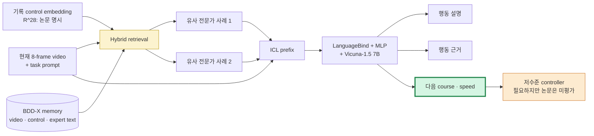

---

## 2. 논문 제목·Abstract 한국어 번역

### 2.1 제목

- **원제:** *RAG-Driver: Generalisable Driving Explanations with Retrieval-Augmented In-Context Learning in Multi-Modal Large Language Model*
- **번역:** **RAG-Driver: 멀티모달 대형언어모델에서 retrieval-augmented in-context learning을 이용한 일반화 가능한 주행 설명**
- **용어 해설:** 여기서 `retrieval`의 검색 단위는 도로 지도 지식이나 규칙 문서가 아니라, expert의 행동·정당화 문장과 control이 붙은 **과거 driving experience**다.

### 2.2 Abstract 한국어 번역

우리는 흔히 불투명한 AI 방법을 사용하는 로봇을 신뢰할 필요가 있다. 로봇은 자신을 설명해야 하고, 우리는 그 설명도 신뢰할 수 있어야 한다. 특히 복잡한 자율주행에서 설명가능성은 투명성과 최종 사용자의 수용성을 높이는 신뢰할 수 있는 자율 의사결정의 핵심 역할을 한다.

최근 멀티모달 대형언어모델(MLLM)의 발전은 control 예측과 함께 자연어 설명을 생성함으로써 주행 agent의 설명가능성을 높일 가능성을 보였다. 그러나 비싼 annotation 비용에서 비롯되는 심각한 데이터 부족과 dataset 간 큰 domain gap 때문에 견고하고 일반화 가능한 시스템을 만드는 일은 매우 어렵다. 또한 MLLM의 막대한 학습 비용과 아직 해결되지 않은 catastrophic forgetting은 배포 후 일반화를 더욱 제한한다.

이 문제를 해결하기 위해 저자들은 high-performance·explainable·generalisable autonomous driving을 위한 in-context learning 기반 retrieval-augmented MLLM, **RAG-Driver**를 제안한다. 검색된 expert demonstration에 grounding함으로써, RAG-Driver는 주행 행동 설명, 행동 정당화, control signal 예측에서 state-of-the-art 성능을 달성한다고 실증한다. 더 나아가 추가 학습 없이 보지 못한 환경에 대해 뛰어난 zero-shot 일반화 능력을 보인다고 주장한다.

### 2.3 주장과 보장 범위 분리

| 논문이 실증한 주장 | 이 논문만으로 보장되지 않는 것 |
|---|---|
| BDD-X의 text explanation/justification과 open-loop course·speed metric에서 RA-ICL가 baseline보다 좋음 | 생성한 자연어 rationale가 model control의 **충실한(faithful) 인과 원인**임 |
| BDD-X memory만으로 London의 Spoken-SAX 58 QA에 zero-shot text score 개선 | 영국 실제 도로에서 안전하게 주행/완주할 수 있음 |
| hybrid retrieval이 visual-only retrieval보다 BDD-X 결과가 좋음 | query의 control embedding이 deployment에서 항상 causal하게 이용 가능하고 leakage가 없음 |
| 한 backbone에서 텍스트와 float control token을 함께 예측 | float token 생성이 안정적인 closed-loop actuator command를 이룸 |
| 검색된 예시가 explanation과 control을 함께 개선 | retrieval이 long-tail 위험을 빠짐없이 찾아내거나 hallucination을 제거함 |

---

## 3. 핵심 기여 5개

| # | 기여 | 무엇을 했는가 | VLA for AD에서의 의미 |
|---:|---|---|---|
| 1 | **RA-ICL driving** | 현재 query 앞에 retrieval된 complete driving demonstrations를 붙여 parameter update 없이 예측을 적응 | domain shift에 fine-tuning 대신 memory를 쓰는 정책 adaptation 가설 |
| 2 | **Hybrid retrieval space** | video embedding과 28-D control embedding을 1,024-D 공통 공간에 사상하고 triplet loss로 학습 | “보이는 것이 비슷함”보다 “행동·근거가 비슷함”에 가까운 사례를 찾으려 한다 |
| 3 | **통합 MLLM** | frozen LanguageBind video encoder → MLP → Vicuna 1.5 7B로 video·text prefix를 결합 | 설명/근거/수치 control을 한 autoregressive decoder에서 공동 생성 |
| 4 | **ICL-aware instruction tuning** | BDD-X에서 두 retrieval example을 포함하는 16K QA instruction data로 학습 | inference 때만 example을 붙인 base MLLM이 무의미한 문자열/숫자를 내는 문제를 보였다 |
| 5 | **OOD 설명 실험** | BDD-X 학습·memory로 London Spoken-SAX에 fine-tuning 없이 평가 | description metric 수준의 transfer signal을 제공하되, driving safety 증거와는 분리해야 한다 |

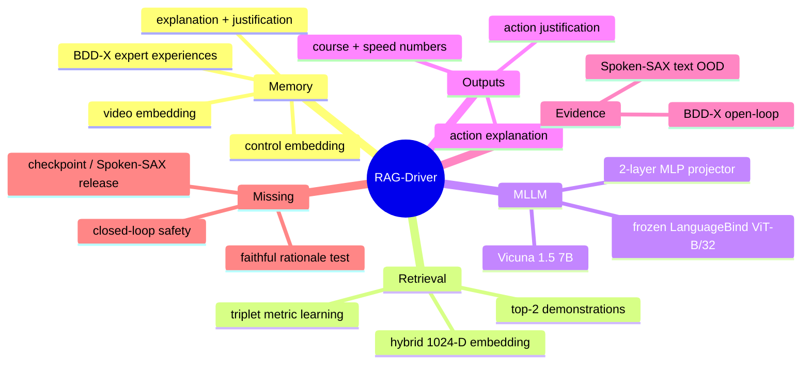

---

## 4. VLA for AD taxonomy 위치

### 4.1 축별 판정

| 분석 축 | RAG-Driver의 위치 | 근거와 주의점 |
|---|---|---|
| **Taxonomy** | **retrieval-augmented explainable E2E VLA** | video, language prompt, memory를 사용해 language와 numerical control을 함께 생성한다. waypoint/trajectory planner형 VLA와는 다르다. |
| State 표현 | 8-frame, 224×224 video + textual instruction + retrieved multimodal examples | BEV, occupancy, HD map, surround view가 핵심 상태 표현이 아니다. |
| Input | 현재 video, task/system text, retrieval prefix; hybrid retrieval은 video와 recorded control embedding을 사용한다고 기술 | control의 시간적 causal availability(과거 history인지 target-adjacent signal인지)는 배포 audit가 필요하다. |
| Reasoning output | 행동 설명(action explanation) + 행동 정당화(action justification) | 자유 CoT라기보다 BDD-X expert language의 task-conditioned 생성이다. |
| Action output | 다음 **course(회전각)** 및 **speed**의 floating-point language tokens | low-level action에 가깝지만 steering/throttle/brake full control, trajectory, safety constraint는 명시적으로 출력·평가하지 않는다. |
| Language 역할 | user-facing explanation, ICL demonstration format, cross-modal action token interface | language가 action에 연결되어도 explanation이 action의 원인이라는 증명은 없다. |
| Action grounding | **중간** | 같은 decoder와 ICL example이 text/control을 공동 조건화하고 control RMSE로 평가된다. 하지만 rationale intervention 및 closed-loop control 검증이 없다. |
| Training recipe | visual alignment pre-training + ICL instruction tuning + retrieval metric learning | online RL, retrieval-aware safety loss, world model training은 없다. |
| Evaluation | caption metrics + open-loop control RMSE/tolerance + OOD caption metrics | simulator/road **closed-loop** 평가와 safety metrics는 없다. |
| Safety / long-tail | cross-city/illumination shift의 설명 성능 신호 | retrieval miss, spurious analogy, stop-sign hallucination, latency가 safety-critical long-tail을 악화할 수 있다. |

### 4.2 taxonomy 지도

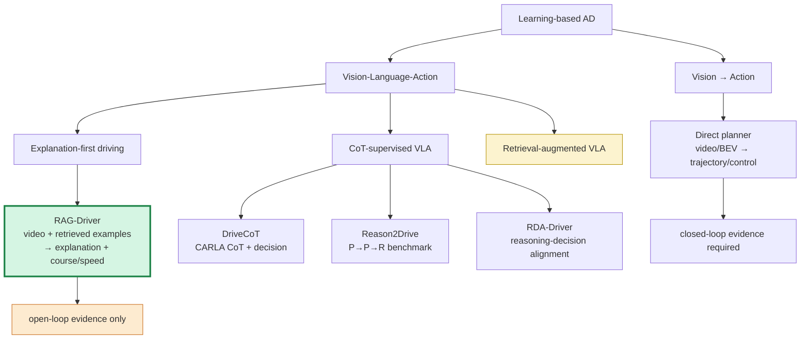

### 4.3 RAG의 세 종류를 구별하기

| 종류 | 검색 대상 | 검색이 주는 것 | RAG-Driver와의 관계 |
|---|---|---|---|
| Knowledge RAG | 법규, 지도, 매뉴얼, 최신 외부 사실 | 사실성·최신성 | **주된 구성요소 아님** |
| Experience RAG | 과거 장면과 expert의 행동/근거/control | 유사 driving episode의 행동 prior | **RAG-Driver의 실제 방식** |
| Counterfactual RAG | 위험한 반사실 사례·near miss·실패 회복 사례 | safety boundary와 “하지 말아야 할 행동” | 논문에 없으며, long-tail 확장의 유망한 방향 |

---

## 5. Architecture / pipeline 시각화

### 5.1 모델과 memory의 연결

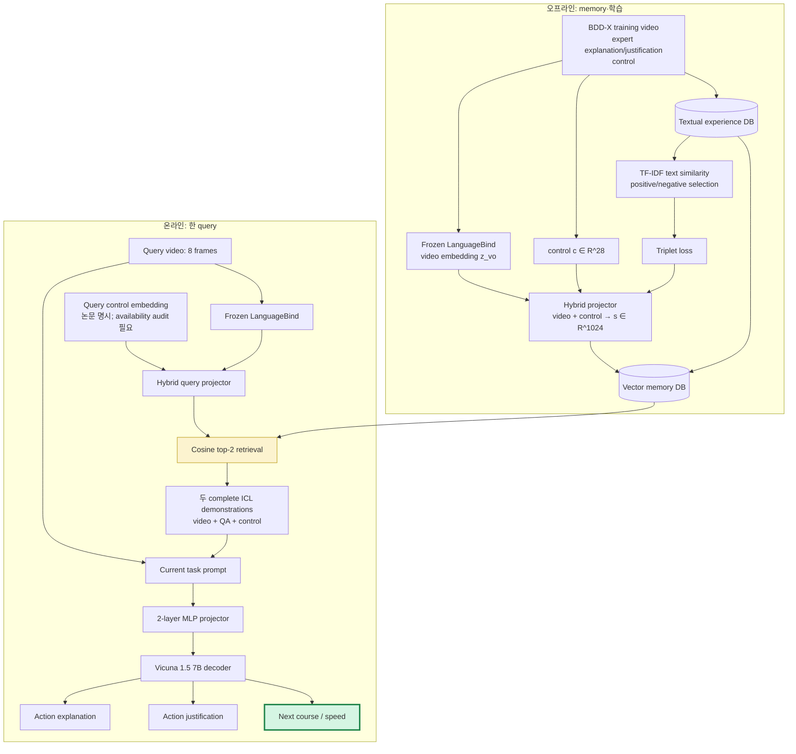

### 5.2 입력–출력 block

```text
┌─────────────────────────────────────────────────────────────────────┐
│ Query                                                               │
│  • 8 sampled RGB frames (224×224)                                  │
│  • system/task instruction                                          │
│  • hybrid retrieval에 쓰는 video + control representation (논문)    │
└──────────────┬──────────────────────────────────────────────────────┘
               │ cosine nearest-neighbor, top-2
┌──────────────▼──────────────────────────────────────────────────────┐
│ Context prefix                                                      │
│  [retrieved video tokens | expert action | justification | control] │
│  [retrieved video tokens | expert action | justification | control] │
│  [current video tokens | current question]                          │
└──────────────┬──────────────────────────────────────────────────────┘
               │ autoregressive token decoding
┌──────────────▼──────────────────────────────────────────────────────┐
│ Outputs                                                             │
│  ① “차량은 감속/정지/회전한다” (action explanation)                │
│  ② “앞 차량/신호/상황 때문에 …” (justification)                    │
│  ③ course (degree), speed (m/s) float tokens                        │
└─────────────────────────────────────────────────────────────────────┘
```

### 5.3 왜 hybrid retrieval인가?

순수 visual similarity는 비슷한 풍경(예: 같은 교차로)을 고르지만, 안전 행동은 속도·진행 방향·상호작용에 따라 달라질 수 있다. 저자들은 video embedding과 28-D control embedding을 common 1,024-D embedding으로 사상하고, **행동/정당화 text의 TF-IDF 유사도**로 positive/negative pair를 정해 triplet loss를 학습한다. 그 뒤 cosine similarity top-2 사례를 query 앞에 넣는다.

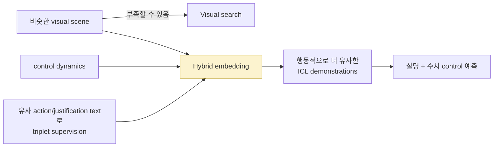

> **중요한 causal 질문:** 논문은 memory와 query를 위한 `control signal c ∈ R^28`를 기록 센서에서 가져온다고 쓴다. 실제 controller라면 query 시점에 이용 가능한 **과거 control history**만 사용해야 한다. 미래/동시 target에 가까운 control이 retrieval key에 섞이면 offline score는 낙관적일 수 있다. 본문만으로 temporal indexing을 완전히 판별하기 어렵기 때문에, 재현 시 timestamp와 field definition을 반드시 audit해야 한다.

---

## 6. Input → Reasoning → Action Grounding 분석

| 단계 | 모델 입력 | 산출물 | supervision / metric | action grounding 판정 | 실패 모드 |
|---|---|---|---|---|---|
| Perception encoding | 8-frame video | LanguageBind video tokens | frozen video-language pretraining | 간접 | 객체·거리·temporal cue 소실, 224×224 해상도 한계 |
| Retrieval | video + 논문에 명시된 28-D control → hybrid vector | top-2 과거 experience | TF-IDF 기반 positive/negative, triplet loss, cosine search | **조건부 간접** | perceptually/behaviorally 틀린 analogy, control availability/leakage 위험 |
| ICL reasoning | current query + 두 complete example + task prompt | latent attention을 통한 in-context adaptation | ICL을 포함한 instruction tuning | 간접 | example 복사, context window 압박, retrieval bias |
| Explanation | video/prefix → language | 행동 서술 | BLEU-4, METEOR, CIDEr | 약함 | 관찰되지 않은 객체를 원인으로 말하는 rationalization |
| Justification | video/prefix → language | 행동 이유 | BLEU-4, METEOR, CIDEr | 중간 이하 | 문장 정답이 trajectory/control의 실제 원인이라는 보장 없음 |
| Control prediction | 같은 decoder → float language tokens | 다음 course(°), speed(m/s) | RMSE, tolerance accuracy Aσ | **중간** | 숫자 token discontinuity, actuator dynamics/constraint 부재 |
| Vehicle outcome | controller·환경 상호작용 | 다음 관측·안전·완주 | 논문에서 없음 | 검증 안 됨 | compounding error, latency, recovery failure |

### 6.1 action grounding 사슬

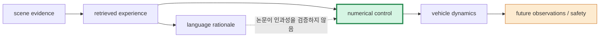

**판정:** `retrieval → text/control`은 하나의 MLLM conditioning path에 놓여 있으므로 단순 explanation-only model보다 action connection이 강하다. 그러나 `text rationale → control`의 counterfactual intervention, `control → closed-loop safe outcome`은 검증하지 않았다. 따라서 텍스트 metric 상승을 safety 상승으로 읽으면 안 된다.

### 6.2 reasoning usefulness checklist — 이번 주 핵심 산출물

| 질문 | 통과 기준 | RAG-Driver 현 상태 | 배포 전 필요한 실험 |
|---|---|---|---|
| **현재 scene evidence가 있는가?** | rationale의 객체/신호가 영상에서 검출·추적됨 | stop sign이 없는데 감속 이유로 든 실패를 저자도 보고 | grounded object/traffic-light verifier, evidence citation |
| **검색 사례가 행동상 맞는가?** | top-k가 visual뿐 아니라 route, right-of-way, speed 관계도 맞음 | hybrid search가 visual-only보다 좋다는 open-loop ablation | retrieval precision@k를 maneuver/risk label별로 보고 |
| **query key가 causal한가?** | query 시점에 관측 가능한 history만 retrieval에 사용 | 28-D control 사용의 시간 정의가 본문에서 충분히 명확하지 않음 | field-level timestamp·no-future-leakage audit |
| **reasoning이 action을 바꾸는가?** | retrieved rationale/critical token을 바꾸면 control이 예측 가능한 방향으로 변함 | 공동 생성만 확인 | rationale swap, retrieved-example swap, object removal intervention |
| **action이 안전한가?** | dynamics·규칙·다른 agent와 상호작용 후 안전 | open-loop RMSE/Aσ만 보고 | CARLA/nuPlan closed-loop: collision, TTC, red light, route completion |
| **불확실성을 표현하는가?** | low-confidence retrieval/vision에서 fallback 또는 risk 상승 | uncertainty head/abstention 없음 | retrieval distance calibration, OOD detector, safe fallback planner |
| **실시간 가능한가?** | perception+retrieval+LLM+controller가 latency budget 충족 | A100 한 장에서 round당 약 4초 | target hardware E2E latency 및 stale-control stress test |
| **long-tail을 덮는가?** | near miss·rare object·weather·locale별 worst-group 안전 개선 | 58 Spoken-SAX text OOD는 매우 작은 표본 | risk-stratified retrieval DB와 adversarial scenario suite |

---

## 7. Training recipe

### 7.1 세 단계 recipe

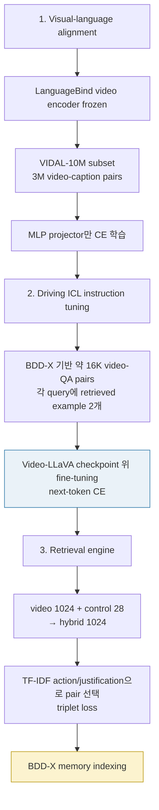

| 구성 | 논문에서 확인한 내용 | 해석 |
|---|---|---|
| Video encoder | **LanguageBind**, ViT-B/32 기반, frozen | driving data에서 vision backbone 전체를 업데이트하지 않고 video-language prior를 사용 |
| MLLM | Video-LLaVA 방식, 2-layer GELU MLP projector, **Vicuna 1.5 7B** | video embedding을 LLM token 공간(본문: 4,096 차원)으로 정렬 |
| Pre-training | VIDAL-10M subset **3M video-caption pairs**, encoder/LLM freeze, projector만 CE | generic video→language alignment 단계 |
| Driving tuning | BDD-X를 구조화해 train 16,803 / test 2,123 video QA pairs; 8 frames, 224×224 | action explanation, justification, control을 모두 next-token prediction으로 학습 |
| ICL | 각 query에 top-2 complete demonstrations; 추가 예시 하나가 약 1,800 token, video sequence는 1,024 fixed tokens | Vicuna 4,096-token window가 top-2 선택의 주된 제약 |
| Retrieval learning | video 1×1,024 + control 1×28 → 1,024 hybrid; margin 0.5 triplet | semantic text similarity를 retrieval space에 주입하려는 설계 |
| Compute | MLLM fine-tuning: 8×A100 약 6시간; retrieval engine: single A100 약 30분; single-round inference 약 4초/A100 | real-time end-to-end control deployment에는 아직 부적합한 수준 |

### 7.2 문서 내 hyperparameter 불일치

| 항목 | 본문 | Appendix A | 실무 결론 |
|---|---|---|---|
| Retrieval projector epochs | 300 | 200 | 공개 config/code와 함께 확인해야 한다. 논문만으로 재현값을 단정하지 말 것. |
| Retrieval MLP 층수 표기 | “same structure as Eq. 1”의 lightweight MLP | “three-layer” 뒤 “four-layer MLP”라는 표기가 함께 나타남 | architecture 파일을 source of truth로 삼고 commit hash를 기록할 것. |
| MLLM tuning epoch | pre-train 1, fine-tune 2 | 2 epochs 표기 | train script와 log로 해소해야 한다. |

> 논문의 qualitative/metric 결론과 별개로, 이 불일치는 reproducing report에 명시할 만한 사항이다. 공식 README는 fine-tune/evaluation 명령을 제공하지만 checkpoint는 TODO로 남아 있다.

### 7.3 학습과 deployment의 차이

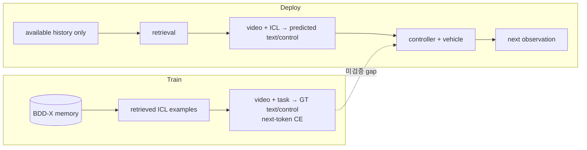

---

## 8. Dataset / Benchmark / Metric 분석

### 8.1 데이터와 benchmark

| 데이터 | 역할 | 규모/구성 | 어떤 domain gap인가? | 한계 |
|---|---|---|---|---|
| **VIDAL-10M subset** | visual-language alignment pre-training | 논문: 3M video-caption pairs 사용 | generic video → language | driving action supervision이 아님 |
| **BDD-X** | driving instruction tuning, in-domain test, memory database | 원 dataset은 미국 여러 road/weather 조건의 77시간 video; 논문 format은 train 16,803 / test 2,123 video QA | 동일 데이터 분포 내 explanation/control | expert text와 logged control의 상관관계는 causal driving truth와 다를 수 있음 |
| **Spoken-SAX (custom)** | zero-shot OOD test | London, UK에서 professional driving instructor narration이 붙은 58 testing QA pairs | 지리·좌측통행 가능성·도로 환경·조명/언어 스타일 변화 | 표본이 58개로 작고, README상 dataset 공개는 TODO |

### 8.2 evaluation matrix

| 층 | 지표 | 무엇을 측정하나 | 무엇을 놓치나 |
|---|---|---|---|
| Action explanation | BLEU-4, METEOR, CIDEr | reference action 문장과의 lexical/semantic/caption consensus | 의미는 맞지만 표현이 다른 답, object grounding, 안전 결과 |
| Action justification | BLEU-4, METEOR, CIDEr | reference reason 문장 유사도 | 말한 근거가 control을 실제로 유발했는지(faithfulness) |
| Course | RMSE(°), tolerance accuracy Aσ | 기록된 회전각과의 open-loop 수치 오차 | 다른 안전한 steering, dynamics, comfort |
| Speed | RMSE(m/s), tolerance accuracy Aσ | 기록 speed와의 open-loop 수치 오차 | braking delay, jerk, lead vehicle reaction |
| OOD text | Spoken-SAX의 caption metrics | dataset shift 아래 language output 일반화 | closed-loop driving, geographic safety rules, worst-case risk |
| Closed-loop safety | collision, route completion, infraction, TTC 등 | action이 future state를 바꾼 뒤 회복/안전 | **RAG-Driver에서는 보고되지 않음** |

### 8.3 핵심 결과를 읽는 법

| 설정 | RAG-Driver 결과 | 비교/해석 |
|---|---:|---|
| BDD-X action explanation | B4 **34.3**, CIDEr **260.8**, METEOR **30.7** | DriveGPT4 대비 각각 30.0/214.0/29.8. caption metric의 in-domain 개선이다. |
| BDD-X justification | B4 **11.1**, CIDEr **109.1**, METEOR **14.8** | DriveGPT4 9.4/102.7/14.6보다 개선. rationale fidelity는 별도 미측정이다. |
| BDD-X course | RMSE **4.48°** | DriveGPT4 4.57°, ADAPT 5.87°보다 낮다. logged course와의 open-loop 오차다. |
| BDD-X speed | RMSE **0.69 m/s** | DriveGPT4 1.09, ADAPT 2.68보다 낮다. vehicle dynamics로 실행한 결과가 아니다. |
| Spoken-SAX action | CIDEr **48.9** | base w/o ICL 5.7, ADAPT 22.3. zero-shot text transfer의 강한 signal이나 B4는 9.9이다. |
| Spoken-SAX justification | CIDEr **17.1** | base w/o ICL 4.7, ADAPT 8.6. 58 samples의 caption score이며 safety score가 아니다. |
| ICL count ablation | 1→2 examples: action CIDEr 257.2→**260.9**, speed error 0.75→**0.69**; course error 4.15→4.48 | example을 늘리면 항상 모든 action metric이 좋아지는 것이 아니다. context trade-off가 있다. |

### 8.4 retrieval ablation의 핵심 교훈

논문 Table III에서 ICL 없이 학습한 MLLM은 inference 때 ICL example을 갑자기 넣으면 random string과 비실수 숫자를 생성해 metric 계산이 불가능했다. 즉, **“RAG를 붙이면 즉시 일반화한다”가 아니라, example format을 읽고 action token을 생성하도록 ICL-aware training을 해야 한다**는 결과다. 또한 visual-only search보다 hybrid search+train/inference ICL 조합이 BDD-X에서 action B4 34.3, CIDEr 260.9, justification B4 11.1, CIDEr 109.1, speed error 0.69, course error 4.48을 보였다.

---

## 9. 관련 논문 비교표

> 아래 Reason2Drive·DriveCoT·RDA-Driver 행은 이번 주 **abstract skim**에 한정한다. 숫자는 각 논문의 서로 다른 dataset/setting에서 나온 것이므로 직접 leaderboard 비교가 아니다.

| 방법 | 핵심 입력·중간 표현 | 최종 출력 | language / retrieval 역할 | action grounding | 평가와 RAG-Driver 대비 |
|---|---|---|---|---|---|
| **RAG-Driver** (RSS 2024) | 8-frame video + top-2 BDD-X expert demonstrations | action 설명·근거 + course/speed | experience RAG가 complete reasoning example을 ICL prefix로 공급 | **중간**: text와 numeric control 공동 생성 | BDD-X open-loop + Spoken-SAX text OOD; closed-loop 없음 |
| **Reason2Drive** (ECCV 2024) | nuScenes/Waymo/ONCE 영상·자동 수집 QA | perception→prediction→reasoning chain | 600K+ video-text pair reasoning benchmark, object-level VLM 개선 | 낮음~중간: abstract는 reasoning benchmark 중심 | semantic ambiguity를 줄이는 aggregated reasoning metric을 제안; RAG의 사례 retrieval과 상보적 |
| **DriveCoT** (2024) | CARLA Leaderboard 2.0 sensor·rule-based expert CoT | CoT + final decision | simulator expert가 reasoning label 생성 | 중간~강함: final decision과 연결 | open-loop와 **closed-loop** 모두 보고. RAG-Driver가 결여한 execution evidence를 제공하지만 sim-to-real gap 존재 |
| **RDA-Driver** (2024) | multimodality-augmented LLM + redesigned CoT | CoT + planning result | reasoning-decision alignment constraint | 강함: CoT와 planning 결과 correspondence를 직접 제약 | nuScenes/DriveLM-nuScenes planning; abstract상 0.80 L2/0.32 collision. RAG의 “reasoning이 control을 바꾸는가?” 공백에 직접 대응 |
| **DriveLM** (2024, 지난 주) | image + Graph VQA P1→P2→P3 + behavior | tokenized waypoint | fixed graph context | 중간~강함: behavior→motion | structured information routing이 장점. RAG-Driver는 graph 대신 유사 사례 memory를 routing한다. |

### 9.1 CoT·RAG·alignment는 대체재가 아니다

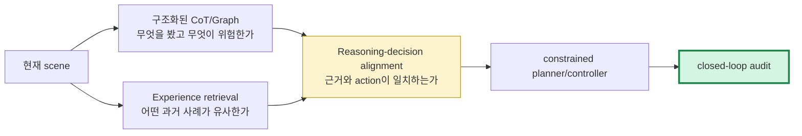

- **CoT/Graph**는 현재 장면의 원인 구조를 명시한다.
- **Retrieval**은 드문 maneuver나 domain-shift 상황에서 경험 prior를 공급한다.
- **Reasoning-decision alignment**는 자연어가 장식이 되는 것을 막는다.
- 마지막 **closed-loop audit** 없이는 위 셋 모두 safety claim으로 충분하지 않다.

---

## 10. 강점과 한계

### 10.1 강점

| 강점 | 논문 근거 | 실무적 함의 |
|---|---|---|
| 재학습 없는 domain adaptation 경로 | BDD-X memory만으로 Spoken-SAX text OOD score 향상 | data drift 때 full fine-tuning 대신 curated memory update를 실험할 수 있다. |
| visual-only가 아닌 behavioral similarity | hybrid retrieval이 더 좋은 ablation | “비슷하게 생긴 장면”이 아니라 “비슷하게 판단해야 하는 장면” retrieval을 목표로 한다. |
| 설명과 control을 따로 보지 않음 | 한 decoder가 explanation/justification/numeric control을 생성 | explanation model과 policy를 완전히 분리한 접근보다 action interface가 명확하다. |
| ICL format 학습의 필요성을 실증 | ICL-trained가 아니면 ICL inference가 실패 | retrieval system은 vector DB만 붙이는 작업이 아니라 prompt/data curriculum 문제다. |
| OOD setting을 제시 | 다른 도시의 professional narration data | in-domain caption score만 보는 초기 driving-VLM 연구보다 일반화 질문을 전면에 둔다. |

### 10.2 한계 및 safety/long-tail 위험

| 한계·위험 | 왜 위험한가 | 완화책 |
|---|---|---|
| **closed-loop 미평가** | predicted course/speed가 next observation을 바꾸는 distribution shift, recovery, interaction을 못 본다 | CARLA/nuPlan/실차 shadow mode에서 collision·TTC·infractions·route completion 평가 |
| **약 4초/A100 round latency** | control loop에서 stale decision은 정확한 offline 숫자보다 위험할 수 있다 | fast local policy + event-triggered slow retrieval reasoner + cache + deadline fallback |
| **rationale hallucination** | 저자 사례에서 없는 stop sign을 감속 이유로 제시 | visual grounding verifier, perception cross-check, “evidence unavailable” abstention |
| **retrieval-induced anchoring** | 잘못 찾은 과거 사례가 현재 장면보다 강한 prior가 되어 action을 끌 수 있다 | query-example compatibility score, counterfactual retrieval, risk-aware re-ranking |
| **control-key causality 불명확성** | unavailable future-adjacent signal이 key에 있으면 offline retrieval이 쉬워질 수 있다 | timestamp audit, past-only ablation, vision-only vs history-only vs hybrid reporting |
| **numeric token representation** | float tokens는 real number space의 연속성을 tokenizer가 보존하지 않는다 | continuous action head, constrained decoder, MPC/trajectory refinement |
| **작은/편향된 OOD test** | 58 examples의 language score가 rare-risk coverage를 뜻하지 않는다 | location/weather/actor/rule별 worst-group suite와 confidence calibration |
| **memory privacy·staleness** | driving episodes는 개인정보·지도 변화·과거의 위험 행동을 담을 수 있다 | data governance, temporal decay, provenance, unsafe-example filtering |
| **공개 재현 자산의 공백** | checkpoint·Spoken-SAX 미공개 TODO | model release 전에는 exact reported OOD replication이 어렵다 |

### 10.3 safety claim 판정기

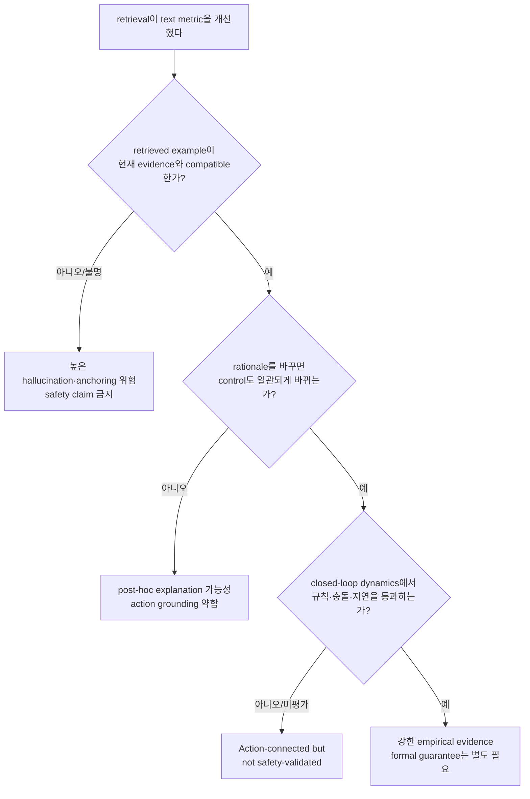

---

## 11. 실전 학습 포인트

1. **RAG는 memory engineering이면서 policy conditioning이다.** 유사 사례는 knowledge snippet이 아니라 모델이 imitation할 행동·근거·수치의 예시다. 따라서 retrieval error는 답변 오류가 아니라 policy bias가 될 수 있다.
2. **CoT를 얻는 것과 CoT를 믿는 것은 다르다.** BLEU/CIDEr가 높은 justification은 reference 문장을 닮았다는 뜻이지, 그 문장이 control을 생성한 causal pathway라는 뜻이 아니다.
3. **retrieval key를 먼저 audit하라.** video, ego history, route, map, target label 중 어느 것이 언제 이용되는지 명시하지 못하면 OOD/control 성능을 해석할 수 없다.
4. **hybrid similarity는 유용하지만 control leakage와 맞닿아 있다.** deployment에서 과거 control history를 쓰는 것은 합당할 수 있다. 다만 동일 시점/미래 target를 쓰는 순간 retrieval이 정답을 힌트받을 수 있으므로 temporal split이 핵심이다.
5. **open-loop RMSE는 safety metric이 아니다.** 기록 운전자와 다른 course/speed가 더 안전할 수 있고, 낮은 RMSE라도 stale action·braking dynamics·other-agent response 때문에 충돌할 수 있다.
6. **두 example의 개선은 context budget의 비용을 수반한다.** 하나에서 둘로 늘리면 설명/속도는 나아졌지만 course error는 약간 나빠졌다. 더 많은 RAG context가 자동으로 더 좋은 control을 뜻하지 않는다.
7. **real-time deployment는 dual-system을 요구할 가능성이 크다.** 4초짜리 MLLM/RAG는 high-level explanation·retrieval reasoner로, 빠른 deterministic planner/safety shield는 별도 loop로 두는 설계가 현실적이다.

### 11.1 재현/확장 실험 우선순위

| 우선순위 | 실험 | 성공 기준 |
|---:|---|---|
| 1 | **Causal-availability audit:** retrieval query에서 target/future를 제거하고 past-only history만 사용 | hybrid 이득이 유지되며 temporal leakage가 없음을 보임 |
| 2 | **Retrieval swap:** top-1, top-2, random, adversarially wrong example을 교체 | correct retrieval일 때만 safety-relevant control이 개선되고 wrong retrieval은 abstain/fallback |
| 3 | **Rationale intervention:** “stop sign/lead car/pedestrian” evidence 및 rationale token을 삭제·교체 | control이 물리·규칙적으로 예상 가능한 방향으로 변함 |
| 4 | **Evidence verification:** generated noun phrase를 detector/tracker/map과 대조 | hallucinated critical object rate와 verifier의 false reject를 보고 |
| 5 | **Closed-loop benchmark:** delayed retrieval/LLM latency를 포함해 CARLA 또는 nuPlan 실행 | collision, TTC, route completion, red-light, comfort를 direct policy와 비교 |
| 6 | **Risk-aware memory:** rare near-miss/occlusion/VRU/weather 사례를 label·re-rank | worst-group safety가 평균 metric을 희생하지 않고 개선 |
| 7 | **Action head 비교:** float token vs continuous head vs constrained MPC refinement | action smoothness·constraint satisfaction·closed-loop recovery 개선 |

### 11.2 최소 deployment architecture 제안

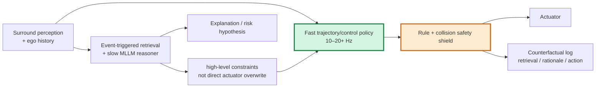

이 구조에서 RAG-Driver류 reasoner는 `왜 감속 제약이 필요한가`와 `유사한 과거 사례`를 제공할 수 있지만, stale LLM output이 actuator를 직접 덮어쓰지 않도록 fast policy와 safety shield가 최종 실행 권한을 가진다.

---

## 12. 다음 주 질문

다음 주는 **Numerical Action Generator 1 — LMDrive**를 다룬다.

1. RAG-Driver의 `course + speed` float token과 LMDrive의 numerical waypoint는 어떤 action representation이 **closed-loop**에서 더 안정적인가?
2. retrieved experience를 waypoint planner의 prompt에 넣을 때, history/control leakage 없이 query와 example을 어떻게 time-align할 수 있는가?
3. language rationale와 numerical trajectory를 함께 출력한다면, RDA-Driver식 alignment constraint 혹은 counterfactual consistency loss를 어디에 걸어야 하는가?
4. 4초짜리 retrieval-MLLM을 fast waypoint generator와 결합할 때, 어떤 risk/event에서만 slow reasoning을 호출해야 하는가?
5. explanation CIDEr/RMSE 개선이 collision·route completion 개선으로 이어지는지 검증하려면 어떤 closed-loop ablation matrix가 필요한가?

---

## 13. 참고 링크

1. **RAG-Driver arXiv (v3)** — https://arxiv.org/abs/2402.10828
2. **RAG-Driver HTML full text (v3)** — https://arxiv.org/html/2402.10828v3
3. **RAG-Driver PDF** — https://arxiv.org/pdf/2402.10828v3
4. **RAG-Driver 공식 코드** — https://github.com/YuanJianhao508/RAG-Driver
5. **RAG-Driver project page** — https://yuanjianhao508.github.io/RAG-Driver/
6. **BDD-X: Textual Explanations for Self-Driving Vehicles** — https://arxiv.org/abs/1807.11546
7. **Reason2Drive** — https://arxiv.org/abs/2312.03661
8. **DriveCoT** — https://arxiv.org/abs/2403.16996
9. **RDA-Driver: Reasoning-Decision Alignment** — https://arxiv.org/abs/2408.13890
10. **DriveLM (지난 주)** — https://arxiv.org/abs/2312.14150
11. **다음 주: LMDrive** — https://arxiv.org/abs/2312.07488
