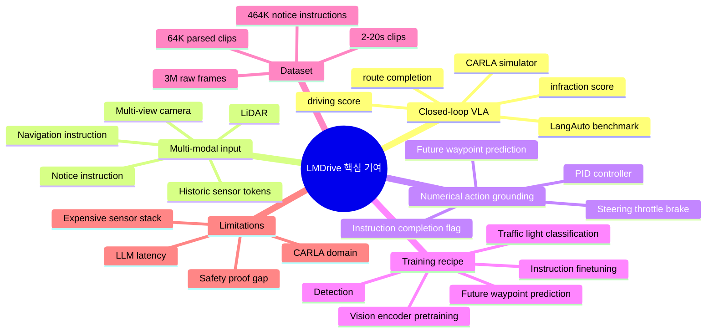
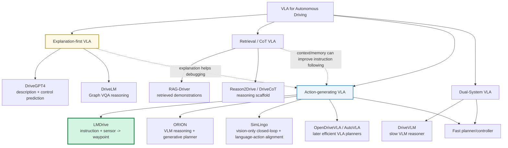
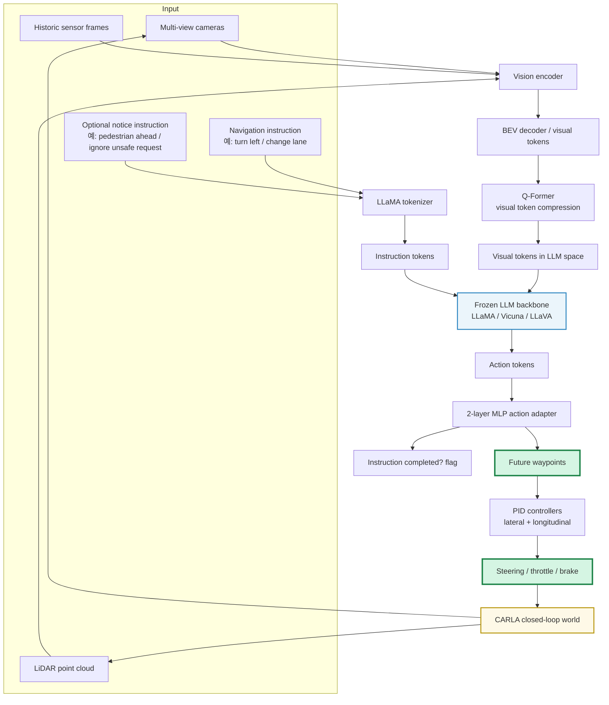
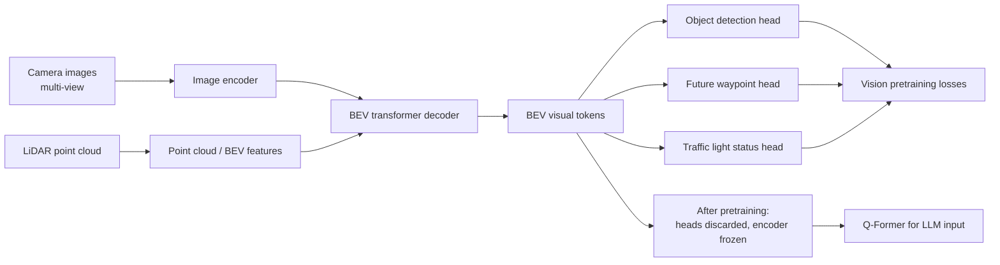
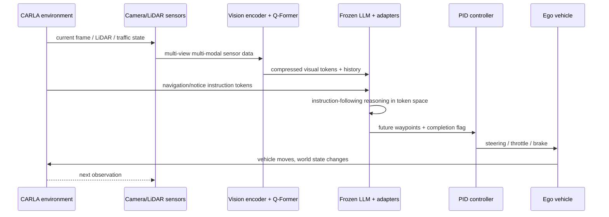
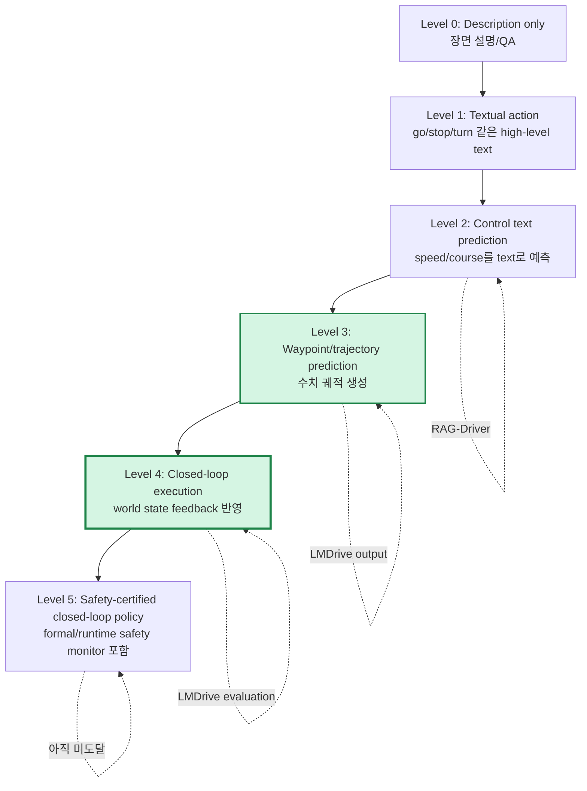
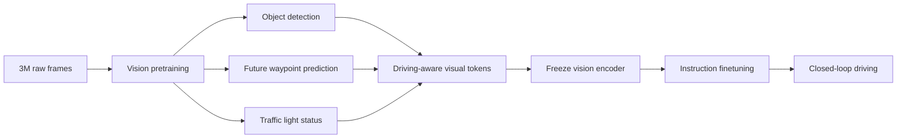
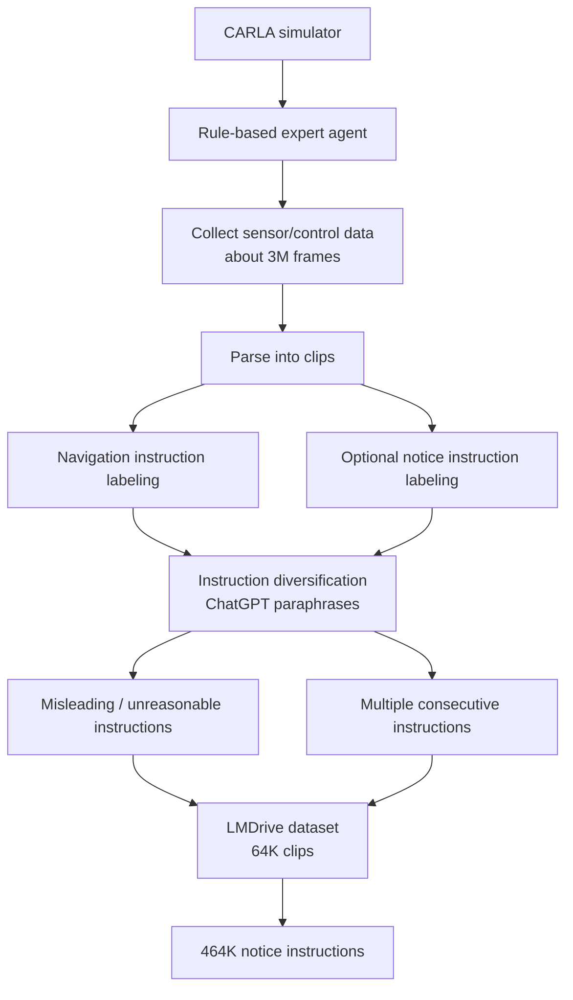
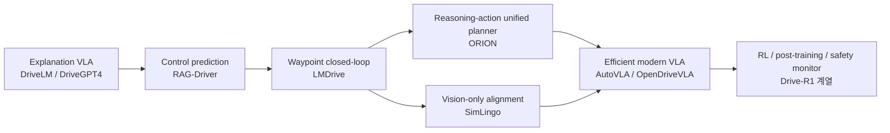

# Week 06. Numerical Action Generator 1: LMDrive로 보는 언어 지시를 waypoint·control로 grounding하는 방법

## Metadata

| 항목 | 내용 |
|---|---|
| Date | 2026-06-02 |
| Week | 06 / 12 |
| Original paper/source | *LMDrive: Closed-Loop End-to-End Driving with Large Language Models* |
| Korean title | **LMDrive: Large Language Model을 이용한 Closed-Loop End-to-End 자율주행** |
| URL | https://arxiv.org/abs/2312.07488 |
| Version read | arXiv abstract page + arXiv HTML full text + GitHub README 기반 |
| Authors | Hao Shao, Yuxuan Hu, Letian Wang, Steven L. Waslander, Yu Liu, Hongsheng Li |
| Venue / status | CVPR 2024, project/code/dataset 공개 |
| Taxonomy | End-to-End VLA for AD / language-guided closed-loop driving / numerical action generator |
| Reading mode | Deep read: **LMDrive** / skim: **ORION**, **SimLingo** |
| 이번 주 focus | waypoint/trajectory output, closed-loop CARLA, language-action alignment |
| Output | **Textual action vs Numerical action 비교표** |

> 참고: 이번 노트는 논문 전체를 줄 단위로 번역하지 않고, arXiv abstract/HTML 본문과 공식 GitHub README를 기반으로 한국어 학습 노트로 재구성했다. LMDrive는 PDF보다 arXiv HTML과 README가 구조·수치 확인에 더 안정적으로 접근 가능했다. ORION/SimLingo는 arXiv abstract 중심으로 skim했다.

---

## 1. 이번 주 한 문장 결론

**LMDrive의 핵심은 “LLM이 운전 설명을 잘한다”가 아니라, multi-view camera + LiDAR sensor token과 자연어 navigation/notice instruction을 LLM 입력으로 넣고, 최종적으로 future waypoint와 instruction-completion flag를 예측해 PID controller가 throttle·brake·steering으로 실행하게 만든 closed-loop numerical action generator라는 점이다.**

Week 05의 RAG-Driver는 retrieved demonstration을 이용해 **설명·정당화·control prediction**을 강화했지만 대부분 open-loop 성격이 강했다. Week 06의 LMDrive는 여기서 한 단계 더 나아가 다음 질문에 답한다.

> **언어가 실제 주행 trajectory에 얼마나 붙어 있는가?**

LMDrive의 답은 명확하다.

- 자연어 instruction은 LLM token으로 들어간다.
- sensor stream은 vision encoder → BEV visual token → Q-Former 압축 → LLM token space로 들어간다.
- LLM은 action token을 만들고, adapter는 **future waypoint**를 예측한다.
- PID controller가 waypoint를 따라 실제 CARLA closed-loop 환경에서 차량을 움직인다.

따라서 LMDrive는 VLA for AD taxonomy에서 **Explanation-first VLA가 아니라 Action-generating VLA**에 훨씬 가깝다. 다만 action이 “LLM이 직접 steering 값을 텍스트로 말하는 방식”은 아니고, **LLM-conditioned waypoint generator + classical controller**라는 hybrid 형태다.

---

## 2. 논문 제목·Abstract 한국어 번역

### 2.1 제목 번역

- **원제**: *LMDrive: Closed-Loop End-to-End Driving with Large Language Models*
- **번역**: **LMDrive: Large Language Model을 이용한 Closed-Loop End-to-End 자율주행**
- **시스템명**: **LMDrive**

### 2.2 Abstract 한국어 번역

자율주행 분야는 최근 상당한 발전을 이루었지만, 현대적인 방법들은 여전히 long-tail 예측 불가능 사건과 복잡한 도시 주행 시나리오를 만났을 때 어려움을 겪고 심각한 사고를 일으킬 수 있다. 한편 Large Language Model(LLM)은 “Artificial General Intelligence”에 가까워 보이는 인상적인 reasoning 능력을 보여주었다. 다른 한편 기존 자율주행 방법들은 sensor data나 navigation waypoint처럼 제한된 형식의 입력에 의존하는 경향이 있어, 차량이 language information을 이해하고 인간과 상호작용하는 능력을 제한한다.

이를 위해 이 논문은 **LMDrive**를 소개한다. LMDrive는 language-guided, end-to-end, closed-loop 자율주행 framework다. LMDrive는 multi-modal sensor data와 자연어 instruction을 함께 처리하고 통합하여, 실제적인 instruction setting에서 인간 및 navigation software와 상호작용할 수 있게 한다.

또한 language 기반 closed-loop 자율주행 연구를 촉진하기 위해, 저자들은 약 **64K instruction-following data clips**를 포함하는 dataset과, 복잡한 instruction 및 challenging driving scenario를 처리하는 능력을 평가하는 **LangAuto benchmark**를 공개한다. LMDrive의 효과를 보이기 위해 광범위한 closed-loop 실험을 수행했다. 저자들이 아는 한, LMDrive는 LLM을 closed-loop end-to-end autonomous driving에 활용한 최초의 연구다. Code, model, dataset은 project page에서 확인할 수 있다.

### 2.3 Abstract를 VLA 관점으로 다시 쓰기

**LMDrive는 기존 end-to-end autonomous driving이 다루던 sensor→action mapping에 자연어 instruction channel을 추가하고, LLM을 frozen reasoning backbone으로 활용해 vision-language-action token을 정렬한 뒤, waypoint 기반 closed-loop control로 실제 주행 성능을 평가한 초기 VLA-for-AD 논문이다.**

### 2.4 제목만 보고 오해하면 안 되는 점

| 오해 | 실제 LMDrive |
|---|---|
| “LLM이 steering/throttle/brake를 텍스트로 직접 생성한다” | LLM 출력 뒤 adapter가 future waypoint를 예측하고 PID controller가 control signal을 만든다. |
| “언어 설명을 생성하는 논문이다” | 핵심 output은 explanation보다 **waypoint/action grounding**이다. |
| “VLM open-loop QA benchmark다” | CARLA 기반 **closed-loop** LangAuto benchmark를 제안한다. |
| “순수 neural controller다” | LLM-conditioned waypoint predictor + PID controller의 hybrid 실행 구조다. |

---

## 3. 핵심 기여 3~5개

| # | 핵심 기여 | 왜 중요한가 |
|---:|---|---|
| 1 | **최초급 language-guided closed-loop E2E driving framework** | DriveGPT4/GPT-Driver류 open-loop 또는 text-centric 접근과 달리, 실제 simulator closed-loop에서 action을 실행한다. |
| 2 | **multi-view camera + LiDAR + natural-language instruction 통합** | 기존 AD 입력(sensor/route command)을 language interaction 가능한 VLA 입력 형식으로 확장한다. |
| 3 | **LLM은 frozen backbone, sensor/action은 adapter로 연결** | LLM reasoning prior를 보존하면서 driving-specific vision/action grounding을 학습한다. |
| 4 | **64K instruction-following clips + 464K notice instructions 공개** | language-conditioned driving dataset 부족 문제를 줄이고 후속 연구의 기준점을 제공한다. |
| 5 | **LangAuto benchmark 제안** | misleading instruction, long instruction, adversarial/challenging scenario까지 포함해 language-action alignment를 closed-loop에서 평가한다. |

### Contribution map

---

## 4. VLA for AD taxonomy 위치

### 4.1 이번 주 taxonomy 판정

| 축 | LMDrive 위치 | 해석 |
|---|---|---|
| System type | **End-to-End Action-generating VLA** | vision-language input을 받아 closed-loop에서 vehicle action으로 이어진다. |
| Input modality | multi-view camera, LiDAR, natural-language navigation instruction, optional notice instruction, historical sensor tokens | sensor + route + human notice를 하나의 instruction-following driving problem으로 만든다. |
| Output modality | future waypoint, instruction completion flag → PID control(throttle/brake/steering) | direct text action이 아니라 numerical waypoint 기반 action grounding이다. |
| Language role | **조건부 goal/constraint/interface** | navigation instruction, human notice, misleading instruction 처리에 쓰인다. |
| Action grounding | **강함** | output이 closed-loop CARLA에서 실제 ego vehicle 움직임을 만든다. |
| Training recipe | vision encoder pretraining + LLM instruction finetuning | perception pretraining으로 visual token quality를 확보한 뒤 language/action alignment를 학습한다. |
| Dataset/benchmark | LMDrive dataset, LangAuto, LangAuto-Short, LangAuto-Tiny, LangAuto-Notice | CARLA 기반 instruction-following closed-loop benchmark다. |
| Open-loop vs closed-loop | **closed-loop 중심** | driving score, route completion, infraction score 등 closed-loop metric 사용. |
| Safety/long-tail | misleading/unreasonable instruction과 challenging scenarios를 포함 | safety proof는 아니지만 language-conditioned safety behavior 평가를 시작한다. |
| Limitation | simulator, LiDAR 의존, LLM latency/robustness, natural language ambiguity | real-world deployment까지는 큰 gap이 남는다. |

### 4.2 VLA taxonomy 위치도

### 4.3 Week 05 RAG-Driver와의 연결

| 질문 | RAG-Driver | LMDrive |
|---|---|---|
| 핵심 문제 | 유사 expert demonstration을 검색해 explanation/control prediction 개선 | 언어 instruction을 closed-loop waypoint/action으로 실행 |
| 주 입력 | driving video + control signal + retrieved examples | multi-view camera + LiDAR + natural-language instruction + notice |
| 출력 | explanation, justification, speed/course control text | future waypoint + completion flag → PID control |
| language role | prompt/example/output 중심 | instruction/constraint/goal 중심 |
| action grounding | 중간: control prediction은 있으나 closed-loop 실행 부족 | 강함: CARLA closed-loop에서 trajectory 실행 |
| 평가 | text metrics + control RMSE/accuracy 중심 | driving score/route completion/infraction score 중심 |
| risk | hallucinated explanation, retrieval mismatch | language misunderstanding이 실제 vehicle action으로 전파됨 |

---

## 5. Architecture / pipeline 시각화

### 5.1 LMDrive 전체 pipeline

### 5.2 Vision encoder detail

핵심은 vision encoder가 단순히 “이미지 caption용 feature”를 만드는 것이 아니라, **driving-specific perception/action pretraining**을 먼저 거친다는 점이다. object detection, future waypoint, traffic light classification으로 visual token이 주행 행동에 필요한 구조를 품게 만든다.

### 5.3 Closed-loop sequence

### 5.4 Input-output map

| Stage | Input | Representation | Output | Action grounding 의미 |
|---|---|---|---|---|
| Sensor encoding | camera, LiDAR | image/point features | BEV visual tokens | 주행 장면을 action-relevant 공간으로 압축 |
| Visual compression | BEV tokens, history | Q-Former query tokens | compact visual tokens | LLM context length 폭발 방지 |
| Language tokenization | navigation/notice instruction | LLaMA tokens | instruction tokens | route/human intent를 policy condition으로 주입 |
| LLM fusion | visual tokens + instruction tokens | frozen LLM hidden states | action tokens | language + perception joint reasoning |
| Action adapter | LLM action token | numerical latent | future waypoints + completion flag | text/reasoning space를 numerical trajectory로 변환 |
| Controller | waypoints | tracking target | steering/throttle/brake | closed-loop physical action 실행 |

### 5.5 Architecture block view

| Block | 구성 | 역할 | VLA 관점 |
|---|---|---|---|
| Vision encoder | camera encoder + LiDAR/BEV fusion + BEV decoder | scene understanding visual token 생성 | V의 driving-specific grounding |
| Pretraining heads | detection, traffic light, future waypoint | visual token을 주행 과제에 맞게 pretrain | V→A prior 부여 |
| Q-Former | BLIP-2 inspired query bottleneck | frame당 visual token 수 압축 | 긴 closed-loop history를 LLM에 넣기 위한 병목 |
| LLM backbone | LLaMA/Vicuna/LLaVA 계열 | instruction 이해와 token fusion | L의 reasoning prior |
| Action adapter | 2-layer MLP | LLM output을 waypoint/flag로 변환 | L→A grounding 핵심 |
| PID controller | lateral/longitudinal PID | waypoint를 low-level control로 변환 | classical safety/control prior |

---

## 6. Input → Reasoning → Action Grounding 분석

### 6.1 LMDrive의 dataflow를 한 줄로 쓰면

> **multi-view camera/LiDAR + language instruction → BEV visual tokens + instruction tokens → frozen LLM fusion → future waypoint prediction → PID control → closed-loop CARLA driving**

### 6.2 Reasoning이 어디에서 일어나는가?

| 위치 | reasoning 종류 | 예시 | 한계 |
|---|---|---|---|
| Vision encoder | scene-level spatial reasoning | 차량/보행자/신호등/차선 구조 | pretraining task에 묶인 perception bias |
| Q-Former | visual token selection/compression | 많은 BEV token 중 LLM에 필요한 compact token 선택 | 중요한 rare object가 압축 중 손실될 수 있음 |
| Frozen LLM | instruction-following / language reasoning | “다음 교차로에서 우회전 후 직진”을 순차 goal로 해석 | 실제 물리 동역학 이해가 명시적으로 보장되지 않음 |
| Action adapter | latent-to-waypoint mapping | LLM hidden state를 future waypoint로 변환 | black-box numerical mapping |
| PID controller | local tracking | waypoint heading/velocity 추종 | high-level semantic error를 고칠 수 없음 |

### 6.3 Language role 분석

| Language input | 기능 | action에 붙는 방식 | 실패 모드 |
|---|---|---|---|
| Navigation instruction | route/goal 지정 | waypoint target sequence에 condition으로 반영 | 긴 instruction에서 순서/시점 오해 |
| Notice instruction | human/environment notice 반영 | 특정 객체/위험에 대한 behavior modification | 잘못된 notice에 과민 반응하거나 무시 |
| Misleading instruction | 안전/규칙 위반 지시 처리 평가 | unsafe request를 따르지 않아야 함 | LLM이 instruction-following만 우선하면 위험 |
| Multiple consecutive instructions | long-horizon route 수행 | instruction completion flag와 history로 추적 | memory/context limit, subgoal 전환 실패 |

### 6.4 Textual action vs Numerical action 비교표

| 축 | Textual action | Numerical action / waypoint action | LMDrive의 선택 |
|---|---|---|---|
| 예시 | “slow down”, “turn left”, “yield to pedestrian” | future waypoints, trajectory points, steering/throttle/brake | future waypoints + PID control |
| 장점 | 설명 가능, 사람이 읽기 쉬움, high-level policy 표현 가능 | 실행 가능, metric 계산 가능, closed-loop 평가 가능 | 언어는 condition, action은 numerical |
| 단점 | ambiguity, execution gap, “말만 그럴듯함” 위험 | 설명성 낮음, 작은 수치 오차가 사고로 누적 | LLM hidden state를 waypoint로 변환해야 함 |
| 평가 방식 | BLEU/CIDEr/VQA accuracy/human eval | driving score, route completion, collision, infraction, displacement error | LangAuto closed-loop metric |
| safety 관점 | unsafe instruction 탐지/설명에 유리 | 실제 crash/violation 검증 가능 | misleading instruction을 closed-loop로 평가 |
| VLA 관점 | L은 강하지만 A가 약할 수 있음 | A는 강하지만 L alignment가 약할 수 있음 | L과 A를 adapter로 연결 |

### 6.5 Action grounding 강도 ladder

LMDrive는 action output만 보면 Level 3, evaluation setting까지 보면 Level 4에 해당한다. 하지만 safety certification/runtime guarantee까지는 아직 Level 5가 아니다.

---

## 7. Training recipe

### 7.1 두 단계 학습

| Stage | 학습 대상 | 데이터 | Objective | 의미 |
|---|---|---|---|---|
| 1. Vision encoder pre-training | vision encoder | annotation 전 raw dataset 약 3M frames | object detection, future waypoint prediction, traffic light status classification | visual token을 driving-aware하게 만든다. |
| 2. Instruction finetuning | Q-Former/adapters/action head 등 LLM 주변 구성 | 약 64K parsed clips + instruction/notice | waypoint L1 loss + completion classification 등 | language/vision/control signal alignment를 학습한다. |

### 7.2 Vision pretraining이 중요한 이유

LMDrive ablation에서 visual pretraining을 제거하면 LangAuto DS가 크게 떨어진다. 논문 표의 LLaVA-v1.5 baseline은 LangAuto DS 약 **36.2**, visual pretraining 제거는 약 **16.9** 수준이다. 즉 성능의 상당 부분은 “LLM이 똑똑해서”가 아니라 **driving-specific visual representation을 먼저 잘 만든 것**에서 온다.

### 7.3 LLM freeze 전략

논문은 pre-trained LLM을 채택하고 frozen 상태로 유지해 reasoning capability를 보존한다고 설명한다. 이는 VLA 학습에서 중요한 설계 선택이다.

| 선택 | 장점 | 단점 |
|---|---|---|
| LLM full fine-tuning | driving domain에 더 강하게 적응 가능 | catastrophic forgetting, 비용, overfitting 위험 |
| Frozen LLM + adapters | LLM prior 보존, 학습 비용 절감, 안정성 | action grounding capacity가 adapter에 제한될 수 있음 |
| LMDrive 선택 | frozen LLM + tokenizer/Q-Former/adapters | early VLA로서는 합리적이나 latency/expressivity trade-off 존재 |

### 7.4 Controller 학습은 어떻게 보는가?

LMDrive는 최종 steering/throttle/brake를 end-to-end로 직접 regression하지 않고, waypoint를 예측한 뒤 PID controller로 실행한다. 이 선택은 장단점이 있다.

| 설계 | 장점 | 위험 |
|---|---|---|
| Direct control regression | 가장 end-to-end, latency 낮을 수 있음 | 작은 distribution shift에 취약, 해석 어려움 |
| Waypoint + PID | trajectory가 해석 가능하고 classical controller 안정성 활용 | PID가 복잡한 semantic failure를 해결하지 못함 |
| LMDrive | LLM-conditioned waypoint → PID | “end-to-end VLA”와 “modular control” 사이의 실용적 절충 |

---

## 8. Dataset / Benchmark / Metric 분석

### 8.1 Dataset 생성 pipeline

### 8.2 Dataset 구성

| 항목 | 값 / 설명 |
|---|---|
| Simulator | CARLA |
| Raw data | 약 3M driving frames |
| Parsed clips | 약 64K clips |
| Notice instructions | 약 464K |
| Clip duration | 2~20초 |
| Clip content | navigation instruction, optional notice instructions, multi-modal multi-view sensor sequence, control signals |
| Sensor | multi-view camera + LiDAR |
| Instruction type | follow, turn, others, notice |
| Language diversification | instruction type마다 ChatGPT로 paraphrase 생성 |
| Safety stressor | misleading/unreasonable instruction 포함 |
| Long-horizon stressor | 2~3개 consecutive instruction 포함 |

### 8.3 LangAuto benchmark

LangAuto는 “언어 instruction을 받는 autonomous agent”를 평가하기 위한 benchmark다. 중요한 점은 단순 VQA가 아니라 **주행 실행 결과**를 본다는 것이다.

| Benchmark | 용도 | 해석 |
|---|---|---|
| LangAuto | long route / challenging scenarios | 기본 closed-loop language driving 평가 |
| LangAuto-Short | 짧은 route | 빠른 비교·ablation용 |
| LangAuto-Tiny | 더 작은 route set | debugging / lightweight evaluation |
| LangAuto-Notice | notice instruction 포함 | human notice와 unsafe/misleading instruction 반영 평가 |

### 8.4 Metric matrix

| Metric | 의미 | 높을수록/낮을수록 | VLA 관점 |
|---|---|---|---|
| DS (Driving Score) | CARLA leaderboard식 종합 주행 점수 | 높을수록 좋음 | closed-loop action quality 핵심 |
| RC (Route Completion) | route를 얼마나 완주했는가 | 높을수록 좋음 | instruction-following + driving robustness |
| IS (Infraction Score) | 사고/규칙 위반 penalty 반영 | 높을수록 좋음 | safety behavior proxy |
| Vehicle collision | 차량 충돌 빈도 | 낮을수록 좋음 | safety-critical failure |
| Pedestrian collision | 보행자 충돌 빈도 | 낮을수록 좋음 | 최중요 safety metric |
| Static collision / off-road / red light 등 | rule violation / scenario failure | 낮을수록 좋음 | language instruction보다 traffic rule 준수가 우선인지 확인 |

### 8.5 주요 수치 읽기

공식 README 기준 공개 model zoo에서 다음 성능이 제시된다.

| Model | LLM base | Vision encoder | DS (LangAuto) | DS (LangAuto-Short) |
|---|---|---|---:|---:|
| LMDrive-1.0 (LLaVA-v1.5-7B) | LLaVA-v1.5-7B | R50 | 36.2 | 50.6 |
| LMDrive-1.0 (Vicuna-v1.5-7B) | Vicuna-v1.5-7B | R50 | 33.5 | 45.3 |
| LMDrive-1.0 (LLaMA-7B) | LLaMA-7B | R50 | 31.3 | 42.8 |

논문 본문 Table 2에서는 LLaVA-v1.5가 LangAuto DS/RC에서 가장 강한 편으로 보고된다. 하지만 LangAuto-Tiny에서는 DS가 66.5, RC가 77.9까지 올라가므로, benchmark 난이도와 route 길이에 따라 성능 해석이 크게 달라진다.

### 8.6 Open-loop vs Closed-loop 평가 차이

| 평가 | 무엇을 측정하는가 | LMDrive에서의 의미 |
|---|---|---|
| Open-loop action imitation | expert action과 예측 action 차이 | 학습 loss로는 필요하지만 실제 안전성 보장 부족 |
| Closed-loop CARLA | 예측 action을 실행했을 때 world가 어떻게 변하는가 | LMDrive의 핵심 가치 |
| Text/VQA metric | 언어 답변이 맞는가 | LMDrive의 보조 가치, action grounding보다 후순위 |
| Safety/infraction metric | collision, rule violation, off-road 등 | VLA deployment에서 가장 중요한 metric |

---

## 9. 관련 논문 비교표

### 9.1 LMDrive vs ORION vs SimLingo

| 축 | LMDrive | ORION | SimLingo |
|---|---|---|---|
| 원제 | *LMDrive: Closed-Loop End-to-End Driving with Large Language Models* | *ORION: A Holistic End-to-End Autonomous Driving Framework by Vision-Language Instructed Action Generation* | *SimLingo: Vision-Only Closed-Loop Autonomous Driving with Language-Action Alignment* |
| 시기 | CVPR 2024 | arXiv 2025 | CVPR 2025 / CARLA Challenge 2024 1st place |
| 핵심 문제 | LLM을 closed-loop E2E driving에 연결 | semantic reasoning space와 numerical trajectory action space gap | driving 성능과 language understanding/action alignment를 동시에 달성 |
| Sensor | camera + LiDAR | vision-language instructed action generation; abstract상 long-term history + VLM/LLM + planner | **vision-only camera**, LiDAR 제외 |
| Architecture | vision encoder + Q-Former + frozen LLM + action adapter + PID | QT-Former + LLM reasoning + generative planner + unified VQA/planning optimization | VLM 기반 closed-loop driving + VLU + language-action alignment |
| Output | future waypoint + completion flag → PID control | precision trajectory prediction | closed-loop driving action + language-aligned outputs |
| Evaluation | LangAuto / CARLA closed-loop | Bench2Drive closed-loop, DS 77.74 / SR 54.62% reported in abstract | Bench2Drive/CARLA, CARLA Challenge 2024 winning entry reported |
| Language role | navigation/notice instruction following | reasoning space와 action space alignment | VQA가 action space와 일치해야 한다는 alignment 강조 |
| Taxonomy | early numerical action generator | stronger later holistic VLA planner | vision-only language-action aligned VLA |
| LMDrive 대비 발전 | baseline | reasoning-action gap을 명시적으로 해결하려 함 | expensive LiDAR 제거 + language/action consistency 강조 |

### 9.2 LMDrive vs RAG-Driver vs DriveLM

| 축 | DriveLM | RAG-Driver | LMDrive |
|---|---|---|---|
| Primary value | graph VQA reasoning | retrieval-augmented explanation/control prediction | closed-loop numerical action generation |
| Input | scene graph / VQA context | video + retrieved demonstrations | camera/LiDAR + instruction/notice |
| Output | QA / behavior / trajectory token 일부 | explanation, justification, speed/course | future waypoint, completion flag |
| Closed-loop | 제한적/주로 reasoning benchmark | open-loop 중심 | **closed-loop CARLA** |
| Action grounding | 중간 | 중간 이하~중간 | 강함 |
| Language risk | graph reasoning이 action과 분리될 수 있음 | retrieved example이 틀리면 hallucination | misread instruction이 실제 crash로 연결될 수 있음 |
| 다음 단계로 연결 | explainable VLA | memory-augmented VLA | ORION/SimLingo/OpenDriveVLA류 action VLA |

### 9.3 Numerical action generator 계열의 진화

---

## 10. 강점과 한계

### 10.1 강점

| 강점 | 설명 | 왜 중요한가 |
|---|---|---|
| Closed-loop 평가 | action을 실제 CARLA 환경에서 실행 | open-loop imitation metric의 착시를 줄인다. |
| Language-conditioned control | navigation/notice instruction을 action 생성에 반영 | 인간·navigation software와 상호작용 가능한 AD로 확장한다. |
| Waypoint output | 직접 control보다 해석 가능하고 안정적 | trajectory-level 검증과 controller 결합이 쉽다. |
| Dataset/benchmark 공개 | 64K clips, LangAuto 공개 | 후속 연구가 같은 기준으로 비교 가능하다. |
| Misleading instruction 포함 | 안전하지 않은 지시를 다룸 | instruction-following이 무조건 순종이어서는 안 됨을 반영한다. |
| Vision pretraining 설계 | detection/traffic light/waypoint로 주행에 맞는 visual token 학습 | VLM feature를 driving에 맞게 재정렬한다. |

### 10.2 한계

| 한계 | 설명 | 연구 질문 |
|---|---|---|
| CARLA simulator domain | real-world sensor noise, behavior diversity, rare event와 gap 존재 | real-world closed-loop 또는 로그 replay에서 유지되는가? |
| LiDAR 포함 | sensor cost가 높고 vision-only deployment와 다름 | SimLingo처럼 vision-only로도 같은 수준 가능한가? |
| Frozen LLM + adapter bottleneck | LLM의 world knowledge가 action에 완전히 전달되지 않을 수 있음 | action adapter가 reasoning-action gap을 충분히 메우는가? |
| PID controller 의존 | final control은 classical tracking | “end-to-end”라고 불러도 control layer는 modular다. |
| Context length / latency | historic visual tokens는 빠르게 증가 | real-time deployment latency는 충분한가? |
| Safety guarantee 부족 | closed-loop metric은 proxy일 뿐 formal guarantee 아님 | unsafe instruction과 long-tail collision을 runtime monitor로 막을 수 있는가? |
| Language ambiguity | 자연어는 다의적이고 passenger instruction은 부정확할 수 있음 | instruction uncertainty를 어떻게 표현·검증할 것인가? |

### 10.3 Safety / long-tail risk matrix

| Risk | LMDrive에서의 대응 | 남은 문제 |
|---|---|---|
| Misleading instruction | dataset/benchmark에 포함 | 실제로 “거절/무시” reasoning을 설명 가능하게 검증하진 않음 |
| Long instruction | consecutive instruction 구성 | long-horizon memory와 subgoal tracking은 여전히 취약 |
| Dense urban scenarios | CARLA challenging scenarios | real-world interaction diversity 부족 |
| Perception miss | camera+LiDAR, pretraining | rare object / sensor failure 대응 불명확 |
| Rule conflict | traffic light/classification, infraction metric | instruction vs law conflict에서 formal priority 필요 |
| LLM hallucination | action은 waypoint로 grounding | LLM latent hallucination이 waypoint에 숨어 들어갈 수 있음 |

### 10.4 비판적 코멘트

LMDrive는 “LLM이 운전한다”는 문장을 기술적으로 현실적인 형태로 바꾼다. 실제로는 LLM 하나가 모든 것을 생성하는 것이 아니라, **driving-aware vision encoder, token compression, frozen LLM, action adapter, PID controller**가 결합된 system이다.

이 점은 약점이 아니라 오히려 중요한 교훈이다.

> AD에서 VLA는 순수한 language model 문제가 아니라, perception representation, action representation, controller, closed-loop evaluation이 모두 맞물린 system design 문제다.

다만 LMDrive의 성능 수치만으로 “LLM이 closed-loop driving을 해결했다”고 말하기는 어렵다. DS가 benchmark 난이도에 따라 크게 달라지고, CARLA domain에서의 성능이 real-world safety로 바로 이어지지 않기 때문이다. 후속 ORION/SimLingo가 “reasoning-action alignment”와 “vision-only closed-loop 성능”을 더 강하게 밀고 나간 이유도 바로 여기에 있다.

---

## 11. 실전 학습 포인트

### 11.1 논문을 읽을 때 반드시 구분할 것

| 구분 | 질문 | LMDrive에서 답 |
|---|---|---|
| Language understanding | instruction을 이해하는가? | LLM tokenizer/backbone이 담당 |
| Scene understanding | 현재 장면을 이해하는가? | camera/LiDAR vision encoder + BEV token |
| Action grounding | 이해가 action으로 변환되는가? | action adapter가 waypoint 예측 |
| Closed-loop robustness | 실행 후 world 변화에 대응하는가? | CARLA closed-loop 평가 |
| Safety alignment | 위험한 instruction을 거절/무시하는가? | misleading instruction 포함, 하지만 formal guarantee는 없음 |

### 11.2 구현 관점 checkpoint

1. **입력 representation을 먼저 확인하라**  
   LMDrive는 language-only도, image-only도 아니다. camera/LiDAR/history/instruction이 모두 들어간다.

2. **action representation을 확인하라**  
   steering을 직접 예측하는지, waypoint를 예측하는지, trajectory token을 생성하는지에 따라 안전성과 평가 방식이 달라진다.

3. **LLM이 실제로 train되는지 확인하라**  
   LMDrive는 frozen LLM + adapter 전략에 가깝다. “LLM을 fine-tune했다”는 표현보다 어떤 parameter가 학습되는지가 중요하다.

4. **closed-loop metric을 open-loop metric보다 우선하라**  
   action prediction loss가 낮아도 closed-loop에서 collision이 누적될 수 있다.

5. **language-action consistency를 별도로 점검하라**  
   VQA 답변이 맞아도 행동이 다르면 VLA for AD에서는 실패다. SimLingo가 이 문제를 정면으로 제기한다.

### 11.3 내가 가져갈 연구 질문

| 질문 | 왜 중요한가 |
|---|---|
| LLM hidden state를 waypoint로 바꾸는 adapter는 실제로 어떤 semantic factor를 보존하는가? | language-action gap의 핵심이다. |
| unsafe instruction을 “따르지 않는 것”은 dataset imitation만으로 충분한가? | safety alignment 문제다. |
| LiDAR 없이 vision-only로 같은 action grounding을 만들 수 있는가? | deployment cost/realism 문제다. |
| waypoint + PID가 VLA의 장점을 제한하지는 않는가? | classical controller bottleneck 여부다. |
| retrieval memory(RAG-Driver)를 LMDrive에 붙이면 long-tail 대응이 좋아질까? | Week 05와 Week 06 연결점이다. |
| ORION처럼 VQA와 planning을 unified optimization하면 LMDrive의 gap이 줄어드는가? | 후속 numerical action generator의 핵심 방향이다. |

### 11.4 이번 주 output: Textual action vs Numerical action 결론표

| 결론 | 설명 |
|---|---|
| Textual action은 interface로 좋다 | 인간이 이해하고 지시하기 쉽다. |
| Numerical action은 evaluation과 execution에 필수다 | 실제 vehicle은 waypoint/control을 필요로 한다. |
| 좋은 VLA는 둘을 분리하지 않고 정렬해야 한다 | language reasoning이 trajectory/action으로 일관되게 변환되어야 한다. |
| LMDrive는 early but important bridge다 | LLM instruction-following을 waypoint closed-loop driving으로 연결했다. |
| 후속 연구의 과제는 language-action alignment의 명시적 검증이다 | ORION/SimLingo가 이 방향을 더 밀고 간다. |

---

## 12. 다음 주 질문

Week 07의 주제는 **Numerical Action Generator 2: 효율성과 최신 구조**이며 deep paper는 **AutoVLA or OpenDriveVLA**다. LMDrive를 읽은 뒤 다음 주에 물어야 할 질문은 다음이다.

1. **LMDrive의 LLM+Q-Former+adapter 구조는 latency와 compute 관점에서 실제 차량 배포에 너무 무겁지 않은가?**
2. **AutoVLA/OpenDriveVLA는 LMDrive 대비 어떤 구조적 효율화를 제안하는가?**
3. **adaptive reasoning, MoE, token pruning은 closed-loop driving score를 유지하면서 inference cost를 얼마나 줄이는가?**
4. **언제 LLM reasoning이 필요하고, 언제 fast planner만으로 충분한가?**
5. **trajectory/waypoint output을 생성하는 VLA에서 “생각을 많이 하는 것”과 “빨리 행동하는 것”의 trade-off는 어떻게 측정해야 하는가?**
6. **LMDrive의 LiDAR+camera setup에서 vision-only/BEV-only/occupancy-based setup으로 넘어갈 때 action grounding은 어떻게 달라지는가?**
7. **closed-loop benchmark에서 latency 자체를 penalty로 넣어야 하는가?**

---

## 13. 참고 링크

- LMDrive arXiv: https://arxiv.org/abs/2312.07488
- LMDrive arXiv HTML: https://arxiv.org/html/2312.07488
- LMDrive GitHub: https://github.com/opendilab/LMDrive
- LMDrive project page: https://hao-shao.com/projects/lmdrive.html
- LMDrive dataset: https://huggingface.co/datasets/OpenDILabCommunity/LMDrive
- LMDrive model zoo: https://huggingface.co/collections/OpenDILabCommunity/lmdrive-658aee50ce38d143c4925a98
- ORION arXiv: https://arxiv.org/abs/2503.19755
- SimLingo arXiv: https://arxiv.org/abs/2503.09594
- CARLA simulator: https://carla.org/

---

## Appendix. 빠른 복습 카드

| 카드 | 답 |
|---|---|
| LMDrive의 핵심 output은? | future waypoints + instruction completion flag |
| 최종 steering/throttle/brake는 누가 만드는가? | PID controllers |
| vision encoder pretraining task 3개는? | object detection, future waypoint prediction, traffic light status classification |
| dataset 규모는? | 약 3M raw frames, 64K parsed clips, 464K notice instructions |
| LMDrive가 RAG-Driver보다 VLA에 가까운 이유는? | closed-loop에서 numerical action을 실행하기 때문 |
| LMDrive의 가장 큰 한계는? | CARLA simulator domain, LiDAR/compute/latency, formal safety guarantee 부족 |
| 다음 세대 논문이 해결하려는 문제는? | reasoning-action alignment, vision-only 효율성, closed-loop 성능/latency trade-off |
