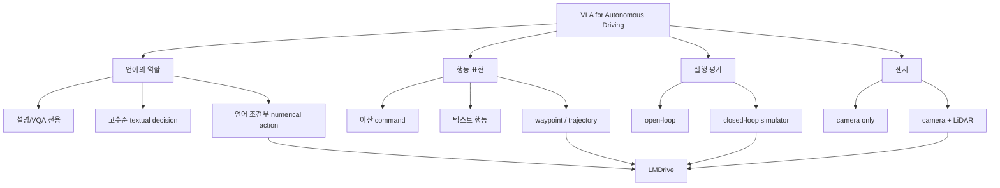
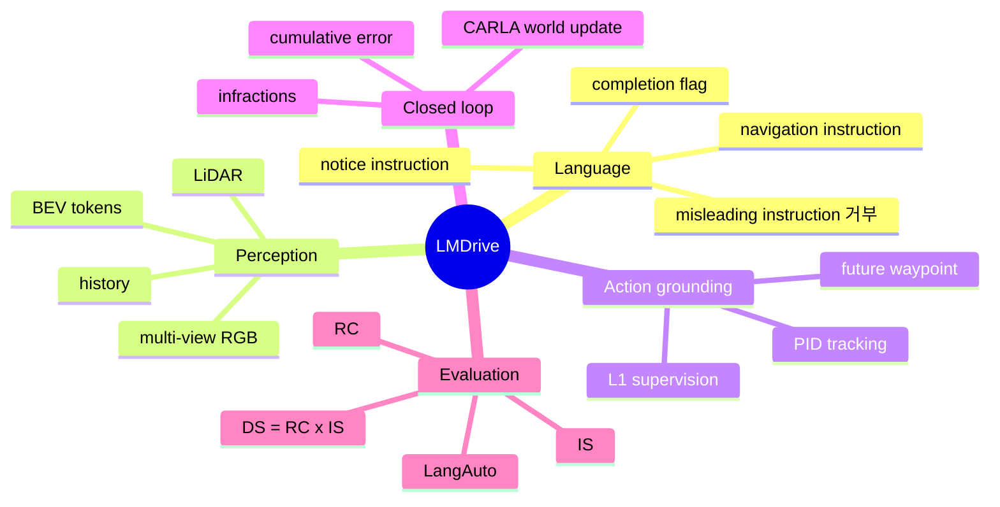
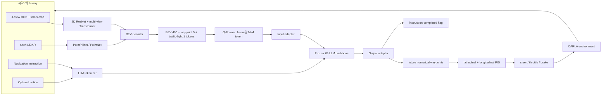
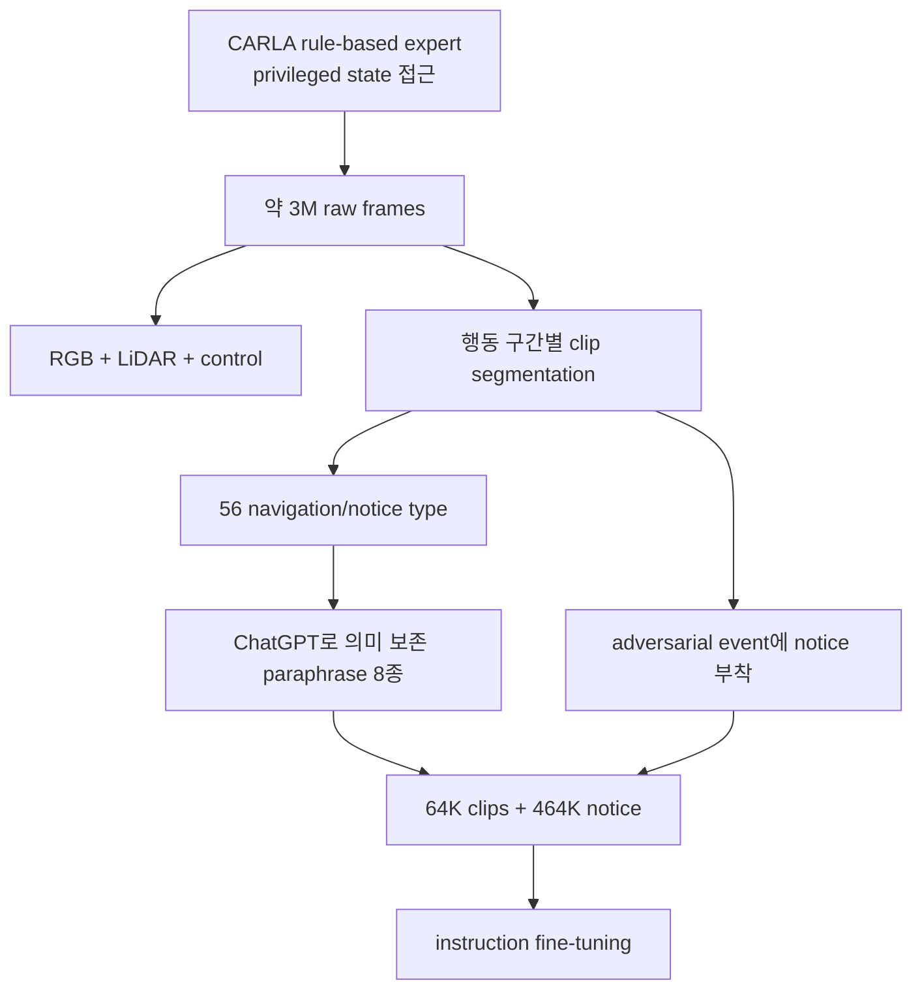
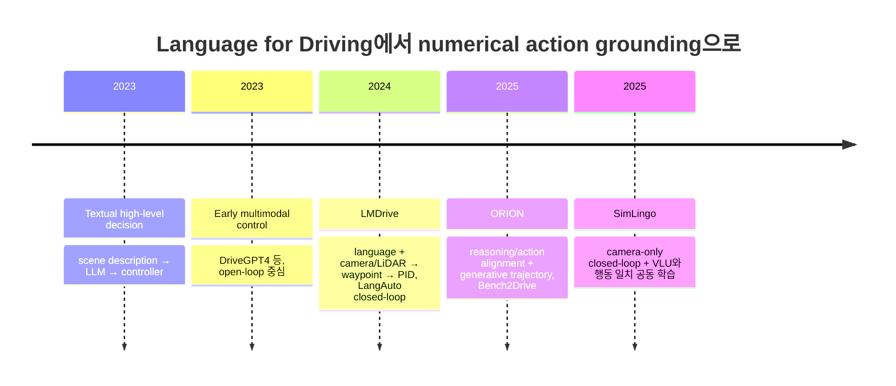
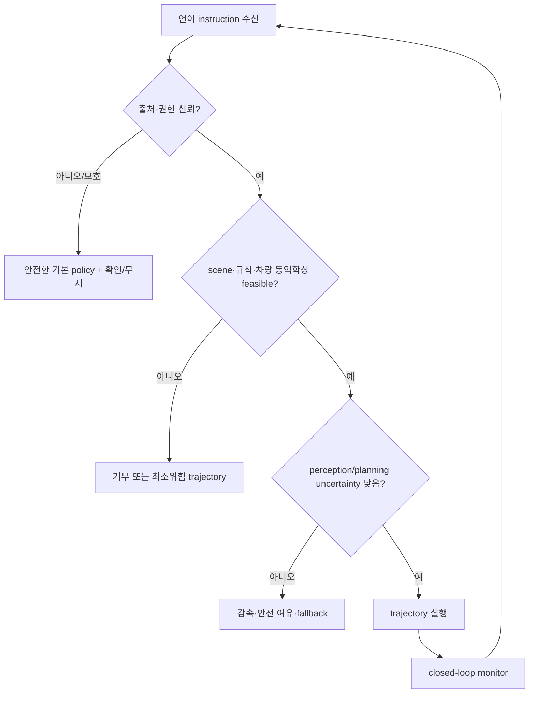

# Week 06. 수치 행동 생성기 1 — LMDrive: LLM으로 폐루프 자율주행하기

> **이번 주 산출물:** Textual action vs Numerical action 비교표  
> **학습일:** 2026-08-25 · **주차:** 6 / 12 · **읽기 방식:** Deep read (LMDrive) + skim (ORION, SimLingo)

| 항목 | 내용 |
|---|---|
| 원 논문 | **LMDrive: Closed-Loop End-to-End Driving with Large Language Models** |
| 한국어 제목 | **LMDrive: 대규모 언어 모델을 이용한 폐루프 End-to-End 주행** |
| 저자 / 발표 | Hao Shao 외 5명 · CVPR 2024 (arXiv v2, 2023-12-21) |
| URL | https://arxiv.org/abs/2312.07488 |
| 코드·데이터 | https://github.com/opendilab/LMDrive |
| taxonomy | **언어 조건부(language-conditioned), End-to-End, multi-modal, numerical-trajectory action, closed-loop VLA for AD** |
| 이번 주 초점 | waypoint/trajectory output · CARLA closed-loop · language–action alignment |

> **읽기 범위 메모:** 논문 PDF 14쪽(본문+부록), arXiv 메타데이터, 공식 프로젝트 페이지와 GitHub README를 확인했다. 수치와 구조는 이 1차 출처를 우선했다.

## 1. 이번 주 한 문장 결론

**LMDrive의 핵심은 언어를 ‘설명 생성’에 머물게 하지 않고, sensor token과 함께 LLM에 넣어 미래 waypoint라는 연속적인 수치 행동으로 내보낸 뒤 PID가 실제 steer/throttle/brake로 추종하게 한 최초의 폐루프 언어 조건부 E2E 주행 프레임워크라는 점이다.**

---

## 2. 논문 제목·Abstract 한국어 번역

### 제목

**LMDrive: 대규모 언어 모델을 이용한 폐루프 End-to-End 주행**

### Abstract 번역

자율주행 분야가 크게 발전했음에도, 기존 방법은 long-tail의 예측하지 못한 사건과 어려운 도심 상황에서 여전히 어려움을 겪으며 심각한 사고를 낼 수 있다. 한편 대규모 언어 모델(LLM)은 ‘인공 일반 지능’에 가까운 인상적인 추론 능력을 보였다. 그러나 기존 자율주행 방법은 sensor data와 navigation waypoint처럼 형식이 제한된 입력에 의존하는 경향이 있어, 차량이 언어 정보를 이해하고 사람과 상호작용하는 능력을 제한한다.

이를 위해 본 논문은 **언어로 유도되는(language-guided) End-to-End 폐루프 자율주행 프레임워크 LMDrive**를 제안한다. LMDrive는 multi-modal sensor data와 자연어 instruction을 함께 처리하고 통합하여, 현실적인 instruction 환경에서 사람 및 내비게이션 소프트웨어와 상호작용할 수 있게 한다. 언어 기반 폐루프 자율주행 연구를 촉진하기 위해 약 **64K개의 instruction-following clip**으로 이루어진 데이터셋과, 복잡한 instruction 및 어려운 주행 상황 처리 능력을 평가하는 **LangAuto benchmark**도 공개한다. 광범위한 폐루프 실험으로 LMDrive의 효과를 보였으며, 저자들은 이를 LLM을 폐루프 End-to-End 자율주행에 활용한 최초의 연구로 제시한다.

---

## 3. 핵심 기여 3~5개

1. **언어를 실행 경로에 연결:** navigation instruction과 passenger/assistant의 notice를 camera·LiDAR 관측과 공동 처리하여, LLM이 다음 **미래 waypoint**와 instruction-completed flag를 낸다.
2. **진짜 closed-loop 평가:** 예측값을 simulator에 실제로 실행한다. 따라서 open-loop의 expert trajectory 오차만으로는 보이지 않는 누적 오차, 시간 일관성, 충돌·신호 위반을 측정한다.
3. **언어-행동 데이터·benchmark:** 3M raw frame에서 약 64K clip, 464K notice instruction을 만들고, 자연어 지시·misleading instruction·연결된 장문 instruction을 포함한 LangAuto를 제안했다.
4. **시각 표현의 주행 사전학습:** multi-view RGB와 LiDAR를 BEV token으로 융합하고, object detection / future waypoint / traffic-light 상태로 vision encoder를 먼저 학습한다. 이 pre-training을 빼면 LangAuto DS가 **36.2 → 16.9**로 크게 하락했다.
5. **긴 history를 감당하는 token bottleneck:** frame당 406개의 visual token을 Q-Former로 4개로 압축해 LLM 문맥에 넣는다. 단순 downsample보다 DS가 **36.2 대 31.7**로 우수했다.

---

## 4. VLA for AD taxonomy 위치



| 축 | LMDrive의 위치 | 왜 중요한가 |
|---|---|---|
| 시스템 형태 | 언어 조건부 End-to-End VLA | perception→planning 사이에 hand-written textual interface를 강제하지 않는다. |
| action space | **미래 waypoint (수치 trajectory)** → PID control | LLM token을 직접 throttle 값으로 해석하지 않아 low-level control을 안정화한다. |
| language role | navigation + notice, instruction completion | 언어는 부가 설명이 아니라 차량 목표와 위험 맥락을 조건화하는 입력이다. |
| grounding | shared LLM context에서 language ↔ BEV/history ↔ waypoint를 공동 최적화 | 말만 그럴듯하고 행동이 다른 문제를 줄이는 방향이다. 단, 인과적 보장은 아니다. |
| sensor | 4-view RGB + focus crop + 64-channel LiDAR | semantic language와 3D geometry를 함께 쓴다. |
| temporal | 최대 40 sampled history frame | 긴 instruction의 진행 상태와 temporal consistency를 겨냥한다. |
| 평가 | CARLA 0.9.10.1 **closed-loop** | action을 세계에 실행한 뒤 다음 관측에서 재계획한다. |

### 개념 지도



---

## 5. Architecture / pipeline 시각화



### Architecture block: 무엇이 학습되고 무엇이 고정되는가?

| 단계 | 입력 | 학습 대상 | supervision / loss | 이후 처리 |
|---|---|---|---|---|
| 1. Vision pre-training | 단일 frame RGB+LiDAR | vision encoder | detection loss + waypoint L1 + traffic-light CE | prediction head를 폐기하고 encoder 고정 |
| 2. Instruction fine-tuning | history sensor token + language | Q-Former + input/output adapter | future waypoint L1 + completion CE | vision encoder와 LLM backbone은 고정 |
| 배포 | 최신 history + instruction | 없음 | 없음 | 최신 frame의 waypoint만 PID로 실행 |

**핵심 설계 해석:** 논문이 말하는 “end-to-end”는 sensor와 language가 단일 학습 경로에서 action representation에 연결된다는 뜻에 가깝다. 그러나 전체 backbone을 모두 finetune하는 완전한 end-to-end training은 아니다. vision encoder와 LLM은 stage 2에서 frozen이므로, **frozen foundation modules + trainable bridges** 구조라고 정확히 부르는 편이 낫다.

---

## 6. Input → Reasoning → Action Grounding 분석

| 층 | 실제 입력/출력 | LMDrive의 구현 | action grounding에서의 의미 | 남는 위험 |
|---|---|---|---|---|
| Perception | RGB, LiDAR | ResNet + PointPillars, BEV decoder | 언어가 참조하는 차선·신호·보행자를 geometric context에 묶는다. | simulator sensor와 실제 sensor의 domain gap, occlusion |
| Memory | 과거 sensor token | history 최대 `Tmax=40`, Q-Former 압축 | “다음 교차로에서 좌회전”의 진행 상태를 한 frame 이상으로 유지한다. | 긴 route/장문 instruction에서 memory 부족 가능 |
| Language | navigation / notice | tokenizer → LLM context | language가 목표·주의 대상을 바꾼다. | paraphrase·모호성·적대적 발화 일반화는 제한적 |
| Reasoning | LLM hidden representation | frozen LLaMA 계열 7B, adapter 학습 | perceptual token과 instruction의 결합 공간 | text CoT를 출력·검증하지 않으므로 reasoning의 충실성은 관찰 불가 |
| Numerical action | future `(x,y)` waypoint sequence | 2-layer output MLP, waypoint L1 | 말의 의미가 연속 공간 trajectory로 supervision된다. | 단일 expert imitation은 multimodal future/불확실성을 충분히 표현하지 못함 |
| Execution | steer/throttle/brake | 2 PID controller가 waypoint heading/speed 추종 | trajectory와 vehicle dynamics의 interface를 분리한다. | PID 및 차량 모델이 action space 일부를 담당; ‘LLM이 직접 control’은 아님 |
| Safety gate | 완료 flag, scene compliance | misleading 지시는 약 1초 뒤 completed로 label | 위험·불가능 지시를 무시하도록 학습 | 명시적 rule shield, uncertainty estimation, formal verifier는 없음 |

### 입력–출력 map

```text
"다음 교차로에서 좌회전" + "앞 보행자를 주의"
                 │
  [camera / LiDAR / 과거 scene] ──► BEV + temporal token
                 │                          │
                 └───────── LLM context ◄───┘
                                      │
                   {future waypoint_1 ... waypoint_N,
                    instruction-completed?}
                                      │
                          PID waypoint tracking
                                      │
                    numerical control = steer, throttle, brake
```

### Textual action vs Numerical action 비교표

| 구분 | Textual action | Numerical action (LMDrive의 중심) |
|---|---|---|
| 예 | “좌회전하라”, “감속하라”, “차선을 바꿔라” | 미래 `(x,y)` waypoint / trajectory, 이후 steer-throttle-brake |
| 장점 | 해석·대화·고수준 계획에 자연스럽고 LLM prior를 활용하기 쉽다 | 실행기와 직접 연결되며 연속적인 거리·곡률·속도를 표현한다 |
| 약점 | text→controller 변환기가 필요하고, semantic error가 누적될 수 있다 | 숫자가 타당해 보이더라도 언어 의도/안전 규칙을 만족하는지 설명하기 어렵다 |
| open-loop 지표 | VQA/decision accuracy, textual consistency | ADE/FDE, waypoint L1 등 expert imitation 오차 |
| closed-loop 지표 | text 자체만으로는 불충분 | RC, collision, traffic violation, DS 등 실제 결과 |
| grounding 실패 예 | “좌회전”이라고 말했지만 controller가 늦게 꺾음 | 보행자 주의 notice를 받았지만 waypoint가 감속/회피를 반영하지 못함 |
| LMDrive의 선택 | language는 **조건(condition)** | waypoint는 **실행 가능한 action representation** |

> **학습 포인트:** numerical action을 낸다고 해서 자동으로 language-action alignment가 보장되지는 않는다. 최소한 instruction을 바꾸었을 때 trajectory가 적절히 바뀌는 **counterfactual test**, invalid instruction을 거부하는 test, 실제 closed-loop 안전 metric이 함께 있어야 한다.

---

## 7. Training recipe

### 데이터 생성 및 annotation



| 항목 | 설정 / 관찰 |
|---|---|
| 수집 환경 | CARLA, 2.5K route, 8 town, 21 환경 조건; rule-based expert가 label 생성 |
| 센서 | RGB 4대(left/front/right/rear) + front focus crop, 64-channel LiDAR (10 Hz) |
| instruction | follow / turn / other / notice, 총 56 유형; 같은 의미의 phrase를 ChatGPT로 8종 생성 |
| hard case | 안전·교통법규에 맞지 않는 misleading instruction, 2–3개 지시를 잇는 sequential instruction |
| visual pre-training | AdamW + cosine schedule, 35 epoch, 첫 5 epoch warm-up; RGB random scale 0.9–1.1, color jitter |
| fine-tuning | 15 epoch, batch 32에서 LR `1e-4`, 2,000 iteration warm-up, weight decay 0.07 |
| memory / sampling | `Tmax=40`; fixed interval 2로 frame sample + temporal shift augmentation |
| trainable 범위 | Q-Former·adapter만 trainable, vision encoder·LLM은 frozen |
| objective | `L = L1(future waypoint) + CE(instruction completed)` (논문은 가중치 세부값을 명시하지 않음) |
| notice regularization | 75% clip에서 notice를 무작위 제거, 남은 clip은 최대 1개 notice. 25% notice 사용이 Short DS 50.6으로 최선(0%: 45.2, 100%: 49.1). |

### 왜 “freeze + adapter”인가?

- 7B LLM의 language prior를 보존하고 full fine-tuning 비용을 피한다.
- 차량 sensor 표현을 LLM embedding 공간으로 옮기는 어려움을 Q-Former/adapter가 맡는다.
- 반대로, driving-specific causal knowledge나 극단 상황 대처가 frozen LLM에 충분히 없으면 adapter만으로 수정할 수 있는 폭에는 한계가 있다.

---

## 8. Dataset / Benchmark / Metric 분석

### LangAuto 설계

| track | 조건 | 목적 |
|---|---|---|
| LangAuto | 위치에 따라 자연어 navigation instruction 갱신 | 기본 language-following closed-loop |
| LangAuto-Short / Tiny | route 길이 150–500m / <150m (기본 LangAuto는 >500m) | horizon별 난이도 분해 |
| LangAuto-Notice | adversarial event 시 실시간 notice 추가 | language가 안전 행동에 실제로 도움 되는지 확인 |
| LangAuto-Sequential | 10%의 연속 2–3 instruction을 장문으로 결합 | temporal instruction parsing·completion 확인 |
| misleading instruction | 약 5%, 1–2초 동안 간헐 삽입 | scene/규칙과 충돌하는 언어 거부 능력 확인 |

**coverage:** 8 CARLA town, highway·intersection·roundabout, 7 weather × 3 daylight 조합을 포함한 16 환경 조건. 평균 route distance는 LangAuto/Short/Tiny 각각 **635.8m / 305.9m / 122.4m**이다.

### metric 해석

| metric | 정의 | 좋은 점 | 맹점 |
|---|---|---|---|
| RC (Route Completion) ↑ | 정해진 route 중 완료 거리 비율 | instruction-following progress를 반영 | 빨리 달려도 안전을 보장하지 않음 |
| IS (Infraction Score) ↑ | collision·신호 위반 등의 discount를 반영 | 안전 위반을 score에 반영 | 위반 종류의 심각도/현실 비용과 일치하지 않을 수 있음 |
| DS (Driving Score) ↑ | `DS = RC × IS` | progress와 safety를 한 숫자로 결합 | 곱 하나로는 failure mode, comfort, uncertainty를 잃는다 |
| collisions / km ↓ | 차·보행자·layout 충돌 | safety error를 세분화 | CARLA scenario coverage에 의존 |

### 주요 closed-loop 결과

| 설정 | DS ↑ | RC ↑ | IS ↑ | 읽는 법 |
|---|---:|---:|---:|---|
| LLaVA-v1.5 7B, LangAuto | **36.2 ± 2.3** | 46.5 ± 4.3 | 0.81 ± 0.03 | 논문 내 가장 높은 기본 LangAuto DS |
| 동일, LangAuto-Short | **50.6 ± 1.7** | 60.0 ± 3.4 | 0.84 ± 0.04 | 짧은 horizon에서 성능 상승 |
| 동일, LangAuto-Tiny | **66.5 ± 3.6** | 77.9 ± 2.3 | 0.85 ± 0.02 | 작은 horizon이 훨씬 쉬움을 보여 줌 |
| 동일, Sequential | 34.0 | 43.7 | 0.81 | 장문·다단 instruction이 DS/RC를 낮춤 |
| Vision pre-training 제거 | 16.9 ± 5.1 | 24.1 ± 4.7 | 0.70 ± 0.04 | driving-grounded visual representation이 병목 |

### Notice가 safety에 주는 신호

LLaVA-v1.5에서 LangAuto 대비 LangAuto-Notice는 IS가 **0.81 → 0.87**, 차량 충돌이 km당 **0.33 → 0.17**, red-light 위반이 **0.92 → 0.50**으로 감소했다. 다만 두 benchmark 조건은 notice 유무 외에도 scenario distribution이 같아야 강한 인과 주장을 할 수 있다. 따라서 이를 “언어 notice가 안전을 증명했다”가 아니라 **해당 CARLA protocol에서 유망한 안전 신호를 보였다**로 해석한다.

---

## 9. 관련 논문 비교표

| 모델 | 언어 역할 | 주 센서 | action | evaluation | LMDrive와의 관계 |
|---|---|---|---|---|---|
| **LMDrive** (2024) | navigation + notice를 실행 조건으로 사용 | multi-view camera + LiDAR | future waypoint → PID control | LangAuto, CARLA closed-loop | 이번 주 기준점: early numerical-action VLA |
| DriveGPT4 (2023) | scene Q&A / control 예측, 특정 navigation input 부재 | frame sequence | control signal | 주로 open-loop 계열 | language interaction은 있으나 explicit route instruction grounding이 약하다는 LMDrive의 문제의식 |
| LanguageMPC (2023) | LLM이 high-level decision 생성 | textified scene | decision → parameter matrix → low-level control | 모듈형 | textual decision과 실행 제어 사이가 분리됨 |
| **ORION** (2025, skim) | VLM/LLM scenario reasoning과 planning을 공동 최적화 | vision 기반 E2E | generative precision trajectory | Bench2Drive closed-loop | QT-Former history + reasoning/action-space alignment를 명시. 보고된 DS 77.74, SR 54.62는 **다른 benchmark**이므로 LMDrive DS와 직접 비교 금지 |
| **SimLingo** (2025, skim) | closed-loop driving + VLU + language-action alignment 3-task | **camera only** | driving action (논문 요약 기준) | Bench2Drive / CARLA closed-loop | 행동과 언어 응답의 일관성을 별도 task로 다루며, CARLA Challenge 2024 우승 보고 |

### 시간축: 표현에서 실행으로



> **공정 비교 주의:** LMDrive의 LangAuto (CARLA 0.9.10.1)와 ORION/SimLingo의 Bench2Drive는 route, scenario, metric protocol이 다르다. DS 숫자를 SOTA 순위처럼 가로 비교하면 안 된다.

---

## 10. 강점과 한계

### 강점

| 강점 | 근거 | 실전 의미 |
|---|---|---|
| 언어가 action까지 연결됨 | future waypoint L1와 instruction-conditioned history | “설명 가능한 주행”에서 “언어로 조건화된 실행”으로 진전 |
| closed-loop를 정면으로 평가 | RC·IS·DS, collision/violation | imitation error만 낮은 policy의 착시를 줄임 |
| 위험한 언어를 dataset/benchmark에 포함 | misleading instruction 약 5%, notice adversarial event | 사람·내비게이션 지시를 무조건 따르지 않아야 한다는 문제를 명시 |
| multi-modal BEV | camera+LiDAR fusion, visual pre-training ablation | geometry와 traffic-light/객체 맥락을 LLM 입력 전에 강화 |
| 공개 재현성 | code, model, dataset, benchmark 공개 | 이후 VLA 연구의 실험 출발점 제공 |

### 한계 및 long-tail/safety risk

| 한계 / 위험 | 왜 문제가 되는가 | 다음 설계에서 필요한 것 |
|---|---|---|
| CARLA-only simulation | sensor noise, human behavior, rare physical failure가 현실과 다름 | real-world/로그 데이터 transfer, sim-to-real stress test |
| rule-based expert imitation | expert가 본 적 없는 위험 회피·상호작용을 잘 못 배울 수 있음 | diverse expert, counterfactual data, offline/online RL과 constraint |
| LLM은 frozen, no uncertainty | 잘못된 sensor-language binding을 confidence 없이 실행할 수 있음 | calibrated uncertainty, OOD detection, fallback/minimal-risk policy |
| PID가 최종 control 담당 | waypoint가 feasibility/comfort/dynamics를 완전히 보장하지 않음 | dynamics-aware trajectory optimizer, control barrier / safety shield |
| completion label의 단순화 | misleading instruction을 약 1초 후 ‘완료’로 label하는 것은 거부·재해석을 동일시 | explicit `reject / defer / ask / obey` action state와 justification |
| language attack / ambiguity | “빨리”, 모순된 passenger 지시, prompt injection 성격의 외부 텍스트 | trusted instruction source, authority hierarchy, rule-grounded parser |
| benchmark metric의 압축 | DS는 진행과 위반을 결합하지만 near-miss, comfort, calibration을 누락 | scenario-family safety matrix, intervention rate, worst-case/CVaR |
| latency·compute 미분석 | 7B LLM과 history는 real-time vehicle deployment에 무거울 수 있음 | latency p50/p99, watchdog, distilled planner, degraded-mode test |

### 안전 관점의 우선순위



LMDrive는 `FEAS`의 일부를 data-drivenly 배우려는 출발점이지만, 위 diagram의 **명시적 authority/feasibility/uncertainty safety layer**를 제공하지는 않는다.

---

## 11. 실전 학습 포인트

1. **VLA 여부를 질문하는 가장 좋은 검사는 output이다.** VQA나 textual rationale가 있어도 그것이 trajectory/control을 조건화·감독하지 않으면 action grounding은 약하다.
2. **trajectory는 control보다 상위이면서도 수치적인 action interface다.** LLM이 매 step `steer=0.13`을 text로 생성하는 것보다 waypoint를 내고 검증된 controller가 추종하게 하는 것이 현실적일 수 있다.
3. **closed-loop는 필수이나 충분조건은 아니다.** 누적 오차는 드러나지만 benchmark 다양성·현실 transfer·안전 보장은 자동으로 해결되지 않는다.
4. **representation pre-training이 언어 모델보다 먼저 무너질 수 있다.** visual pre-training 제거 DS 하락(36.2→16.9)은 “좋은 LLM”보다 driving-grounded sensor token이 먼저라는 강한 ablation 신호다.
5. **언어를 항상 따르는 것은 안전하지 않다.** misleading instruction을 ‘거부’하는 capability와, 누가 어떤 지시를 할 권한이 있는지의 policy를 분리해 설계해야 한다.
6. **평가 표에는 action representation과 controller를 함께 써야 한다.** “LLM이 주행한다”는 표현 뒤에 waypoint decoder·PID·규칙 fallback이 숨으면 실제 책임 경계가 흐려진다.

### 재현/확장 체크리스트

- [ ] 동일 CARLA version, route/scenario file, weather seed와 3회 이상 run을 고정한다.
- [ ] RC/IS/DS뿐 아니라 scenario family별 collision·red-light·offroad/km를 보고한다.
- [ ] 같은 scene에서 instruction만 바꾼 counterfactual waypoint test를 만든다.
- [ ] invalid, contradictory, delayed, paraphrased instruction을 분리 평가한다.
- [ ] trajectory waypoint와 final PID control 모두의 latency와 p99를 기록한다.
- [ ] `reject/slow-down/fallback`을 명시 action으로 두고, unsafe instruction acceptance rate를 측정한다.

---

## 12. 다음 주 질문

**Week 07 — Numerical Action Generator 2: 효율성과 최신 구조**

> ORION/AutoVLA/OpenDriveVLA류에서는 LMDrive의 “frozen LLM + Q-Former + waypoint + PID” interface가 어떻게 바뀌는가? 특히 (1) generative trajectory의 multimodality, (2) reasoning–action alignment loss, (3) MoE/token pruning/adaptive reasoning이 **closed-loop safety를 손상하지 않고 latency를 낮추는지**를 어떤 공정한 protocol으로 검증해야 하는가?

---

## 13. 참고 링크

1. **LMDrive paper (arXiv v2):** https://arxiv.org/abs/2312.07488  
2. **LMDrive PDF:** https://arxiv.org/pdf/2312.07488  
3. **LMDrive project page:** https://hao-shao.com/projects/lmdrive.html  
4. **LMDrive code / model / dataset 안내:** https://github.com/opendilab/LMDrive  
5. **LMDrive dataset:** https://huggingface.co/datasets/OpenDILabCommunity/LMDrive  
6. **ORION (skim):** https://arxiv.org/abs/2503.19755  
7. **SimLingo (skim):** https://arxiv.org/abs/2503.09594  
8. **CARLA Leaderboard:** https://leaderboard.carla.org/

---

### 용어 미니 사전

| 용어 | 이 노트에서의 뜻 |
|---|---|
| action grounding | 언어/scene representation이 실제 실행 가능한 trajectory·control과 일관되게 연결되는 성질 |
| closed-loop | model action을 환경에 실행하고, 변한 다음 관측을 다시 받아 반복하는 평가/제어 |
| waypoint | 차량이 지나가야 할 미래 위치들의 수치 sequence |
| BEV | Bird’s-Eye View. 여러 sensor view를 ego-centric top-down 공간으로 융합한 표현 |
| Q-Former | learned query로 많은 visual token을 적은 language-compatible token으로 압축하는 모듈 |
| notice instruction | 위험·신호·보행자 등 주행 중 실시간 주의 정보를 전달하는 자연어 입력 |
| RC / IS / DS | route completion / infraction score / driving score (`DS = RC × IS`) |
