# Week 07. Numerical Action Generator 2: AutoVLA로 보는 효율적 adaptive reasoning과 최신 VLA 구조

## Metadata

| 항목 | 내용 |
|---|---|
| Date | 2026-06-09 |
| Week | 07 / 12 |
| Original paper/source | *AutoVLA: A Vision-Language-Action Model for End-to-End Autonomous Driving with Adaptive Reasoning and Reinforcement Fine-Tuning* |
| Korean title | **AutoVLA: Adaptive Reasoning과 Reinforcement Fine-Tuning을 이용한 End-to-End 자율주행 Vision-Language-Action 모델** |
| URL | https://arxiv.org/abs/2506.13757 |
| Version read | arXiv v3 metadata + arXiv HTML full text + project page 기반 |
| Authors | Zewei Zhou, Tianhui Cai, Seth Z. Zhao, Yun Zhang, Zhiyu Huang, Bolei Zhou, Jiaqi Ma |
| Venue / status | NeurIPS 2025, project page: https://autovla.github.io/ |
| Taxonomy | End-to-End VLA for AD / numerical action generator / adaptive reasoning / physical action tokenization / RL post-training |
| Reading mode | Deep read: **AutoVLA** / skim: **DriveMoE**, **OpenDriveVLA**, **FastDriveVLA 확인 제한** |
| 이번 주 focus | adaptive reasoning, MoE, token pruning/action tokenization, latency |
| Output | **VLA inference cost / latency 정리** |

> 참고: 이번 노트는 논문 전체를 줄 단위로 번역하지 않고, arXiv abstract/HTML 본문과 project page를 기반으로 한국어 학습 노트로 재구성했다. PDF 전체 line-by-line 번역은 수행하지 않았다. FastDriveVLA는 이번 cron 실행에서 arXiv/GitHub/공식 metadata를 안정적으로 확인하지 못해, 비교표에서는 “확인 제한”으로 표시하고 추적 대상으로 남겼다.

---

## 1. 이번 주 한 문장 결론

**AutoVLA의 핵심은 “VLM이 운전 이유를 길게 설명한다”가 아니라, multi-view camera + ego state + language instruction을 하나의 autoregressive VLM에 넣고, CoT reasoning token과 물리적으로 feasible한 discrete action token을 같은 decoder에서 생성하되, GRPO 기반 RFT로 쉬운 장면에서는 reasoning을 줄이고 어려운 장면에서만 slow thinking을 쓰도록 학습한다는 점이다.**

Week 06의 LMDrive가 **LLM-conditioned waypoint generator + PID controller**로 closed-loop action grounding을 보여줬다면, Week 07의 AutoVLA는 다음 질문을 더 직접적으로 다룬다.

> **VLA가 reasoning과 trajectory generation을 한 모델 안에서 처리할 때, latency 폭발을 어떻게 줄일 것인가?**

AutoVLA의 답은 세 가지다.

1. **Continuous trajectory를 physical action token으로 discretize**해 LLM의 next-token prediction 문제로 만든다.
2. **Fast thinking / slow thinking dual mode**를 SFT 데이터에 함께 넣어, action-only 출력과 CoT+action 출력을 모두 학습한다.
3. **GRPO 기반 reinforcement fine-tuning(RFT)**에서 planning reward와 CoT length penalty를 결합해, 불필요한 긴 reasoning을 줄인다.

즉 Week 07의 주제는 단순한 “더 큰 VLM”이 아니라, **action grounding의 물리적 feasibility와 inference cost를 동시에 최적화하는 VLA 설계**다.

---

## 2. 논문 제목·Abstract 한국어 번역

### 2.1 제목 번역

- **원제**: *AutoVLA: A Vision-Language-Action Model for End-to-End Autonomous Driving with Adaptive Reasoning and Reinforcement Fine-Tuning*
- **번역**: **AutoVLA: Adaptive Reasoning과 Reinforcement Fine-Tuning을 이용한 End-to-End 자율주행 Vision-Language-Action 모델**
- **시스템명**: **AutoVLA**

### 2.2 Abstract 한국어 번역

최근 Vision-Language-Action(VLA) 모델은 world knowledge와 reasoning 능력을 활용해 end-to-end 자율주행에서 가능성을 보여주었다. 그러나 현재 VLA 모델들은 종종 물리적으로 불가능한 action output, 복잡한 모델 구조, 또는 불필요하게 긴 reasoning 문제를 겪는다.

이 논문에서는 end-to-end 자율주행을 위해 reasoning과 action generation을 하나의 autoregressive generation model 안에서 통합하는 새로운 VLA 모델인 **AutoVLA**를 제안한다. AutoVLA는 raw visual input과 language instruction으로부터 semantic reasoning과 trajectory planning을 직접 수행한다. 저자들은 continuous trajectory를 discrete하고 feasible한 action으로 tokenize하여 language model 안에 직접 통합할 수 있게 만든다.

학습에는 supervised fine-tuning을 사용해 모델이 두 가지 thinking mode를 갖도록 한다. 첫째는 trajectory만 빠르게 생성하는 **fast thinking**이고, 둘째는 chain-of-thought reasoning으로 보강된 **slow thinking**이다. Planning 성능과 효율성을 더 높이기 위해, 저자들은 Group Relative Policy Optimization(GRPO)에 기반한 reinforcement fine-tuning 방법을 도입하여 straightforward scenario에서 불필요한 reasoning을 줄인다.

nuPlan, nuScenes, Waymo, CARLA를 포함한 real-world 및 simulated dataset/benchmark에서 광범위한 실험을 수행한 결과, AutoVLA는 open-loop와 closed-loop setting 모두에서 경쟁력 있는 성능을 보였다. 정성적 결과는 다양한 시나리오에서 AutoVLA가 adaptive reasoning과 정확한 planning capability를 갖고 있음을 보여준다.

### 2.3 Abstract를 VLA 관점으로 다시 쓰기

**AutoVLA는 VLM의 language reasoning 능력을 trajectory planning에 연결하되, continuous waypoint를 그대로 텍스트로 생성하지 않고 0.5초 단위의 feasible physical action token sequence로 바꾸어 autoregressive decoder가 직접 생성하게 만든 numerical action generator다. 여기에 GRPO post-training을 붙여, 안전·진행·comfort 같은 planning reward와 reasoning 길이 penalty를 동시에 최적화함으로써 성능과 latency를 함께 다룬다.**

### 2.4 제목만 보고 오해하면 안 되는 점

| 오해 | 실제 AutoVLA |
|---|---|
| “CoT를 길게 쓰는 reasoning 논문이다” | CoT는 수단이고, 핵심 output은 **5초 trajectory로 decode되는 physical action token sequence**다. |
| “Fast/slow thinking은 rule-based switch다” | SFT로 두 mode를 학습하고, RFT에서 reward와 length penalty로 adaptive behavior를 유도한다. |
| “LLM이 waypoint 좌표를 텍스트로 직접 찍는다” | Continuous trajectory를 codebook 기반 discrete action token으로 바꾼 뒤 생성·decode한다. |
| “open-loop planning만 평가한다” | NAVSIM/nuScenes/Waymo 같은 open-loop뿐 아니라 CARLA Bench2Drive closed-loop도 평가한다. |
| “효율성은 작은 모델을 쓰면 끝난다” | Qwen2.5-VL-3B를 쓰지만, slow CoT는 평균 10.518초로 여전히 비싸며 RFT가 이 비용을 줄이는 핵심 장치다. |

---

## 3. 핵심 기여 3~5개

| # | 핵심 기여 | 왜 중요한가 |
|---:|---|---|
| 1 | **Reasoning과 action generation을 단일 autoregressive VLM으로 통합** | 별도 VLM reasoner + planner 구조보다 단순하며, end-to-end token generation으로 reasoning/action을 같은 policy 안에 둔다. |
| 2 | **Physical action tokenization** | Continuous trajectory를 0.5초 단위 motion token으로 discretize해, LLM vocabulary에 `<action_0> ...` 형태로 추가한다. 물리적으로 infeasible한 text waypoint 문제를 줄인다. |
| 3 | **Fast thinking / slow thinking dual mode SFT** | 쉬운 장면은 action-only, 복잡한 장면은 CoT+action으로 학습해 adaptive reasoning의 기반을 만든다. |
| 4 | **GRPO 기반 RFT + CoT length penalty** | Planning reward를 높이면서 불필요한 reasoning token 생성을 줄여, NAVSIM에서 PDMS 향상과 runtime 감소를 동시에 보고한다. |
| 5 | **Open-loop + closed-loop multi-benchmark 평가** | nuPlan/NAVSIM, nuScenes, Waymo, CARLA Bench2Drive를 함께 사용해 numerical action grounding의 범위를 넓힌다. |

### Contribution map

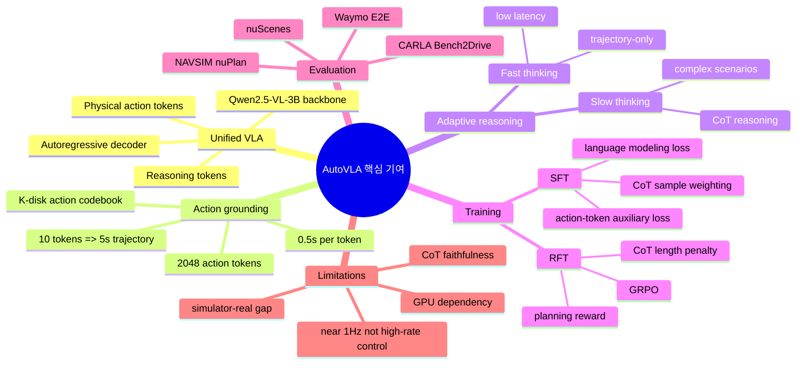

---

## 4. VLA for AD taxonomy 위치

### 4.1 Taxonomy 좌표

| 축 | AutoVLA 위치 | 해석 |
|---|---|---|
| System type | **End-to-End VLA** | Raw visual observation + instruction에서 직접 trajectory token을 생성한다. |
| Action output | **Discrete physical action tokens → continuous trajectory** | Textual action이 아니라 codebook token을 decode해 5초 trajectory를 만든다. |
| Language role | **Instruction + optional CoT reasoning** | Language는 route/command 입력이자, complex scene reasoning을 위한 intermediate token이다. |
| Reasoning style | **Adaptive fast/slow thinking** | 모든 장면에 CoT를 쓰지 않고, RFT로 불필요한 reasoning을 줄이도록 유도한다. |
| Planner coupling | **단일 autoregressive policy 내부** | 별도 downstream planner에 meta-action을 넘기는 방식보다 통합적이다. |
| Evaluation | **Open-loop + closed-loop** | NAVSIM/nuScenes/Waymo와 Bench2Drive를 모두 사용한다. |
| Efficiency strategy | **CoT length penalty + small VLM + action tokenization** | token pruning 자체보다는 reasoning token budget을 reward로 제어하는 접근이다. |

### 4.2 Week 01 taxonomy에 연결하기

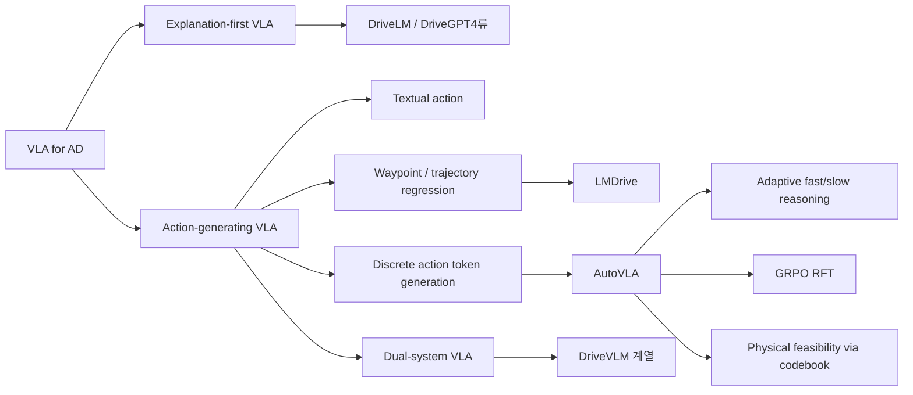

### 4.3 AutoVLA의 위치를 한 줄로 요약

**AutoVLA는 “VLM reasoning을 갖춘 end-to-end planner”이면서, action output 측면에서는 continuous waypoint regression보다 LLM 친화적인 discrete physical action token generator에 가깝다.**

---

## 5. Architecture / pipeline 시각화

### 5.1 전체 pipeline

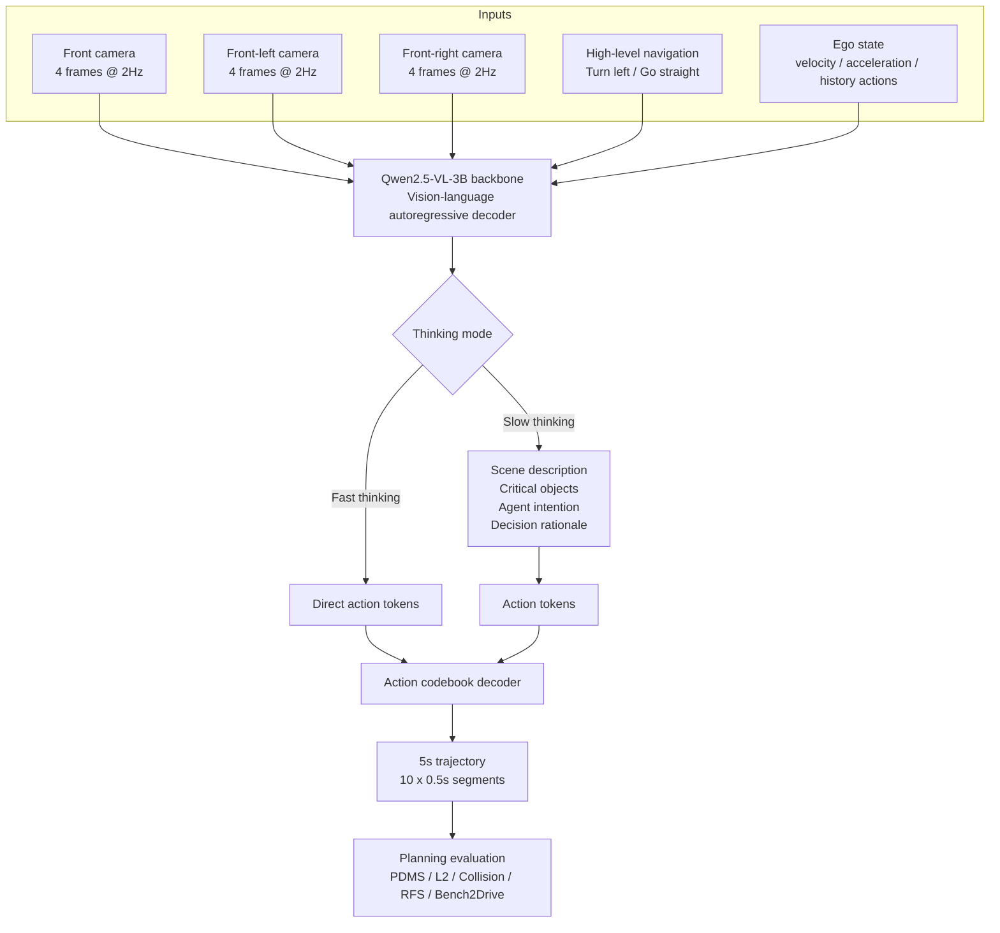

### 5.2 Token-level 관점

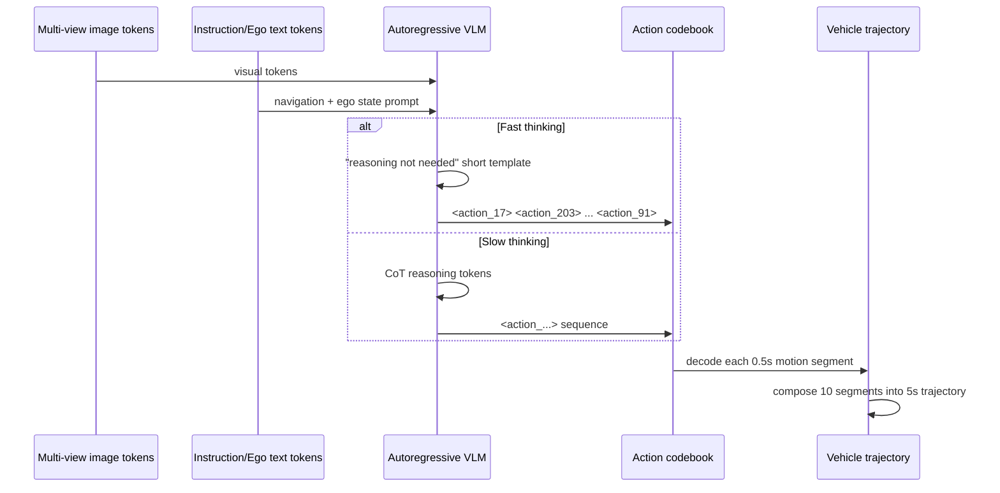

### 5.3 AutoVLA architecture blocks

| Block | 논문 내 역할 | 학습/평가상 의미 |
|---|---|---|
| Qwen2.5-VL-3B | Visual/text input을 받아 reasoning/action token을 autoregressive하게 생성 | 3B variant는 onboard deployment와 성능 사이 trade-off로 선택됨 |
| Physical action vocabulary | `<action_i>` 형태의 추가 token | trajectory planning을 language modeling 문제로 변환 |
| K-disk action codebook | 실제 vehicle motion segment를 clustering해 대표 token 생성 | 물리적으로 plausible한 short-term maneuver coverage 확보 |
| CoT reasoning data | scene description, crucial objects, intention prediction, action rationale | slow thinking mode를 학습하기 위한 distillation target |
| GRPO RFT | group candidate output의 relative advantage로 policy update | planning reward와 reasoning efficiency를 동시에 맞춤 |
| CoT length penalty | 긴 reasoning token에 비용 부여 | straightforward scenario에서 fast thinking을 유도 |

---

## 6. Input → Reasoning → Action Grounding 분석

### 6.1 I/O map

| Stage | Input | Internal representation | Output | Action grounding 수준 |
|---|---|---|---|---|
| Perception input | 3 camera views × 4 frames | VLM visual tokens | Scene context | Raw image 기반이지만 camera coverage는 front/front-left/front-right 중심 |
| Instruction input | High-level command | Text tokens | Intended route/direction | Language가 action goal을 제한한다. |
| Ego input | velocity, acceleration, historical actions | Prompt/state tokens | dynamic context | 현재 차량 동역학을 trajectory generation에 반영한다. |
| Reasoning | visual+text+ego | CoT language tokens | scene description / critical objects / intention / decision | Optional. 모든 장면에 길게 쓰면 latency가 커진다. |
| Action generation | hidden state after prompt/CoT | physical action token distribution | 10 action tokens | 각 token은 0.5초 motion segment다. |
| Decoding | action token sequence | K-disk codebook lookup | 5초 continuous trajectory | Feasible motion prior가 codebook에 들어간다. |

### 6.2 Fast vs Slow thinking runtime

논문 Table 2 기준:

| Thinking mode | Min. runtime | Max. runtime | Avg. runtime | 해석 |
|---|---:|---:|---:|---|
| Fast thinking | 0.997s | 1.116s | **1.072s** | 거의 1Hz 수준. 단순 장면에서는 이 mode가 필요하다. |
| Slow thinking | 7.607s | 13.706s | **10.518s** | CoT token 생성 때문에 실시간 제어에는 매우 부담스럽다. |

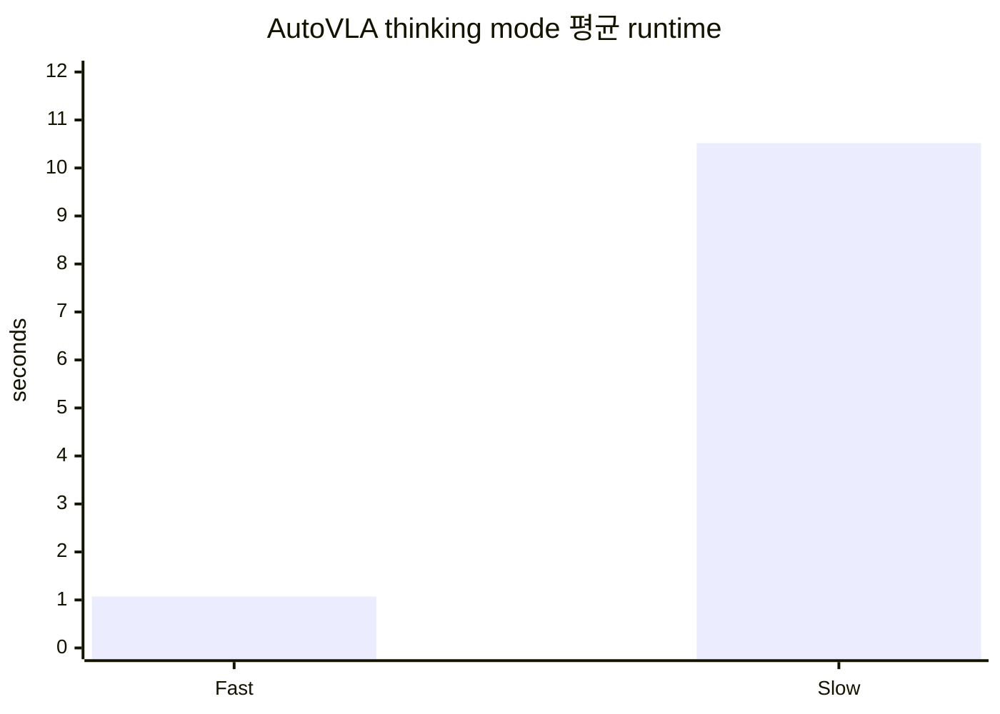

### 6.3 Action tokenization이 중요한 이유

| 방식 | 장점 | 약점 | AutoVLA 관점 |
|---|---|---|---|
| Textual action | LLM이 자연스럽게 생성 가능 | 좌표/동역학이 물리적으로 깨질 수 있음 | 논문은 text waypoint보다 physical action이 더 낫다고 보고한다. |
| Direct waypoint regression | 연속 trajectory를 직접 예측 | LLM vocabulary와 잘 맞지 않음 | LMDrive류 hybrid 구조에서 흔함 |
| Latent action token + planner | feasible decoder 가능 | 중간 모듈이 늘어나 end-to-end 단순성이 약해짐 | AutoVLA가 비판하는 복잡 구조 중 하나 |
| **Physical action token** | LLM next-token prediction과 trajectory feasibility를 연결 | codebook coverage와 quantization error에 의존 | AutoVLA의 핵심 선택 |

### 6.4 Text waypoint vs physical action 결과

논문 ablation 기준:

| Metric | Text waypoint | Physical action | 개선 방향 |
|---|---:|---:|---|
| PDM Score | 71.31 | **80.54** | physical action token 우세 |
| Avg. L2 (m) | 0.89 | **0.70** | 낮을수록 좋음 |
| Avg. Collision (%) | 0.36 | **0.31** | 낮을수록 좋음 |
| Runtime (s) | 7.65 | **3.95** | physical action token이 더 빠름 |

**해석:** AutoVLA에서 action tokenization은 단순 구현 detail이 아니라, **accuracy·safety proxy·latency를 동시에 바꾸는 architecture decision**이다.

---

## 7. Training recipe

### 7.1 Training overview

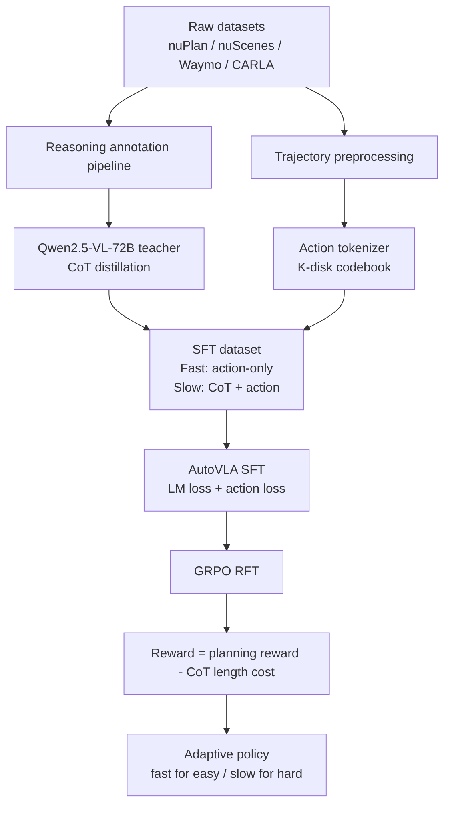

### 7.2 Reasoning data pipeline

AutoVLA는 reasoning data 부족을 직접 해결하려고 한다. 논문은 Qwen2.5-VL-72B를 teacher로 사용해 다음 네 가지 구조화된 annotation을 만든다.

| Reasoning component | 의미 | VLA에서 중요한 이유 |
|---|---|---|
| Detailed scene description | 장면의 도로/차선/신호/agent 상황 설명 | perception token을 language reasoning 공간에 연결 |
| Crucial object identification | 주행 결정에 중요한 객체 식별 | long-tail risk와 safety-critical cue를 놓치지 않기 위함 |
| Surrounding agents' intention prediction | 주변 차량/보행자의 의도 예측 | 단순 imitation보다 interaction-aware planning에 필요 |
| Appropriate driving action determination | 어떤 driving action이 타당한지 결정 | reasoning을 최종 action token에 causal하게 연결 |

Reasoning sample 규모:

| Dataset | Reasoning samples | 역할 |
|---|---:|---|
| nuPlan | 45.6k | NAVSIM/open-scene planning reasoning |
| Waymo E2E | 7.2k | challenging/long-tail scenario reasoning |
| nuScenes | 2.9k | open-loop planning + VQA 연결 |
| CARLA / DriveLM reformatted | 53.2k | simulation closed-loop reasoning 보강 |

### 7.3 SFT objective 직관

SFT는 두 가지를 동시에 학습한다.

1. **Language modeling loss**: prompt 뒤에 나오는 reasoning/action token sequence를 맞춘다.
2. **Action-token auxiliary loss**: output sequence 안의 action token 위치에 더 직접적인 supervision을 준다.

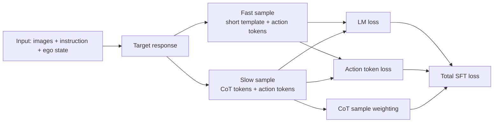

### 7.4 RFT / GRPO 직관

AutoVLA의 RFT는 “좋은 trajectory를 만들면서도 쓸데없이 길게 생각하지 말라”는 압력을 준다.

| 구성 | 설명 |
|---|---|
| Candidate sampling | 같은 scenario에서 여러 candidate output을 sampling |
| Group relative advantage | 같은 group 안에서 reward가 더 좋은 output을 상대적으로 강화 |
| Planning reward | nuPlan에서는 PDMS, Waymo에서는 ADE 기반 reward 사용 |
| KL regularization | SFT policy에서 너무 멀어지는 것을 방지 |
| CoT length penalty | 쉬운 장면에서 긴 reasoning을 생성하는 행동을 억제 |

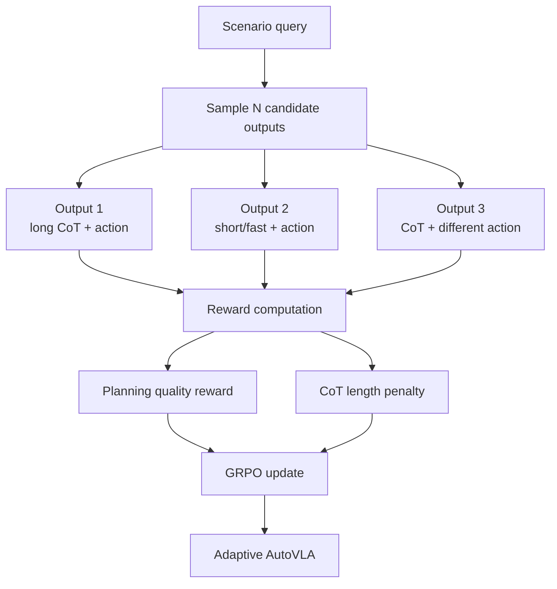

---

## 8. Dataset / Benchmark / Metric 분석

### 8.1 Dataset matrix

| Dataset | Train samples | Test samples | Modal / role | AutoVLA에서의 쓰임 |
|---|---:|---:|---|---|
| nuPlan / NAVSIM | 166.3k | 12.1k | real-world driving scenes | planning reward(PDMS), open-loop planning 평가 |
| nuScenes | 19.0k | 5.6k | urban driving, 6 camera views | L2/collision 기반 open-loop planning 비교 |
| Waymo E2E | 23.8k | 1.5k | 20초 segment, challenging/long-tail focus | RFS/ADE 평가 및 RFT reward 일부 |
| CARLA / Garage / Bench2Drive | 274.5k | benchmark scenarios | simulation closed-loop | closed-loop driving score/success 평가 |

### 8.2 Metric map

| Benchmark | Type | Main metrics | 무엇을 본다고 해석할까? |
|---|---|---|---|
| NAVSIM / nuPlan | Open-loop planning benchmark | PDMS, collision, area, direction, progress, TTC, comfort | Safety + progress + comfort를 합친 planning quality proxy |
| nuScenes planning | Open-loop | L2 distance, collision rate | GT trajectory imitation 및 collision proxy |
| Waymo E2E | Open-loop / human-rated style | RFS, ADE at 3s/5s, spotlight RFS | long-tail/high-value scenario의 planning quality |
| Bench2Drive / CARLA | Closed-loop simulation | Driving score, success rate, efficiency, comfortness | Interactive rollout에서 실제로 끝까지 주행하는지 |

### 8.3 Main results: NAVSIM

| Method | PDMS | Collision | Progress | Comfort | 비고 |
|---|---:|---:|---:|---:|---|
| AutoVLA One-shot | 80.54 | 96.89 | 75.82 | 99.94 | SFT/action generation baseline |
| AutoVLA Post-RFT | **89.11** | **98.41** | 81.87 | 99.94 | RFT 후 planning reward 정렬 |
| AutoVLA Best-of-N | **92.12** | 99.14 | **87.55** | **99.98** | oracle scorer로 6 candidates 중 선택 |
| Centaur | 92.10 | 99.23 | 85.96 | 99.97 | strong baseline |
| TrajHF | 93.95 | 99.30 | 90.39 | 99.81 | highest PDMS among listed baselines |

**해석:** Post-RFT는 one-shot 대비 큰 폭으로 좋아진다. 다만 Best-of-N은 oracle scorer에 기대므로 실제 onboard deployment와는 차이가 있다.

### 8.4 Main results: closed-loop Bench2Drive

| Method | Driving Score | Success Rate | Efficiency | Comfortness |
|---|---:|---:|---:|---:|
| Orion | 77.74 | 54.62% | **151.48** | 17.38 |
| AutoVLA | **78.84** | **57.73%** | 146.93 | **39.33** |
| DriveAdapter | 64.22 | 33.08% | 70.22 | 16.01 |
| UniAD-Base | 45.81 | 16.36% | 129.21 | 43.58 |

**해석:** AutoVLA는 closed-loop simulation에서도 강한 결과를 보이지만, 실제 도로가 아니라 CARLA scenario라는 점은 계속 염두에 둬야 한다.

### 8.5 Open-loop vs closed-loop의 의미

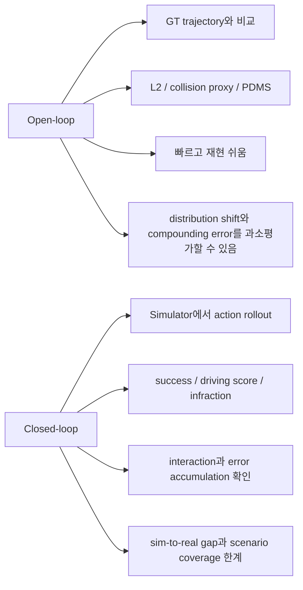

---

## 9. 관련 논문 비교표

### 9.1 Week 06–07 numerical action generator 비교

| Paper/system | 핵심 action representation | Reasoning 구조 | 효율성 전략 | 평가 | Week 07 관점의 포인트 |
|---|---|---|---|---|---|
| LMDrive | Future waypoint + PID control | LLM-conditioned, explicit CoT 중심은 아님 | frozen LLM + adapters | CARLA closed-loop LangAuto | language instruction을 waypoint grounding으로 연결한 초기 강한 기준점 |
| ORION | Latent action / planning-oriented VLA 계열 | reasoning-action 연결 | downstream decoding 구조 | closed-loop/benchmark 중심 | AutoVLA가 “복잡한 intermediate decoder” 문제의 비교 대상으로 보는 방향 |
| SimLingo | VLM/VLA style driving in simulation | language-to-action grounding | simulator 기반 학습/평가 | CARLA류 | language-conditioned driving data/closed-loop realism 관점에서 연결 |
| OpenDriveVLA | 2D/3D instance-aware visual representation + autoregressive action | structured agent-environment-ego interaction modeling | hierarchical vision-language alignment | nuScenes open-loop + QA | AutoVLA와 가장 직접적인 open-source VLA 비교군. AutoVLA appendix에서도 nuScenes 비교 포함 |
| DriveMoE | Vision MoE + Action MoE | scenario/behavior specialized experts | camera selection router + behavior expert router | Bench2Drive closed-loop | Week 07의 “효율성과 최신 구조”에서 MoE 방향을 대표 |
| FastDriveVLA | 확인 제한 | 확인 제한 | 이름상 fast/latency 계열로 추정 금지 | 확인 제한 | 이번 실행에서 공식 source 확인 실패. 다음 주기/수동 조사 필요 |
| AutoVLA | Physical action token sequence | adaptive fast/slow thinking | GRPO RFT + CoT length penalty | nuPlan, nuScenes, Waymo, CARLA | reasoning token budget을 reward로 직접 제어하는 점이 핵심 |

### 9.2 AutoVLA vs OpenDriveVLA

| 축 | AutoVLA | OpenDriveVLA |
|---|---|---|
| Backbone | Qwen2.5-VL-3B | open-source LLM 기반 VLA |
| Visual representation | front/front-left/front-right multi-frame camera 중심 | 2D + 3D instance-aware visual representations |
| Action grounding | K-disk codebook 기반 physical action tokens | spatially grounded driving actions |
| Reasoning | fast/slow thinking + CoT annotation + GRPO RFT | structured agent-environment-ego interaction modeling |
| Efficiency focus | 불필요한 CoT token을 줄이는 adaptive reasoning | modality alignment와 structured token modeling 중심 |
| 평가 | nuPlan, nuScenes, Waymo, CARLA | nuScenes open-loop planning + driving QA 중심 |
| 강점 | planning reward와 reasoning length를 함께 최적화 | 2D/3D structured visual grounding이 강함 |

### 9.3 AutoVLA vs DriveMoE

| 축 | AutoVLA | DriveMoE |
|---|---|---|
| 문제의식 | CoT reasoning이 길고 비싸다 | multi-view sensory data와 rare maneuver를 전문화해 처리해야 한다 |
| 구조 | single autoregressive VLM + action token | Scene-Specialized Vision MoE + Skill-Specialized Action MoE |
| 효율성 | 쉬운 장면에서 reasoning token을 줄임 | router가 relevant camera/expert를 선택해 specialization |
| Action | physical action token sequence | behavior-specialized action experts |
| 위험 | slow mode가 여전히 10초대, GPU 의존 | router failure, expert imbalance, rare skill coverage 문제 가능 |
| 학습 포인트 | RL로 reasoning budget을 제어 | MoE로 perception/action capacity를 조건부 활성화 |

### 9.4 Efficiency technique map

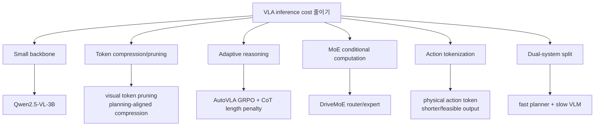

---

## 10. 강점과 한계

### 10.1 강점

| 강점 | 설명 | 왜 중요한가 |
|---|---|---|
| Unified architecture | reasoning과 action generation이 같은 autoregressive model에 있음 | dual-system보다 단순하고 end-to-end optimization에 가깝다. |
| Physical feasibility | action codebook이 실제 vehicle motion segment에서 만들어짐 | LLM이 이상한 좌표/불가능한 waypoint를 말하는 문제를 줄인다. |
| Adaptive reasoning | RFT로 CoT를 줄일지 쓸지 학습 | latency와 reasoning 성능 사이 trade-off를 정면으로 다룬다. |
| Multi-benchmark | nuPlan, nuScenes, Waymo, CARLA | 한 benchmark overfit 가능성을 일부 줄인다. |
| RFT 효과 | PDMS 개선과 runtime 감소를 같이 보고 | VLA post-training이 단순 language alignment를 넘어 planning reward alignment로 갈 수 있음을 보인다. |

### 10.2 한계

| 한계 | 구체적 위험 | 연구 질문 |
|---|---|---|
| Runtime | fast도 평균 1.072초, slow는 평균 10.518초 | 10–20Hz control loop와 어떻게 연결할 것인가? |
| GPU dependency | 논문도 near-real-time 1Hz와 GPU memory/compute 의존을 한계로 인정 | quantization, distillation, token pruning이 필요하다. |
| CoT faithfulness | 생성된 reasoning이 실제 action decision의 원인인지 보장 어려움 | reasoning trace와 planner hidden state를 어떻게 검증할까? |
| Codebook quantization | action token coverage 밖의 motion은 표현이 어렵다 | rare maneuver와 emergency behavior를 codebook이 충분히 덮는가? |
| Best-of-N realism | oracle scorer가 candidate 중 좋은 trajectory를 고르는 설정은 배포와 다름 | 실제 onboard scorer 없이 one-shot 성능을 얼마나 끌어올릴 수 있나? |
| Open-loop metric blind spot | L2/PDMS가 실제 interaction safety를 완전히 보장하지 않음 | closed-loop, adversarial, long-tail benchmark가 더 필요하다. |
| Camera coverage | front/front-left/front-right 3 camera 중심 설명 | full 360° perception 없이 lane change/cut-in 대응이 충분한가? |

### 10.3 Safety / long-tail risk checklist

| Risk | AutoVLA가 하는 일 | 아직 부족한 점 |
|---|---|---|
| Rare maneuver | Waymo challenging scenario, DriveMoE류 rare behavior 문제의식과 연결 | action codebook이 aggressive turn/emergency evasive maneuver를 충분히 포함하는지 검증 필요 |
| Hallucinated reasoning | GT action hint 기반 reasoning annotation으로 nonsensical output 감소 시도 | CoT가 그럴듯하지만 틀린 경우를 closed-loop에서 어떻게 탐지할지 불명확 |
| Collision | PDMS/collision score, Bench2Drive score로 평가 | real-world closed-loop safety evidence는 아님 |
| Traffic signal/sign | reasoning annotation에서 critical cue를 강조 | failure case taxonomy가 더 필요 |
| Latency-induced risk | RFT로 unnecessary reasoning 감소 | slow mode가 필요한 상황에서 latency가 safety risk로 바뀔 수 있음 |

---

## 11. 실전 학습 포인트

### 11.1 이 논문에서 가져갈 design pattern

1. **LLM/VLM에 action을 넣고 싶다면, 먼저 action vocabulary를 설계하라.**  
   Continuous control을 무작정 숫자 텍스트로 생성하게 하면 feasibility와 latency가 모두 나빠질 수 있다.

2. **Reasoning은 항상 좋은 것이 아니라 budget이 있는 resource다.**  
   AutoVLA의 slow thinking은 평균 10.5초다. 자율주행에서 reasoning token은 곧 latency cost다.

3. **SFT만으로는 “언제 생각하지 말아야 하는가”를 잘 배우기 어렵다.**  
   RFT에서 CoT length penalty를 넣어야 쉬운 장면에서 fast mode를 선택하도록 pressure를 줄 수 있다.

4. **Planning reward alignment는 VLA post-training의 핵심 방향이다.**  
   RLHF식 preference가 아니라 PDMS/ADE 같은 task-specific reward가 중요하다.

5. **Open-loop 성능과 closed-loop 성능을 분리해서 읽어야 한다.**  
   NAVSIM/nuScenes 수치가 좋아도 실제 closed-loop interaction에서 안전하다는 뜻은 아니다.

### 11.2 연구 아이디어로 이어지는 질문

| 아이디어 | 출발점 | 가능한 실험 |
|---|---|---|
| Token pruning + AutoVLA | slow CoT runtime 10초대 | visual token과 reasoning token을 planning-critical token 기준으로 prune |
| MoE + action token | DriveMoE의 behavior expert | turn/merge/yield/emergency expert로 action-token head specialization |
| Confidence-aware fast/slow switch | RFT length penalty | uncertainty가 높을 때만 slow reasoning을 허용 |
| Safety shield | physical action token decode 후 | rule-based or learned safety filter로 collision-prone trajectory reject |
| Closed-loop RFT | 현재 RFT reward는 benchmark별 proxy | CARLA rollout reward로 sequence-level policy update |

### 11.3 “VLA inference cost / latency” 정리

| 비용 원인 | AutoVLA에서의 예 | 줄이는 방법 |
|---|---|---|
| Visual tokens | multi-view × multi-frame camera | view selection, BEV/token compression, planning-aligned pruning |
| Reasoning tokens | slow thinking CoT | CoT length penalty, adaptive reasoning, answer-only fast mode |
| Action decoding | 10 action tokens for 5s horizon | codebook tokenization은 waypoint text보다 효율적 |
| Candidate sampling | Best-of-N / GRPO sampling | deployment에서는 one-shot or lightweight reranker 필요 |
| Backbone size | Qwen2.5-VL-3B | quantization, distillation, LoRA/adapter deployment |
| Closed-loop frequency | fast mode도 약 1Hz | low-level controller와 high-level planner 주기 분리 필요 |

### 11.4 내가 기억할 한 문장

> **AutoVLA는 “언어로 운전을 설명하는 모델”이 아니라, language reasoning을 필요할 때만 쓰도록 reward로 압박받는 physical action token generator다.**

---

## 12. 다음 주 질문

Week 08은 **Dual-System VLA**이며 deep paper/source는 **DriveVLM**이다. AutoVLA를 읽고 나면 다음 질문을 들고 가면 좋다.

1. **단일 autoregressive VLA(AutoVLA)와 dual-system VLA(DriveVLM)는 safety-critical latency를 어떻게 다르게 다루는가?**
2. **Slow VLM reasoner와 fast planner를 분리하면 interpretability는 좋아지지만, end-to-end action grounding은 약해지는가?**
3. **AutoVLA의 CoT length penalty와 DriveVLM의 module separation 중 어느 쪽이 실제 deployment에 더 현실적인가?**
4. **Closed-loop에서 VLM reasoning을 매 frame 호출해야 하는가, 아니면 event-triggered로 호출해야 하는가?**
5. **Trajectory/action token generator 위에 safety shield를 붙이는 것이 dual-system과 어떻게 연결되는가?**

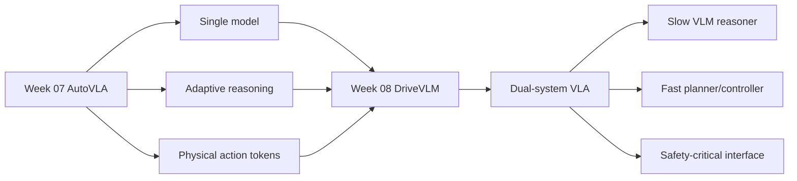

---

## 13. 참고 링크

### Primary

- AutoVLA arXiv: https://arxiv.org/abs/2506.13757
- AutoVLA project page: https://autovla.github.io/
- AutoVLA PDF: https://arxiv.org/pdf/2506.13757

### Skim / related

- DriveMoE arXiv: https://arxiv.org/abs/2505.16278
- DriveMoE project page: https://thinklab-sjtu.github.io/DriveMoE/
- OpenDriveVLA arXiv: https://arxiv.org/abs/2503.23463
- LMDrive arXiv: https://arxiv.org/abs/2312.07488
- DriveLM arXiv: https://arxiv.org/abs/2312.14150
- DriveVLM arXiv: https://arxiv.org/abs/2402.12289

### Keyword glossary

| Keyword | 이번 주 의미 |
|---|---|
| adaptive reasoning | 장면 난이도에 따라 fast action-only와 slow CoT reasoning을 선택하는 능력 |
| physical action token | 실제 vehicle motion segment를 나타내는 discrete token |
| K-disk clustering | 다양한 motion segment를 codebook으로 선택하기 위한 clustering 방식 |
| GRPO | group-relative advantage를 이용하는 RL fine-tuning 알고리즘 |
| CoT length penalty | reasoning이 길수록 reward를 깎아 latency를 줄이는 장치 |
| PDMS | NAVSIM에서 safety/progress/comfort 등을 종합하는 planning score |
| closed-loop | 모델 action이 환경에 반영되고 다음 state가 바뀌는 interactive evaluation |
