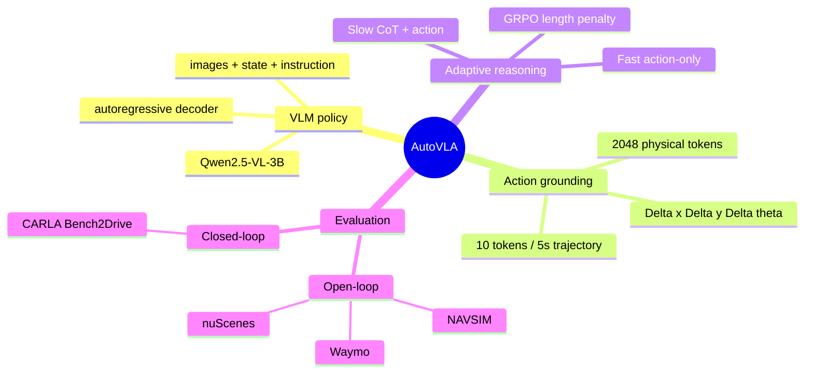
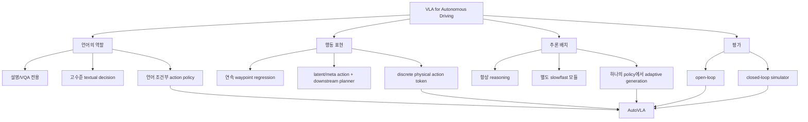
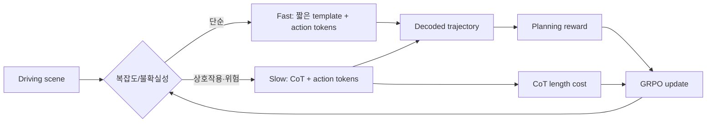
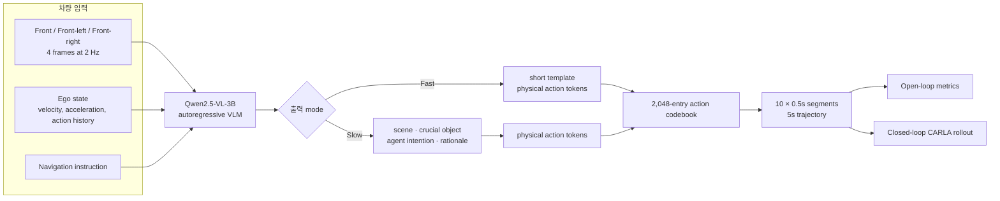
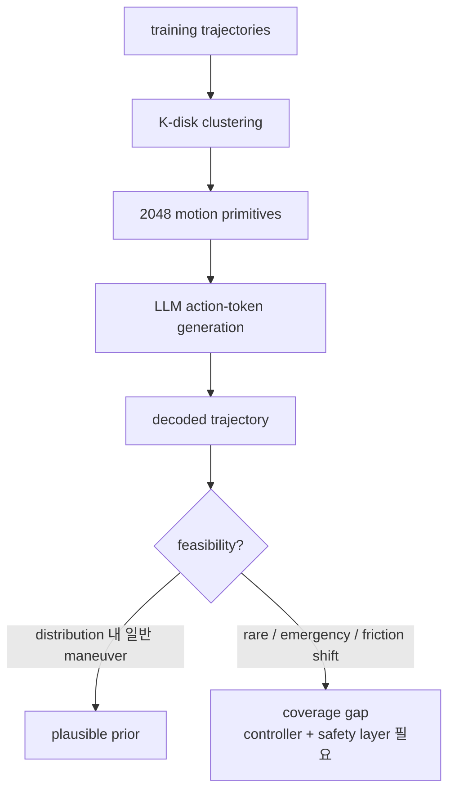
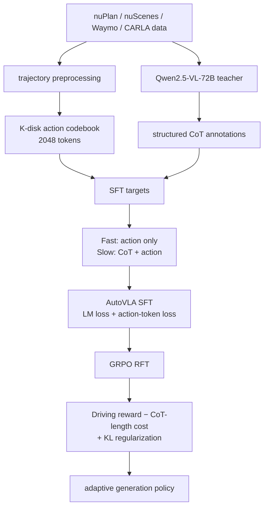
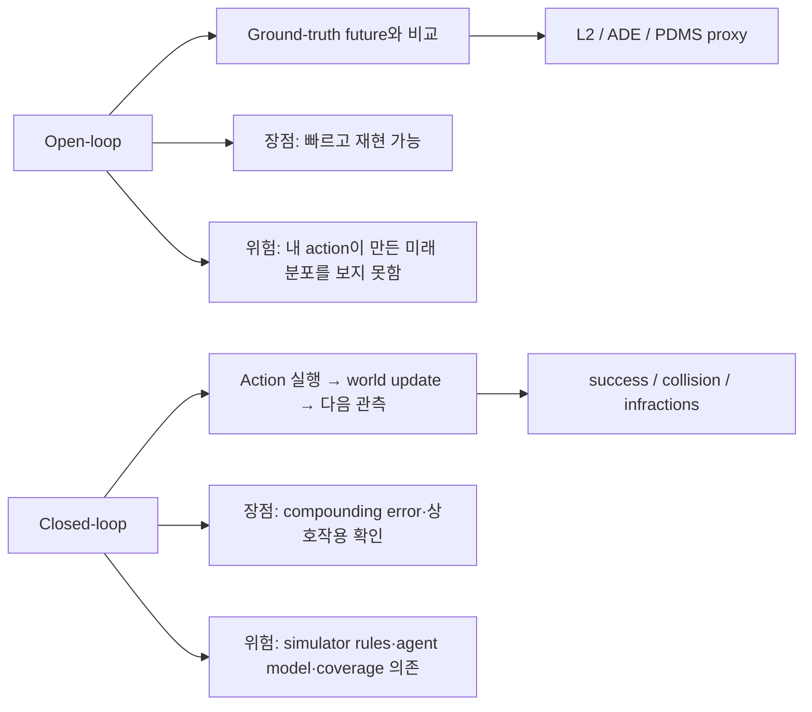
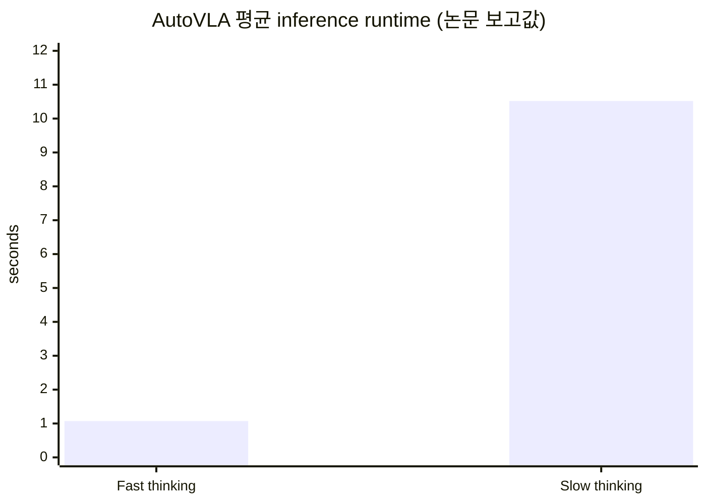
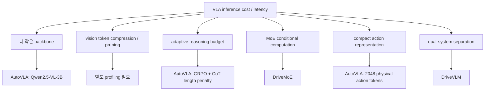
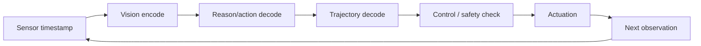

# Week 07. 수치 행동 생성기 2: 효율성과 최신 구조

| 항목 | 내용 |
|---|---|
| 학습일 · 주차 | 2026-09-01 · 07 / 12 |
| 원 논문 | **AutoVLA: A Vision-Language-Action Model for End-to-End Autonomous Driving with Adaptive Reasoning and Reinforcement Fine-Tuning** |
| 한국어 제목 | **AutoVLA: 적응형 추론과 강화 미세조정을 이용한 End-to-End 자율주행 Vision-Language-Action 모델** |
| URL | https://arxiv.org/abs/2506.13757 (v3, 2025-11-05) |
| 저자 · 발표 | Zewei Zhou 외 6명 · NeurIPS 2025 |
| taxonomy | End-to-End VLA for AD · discrete numerical action generator · adaptive reasoning · GRPO reinforcement fine-tuning(RFT) |
| 읽기 방식 | **Deep read:** AutoVLA arXiv HTML/abstract/project page · **skim:** DriveMoE, OpenDriveVLA, FastDriveVLA |
| 이번 주 산출물 | VLA inference cost / latency 정리 |

> **출처·범위 메모:** arXiv abstract와 v3 HTML 전문(본문·부록의 구조, 설정, 표)을 우선 확인했다. AutoVLA의 프로젝트 페이지는 arXiv가 연결한다. 이번 실행에서는 PDF를 줄 단위로 번역하지 않고, 1차 출처에 근거한 한국어 학습 노트로 재구성했다. FastDriveVLA는 신뢰할 수 있는 공식 논문/저장소를 안정적으로 확인하지 못했으므로 성능·구조를 추정하지 않는다.

---

## 1. 이번 주 한 문장 결론

**AutoVLA는 multi-view camera·ego state·navigation language를 하나의 autoregressive VLM에 넣어, 필요하면 CoT를 생성하고 최종적으로는 2,048개 codebook의 물리 action token을 5초 trajectory로 decode한다. 핵심 trade-off는 ‘추론을 할 것인가’가 아니라, GRPO의 planning reward와 CoT 길이 패널티로 쉬운 장면의 불필요한 token latency를 줄이면서도 복잡 장면의 action grounding을 유지하는 것이다.**

Week 06의 [[LMDrive]]가 `sensor + instruction → continuous waypoint → PID`라는 hybrid interface를 택했다면, AutoVLA는 trajectory의 짧은 motion segment `(Δx, Δy, Δθ)`를 language-model vocabulary에 넣는다. 따라서 numerical action은 텍스트 설명의 부속물이 아니라 decoder가 직접 예측하는 policy output이다.

---

## 2. 논문 제목·Abstract 한국어 번역

### 제목

- **원제:** *AutoVLA: A Vision-Language-Action Model for End-to-End Autonomous Driving with Adaptive Reasoning and Reinforcement Fine-Tuning*
- **번역:** **AutoVLA: 적응형 추론과 강화 미세조정을 이용한 End-to-End 자율주행 Vision-Language-Action 모델**

### Abstract 번역

최근 Vision-Language-Action(VLA) 모델은 world knowledge와 reasoning 능력을 활용하여 End-to-End 자율주행에서 가능성을 보였다. 그러나 기존 VLA 모델은 물리적으로 실행 불가능한 action output, 복잡한 모델 구조, 또는 불필요하게 긴 reasoning이라는 문제를 자주 겪는다.

본 논문은 End-to-End 자율주행을 위해 reasoning과 action generation을 하나의 autoregressive generation model 안에 통합한 새로운 VLA인 **AutoVLA**를 제안한다. AutoVLA는 raw visual input과 language instruction으로부터 semantic reasoning과 trajectory planning을 직접 수행한다. 저자들은 continuous trajectory를 discrete하면서도 실행 가능한(feasible) action으로 tokenization하여 language model에 직접 통합한다.

학습에서는 supervised fine-tuning(SFT)으로 두 가지 thinking mode를 갖게 한다. 하나는 trajectory만 출력하는 **fast thinking**이고, 다른 하나는 chain-of-thought(CoT) reasoning으로 보강되는 **slow thinking**이다. planning 성능과 효율을 더 높이기 위해 Group Relative Policy Optimization(GRPO)에 기반한 reinforcement fine-tuning(RFT)을 도입하며, 이를 통해 단순한 scenario에서 불필요한 reasoning을 줄인다.

nuPlan, nuScenes, Waymo, CARLA를 포함한 실제 및 simulation dataset/benchmark의 광범위한 실험에서 AutoVLA는 open-loop와 closed-loop 모두에서 경쟁력 있는 성능을 보였다. 정성 결과는 다양한 scenario에서 적응형 추론과 정확한 planning 능력을 보여준다.

### Abstract를 action grounding 언어로 다시 읽기

```text
이미지 + ego state + “좌회전”
       │
       ▼
[선택적 CoT: 무엇이 위험하고 왜 이 maneuver인가]
       │
       ▼
<action_…> × 10  ── codebook decode ──► 5초 trajectory
```

이 논문의 주장 범위는 **“모델이 자연어로 운전 설명을 잘한다”가 아니라 “설명 token 뒤의 physical action token이 trajectory로 decode되어 평가된다”**이다. 다만 CoT가 실제 action의 인과적 원인인지(=faithfulness)는 별도의 counterfactual 검증 없이는 증명되지 않는다.

---

## 3. 핵심 기여 3~5개

1. **단일 autoregressive VLA:** pretrained Qwen2.5-VL-3B가 visual observation, navigation instruction, ego state를 받아 reasoning token과 action token을 동일 decoder에서 생성한다.
2. **Physical action tokenization:** continuous trajectory를 K-disk clustering 기반 **2,048개 motion codebook**으로 이산화한다. action 하나는 short-horizon `(Δx, Δy, Δθ)`이며, 0.5초 간격 10개 token을 합쳐 5초 trajectory를 만든다.
3. **Fast/slow dual thinking SFT:** action-only target과 CoT+action target을 함께 학습한다. 쉬운 장면에서 긴 explanation을 강제하지 않고, 복잡 장면에는 structured reasoning 경로를 제공한다.
4. **GRPO RFT로 reasoning budget 정렬:** `driving reward − λ × CoT length cost`를 최적화한다. nuPlan에서는 PDMS, Waymo에서는 ADE 계열 reward를 사용하며 KL regularization으로 SFT policy에서의 과도한 이탈을 제한한다.
5. **다축 평가:** NAVSIM/nuPlan, nuScenes, Waymo의 open-loop와 CARLA Bench2Drive의 closed-loop를 함께 보고해, imitation 오차와 interactive rollout을 구분한다.



---

## 4. VLA for AD taxonomy 위치



| 분석 축 | AutoVLA의 위치 | 해석 및 주의점 |
|---|---|---|
| taxonomy | language-conditioned, camera-based End-to-End VLA | perception/planning을 하나의 VLM policy로 묶지만, action codebook은 강한 inductive bias다. |
| input | 3 camera views × 4 frame(2 Hz), high-level instruction, velocity·acceleration·history action | front/front-left/front-right 중심이라 rear/side occlusion의 관측 한계가 남는다. |
| output | 10 physical action token → 5초 trajectory | direct steer/throttle/brake가 아니라 planning trajectory다. vehicle controller·replanning 주기가 실제 안전에 중요하다. |
| language role | navigation goal + optional intermediate CoT | language는 action을 조건화하며, CoT는 optional output이지 safety proof가 아니다. |
| action grounding | codebook token이 `(Δx, Δy, Δθ)` segment로 decode | feasible motion prior를 주지만 codebook 밖의 emergency maneuver에는 quantization/coverage 위험이 있다. |
| training | SFT 후 GRPO RFT | behavior cloning만이 아니라 verified planning reward를 사용하나 reward misspecification 위험이 있다. |
| evaluation | open-loop + CARLA closed-loop | benchmark 범위가 넓지만 closed-loop도 simulator이며 on-road validation은 아니다. |

### Concept map: reasoning을 비용으로 보는 관점



> ‘adaptive’는 별도의 rule-based risk detector가 명시적으로 mode를 hard-switch한다는 뜻이 아니다. SFT response format과 RFT reward가 어떤 출력 길이/품질의 policy를 선호하도록 만드는 학습적 유도다. 실제 배포에서는 uncertainty·deadline·safety gate를 별도 계측해야 한다.

---

## 5. Architecture / pipeline 시각화



### Architecture block

| 블록 | 구현 역할 | latency / grounding 의미 |
|---|---|---|
| Qwen2.5-VL-3B backbone | image와 text를 처리하는 small VLM | 3B는 큰 VLM보다 실용적이지만, autoregressive decode 자체가 real-time 병목이다. |
| multi-frame image context | 각 3 view의 현재+직전 3 frame | temporal cue를 제공하지만 image token 수와 attention 비용을 늘린다. |
| ego-state prompt | 속도, 가속도, 과거 action | visual ambiguity를 vehicle dynamics context로 보완한다. |
| structured CoT | 장면 설명→critical object→주변 agent intention→driving action | semantic diagnostic에는 유용하나 output token이 길면 planning deadline을 넘긴다. |
| action vocabulary | `<action_0> … <action_2047>` | trajectory를 next-token prediction으로 바꾸고 plausible-motion prior를 제공한다. |
| codebook decoder | action token을 motion segment로 복원·연결 | codebook은 physical feasibility를 ‘보장’하기보다 training distribution의 maneuver support를 제공한다. |

### Input → output map

| 입력 모달리티 | 모델 내 역할 | 생성물 | 실제 실행과의 경계 |
|---|---|---|---|
| camera sequence | 차선, 신호, agent, temporal motion 관측 | visual embedding | occlusion/조도/domain shift에 취약 |
| navigation language | 방향·route goal 부여 | goal-conditioned action sequence | 모호하거나 rule과 충돌하는 발화는 별도 검증 필요 |
| ego state | 동역학 상태 condition | maneuver scale/방향 보정 | actuator·tire model은 직접 학습하지 않음 |
| CoT (선택) | scene semantics와 decision rationale | language token | 설명의 정확성 ≠ action의 안전성 |
| physical action token | short motion primitive | decoded trajectory | downstream tracking controller와 receding-horizon update가 필요 |

---

## 6. Input → Reasoning → Action Grounding 분석

| 단계 | Input / Output | AutoVLA의 방법 | action grounding에 주는 이점 | 실패·검증 질문 |
|---|---|---|---|---|
| Perception | 3-view, 4-frame RGB | VLM vision encoder | language가 가리키는 차선·신호·agent를 planning context와 결합 | camera-only blind spot, rear threat, weather/occlusion은? |
| Goal conditioning | `Turn Left`, `Go Straight` | navigation text prompt | 같은 장면에서도 route intent에 따라 trajectory를 바꾼다 | instruction을 counterfactual하게 바꿨을 때 action도 일관되게 변하는가? |
| State grounding | velocity, acceleration, action history | text/state input | 현재 속도와 운동 상태를 maneuver에 반영 | state quantization/prompt formatting에 민감한가? |
| Reasoning | optional CoT token | fast action-only 또는 slow structured reasoning | 복잡 장면에서 중요한 객체·상호작용을 명시할 수 있다 | CoT를 교란/삭제해도 action이 같은가? faithfulness가 필요하다. |
| Numerical action | 10 discrete token | K-disk action codebook, K=2048 | output을 vehicle motion manifold에 묶어 free-form numeric text 오류를 줄인다 | rare/emergency motion이 codebook에 없는 경우는? |
| Trajectory | 5초 future path | token decode 후 segment composition | standard planning metric에 바로 연결된다 | 5초 horizon과 replanning rate가 latency보다 충분히 빠른가? |
| Safety | reward·evaluation | PDMS/ADE reward, collision/TTC proxy | imitation만보다 safety/comfort를 일부 정렬 | reward hacking, uncertainty, formal rule shield는 부재하다. |

### Physical action vs 다른 output 표현

| action 표현 | 장점 | 한계 | AutoVLA와의 관계 |
|---|---|---|---|
| textual action | LLM prior와 설명에 자연스럽다 | controller로의 변환이 필요하며 좌표·동역학이 모호하다 | 논문이 피하려는 output 형식 |
| continuous waypoint regression | 연속적인 trajectory를 직접 예측 | VLM token vocabulary와 결합이 덜 자연스럽고 multimodality/mode collapse 문제가 가능 | LMDrive류의 대표 형태 |
| latent/meta action + planner | feasibility decoder를 별도 설계할 수 있다 | module 수·interface·training overhead 증가 | AutoVLA가 복잡성 측면에서 비판하는 대안 |
| **physical action token** | language modeling과 short motion primitive를 직접 결합 | quantization error·codebook coverage·autoregressive latency | AutoVLA의 중심 선택 |

### 왜 codebook이 “물리적으로 feasible”한가, 그리고 왜 충분하지 않은가



codebook은 관측된 driving motion의 대표값을 제공하므로 임의의 숫자를 생성하는 것보다 trajectory prior가 강하다. 그러나 codebook clustering은 충돌 회피, 법규 준수, 타 agent의 미래 의도, road friction에 대한 **형식적 제약 만족 증명**이 아니다. action grounding 평가에는 decoded trajectory의 L2뿐 아니라 collision, TTC, route progress, 그리고 interactive closed-loop rollout이 필요하다.

---

## 7. Training recipe



### 7.1 Data 및 supervision

| 항목 | 논문 설정 / 역할 |
|---|---|
| base model | Qwen2.5-VL-3B. 작은 backbone으로 on-board 가능성을 염두에 둔 선택이다. |
| visual input | front, front-left, front-right의 RGB 3 view; 각 4 frame, 2 Hz. |
| trajectory token | short-term `(Δx, Δy, Δθ)` motion을 cluster하여 2,048 token vocabulary로 확장. 10 token=5초 horizon. |
| reasoning teacher | Qwen2.5-VL-72B가 scene description, critical object, surrounding-agent intention, appropriate action의 structured annotation을 생성. |
| CoT 규모 | nuPlan 약 45.6k, Waymo E2E 약 7.2k annotation; DriveLM 계열(nuScenes/CARLA) data도 재형식화해 보강. |
| SFT target | fast는 짧은 fixed template + action token, slow는 CoT + action token. |
| SFT loss | causal language-model loss와 action-token position의 auxiliary loss를 결합; CoT가 있는 sample에 가중치를 부여. |

### 7.2 Objective를 직관적으로 보기

```text
L_SFT = sample_weight × (L_language + λ_action × L_action-token)

reward_RFT = driving_quality − λ_reasoning × CoT_length
```

- **SFT:** reasoning 단어를 잘 맞히는 loss만 쓰면 numerical action이 희석될 수 있다. 그래서 action token 위치를 별도 강조한다.
- **RFT:** 동일 scene에서 여러 candidate를 sampling한 뒤 group-relative advantage로 더 좋은 candidate를 강화한다. multi-modal trajectory planning은 한 scene에 실행 가능한 경로가 여럿일 수 있어 GRPO의 group 비교와 잘 맞는다.
- **KL regularization:** RFT가 reward proxy에 과적합되어 SFT의 language/action behavior를 잃는 것을 완화한다.

### 7.3 Adaptive reasoning의 실제 의미

| mode | target 형식 | 장점 | 운영상 위험 |
|---|---|---|---|
| Fast thinking | 짧은 template 후 action token | decode token이 적어 latency가 낮다 | 위험 장면을 너무 일찍 ‘쉬움’으로 취급할 수 있다. |
| Slow thinking | structured CoT 후 action token | critical object·interaction을 언어로 전개할 수 있다 | 생성 시간이 제어 주기보다 길면 action이 stale해진다. |
| RFT policy | reward와 length cost의 절충 | 정적 rule 없이 token budget을 학습적으로 줄인다 | 길이 penalty가 safety-critical reasoning까지 억제할 수 있다. |

---

## 8. Dataset / Benchmark / Metric 분석

### 8.1 Evaluation matrix

| Dataset / benchmark | 현실성 | Open / closed loop | 핵심 metric | 이 논문에서 확인하는 것 | 놓칠 수 있는 것 |
|---|---|---|---|---|---|
| NAVSIM / nuPlan | 실제 주행 data 기반 | open-loop planning | PDMS, collision, area, direction, progress, TTC, comfort | trajectory quality를 safety·progress·comfort proxy로 종합 | policy rollout의 distribution shift |
| nuScenes | 실제 도시 주행 | open-loop | L2 displacement, collision proxy | GT future에 대한 imitation/planning accuracy | 다른 차량이 예측 trajectory에 반응하지 않음 |
| Waymo E2E | 실제 주행·challenging subset | 주로 open-loop score | RFS, ADE (3 s/5 s) | long-tail scene에서 quality 비교 | human rater signal의 범위 및 closed-loop causal effect |
| CARLA Bench2Drive | simulation | **closed-loop** | Driving Score, success, efficiency, comfortness | action을 세계에 반복 실행한 interaction/누적 오차 | sim-to-real gap, scripted scenario coverage |

### 8.2 Reported 대표 결과와 올바른 독해

| 실험 | 수치 | 해석 |
|---|---:|---|
| physical action vs text waypoint: PDM Score | **80.54 vs 71.31** | 같은 VLA setting에서 action tokenization이 planning score에 유리하다고 보고한다. |
| physical action vs text waypoint: Avg. L2 | **0.70 m vs 0.89 m** | GT trajectory에 더 가깝지만, L2 단독으로 안전을 뜻하지는 않는다. |
| physical action vs text waypoint: collision | **0.31% vs 0.36%** | proxy collision도 개선되나 rare safety event의 신뢰구간을 함께 볼 필요가 있다. |
| physical action vs text waypoint: runtime | **3.95 s vs 7.65 s** | action token 출력이 text waypoint setting보다 빠르다고 보고되지만, real-time controller deadline 기준으로는 여전히 크다. |
| NAVSIM PDMS: one-shot → post-RFT | **80.54 → 89.11** | reward-aligned RFT의 큰 이득. reward definition과 test leakage 여부가 재현성의 핵심이다. |
| CARLA Bench2Drive Driving Score | **78.84** | closed-loop simulator에서 action policy가 rollout됨을 보여준다. 실제 도로 안전 성능으로 일반화하면 안 된다. |

### 8.3 Open-loop 대 closed-loop



**판정:** AutoVLA는 둘 다 보고하므로 open-loop 논문보다 평가 범위가 넓다. 그러나 CARLA closed-loop는 중요한 필요조건일 뿐 충분조건이 아니다. real-world deployment에는 sensor failure, perception uncertainty, map mismatch, non-cooperative human behavior, actuator latency가 추가된다.

### 8.4 VLA inference cost / latency 정리

논문 Table 2의 single-sample runtime 보고값은 다음과 같다.

| mode | 최소 | 최대 | 평균 | 시스템적 의미 |
|---|---:|---:|---:|---|
| Fast thinking | 0.997 s | 1.116 s | **1.072 s** | 약 1 Hz 수준. high-level replanning에는 가능성을 보이나 고주기 안전 control의 대체재는 아니다. |
| Slow thinking | 7.607 s | 13.706 s | **10.518 s** | complex scene에서 observation이 action 전 오래되어 stale trajectory 위험이 매우 크다. |



| latency 원인 | AutoVLA의 대응 | 남는 engineering 과제 |
|---|---|---|
| multi-view·multi-frame visual token | 3B backbone 선택 | vision token pruning/temporal cache의 효과를 별도로 계측해야 한다. |
| autoregressive CoT decode | fast/slow target + CoT length penalty | hard-case detector, maximum deadline, early exit가 필요하다. |
| action output serialization | 10개의 compact action token | codebook decode 후 trajectory tracking 및 replanning overhead도 end-to-end latency에 포함해야 한다. |
| model capacity | Qwen2.5-VL-3B | quantization, runtime, thermal budget, memory bandwidth를 실제 차량 hardware에서 검증해야 한다. |
| candidate sampling / Best-of-N | RFT 및 oracle 선택 결과 보고 | Best-of-N은 oracle scorer가 없으면 deployment latency와 selection quality가 달라진다. |

---

## 9. 관련 논문 비교표

| 논문 / 시스템 | action 표현 | language 역할 | 효율성 전략 | evaluation | 핵심 차이 |
|---|---|---|---|---|---|
| **LMDrive** (Week 06) | continuous future waypoint → PID | navigation/notice가 trajectory condition | frozen LLM + bridge token compression | CARLA LangAuto closed-loop | trajectory regression과 controller interface가 명시적이다. |
| **AutoVLA** | discrete physical action token → trajectory | instruction + optional CoT | 3B VLM, action tokenization, GRPO CoT penalty | nuPlan/nuScenes/Waymo open-loop + CARLA closed-loop | reasoning과 numerical action을 하나의 decoder token stream에 통합한다. |
| **DriveVLM** | slow VLM decision + fast conventional driving module | slow semantic reasoning | dual-process module split | system-level dual process | AutoVLA는 separate fast planner 대신 하나의 autoregressive policy에서 mode를 학습한다. |
| **OpenDriveVLA** | spatially grounded driving action | agent–environment–ego structured interaction | 2D/3D instance-aware representation | nuScenes planning·driving QA 중심 | visual grounding 구조가 중심이며 AutoVLA의 CoT-budget RFT와 초점이 다르다. |
| **DriveMoE** | behavior-specialized action experts | driving policy context | scene-specialized vision MoE + skill-specialized action MoE | Bench2Drive closed-loop | AutoVLA가 sequence length를 줄이는 반면 DriveMoE는 conditional expert capacity를 선택한다. |
| **FastDriveVLA** | 확인 제한 | 확인 제한 | 확인 제한 | 확인 제한 | 공식 1차 출처를 이번 실행에서 확인하지 못해 이름만으로 latency 특성을 단정하지 않는다. |

### Efficiency technique map



**비교에서 얻는 결론:** token pruning, MoE, adaptive reasoning은 서로 대체재가 아니라 서로 다른 병목(vision encoder FLOPs, decoder length, active parameters)을 겨냥한다. 따라서 ‘초당 token’, end-to-end sensor-to-actuator latency, worst-case latency(p95/p99), closed-loop safety를 함께 보고해야 한다.

---

## 10. 강점과 한계

### 강점

| 강점 | 근거 | 실전적 의미 |
|---|---|---|
| action space가 VLM과 잘 맞음 | codebook action을 vocabulary에 추가 | free-form numeric text보다 decode·supervision이 명확하다. |
| reasoning 비용을 objective에 포함 | GRPO reward에 CoT length penalty | 성능만 최적화한 ‘무한 CoT’보다 deployment trade-off를 직접 다룬다. |
| reasoning/action의 shared policy | 하나의 autoregressive decoder | interface mismatch를 줄이고, 동일 context에서 language와 action을 생성한다. |
| broad benchmark coverage | 실제 data open-loop + CARLA closed-loop | 한 benchmark의 metric gaming 가능성을 일부 낮춘다. |
| structured teacher annotation | critical object·intention·action을 분리 | debugging 가능한 intermediate representation을 제공한다. |

### 한계 및 safety/long-tail risk

| 한계 / 위험 | 왜 중요한가 | 필요한 보완 |
|---|---|---|
| **Slow mode 평균 10.518초** | 실제 차가 이동하는 동안 scene이 바뀌어 trajectory가 stale해질 수 있다 | asynchronous fast safety planner, deadline abort, speculative/cache decoding, p99 측정 |
| codebook coverage·quantization | emergency swerve, low-friction, uncommon geometry가 codebook 밖일 수 있다 | OOD detection, continuous residual control, constraint-aware decoder, coverage audit |
| CoT faithfulness 불명 | 그럴듯한 rationale이 action의 실제 원인이 아닐 수 있다 | rationale intervention, object masking, instruction counterfactual, causal consistency test |
| camera-centric perception | rear/side blind spot, darkness, weather, occlusion | radar/LiDAR/BEV fusion, sensor health monitoring, redundancy |
| reward misspecification | PDMS/ADE/length penalty를 최적화해도 법규·human comfort·ethical risk가 빠질 수 있다 | explicit safety rules, uncertainty-aware risk, adverse scenario evaluation, human review |
| simulator-to-real gap | CARLA agent dynamics와 실제 human behavior가 다르다 | log replay, closed-course shadow mode, safety driver의 단계적 validation |
| benchmark long-tail의 불완전성 | rare event가 test set에 없으면 좋은 score도 안전을 보장하지 않는다 | scenario mining, counterfactual simulation, distributional/worst-case metric |

> **안전상 핵심:** 이 모델의 fast/slow 선택은 “추론을 줄여도 되는가”라는 efficiency 문제가 아니라, “언제 느린 생성의 deadline을 기다릴 수 있는가”라는 runtime assurance 문제다. safety-critical system에서는 VLA 출력 위에 독립적인 collision avoidance, rule monitor, trajectory feasibility checker가 필요하다.

---

## 11. 실전 학습 포인트

### A. Numerical action generator를 평가하는 체크리스트

- [ ] action이 textual label, continuous waypoint, latent action, physical action token 중 무엇인가?
- [ ] decoder output이 실제로 어떤 controller/trajectory tracker로 실행되는가?
- [ ] codebook·latent space가 rare maneuver와 vehicle dynamics를 얼마나 coverage하는가?
- [ ] language instruction을 바꾸면 trajectory가 적절히 counterfactually 바뀌는가?
- [ ] CoT를 길게 한 것이 action/safety를 실제로 개선했는가, 아니면 explanation만 늘었는가?
- [ ] 평균뿐 아니라 **p95/p99 sensor-to-actuator latency**와 stale-observation failure를 보고하는가?
- [ ] open-loop metric과 closed-loop infractions가 함께 개선되는가?
- [ ] model uncertainty가 높을 때 fallback policy가 있는가?

### B. 설계 규칙: latency budget을 먼저 적어라



`inference time`만 재면 부족하다. 실제 latency budget은 `capture + preprocessing + vision encode + autoregressive decode + codebook decode + safety check + controller + actuation`이다. AutoVLA의 reported fast 평균 1.072초와 slow 평균 10.518초는 이 전체 chain의 worst case가 아니라 model runtime 보고값으로 읽어야 한다.

### C. 다음 구현/재현 실험 제안

| 실험 | 질문 | 성공 기준 |
|---|---|---|
| instruction counterfactual | “좌회전”을 “직진”으로 바꾸면 action token 분포가 바뀌는가? | route-consistent trajectory 변화와 collision 증가 없음 |
| CoT ablation | CoT를 삭제·교란할 때 hard scenario action은 어떻게 변하는가? | CoT가 있을 때 safety/progress가 유의미하게 개선 |
| codebook sweep | K=512/2048/4096에서 error·coverage·decode cost는? | long-tail maneuver 개선이 latency/quantization 손실을 상회 |
| deadline evaluation | fixed 100 ms/500 ms/1 s deadline에서 mode별 performance는? | deadline miss와 closed-loop infraction을 함께 보고 |
| OOD weather/occlusion | camera corruption에서 action entropy·failure는? | uncertainty 상승, safe fallback, catastrophic failure 억제 |
| closed-loop stress | cut-in, emergency vehicle, pedestrian emergence | route completion뿐 아니라 near-miss/TTC/worst-case violation 개선 |

### D. 이번 주 암기 카드

| 질문 | 답 |
|---|---|
| AutoVLA의 action은 무엇인가? | 2,048개 codebook에서 생성하는 discrete physical action token이며 10개가 5초 trajectory로 decode된다. |
| fast/slow의 차이는? | fast는 action-only, slow는 structured CoT 뒤 action을 생성한다. |
| adaptive reasoning은 어떻게 학습되는가? | action-only/CoT+action SFT 후, `driving reward − CoT length penalty`의 GRPO RFT로 유도한다. |
| 이 논문의 가장 큰 deployment 경고는? | slow runtime 평균 10.518초이므로 real-time safety control과 직접 등치할 수 없다. |
| closed-loop 결과가 있어도 부족한 이유는? | CARLA의 scenario·sensor·agent model과 실제 도로는 다르며 formal safety guarantee가 없기 때문이다. |

---

## 12. 다음 주 질문

**Week 08 — Dual-System VLA (DriveVLM):**

1. slow VLM reasoner와 fast planner를 분리하면 AutoVLA의 10초대 slow decode 문제를 얼마나 줄일 수 있는가?
2. 두 시스템 사이의 interface는 textual decision, BEV feature, risk score, trajectory proposal 중 무엇이어야 action grounding이 가장 덜 깨지는가?
3. slow reasoner가 지연·hallucination·uncertainty를 보일 때 fast safety planner가 무엇을 신뢰하고 무엇을 무시해야 하는가?
4. End-to-End single policy와 dual-system policy를 공정하게 비교하려면 average latency 외에 어떤 p95/p99 latency, closed-loop, fallback metric이 필요한가?

---

## 13. 참고 링크

### Primary

1. **AutoVLA arXiv abstract / v3:** https://arxiv.org/abs/2506.13757
2. **AutoVLA arXiv HTML:** https://arxiv.org/html/2506.13757
3. **AutoVLA project page:** https://autovla.github.io/
4. Zhou, Cai, Zhao, Zhang, Huang, Zhou, Ma. *AutoVLA: A Vision-Language-Action Model for End-to-End Autonomous Driving with Adaptive Reasoning and Reinforcement Fine-Tuning*. NeurIPS 2025.

### 비교·배경

5. **LMDrive:** https://arxiv.org/abs/2312.07488
6. **DriveMoE repository:** https://github.com/Thinklab-SJTU/DriveMoE
7. **OpenDriveVLA:** https://arxiv.org/search/?query=OpenDriveVLA&searchtype=all
8. **DriveVLM:** https://arxiv.org/abs/2402.12289
9. **NAVSIM:** https://github.com/autonomousvision/navsim
10. **Bench2Drive:** https://github.com/Thinklab-SJTU/Bench2Drive

> 출처를 재확인할 때는 arXiv version과 benchmark version을 함께 기록할 것. 특히 latency는 hardware, batch size, precision, decoding settings, end-to-end measurement 범위가 빠지면 서로 비교할 수 없다.
