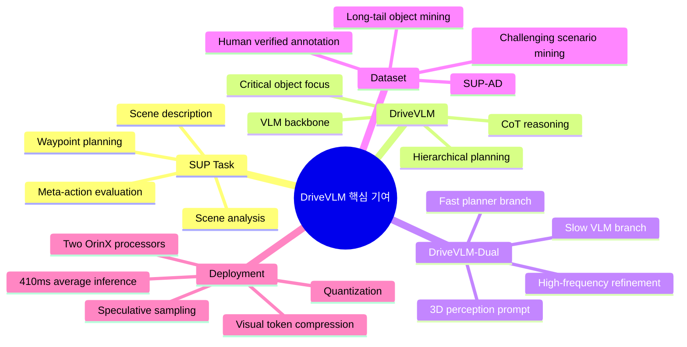
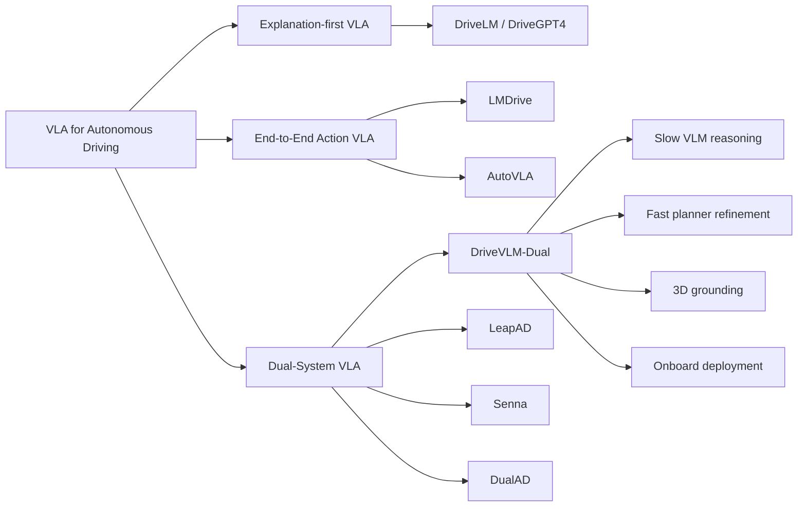
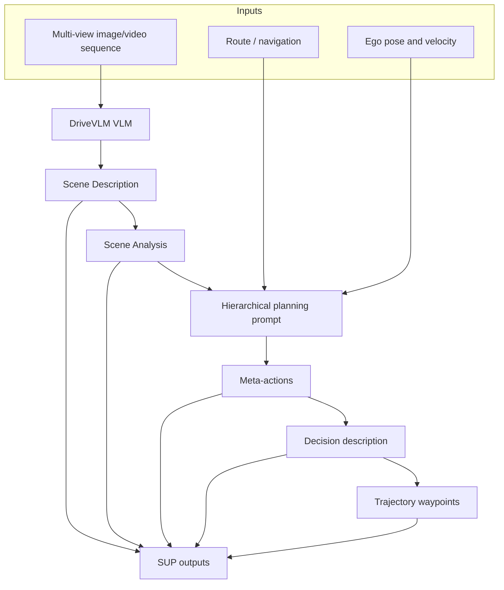
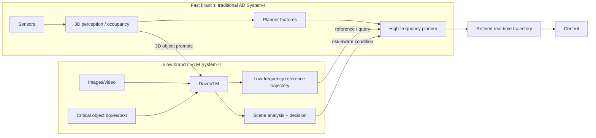
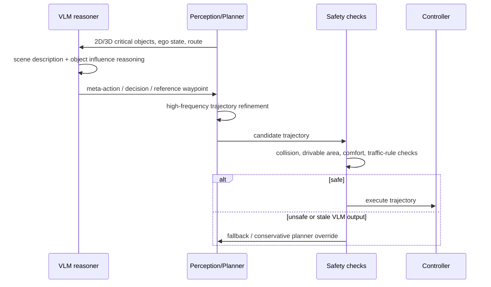
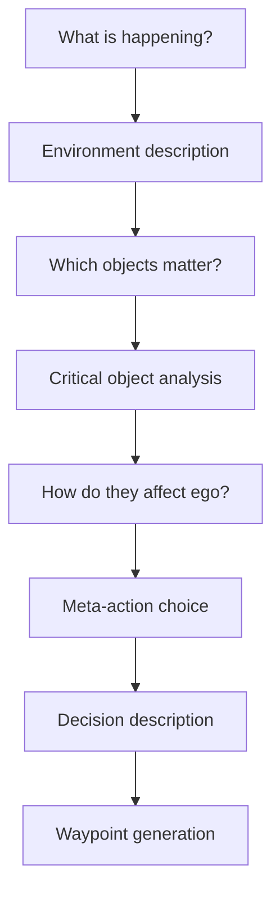
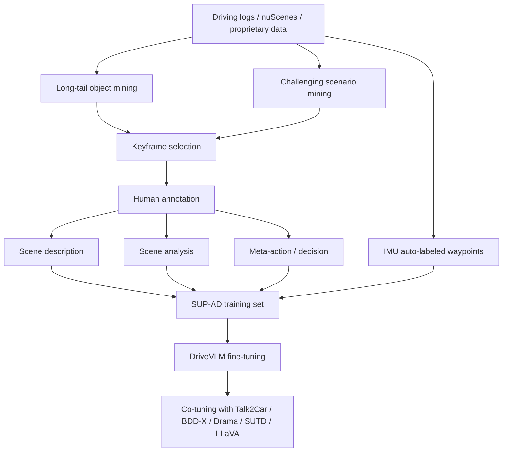
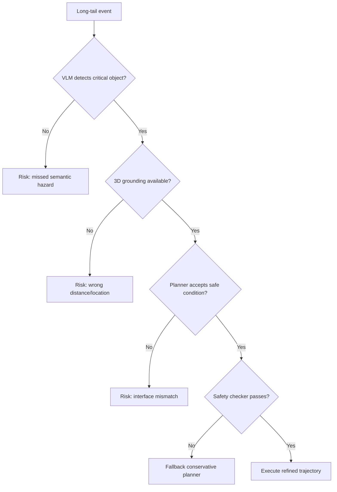

# Week 08. Dual-System VLA: DriveVLM으로 보는 느린 VLM reasoning과 빠른 planner의 결합

## Metadata

| 항목 | 내용 |
|---|---|
| Date | 2026-06-16 |
| Week | 08 / 12 |
| Original paper/source | *DriveVLM: The Convergence of Autonomous Driving and Large Vision-Language Models* |
| Korean title | **DriveVLM: 자율주행과 대형 Vision-Language Model의 수렴** |
| URL | https://arxiv.org/abs/2402.12289 |
| Version read | arXiv v5 metadata + arXiv HTML full text + project page 기반 |
| Authors | Xiaoyu Tian, Junru Gu, Bailin Li, Yicheng Liu, Yang Wang, Zhiyong Zhao, Kun Zhan, Peng Jia, Xianpeng Lang, Hang Zhao |
| Venue / status | CoRL 2024, project page: https://tsinghua-mars-lab.github.io/DriveVLM/ |
| Taxonomy | **Dual-System VLA for AD** / slow VLM reasoning / fast planner / safety-critical interface / scene understanding for planning |
| Reading mode | Deep read: **DriveVLM / DriveVLM-Dual** / skim: **LeapAD**, **Senna**, **DualAD** |
| 이번 주 focus | slow VLM reasoning, fast planner, safety-critical interface |
| Output | **End-to-End VLA vs Dual-System VLA 비교표** |

> 참고: 이번 노트는 논문 전체를 줄 단위로 번역하지 않고, arXiv abstract/HTML 본문, 프로젝트 페이지, 관련 논문 metadata/GitHub README를 기반으로 한국어 학습 노트로 재구성했다. PDF 원문 전체 수식·appendix의 세부 수치는 필요한 부분만 반영했다.

---

## 1. 이번 주 한 문장 결론

**DriveVLM의 핵심은 VLM을 “차량을 직접 10~50Hz로 제어하는 end-to-end controller”로 쓰는 것이 아니라, 복잡·long-tail 장면에서 scene description → scene analysis → hierarchical planning을 수행하는 느린 System-II reasoner로 두고, 기존 3D perception/planner가 고주파 trajectory refinement를 담당하는 DriveVLM-Dual 구조로 safety-critical interface를 만든다는 점이다.**

Week 07의 AutoVLA가 **reasoning token과 physical action token을 하나의 autoregressive VLM 안에서 생성**하려 했다면, Week 08의 DriveVLM은 정반대 질문을 던진다.

> **VLM이 공간 추론과 실시간성에 약하다면, 어떤 부분만 VLM에게 맡기고 어떤 부분은 전통 AD stack에 남겨야 하는가?**

DriveVLM의 답은 세 가지다.

1. **VLM은 long-tail scene understanding과 decision-level reasoning을 맡긴다.**  
   환경, critical object, 객체의 영향, meta-action, decision description을 language로 구조화한다.
2. **정밀한 3D grounding과 high-frequency planning은 기존 AD pipeline으로 보강한다.**  
   3D detector / occupancy / motion planner / VAD류 planner와 결합해 waypoint를 refinement한다.
3. **VLM branch와 planner branch를 asynchronous slow-fast dual system으로 운영한다.**  
   VLM은 저주파로 reference trajectory 또는 high-level decision을 제공하고, fast planner는 실시간 rollout을 보장한다.

즉 이번 주의 키워드는 **“VLA가 모든 것을 직접 생성해야 한다”가 아니라, “VLM reasoning을 어떤 안전한 interface로 planner에 주입할 것인가”**다.

---

## 2. 논문 제목·Abstract 한국어 번역

### 2.1 제목 번역

- **원제**: *DriveVLM: The Convergence of Autonomous Driving and Large Vision-Language Models*
- **번역**: **DriveVLM: 자율주행과 대형 Vision-Language Model의 수렴**
- **시스템명**: **DriveVLM**, deployment-oriented variant는 **DriveVLM-Dual**

### 2.2 Abstract 한국어 번역

도심 환경에서 자율주행이 직면하는 주요 장애물은 까다로운 도로 조건이나 섬세한 인간 행동처럼 복잡하고 long-tail인 시나리오를 이해하는 것이다. 본 논문은 향상된 장면 이해와 planning 능력을 위해 Vision-Language Model(VLM)을 활용하는 자율주행 시스템 **DriveVLM**을 소개한다. DriveVLM은 scene description, scene analysis, hierarchical planning을 위한 독특한 reasoning module 조합을 통합한다.

또한 VLM의 spatial reasoning 한계와 높은 계산 비용을 인식하여, 저자들은 **DriveVLM-Dual**을 제안한다. DriveVLM-Dual은 DriveVLM과 전통적인 자율주행 pipeline의 장점을 결합하는 hybrid system이다. nuScenes dataset과 자체 SUP-AD dataset에서의 실험은 DriveVLM과 DriveVLM-Dual이 복잡하고 예측하기 어려운 주행 조건을 처리하는 데 효과적임을 보여준다. 마지막으로 저자들은 DriveVLM-Dual을 양산 차량(production vehicle)에 배포하여 실제 자율주행 환경에서 효과적임을 검증했다.

### 2.3 Abstract를 VLA 관점으로 다시 쓰기

**DriveVLM은 multi-view video를 입력받아 VLM이 장면을 language로 해석하고, critical object와 그 영향을 분석한 뒤, meta-action → decision description → waypoint로 이어지는 hierarchical planning을 생성하는 VLA형 시스템이다. 하지만 저자들은 VLM 단독으로는 spatial grounding과 onboard latency가 부족하다고 보고, DriveVLM-Dual에서 3D perception과 fast planner를 결합해 실시간성과 안전성을 보강한다.**

### 2.4 제목만 보고 오해하면 안 되는 점

| 오해 | 실제 DriveVLM |
|---|---|
| “VLM이 차량 제어를 완전히 대체한다” | VLM은 주로 scene understanding과 hierarchical planning reasoner이며, DriveVLM-Dual은 기존 AD pipeline과 결합한다. |
| “end-to-end VLA처럼 action token을 직접 고주파로 낸다” | waypoint는 생성하지만 deployment에서는 fast planner가 high-frequency trajectory refinement를 담당한다. |
| “language captioning 논문이다” | 단순 caption이 아니라 critical object analysis, meta-action, decision description, waypoint까지 planning-oriented output을 정의한다. |
| “VLM은 공간 정보를 잘 아니까 3D module이 필요 없다” | 논문은 오히려 VLM의 spatial grounding 한계를 인정하고 3D perception prompt와 planner coupling을 도입한다. |
| “closed-loop 실차 배포가 없다” | DriveVLM-Dual을 두 개의 OrinX processor가 탑재된 양산 차량에 asynchronous로 배포하고 평균 410ms inference를 보고한다. |

---

## 3. 핵심 기여 3~5개

| # | 핵심 기여 | 왜 중요한가 |
|---:|---|---|
| 1 | **Scene Understanding for Planning(SUP) task 정의** | VLM을 단순 VQA/설명 모델이 아니라 planning에 필요한 scene description, scene analysis, meta-action, waypoint output으로 평가한다. |
| 2 | **DriveVLM CoT pipeline: description → analysis → hierarchical planning** | perception/prediction/planning을 language reasoning 단계로 재해석하여 long-tail object와 human behavior를 다룬다. |
| 3 | **DriveVLM-Dual slow-fast architecture** | VLM의 high-level reasoning과 기존 3D perception/planner의 spatial grounding·실시간성을 결합한다. |
| 4 | **SUP-AD dataset과 evaluation metric 제안** | long-tail object mining, challenging scenario mining, keyframe annotation을 통해 safety-critical scene understanding을 측정한다. |
| 5 | **onboard deployment study** | 작은 LLM, visual token compression, speculative sampling 등 실제 OrinX 환경 최적화 전략을 실험한다. |

### Contribution map



---

## 4. VLA for AD taxonomy 위치

### 4.1 Taxonomy 좌표

| 축 | DriveVLM 위치 | 해석 |
|---|---|---|
| System type | **Dual-System VLA / hybrid VLM-planner** | VLM 단독 end-to-end가 아니라 slow reasoning branch + fast AD stack 결합이다. |
| Input modality | Multi-view video/images + route + ego pose/velocity + optional 3D perception | camera-only VLM에서 출발하지만 DriveVLM-Dual은 3D detector/occupancy/planner 정보를 language prompt로 주입한다. |
| Output | Scene description, scene analysis, meta-actions, decision description, waypoints | 자연어 reasoning과 numerical waypoint가 함께 나온다. |
| Language role | **Reasoning interface + decision abstraction** | language는 caption이 아니라 critical object와 action rationale를 planner에 전달하는 중간 표현이다. |
| Action grounding | **Meta-action → decision description → waypoint → planner refinement** | VLM output이 바로 제어 입력이 아니라 fast planner의 reference/condition으로 쓰인다. |
| Training recipe | SUP-AD/nuScenes fine-tuning + co-tuning | driving-specific annotation과 일반 VLM capability 보존을 동시에 노린다. |
| Evaluation | SUP-AD scene/meta-action + nuScenes open-loop + 실차 deployment | closed-loop 정량 benchmark보다는 deployment와 planning metric 중심이다. |
| Safety/long-tail | Long-tail object mining, challenging scenario mining | weird-shaped vehicles, road debris, animals, traffic police gesture 같은 rare cue를 강조한다. |

### 4.2 Week 01 taxonomy에 연결하기



### 4.3 End-to-End VLA vs Dual-System VLA 핵심 비교

| 관점 | End-to-End VLA | Dual-System VLA |
|---|---|---|
| 대표 예 | LMDrive, AutoVLA, OpenDriveVLA | DriveVLM-Dual, LeapAD, Senna, DualAD |
| 기본 철학 | 하나의 모델이 perception/reasoning/action을 최대한 직접 연결 | 느린 language reasoning과 빠른 control/planning을 분리 |
| 장점 | 구조 단순, 학습 signal end-to-end, action grounding이 명확해질 수 있음 | 실시간성·안전성·기존 AD stack 재사용에 유리 |
| 약점 | latency, numerical precision, closed-loop 안정성, failure diagnosis | interface 설계가 어렵고, VLM output과 planner objective가 어긋날 수 있음 |
| Language 역할 | instruction, CoT, action token generation | scene summary, risk explanation, high-level decision, exception handler |
| Safety-critical interface | output token이 바로 trajectory/control로 연결될 수 있음 | VLM output을 planner가 검증·refine·override할 수 있음 |
| 적합한 상황 | 연구용 unified policy, low-frequency planning, simulation benchmark | 실제 차량 deployment, long-tail intervention, rule/planner 기반 safety envelope |

---

## 5. Architecture / pipeline 시각화

### 5.1 DriveVLM 전체 pipeline



### 5.2 DriveVLM-Dual slow-fast system



### 5.3 Safety-critical interface 확대



### 5.4 Architecture blocks

| Block | 논문 내 역할 | VLA 관점 해석 |
|---|---|---|
| Vision encoder + LLM | image tokens를 language reasoning으로 연결 | VLM의 world knowledge와 visual reasoning을 driving에 사용 |
| Scene description | weather/time/road/lane + critical object 식별 | raw perception을 planning-friendly language state로 압축 |
| Scene analysis | static attributes, motion states, special behavior, ego influence 분석 | prediction을 trajectory extrapolation이 아니라 interaction reasoning으로 재구성 |
| Hierarchical planning | meta-action → decision description → waypoints | high-level decision과 low-level trajectory 사이 bridge |
| 3D perception integration | detected 3D object를 2D critical object와 match해 prompt에 추가 | VLM의 spatial grounding 약점을 보강 |
| Fast planner refinement | `W_fast = Planner([W_slow, f])` | VLM output을 실시간 제어 가능한 trajectory로 바꿈 |

---

## 6. Input → Reasoning → Action Grounding 분석

### 6.1 I/O map

| Stage | Input | Internal representation | Output | Action grounding 수준 |
|---|---|---|---|---|
| Visual perception | Multi-view images/video sequence | VLM image tokens | visual scene context | 2D visual grounding 중심 |
| Environment description | visual context | weather/time/road/lane language fields | structured scene description | 주행 조건을 decision variable로 변환 |
| Critical object identification | image + prompt | object category + approximate 2D bbox | critical objects | 모든 객체가 아니라 decision-relevant 객체만 선택 |
| Scene analysis | critical objects + environment | static/motion/behavior/influence reasoning | scene-level summary | prediction을 “ego에 어떤 영향을 주는가”로 바꿈 |
| 3D grounding in Dual | 3D detections / occupancy / history | 3D object prompt + matched critical object | improved object analysis | VLM의 좌표/거리 추론 한계 완화 |
| Hierarchical planning | scene summary + route + ego pose/velocity | meta-action sequence + decision description | waypoints | language decision이 trajectory로 연결됨 |
| Fast refinement | VLM waypoint + planner features | optimization/neural planner state | high-frequency trajectory | 실제 control에 가까운 grounding |

### 6.2 DriveVLM의 CoT는 무엇을 “생각”하나?



| CoT 단계 | 질문 | 예시 |
|---|---|---|
| Scene description | 지금 환경은 어떤가? | sunny/day/urban road/current lane condition |
| Critical object | 어떤 객체가 내 주행을 바꾸는가? | fallen tree, traffic police, tricycle, unusual vehicle |
| Object influence | 그 객체가 ego에 어떤 위험/제약을 주는가? | stop signal, detour need, lane blocked, cyclist approaching |
| Meta-action | 상위 maneuver는 무엇인가? | slow down, stop, change lane, go straight slowly |
| Decision description | 무엇을 대상으로 얼마 동안 어떤 행동을 할 것인가? | pedestrian을 위해 wait, police signal에 따라 stop |
| Waypoint | 실제 경로는 어떻게 생기는가? | 3초 미래 waypoint curve |

### 6.3 Action grounding 관점의 장단점

| 항목 | 강점 | 위험 |
|---|---|---|
| Meta-action | 사람이 읽을 수 있고 long-tail decision을 설명하기 쉽다 | category set이 coarse하면 미세 control이 빠진다 |
| Decision description | object-action-duration을 연결해 planner condition으로 쓰기 좋다 | 자연어가 ambiguous하면 planner가 잘못 해석할 수 있다 |
| Waypoint | numerical trajectory로 planning metric 평가 가능 | VLM이 직접 생성한 waypoint는 spatial precision이 부족할 수 있다 |
| Fast planner refinement | safety envelope와 real-time control을 보강한다 | VLM의 reasoning이 planner objective에 실제로 반영되는지 검증 필요 |

---

## 7. Training recipe

### 7.1 데이터와 fine-tuning 흐름



### 7.2 SUP-AD annotation recipe

| 단계 | 설명 | 왜 중요한가 |
|---|---|---|
| Long-tail object mining | weird-shaped vehicles, road debris, animals crossing 등 language query + CLIP search로 mining | 표준 detector가 놓치는 rare cue를 VLM이 다루도록 함 |
| Challenging scenario mining | recorded maneuver variance가 큰 상황을 선택 | 실제 decision이 바뀌는 순간을 학습 |
| Keyframe selection | maneuver 변화 0.5~1초 전 keyframe 선택 | 주행 의사결정에 필요한 reaction time 확보 |
| Human annotation | scene description, scene analysis, planning을 annotator가 작성하고 3명 검증 | language reasoning target의 품질 확보 |
| Waypoint auto-label | vehicle IMU 기록에서 waypoint 생성 | natural language output과 numerical planning target을 연결 |

### 7.3 Fine-tuning과 co-tuning

DriveVLM은 Qwen-VL 계열 VLM을 backbone으로 사용하고, SUP-AD 및 nuScenes 기반 driving-specific output을 fine-tuning한다. 논문은 VLM이 driving task에 과적합되어 일반 visual-language 능력을 잃지 않도록 Talk2Car, BDD-X, Drama, SUTD, LLaVA 등과 **co-tuning**을 수행했다고 설명한다.

| 구성 | 역할 | 학습상 의미 |
|---|---|---|
| SUP-AD | scene understanding/planning supervision | long-tail planning reasoning 강화 |
| nuScenes | public urban driving benchmark | waypoint planning 평가와 비교 가능성 확보 |
| Co-tuning datasets | 일반 VLM capability 보존 | hallucination/overfitting 완화 |
| 3D perception prompt | matched object의 center/orientation/history 제공 | language prompt에 spatial clue 주입 |

### 7.4 Deployment optimization recipe

| 최적화 | 논문 내 관찰 | VLA deployment 의미 |
|---|---|---|
| Small LLM 선택 | OrinX memory/bandwidth 한계 때문에 4B 이하 모델 탐색 | 큰 VLM을 차량에 그대로 올리기 어렵다 |
| Qwen 계열 | Orin에서 wide-and-shallow 구조가 narrow-and-deep보다 유리하다고 보고 | architecture shape가 edge latency에 영향 |
| High-resolution visual encoder | fine-grained driving cue를 위해 고해상도 필요 | distant object/traffic sign 인식에 중요 |
| Visual token compression | LDPNetV2로 visual token을 줄여 속도와 성능 trade-off | multi-view/high-res 입력의 bottleneck 완화 |
| Speculative sampling | Eagle/Medusa류로 decode latency 가속 | language generation latency가 safety-critical 병목임 |
| Two-Orin asynchronous deployment | OrinX-1은 high-frequency E2E driving, OrinX-2는 DriveVLM | slow-fast separation의 실제 구현 |

---

## 8. Dataset / Benchmark / Metric 분석

### 8.1 Dataset / benchmark matrix

| Dataset / benchmark | Type | 사용 목적 | Metric / output |
|---|---|---|---|
| SUP-AD | in-house scene understanding for planning dataset | long-tail/challenging scene에서 description·analysis·meta-action 평가 | scene description score, meta-action score |
| nuScenes | public urban driving dataset | planning waypoint 성능 비교 | Displacement Error(DE), Collision Rate(CR) |
| DriveLM-QA / DriveLM-Grounding | driving VQA/grounding benchmark | deployment model selection에서 driving-relevant VLM 능력 평가 | QA / grounding scores |
| RealWorldQA, RefCOCO, SEEDBench, MMMU | general VLM benchmarks | general capability와 driving capability trade-off 점검 | weighted score |
| Production vehicle deployment | real-world onboard test | latency와 실제 시스템 결합 가능성 확인 | 평균 410ms inference 보고 |

### 8.2 SUP metric 해석

DriveVLM은 일반 caption metric(BLEU/CIDEr 등)보다 planning-specific metric을 제안한다.

| Metric | 평가 방식 | 장점 | 주의점 |
|---|---|---|---|
| Scene description/analysis score | LLM이 reference annotation과 generated description의 key information match/hallucination을 비교 | structured/unstructured description 모두 평가 가능 | LLM evaluator bias와 reference completeness에 의존 |
| Meta-action score | dynamic programming으로 action sequence를 reference/semantic variants와 비교 | 순서와 conservative action penalty를 반영 | action vocabulary 설계가 결과를 좌우 |
| DE / CR | waypoint와 GT trajectory/collision proxy 비교 | 기존 planning benchmark와 비교 가능 | open-loop imitation이 closed-loop 안전을 완전히 보장하지 않음 |

### 8.3 주요 결과 요약

| 결과 | 수치/관찰 | 해석 |
|---|---|---|
| SUP-AD | DriveVLM w/ Qwen이 scene description 0.71, meta-action 0.37로 GPT-4V in-context보다 높은 결과 보고 | driving-specific fine-tuning이 범용 GPT-4V prompting보다 유리할 수 있음 |
| nuScenes planning | DriveVLM-Dual + VAD가 Avg. L2 0.31m, Avg. collision 0.10% 보고 | VLM 단독보다 VAD 같은 planner와의 dual 결합이 강함 |
| Ablation | critical object analysis와 3D prompt를 추가할수록 L2/Collision 개선 | language reasoning만이 아니라 spatial grounding 보강이 중요 |
| Deployment | 두 OrinX에서 asynchronous 운영, DriveVLM 평균 410ms inference 보고 | VLM이 실차 system에 들어가려면 model/system co-design 필요 |

### 8.4 Open-loop vs closed-loop 평가 관점

| 평가 유형 | DriveVLM에서의 위치 | 남는 질문 |
|---|---|---|
| Open-loop planning | nuScenes DE/CR로 waypoint 비교 | GT와 가까운 trajectory가 interaction에서 항상 안전한가? |
| SUP semantic evaluation | description/meta-action 평가 | language reasoning이 실제 driving score와 얼마나 상관되는가? |
| Closed-loop simulation | 논문 본문은 nuScenes/SUP-AD와 실차 deployment 중심이며, CARLA류 closed-loop leaderboard는 핵심 결과가 아님 | rare event에서 planner override가 얼마나 안정적인가? |
| Real-world deployment | production vehicle에서 DriveVLM-Dual 작동 확인 | 정량 safety case, intervention rate, disengagement metric이 더 필요 |

---

## 9. 관련 논문 비교표

### 9.1 DriveVLM vs LeapAD vs Senna vs DualAD

| 논문/system | 핵심 구조 | Slow system | Fast system | Language 역할 | Action grounding | Evaluation |
|---|---|---|---|---|---|---|
| **DriveVLM / DriveVLM-Dual** | VLM CoT + traditional AD pipeline | scene description/analysis/hierarchical planning | 3D perception + high-frequency planner/VAD | critical object reasoning, meta-action, decision description | waypoint + planner refinement | SUP-AD, nuScenes, production vehicle |
| **LeapAD** | dual-process cognitive AD | GPT-4 powered Analytic Process, reflection, memory bank | 1.8B Heuristic Process | linguistic driving experience accumulation and transfer | closed-loop decision-making in CARLA | CARLA closed-loop, memory bank growth |
| **Senna** | LVLM + E2E model decoupling | Senna-VLM high-level planning decisions | Senna-E2E precise trajectory prediction | natural language planning decision; planning-oriented QA | VLM decision conditions E2E trajectory model | two datasets, DriveX pretrain + nuScenes fine-tune |
| **DualAD** | dual-layer rule planner + LLM intervention | LLM upper layer for danger reasoning | rule-based motion planner bottom layer | text-encoded scenario → LLM decision | upper layer intervenes when danger detected | nuPlan Hard-55 / Super-Hard-24 closed-loop |

### 9.2 End-to-End VLA vs Dual-System VLA 비교표

| 축 | End-to-End VLA | Dual-System VLA |
|---|---|---|
| 목표 | multimodal input에서 action/trajectory를 직접 생성 | reasoning과 control을 기능적으로 분리해 안정성 확보 |
| 대표 failure | hallucinated trajectory, latency spike, numerical precision error | stale reasoning, interface mismatch, planner가 VLM intent 무시 |
| 학습 난이도 | 대규모 paired observation-action data 필요 | 각 module별 supervision과 interface data 필요 |
| 해석 가능성 | CoT가 있으면 가능하지만 action과의 causal faithfulness 불명확 | high-level decision과 planner output을 비교·검증하기 쉬움 |
| 실시간성 | 모델 크기와 token generation에 강하게 의존 | fast planner가 control frequency를 유지 |
| long-tail 대응 | model capacity와 training data coverage에 의존 | VLM branch를 exception detector/reasoner로 활용 가능 |
| deployment 현실성 | 연구적으로 매력적이나 safety case가 어려움 | 기존 AD stack 위에 incremental deployment 가능 |

### 9.3 이번 주 skim paper별 한 줄 takeaway

| Skim | 한 줄 takeaway |
|---|---|
| LeapAD | System-II analytic reasoning이 memory/reflection을 통해 System-I heuristic model로 지식을 이전하는 “continuous improvement” dual-process VLA에 가깝다. |
| Senna | LVLM은 high-level planning decision을 자연어로 만들고, precise trajectory는 E2E model이 예측하도록 decoupling한다. |
| DualAD | routine driving은 rule-based planner가 처리하고, danger가 감지될 때 LLM upper layer가 intervention하는 구조다. |

---

## 10. 강점과 한계

### 10.1 강점

| 강점 | 설명 |
|---|---|
| 현실적인 VLM 사용 위치 | VLM의 장점인 commonsense/long-tail reasoning은 살리고, 약점인 실시간 control은 planner에 맡긴다. |
| critical object 중심 | 모든 객체를 dense하게 처리하기보다 decision에 중요한 object를 고르는 human-like attention을 모방한다. |
| spatial grounding 보강 | 3D detector 결과를 prompt에 넣어 2D VLM의 거리/위치 추론 한계를 줄인다. |
| hierarchical output | meta-action, decision description, waypoint를 함께 내서 explanation과 action 사이 gap을 줄인다. |
| deployment discussion | OrinX latency, token compression, speculative sampling 등 실제 차량 탑재 이슈를 정면으로 다룬다. |

### 10.2 한계와 리스크

| 한계 | 왜 중요한가 | 연구 질문 |
|---|---|---|
| VLM reasoning faithfulness | CoT가 그럴듯해도 실제 action 원인인지 보장되지 않는다 | reasoning text와 planner decision의 causal link를 어떻게 검증할까? |
| Language interface ambiguity | natural language decision이 planner input으로 쓰일 때 해석 차이가 생길 수 있다 | meta-action schema를 더 formal하게 만들어야 하나? |
| Open-loop 중심 정량 평가 | nuScenes DE/CR은 closed-loop interaction risk를 완전히 반영하지 않는다 | DriveVLM-Dual을 CARLA/nuPlan closed-loop에서 어떻게 stress test할까? |
| 3D module 의존성 | dual system은 VLM 단독보다 robust하지만 기존 perception failure를 상속한다 | 3D detector가 long-tail object를 놓치면 VLM branch가 보완할 수 있나? |
| Latency/staleness | 410ms 평균도 고속 주행·복잡 교차로에서는 stale output이 될 수 있다 | VLM output의 validity horizon을 어떻게 모델링할까? |
| Proprietary SUP-AD | in-house dataset이라 재현성과 benchmark 확산에 제약 | public long-tail SUP benchmark가 필요하다 |

### 10.3 Safety / long-tail risk checklist



---

## 11. 실전 학습 포인트

### 11.1 DriveVLM을 읽을 때 잡아야 할 핵심 구분

1. **Captioning vs Planning-oriented reasoning**  
   DriveVLM은 “전방에 사람이 있다”에서 끝나지 않고 “그 사람이 ego에게 어떤 영향을 주며 어떤 meta-action이 필요한가”까지 가야 한다.

2. **VLM waypoint vs planner-refined trajectory**  
   논문에서 waypoint를 생성하지만, 실차 deployment의 핵심은 이 waypoint를 fast planner가 refinement한다는 점이다.

3. **Dual-system은 타협이 아니라 safety architecture다**  
   느린 VLM을 억지로 빠르게 만드는 것보다, 느린 reasoning의 책임 범위를 명확히 하고 fast planner가 control frequency를 보장하는 편이 더 안전할 수 있다.

4. **Language는 interface이자 risk surface다**  
   language output은 사람이 읽기 좋지만 ambiguity/hallucination이 있다. 따라서 schema, validator, safety checker가 필요하다.

### 11.2 구현 관점 pseudo-interface


```yaml
structured_vlm_output:
  scene:
    weather: sunny
    road_type: urban
    lane_condition: blocked_right_lane
  critical_objects:
    - type: traffic_police
      evidence: hand_signal_stop
      estimated_position: front_lane
      influence_on_ego: must_stop
  meta_actions:
    - slow_down
    - stop
    - wait
  decision_description:
    action: stop
    subject: traffic_police_signal
    duration: until_signal_changes
  reference_waypoints: [[0.0, 0.0], [1.2, 0.0], [2.0, 0.0]]
  confidence: medium
  valid_horizon_ms: 500
```

### 11.3 내 연구/학습용 질문

| 질문 | 왜 중요한가 |
|---|---|
| VLM output을 planner가 이해할 수 있는 formal schema로 바꾸면 성능이 좋아질까? | natural language ambiguity를 줄일 수 있다. |
| critical object selection이 틀렸을 때 planner fallback은 어떻게 설계해야 하나? | VLM branch failure가 바로 사고로 이어지면 안 된다. |
| VLM branch를 매 frame 실행하지 않고 event-triggered로 실행해도 충분할까? | latency와 compute cost를 크게 줄일 수 있다. |
| meta-action score가 실제 closed-loop safety와 상관되는가? | semantic metric의 타당성을 검증해야 한다. |
| DriveVLM-Dual과 AutoVLA를 결합해 “action token + fast planner” hybrid를 만들 수 있을까? | end-to-end grounding과 deployment realism을 동시에 얻을 수 있다. |

---

## 12. 다음 주 질문

다음 주 주제는 **VLM supervision / distillation**이다. 이번 주 DriveVLM/LeapAD/Senna에서 이미 보인 핵심 패턴은 “큰 VLM은 느리지만 똑똑하고, 작은 model/planner는 빠르지만 context가 부족하다”였다. 따라서 다음 주에는 다음 질문을 중심으로 보면 좋다.

1. **VLM을 직접 controller로 쓰지 않고 teacher/supervisor로 쓸 때 무엇이 좋아지는가?**
2. **Distillation된 driving model이 teacher의 reasoning을 실제 action grounding으로 보존하는가?**
3. **VLM supervision은 closed-loop robustness를 높이는가, 아니면 open-loop annotation quality만 높이는가?**
4. **Teacher VLM의 hallucination이나 bias가 student planner에 증류되면 어떻게 감지할 수 있는가?**
5. **Direct VLA, Dual-System VLA, Distilled VLA 중 deployment 관점에서 가장 현실적인 path는 무엇인가?**

---

## 13. 참고 링크

### Deep read

- DriveVLM arXiv: https://arxiv.org/abs/2402.12289
- DriveVLM PDF: https://arxiv.org/pdf/2402.12289
- DriveVLM project page: https://tsinghua-mars-lab.github.io/DriveVLM/
- DriveVLM video demo: https://www.youtube.com/watch?v=MMCO0TLMT74

### Skim papers / related systems

- LeapAD arXiv: https://arxiv.org/abs/2405.15324
- LeapAD project page: https://pjlab-adg.github.io/LeapAD/
- Senna arXiv: https://arxiv.org/abs/2410.22313
- Senna GitHub: https://github.com/hustvl/Senna
- DualAD arXiv: https://arxiv.org/abs/2409.18053
- DualAD GitHub: https://github.com/TUM-AVS/DualAD

### 이전 주차와 연결

- Week 06: LMDrive — waypoint/trajectory output과 closed-loop CARLA의 action grounding
- Week 07: AutoVLA — discrete physical action token과 adaptive reasoning
- Week 08: DriveVLM — slow VLM reasoning + fast planner의 dual-system interface
