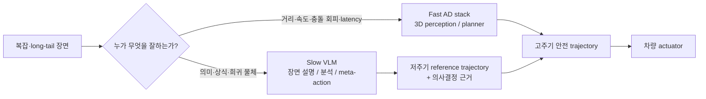
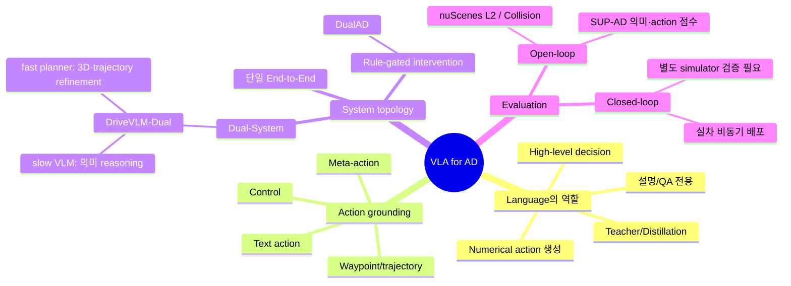
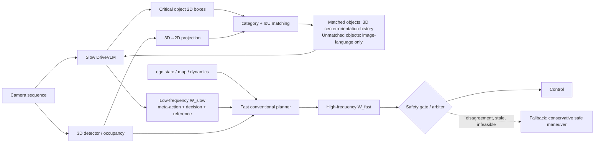
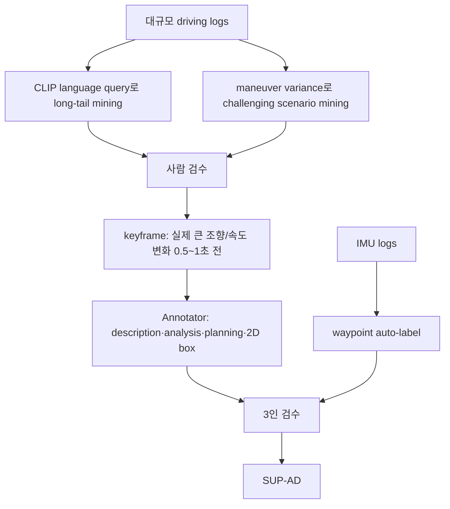
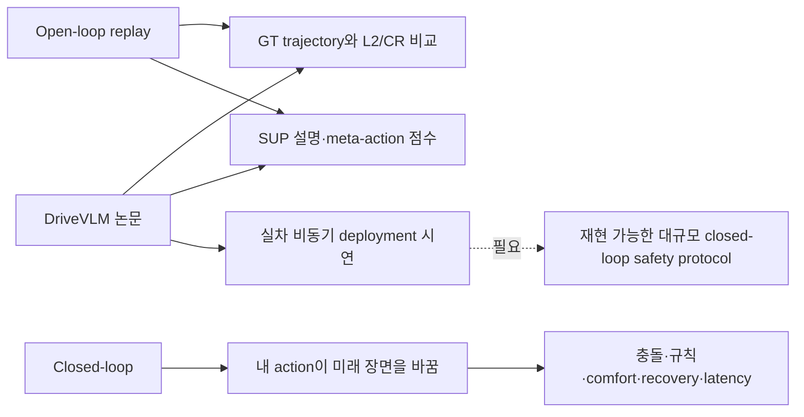
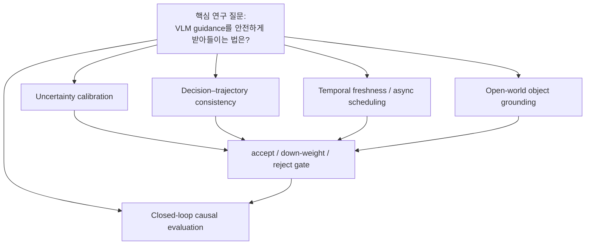

# Week 08. 이중 시스템 VLA: 느린 VLM 추론과 빠른 planner의 결합 — DriveVLM-Dual

> **학습 메모**: VLM을 곧바로 steering/trajectory 생성기로 쓰기보다, VLM의 long-tail 이해·의미적 추론은 저주기(high-level) guidance로 사용하고, 검증된 3D perception·motion planner가 고주기 안전 제약과 궤적을 맡기는 것이 DriveVLM-Dual의 핵심이다.

| 항목 | 내용 |
|---|---|
| 날짜 | 2026-09-08 |
| Week | 08 / 12 |
| 원 논문 | *DriveVLM: The Convergence of Autonomous Driving and Large Vision-Language Models* (Tian et al., CoRL 2024; arXiv v5) |
| 원문 URL | https://arxiv.org/abs/2402.12289 |
| 프로젝트 | https://tsinghua-mars-lab.github.io/DriveVLM/ |
| taxonomy | **Dual-System VLA / VLM-guided hierarchical planning**; slow semantic reasoning + fast conventional planning |
| Reading mode | **Deep read:** DriveVLM/DriveVLM-Dual. **Skim comparison:** LeapAD, Senna, DualAD |
| 원문 접근 범위 | arXiv HTML(v5), abstract, 프로젝트 페이지를 검토했다. PDF 텍스트 변환 도구는 실행 환경에 없어, 본 노트의 수치·구조 인용은 HTML 원문 표와 프로젝트 페이지를 기준으로 했다. |

---

## 1. 이번 주 한 문장 결론

**Dual-System VLA의 실용적 설계는 “VLM이 운전 제어를 대체한다”가 아니라, VLM이 critical object·의도·meta-action을 저주기로 제안하고, 3D-grounded fast planner가 이를 reference로 삼아 고주기 trajectory를 제약·정제하는 안전한 책임 분리다.**



---

## 2. 논문 제목·Abstract 한국어 번역

### 제목 번역

**DriveVLM: 자율주행과 대규모 Vision-Language Model의 융합**

### Abstract 번역

도시 환경 자율주행의 주된 난제는 까다로운 도로 조건과 미묘한 인간 행동처럼 복잡하고 long-tail인 상황을 이해하는 일이다. 본 논문은 향상된 장면 이해와 planning 능력을 위해 Vision-Language Model(VLM)을 활용하는 자율주행 시스템 **DriveVLM**을 제안한다. DriveVLM은 장면 기술(scene description), 장면 분석(scene analysis), 계층적 planning을 위한 고유한 reasoning module 조합을 통합한다.

또한 VLM의 spatial reasoning 한계와 큰 계산량을 고려하여, DriveVLM과 전통적 자율주행 pipeline의 장점을 결합한 hybrid 시스템 **DriveVLM-Dual**을 제안한다. nuScenes 및 자체 SUP-AD 데이터셋 실험은 DriveVLM과 DriveVLM-Dual이 복잡하고 예측하기 어려운 주행 조건을 다루는 데 효과적임을 보인다. 마지막으로 DriveVLM-Dual을 양산 차량(production vehicle)에 탑재하여 실제 자율주행 환경에서의 유효성을 검증한다.

### 문제를 다시 쓰면

| 기존 end-to-end policy의 약점 | VLM 단독의 약점 | Dual이 노리는 결합 |
|---|---|---|
| 흔치 않은 물체·몸짓·상황의 의미를 놓칠 수 있음 | 미터 단위 거리/상대속도/3D geometry가 약하고 autoregressive decode가 느림 | VLM의 open-world 의미 이해를 fast, grounded planning에 연결 |
| latent decision이 해석하기 어려움 | 말로 그럴듯하게 설명해도 실행 waypoint가 안전하다는 보장이 없음 | 중간 산출물(meta-action, decision description)을 audit 가능하게 만듦 |
| 데이터 분포 밖의 상식 일반화가 제한됨 | hallucination·prompt sensitivity·지연 시간이 safety-critical control에 부적합 | fast branch가 독립적으로 계속 운전하고 VLM은 비동기 보조 |

---

## 3. 핵심 기여 3~5개

1. **계층형 driving CoT를 action까지 확장**: 이미지 시퀀스에서 `scene description → critical-object/scene analysis → meta-action → decision description → waypoint`를 순차 생성한다. 언어 explanation으로 끝나지 않고 수치 waypoint까지 내려간다는 점이 VLA 측면의 핵심이다.
2. **DriveVLM-Dual 제안**: VLM의 2D critical-object 결과를 3D detector/occupancy 등의 측정과 IoU로 매칭하고, VLM의 저주기 trajectory를 conventional planner가 고주기로 refinement한다.
3. **SUP(Scene Understanding for Planning) 과제와 SUP-AD**: weather/time/road/lane, critical object 영향, meta-action, decision, waypoint를 함께 다루는 과제를 정의했다. long-tail object와 어려운 maneuver를 mining하고 3인 검수 annotation을 사용했다.
4. **의미와 행동을 분리한 평가**: scene description/analysis는 GT와의 구조적 일치 및 hallucination penalty를 포함한 LLM 평가, meta-action은 의미적으로 동등한 action sequence까지 고려한 dynamic-programming 정렬 점수로 평가한다.
5. **온보드 실증과 최적화**: 두 OrinX에서 비동기로 동작시키고, 작은 backbone·token compression·temporal feature queue·speculative sampling을 조합하여 DriveVLM 평균 추론 시간을 **410 ms**로 보고한다.

> **해석 주의**: 410 ms는 VLM branch의 평균 추론 시간이며, 10 Hz 이상의 actuator-level closed-loop 전체를 VLM 하나가 직접 담당한다는 의미는 아니다. 이것이 fast branch가 필요한 이유다.

---

## 4. VLA for AD taxonomy 위치

### 4.1 taxonomy map



### 4.2 분류 판정

| 축 | DriveVLM / DriveVLM-Dual의 위치 | 근거와 함의 |
|---|---|---|
| 시스템 형태 | **Hybrid dual-system VLA** | VLM은 slow branch, 기존 AD pipeline은 fast branch. 둘은 비동기로 협업한다. |
| perception 표현 | multi-view image + 선택적 3D object/occupancy | VLM의 2D semantic recognition과 기존 3D metric grounding을 결합한다. |
| language role | 관찰 요약, 위험/영향 분석, high-level driving decision의 **intermediate representation** | 자연어는 사용자 대화용 설명만이 아니라 planner에 넘기는 structured decision scaffold다. |
| action grounding | 17개 meta-action → action/subject/duration → `(x,y)` waypoint | 단, 실제 실행 안전성은 conventional planner refinement에 의존한다. |
| planning 시간척도 | VLM 저주기 reference + planner 고주기 update | 느린 reasoning이 fast safety loop를 block하지 않도록 설계한다. |
| 학습 방식 | Qwen-VL 기반 supervised fine-tuning + co-tuning | 인터넷 상식/일반 능력 망각을 줄이려 driving 외 QA/caption 데이터를 1:1로 섞었다. |
| 안전 관점 | semantic long-tail 발견을 강화하지만 **formal safety guarantee는 제시하지 않음** | interface의 uncertainty, rejection, fallback 정책이 실제 안전 case에서 결정적이다. |

### 4.3 End-to-End VLA와 Dual-System VLA 비교

| 질문 | End-to-End VLA (직접 trajectory/control) | Dual-System VLA (DriveVLM-Dual) |
|---|---|---|
| 최종 action 생성자 | VLM/통합 policy가 직접 생성 | fast planner가 최종 trajectory를 정제·발행 |
| VLM의 주 책임 | perception부터 numerical action까지 | scene semantics, critical-object reasoning, high-level guidance |
| metric geometry | 모델 내부에 묻힘; 정확도는 학습에 의존 | 기존 3D perception 및 motion-planning 표현을 명시적으로 활용 |
| latency 실패 | decode 지연이 control loop 전체에 전파될 수 있음 | fast branch가 독립 운전; VLM update가 늦어도 마지막 유효 guidance/fallback 사용 가능 |
| failure mode | 언어/수치 출력 오차가 바로 action error | branch disagreement, stale guidance, interface misalignment가 새 위험 |
| 해석 가능성 | 중간 text가 없으면 낮음 | scene→analysis→meta-action→decision→waypoint trace를 점검 가능 |
| 배포 난이도 | 하나의 모델로 단순해 보이나 검증 범위가 큼 | 통합·versioning·arbiter 설계가 추가되나 기존 safety stack 재사용 가능 |

---

## 5. Architecture / pipeline 시각화

### 5.1 DriveVLM의 reasoning-to-action pipeline

```mermaid
flowchart TD
  I[Surround-view image sequence<br/>t, t-1, t-2, t-3] --> VE[Vision encoder]
  VE --> A[Attention extractor / visual tokens]
  A --> LLM[Qwen-VL 기반 LLM]
  R[Route + ego pose + velocity] --> LLM
  LLM --> SD[1. Scene Description<br/>날씨·시간·도로·차선]
  SD --> CO[Critical Objects<br/>category + 2D box]
  CO --> SA[2. Scene Analysis<br/>속성·motion·특수 행동·ego 영향]
  SA --> SS[Scene summary]
  SS --> MA[3a. Meta-action sequence<br/>17 categories]
  MA --> DD[3b. Decision description<br/>Action / Subject / Duration]
  DD --> WP[3c. Numerical waypoints<br/>W = {(x_i, y_i)}]
```

### 5.2 DriveVLM-Dual: safety-critical interface를 중심으로



### 5.3 interface 계약(contract): “VLM을 믿는다”가 아니라 “검증 가능한 proposal만 받는다”

| 인터페이스 | VLM이 제공 | fast branch가 검증/보완해야 할 것 | 배포 권고 |
|---|---|---|---|
| object | critical object category, 2D box, 언어적 위험 설명 | 3D 위치·속도·tracking 안정성·false positive/negative | VLM object와 3D object의 matching confidence를 함께 전달 |
| decision | `slow down`, `change lane`, `wait` 등 meta-action | map legality, traffic-rule, surrounding-agent feasibility | action vocabulary에 OOD/모호 출력의 reject token 포함 |
| trajectory | 저주기 `W_slow` reference | collision, comfort, kinematics, route consistency | solver의 초기값 또는 learned planner의 query로만 사용 |
| timing | VLM output timestamp, confidence/근거 | stale 여부와 현재 scene drift | age timeout 뒤에는 guidance를 감쇠·폐기하고 fast-only fallback |

---

## 6. Input → Reasoning → Action Grounding 분석

| 단계 | 입력 | 모델 산출 | language의 역할 | action grounding 상태 | 주요 실패 위험 |
|---|---|---|---|---|---|
| 장면 기술 | multi-view image sequence | weather, time, road, lane | scene을 운전 관련 슬롯으로 압축 | 간접적 | caption은 맞아도 위험 우선순위가 틀릴 수 있음 |
| critical object | image + prompt | class + 대략적 2D bbox | “무엇이 중요한가”를 선택 | 2D referential grounding | 작은/가림/희귀 물체의 box 오류, 3D false match |
| object/scene 분석 | object + temporal context | static/motion/behavior와 ego 영향 | causal hypothesis를 언어로 명시 | decision 전 단계 | hallucinated intent, 관찰과 인과의 혼동 |
| meta-action | summary + route + ego state | 17종 action의 sequence | 행동의 semantic skeleton | **discrete task-level grounding** | 같은 상황의 복수 안전 행동을 단일 GT로 과벌 가능 |
| decision description | meta-action | Action–Subject–Duration | ‘왜/누구 때문에/얼마나’의 해석 trace | temporal/relational grounding | 자연어가 trajectory와 불일치 가능 |
| waypoint | decision + state | 미래 `(x,y)` sequence | 수치 waypoint를 token으로 autoregressive 생성 | **numerical action grounding** | 숫자 token 오차, geometry·충돌 제약 미보장 |
| dual refinement | `W_slow` + 3D/ego/map | `W_fast` | language는 더 이상 최종 control이 아님 | **metric·dynamic grounding** | stale reference 또는 VLM/fast plan 충돌 |

### action hierarchy의 핵심

```text
의미 이해:       “우측에서 자전거가 접근한다”
      ↓
행동 전략:       [slow down, wait]
      ↓
관계 있는 결정:  “자전거가 교차하기 전까지 감속하고 양보한다”
      ↓
수치 제안:       W_slow = [(x1,y1), ..., (xn,yn)]
      ↓
실행 가능 action: fast planner가 충돌·동역학·규칙을 만족하는 W_fast로 정제
```

**학습 포인트**: text를 낸다는 사실은 grounding을 보장하지 않는다. 여기서 grounding의 강도는 `2D referential → discrete maneuver → waypoint → planner-validated trajectory`로 갈수록 높아진다.

---

## 7. Training recipe

### 7.1 backbone과 supervision

| 요소 | 논문 설정 | 왜 필요한가 |
|---|---|---|
| base VLM | Qwen-VL, 총 9.6B parameters (vision encoder 1.9B, adapter 0.08B, LLM 7.7B) | visual localization/text recognition/QA 능력을 driving CoT에 전이 |
| visual input | 이미지 448×448; 학습 시 현재 `T`를 포함하는 `T, T-1, T-2, T-3` 중 시퀀스를 무작위 선택 | 짧은 시간 문맥으로 object motion/변화를 추론 |
| driving supervision | description, critical-object analysis, meta-action, decision description, waypoint | text와 action을 동일 autoregressive chain에서 정렬 |
| waypoint label | 차량 IMU 기록에서 auto-label | 수치 trajectory label의 annotation 비용 절감 |
| co-tuning | SUP-AD·nuScenes와 Talk2Car, BDD-X, DRAMA, SUTD, LLaVA를 각 driving 데이터량과 1:1 random sampling | driving만 fine-tune할 때 일반 VLM 능력이 무너지는 catastrophic forgetting 완화 |

### 7.2 SUP-AD 생성 및 annotation recipe



- SUP-AD는 **1,000개 driving video clip**, 40개 이상 scenario category를 포함한다고 부록에서 설명한다.
- scenario 예: road construction, sudden cut-in, animal crossing, debris, pedestrian popping out, traffic-police gesture, snowfall, fallen tree 등.
- train/validation/test split은 **7.5:1:1.5**다.
- annotation은 3명이 정확성과 일관성을 검수하지만, decision label에는 hindsight bias가 남는다. 즉 “실제 운전자가 선택한 행동”이 유일한 최적·안전 행동이라는 뜻은 아니다.

### 7.3 deployment-oriented 최적화

| 병목 | 선택 | 논문의 관찰 | 시스템적 의미 |
|---|---|---|---|
| LLM 규모/latency | 4B 이하 model 선택, Qwen 계열 비교 | Orin에서 wide/shallow Qwen이 비교 대상보다 속도 면에서 유리 | slow branch라도 vehicle compute budget을 만족해야 함 |
| visual token | LDPNetV2 기반 압축 | 원래 token의 75%를 줄이는 설정을 성능-속도 타협점으로 보고 | visual detail 손실이 critical object recall을 해치지 않는지 별도 점검 필요 |
| temporal input | feature queue + weighted fusion(SE block) | 매 frame 전체 재인코딩 대신 history feature 재사용 | stale temporal memory와 갑작스러운 위험 사이 trade-off |
| decode | Eagle speculative sampling + 4-bit quantization/fine-tuning + vocab 축소 | 표에서 decode latency 4.33× 가속 조합 보고 | 가속 후 rare action token/숫자 token 오류를 safety set에서 재평가해야 함 |

---

## 8. Dataset / Benchmark / Metric 분석

### 8.1 평가 매트릭스

| 평가층 | 데이터/환경 | metric | 측정하는 것 | 놓치는 것 |
|---|---|---|---|---|
| semantic understanding | SUP-AD test | Scene Description score | GT의 환경·차선·critical event와 생성 설명의 일치; hallucination penalty | 표현이 달라도 안전한 다른 판단인지, evaluator LLM의 편향 |
| decision sequence | SUP-AD test | Meta-action score | DP 정렬, conservative action의 낮은 penalty, LLM 생성 동의어 sequence 중 최고점 | 실제 closed-loop 결과, action timing의 연속성 |
| numerical planning | nuScenes validation | 1/2/3 s L2 displacement error, Collision Rate | GT trajectory 근접성과 예측 collision proxy | policy가 상황을 바꾸는 상호작용·recovery·distribution shift |
| deployment | production vehicle | 비동기 시스템 구동/평균 VLM latency | onboard feasibility signal | 공개된 통제 조건의 대규모 safety 통계·실패율·ODD coverage |

### 8.2 주요 결과 읽기

| 설정 (nuScenes val) | 평균 L2 ↓ | 평균 Collision ↓ | 해석 |
|---|---:|---:|---|
| VAD-Base | 0.37 m | 0.14% | 강한 conventional E2E baseline |
| DriveVLM 단독 | 0.40 m | 0.27% | semantic CoT가 있어도 VLM 단독 numerical trajectory는 불리함 |
| **DriveVLM-Dual + VAD** | **0.31 m** | **0.10%** | 저주기 VLM reference를 fast VAD가 정제할 때 가장 좋음 |
| UniAD | 1.03 m | 0.31% | 논문 표의 비교 baseline |
| DriveVLM-Dual + UniAD | 0.39 m | 0.20% | dual interface가 다른 conventional pipeline에도 이식 가능하다는 ablation |

SUP-AD에서는 Qwen 기반 DriveVLM이 scene description **0.71**, meta-action **0.37**을 보고했다. 비교 표의 GPT-4V in-context baseline은 각각 0.38/0.19다. 다만 이 점수는 논문이 정의한 LLM evaluator와 annotation ontology에 묶여 있으므로, “0.71 = 실제 안전도 71%”로 읽어서는 안 된다.

### 8.3 open-loop vs closed-loop 판정



- 논문의 **주 정량 planning 결과는 nuScenes open-loop**다. trajectory L2와 collision proxy는 유용하지만, ego action이 다른 agent를 바꾸는 closed-loop interaction을 완전히 시험하지 않는다.
- production vehicle 배포는 강한 engineering evidence이지만, 논문 본문에서 공개 benchmark와 동등한 형태의 closed-loop collision/route-completion 통계를 제시한 것은 아니다.
- 따라서 “Dual이 open-loop에서 더 좋다”와 “Dual이 모든 long-tail에서 안전하다” 사이에는 아직 큰 검증 간극이 있다.

---

## 9. 관련 논문 비교표

### 9.1 DriveVLM 중심의 skim 비교

| 방법 | duality의 단위 | slow/high-level branch | fast/low-level branch | language → action interface | 주 평가/특징 |
|---|---|---|---|---|---|
| **DriveVLM-Dual** | VLM + 전통 AD pipeline | scene description/analysis, meta-action, decision, `W_slow` | 3D perception + 고주기 planner가 `W_fast` 생성 | 2D critical object와 3D object IoU matching; reference trajectory | nuScenes open-loop + SUP-AD; 실차 비동기 배포 |
| **LeapAD** | System-II analytic + System-I heuristic | GPT-4 기반 분석·reflection·memory bank | 1.8B heuristic process | linguistic driving experience를 SFT로 fast process에 전이 | CARLA closed-loop; memory 증가에 따른 지속 개선을 강조 |
| **Senna** | LVLM decision + E2E trajectory policy | Senna-VLM이 자연어 planning decision 생성 | Senna-E2E가 precise trajectory 예측 | high-level natural-language decision으로 decoupling | DriveX pretrain + nuScenes fine-tune; 논문 abstract는 pretrain 없이 대비 planning error 27.12%, collision 33.33% 감소 보고 |
| **DualAD** *(Wang et al., 2024; 동명 CVPR DualAD와 구별)* | danger intervention layer + rule planner | text encoder + LLM이 위험 시 decision intervention | routine driving rule-based motion planner | 절대 state를 text로 변환한 후 LLM decision | zero-shot LLM, closed-loop 평가를 강조 |
| 단일 End-to-End VLA | 하나의 policy | semantic reasoning과 action이 한 모델에 공존 | 별도 fast supervisor가 없을 수 있음 | image/text → waypoint/control 직접 생성 | interface 단순하지만 latency·metric grounding·fallback을 한 모델이 모두 책임 |

> **명명 주의**: “DualAD”에는 (1) dynamic/static world 표현을 분리한 CVPR 2024의 Doll et al. 논문과, (2) LLM upper layer + rule planner를 제안한 Wang et al.의 *Dual-Layer Planning for Reasoning in Autonomous Driving*이 있다. 본 curriculum의 DualAD는 후자(arXiv:2409.18053)를 가리킨다.

### 9.2 무엇이 서로 다른가: guidance의 전달 방식

| 전달 방식 | 대표 | 장점 | 아직 남는 안전 질문 |
|---|---|---|---|
| online reference trajectory | DriveVLM-Dual | VLM의 scene-specific reasoning을 즉시 planner 초기값/query에 반영 | VLM update가 늦거나 틀릴 때 stale/incorrect reference를 어떻게 격리하는가? |
| distilled experience | LeapAD | slow expert의 지식을 small fast policy에 누적 | memory error와 reflection 오류가 self-training으로 증폭되지 않는가? |
| natural-language decision conditioning | Senna | high-level intent와 precise trajectory를 역할별로 전문화 | text decision과 low-level trajectory가 실제로 일치하는지 어떻게 측정/강제하는가? |
| danger-triggered intervention | DualAD | routine case의 비용을 낮추고 위험 상황에만 LLM 호출 | trigger의 recall이 낮으면 LLM이 필요한 위험을 놓치지 않는가? |

---

## 10. 강점과 한계

### 강점

1. **올바른 능력 분해**: VLM의 강점(semantic, commonsense, long-tail)을 거리·충돌·실시간 계산의 강점으로 과장하지 않는다.
2. **traceable intermediate outputs**: critical object, 영향, meta-action, decision description, waypoint의 사슬이 있어 failure analysis가 가능하다.
3. **3D grounding의 현실적 보강**: VLM이 찾은 2D critical object를 3D detector의 center/orientation/history와 연결해 motion·spatial ambiguity를 줄인다.
4. **action grounding의 연속성**: natural language에서 끊지 않고 discrete maneuver와 numerical waypoint까지 supervision한다.
5. **배포 관점의 구체성**: two-Orin 비동기 배치, token/decoder 최적화까지 포함해 “큰 VLM을 차에 어떻게 넣는가”를 다룬다.

### 한계와 long-tail/safety risk

| 위험 | 왜 생기는가 | 논문 설계가 줄이는 부분 | 아직 필요한 guardrail |
|---|---|---|---|
| semantic hallucination | VLM이 보이지 않는 object/intent를 말할 수 있음 | GT 비교 시 hallucination penalty; 3D match로 일부 grounding | calibrated confidence, sensor cross-check, unknown/abstain 출력 |
| long-tail **miss** | 희귀 물체는 VLM도 놓칠 수 있고 3D detector도 class 밖일 수 있음 | CLIP mining과 VLM open-vocabulary 성질 | OOD detector, conservative free-space/occupancy safety envelope |
| 2D–3D mismatch | IoU/category matching은 가림·중복 class·calibration error에 약함 | matched/unmatched object를 구분 | match uncertainty 전파, temporal association, no-match safe policy |
| stale VLM guidance | 410 ms의 VLM update 동안 장면이 급변 | fast planner가 비동기로 독립 동작 | timestamp/age limit, scene-change detector, reference expiry |
| planner disagreement | VLM meta-action과 map·dynamics 제약이 충돌 | conventional planner가 refinement | 명시적 arbitration priority와 contradiction log |
| open-loop optimism | GT replay는 ego action의 feedback을 반영하지 않음 | 실차 시연 | scenario-based closed-loop, counterfactual agents, fault injection |
| text–action inconsistency | explanation이 사후 rationalization일 수 있음 | shared hierarchy로 생성 | decision-following metric: text/meta-action이 `W_fast`에 실제 반영됐는지 검증 |
| dataset bias | 1,000 clips, keyframe와 hindsight label은 제한적 | 40+ scenario와 targeted mining | ODD 별 coverage, near-miss/negative examples, annotation disagreement 공개 |

### 비판적 결론

DriveVLM-Dual의 핵심 성과는 VLM을 빠른 controller로 바꾸는 데 있지 않다. **VLM 출력에 “참조(reference)·설명·우선순위”라는 제한된 권한을 주고, 최종 실행 권한을 metric-grounded safety stack에 남긴 것**이 더 중요한 설계 선택이다. 그러나 이 분리는 안전을 자동으로 증명하지 않는다. 실제 safety-critical interface는 (a) 언제 VLM을 호출하고, (b) 어느 confidence에서 guidance를 수용하며, (c) 언제 폐기하고 fast-only fallback할지의 계약으로 완성된다.

---

## 11. 실전 학습 포인트

### 11.1 구현 체크리스트

- [ ] VLM output마다 **timestamp, confidence, source frames, prompt/model version**을 기록한다.
- [ ] `W_slow`를 command가 아닌 **soft reference**로 전달하고, fast planner가 collision/kinematics/map legality를 hard constraint로 갖게 한다.
- [ ] VLM object와 tracked 3D object가 불일치하면 원인을 `VLM-only / tracker-only / match-ambiguous`로 분류한다.
- [ ] VLM output age가 임계값을 넘거나 current image embedding이 크게 drift하면 reference를 무효화한다.
- [ ] text decision, meta-action, final `W_fast`의 일치율을 telemetry metric으로 만든다. 예: “wait”인데 planner가 급가속한 case.
- [ ] shadow mode에서 VLM proposal과 production planner action의 disagreement를 long-tail taxonomy별로 모은 뒤 제한적 intervention을 시작한다.

### 11.2 evaluation matrix: 다음 실험에 반드시 넣을 축

| 축 | 최소 측정 | 좋은 결과의 기준 |
|---|---|---|
| semantic recall | critical-object recall/precision, 특히 VRU·debris·gesture | 중요한 object를 많이 말하는 것뿐 아니라 false alarm burden도 낮음 |
| geometric validity | `W_slow`, `W_fast`의 collision/curvature/jerk/rule violation | fast refinement 전후 안전 margin이 악화되지 않음 |
| interface health | 2D–3D match rate, branch disagreement, stale rate | uncertainty가 높은 guidance가 최종 action을 지배하지 않음 |
| latency | perception→VLM→planner E2E latency distribution(p50/p95/p99) | 평균 410 ms가 아니라 tail latency에서도 fallback이 작동 |
| closed-loop | route completion, collision, intervention, recovery, comfort | open-loop gain이 interactive scenario에서도 유지 |
| long-tail | weather/occlusion/novel object/rare behavior별 slice | 평균 점수 상승이 취약 집단의 실패를 숨기지 않음 |

### 11.3 개인 research map



---

## 12. 다음 주 질문

다음 주 주제는 **VLM supervision / distillation**이다. DriveVLM-Dual은 큰 VLM을 online slow branch로 남겨 두는데, 다음의 질문으로 이어진다.

1. VLM의 critical-object/decision/waypoint supervision을 작은 driving policy에 distill하면, 어떤 정보(텍스트, latent feature, trajectory distribution)를 옮겨야 long-tail 성능이 유지되는가?
2. teacher VLM의 hallucination과 2D–3D mismatch를 student가 그대로 모방하지 않게 하려면 uncertainty-aware distillation을 어떻게 설계해야 하는가?
3. online dual system과 offline distillation은 경쟁 관계인가, 아니면 **slow teacher + fast student + safety gate**의 삼중 구조로 결합할 수 있는가?
4. student의 closed-loop 실패를 다시 teacher가 설명·수정하는 data flywheel은 안정적으로 수렴하는가?

---

## 13. 참고 링크

### Deep read

- DriveVLM arXiv (v5): https://arxiv.org/abs/2402.12289
- DriveVLM HTML full text: https://arxiv.org/html/2402.12289v5
- DriveVLM project page: https://tsinghua-mars-lab.github.io/DriveVLM/
- DriveVLM deployment demo (논문 링크): https://www.youtube.com/watch?v=MMCO0TLMT74

### Skim comparison

- LeapAD — *Continuously Learning, Adapting, and Improving: A Dual-Process Approach to Autonomous Driving*: https://arxiv.org/abs/2405.15324
- LeapAD project page: https://pjlab-adg.github.io/LeapAD/
- Senna — *Bridging Large Vision-Language Models and End-to-End Autonomous Driving*: https://arxiv.org/abs/2410.22313
- Senna code/models: https://github.com/hustvl/Senna
- DualAD — *Dual-Layer Planning for Reasoning in Autonomous Driving*: https://arxiv.org/abs/2409.18053
- DualAD code/benchmark: https://github.com/TUM-AVS/DualAD

### 핵심 메모

> **Dual-System VLA의 평가 단위는 VLM score 하나가 아니다.** `semantic understanding × geometric feasibility × freshness × branch agreement × closed-loop safety`를 함께 측정해야 한다.
