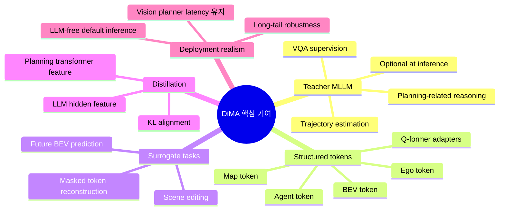
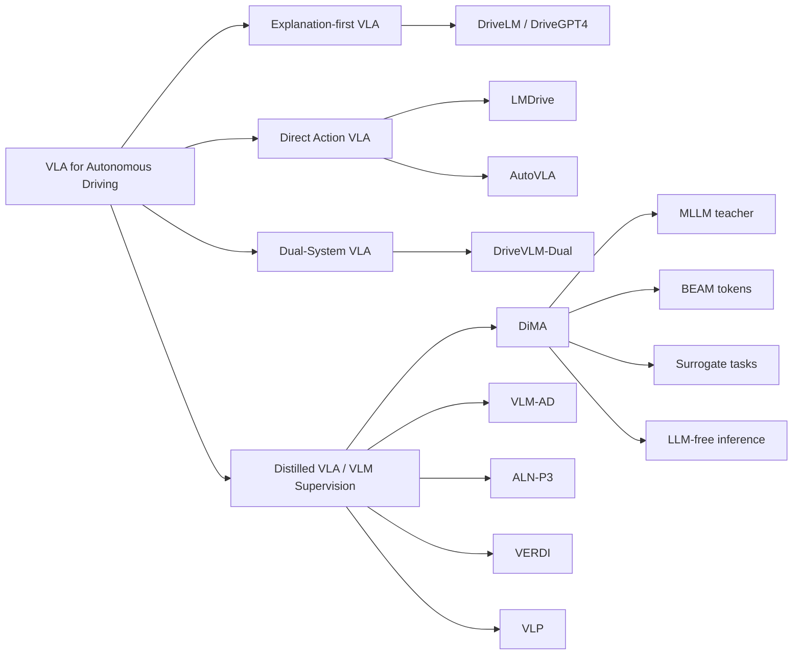
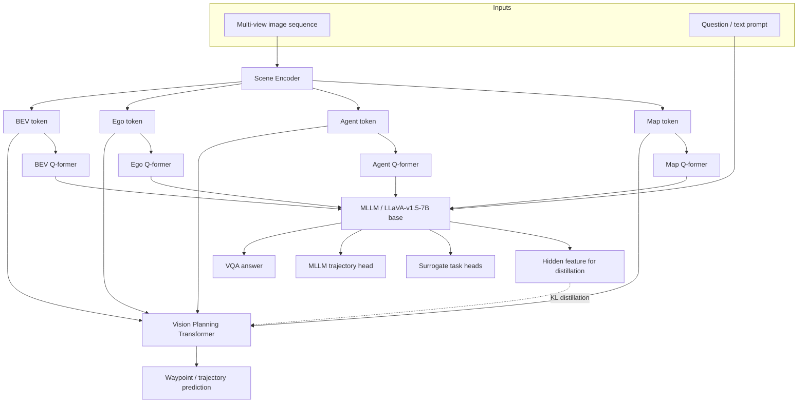
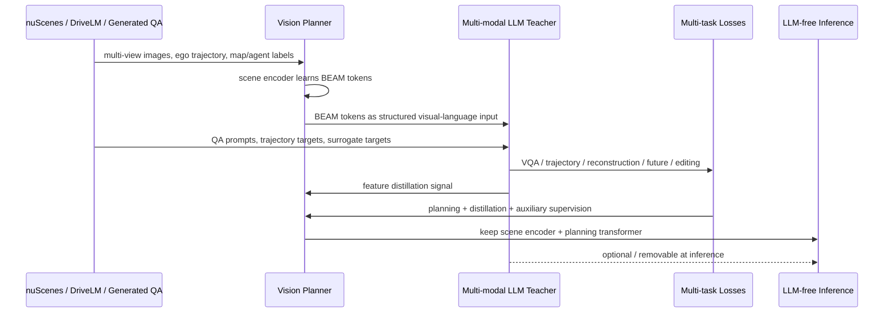
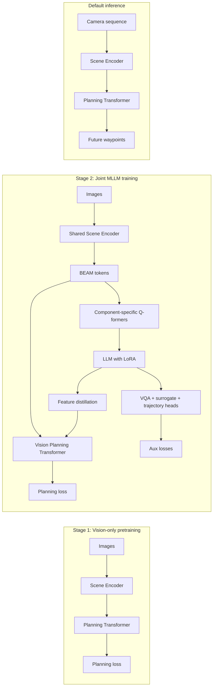
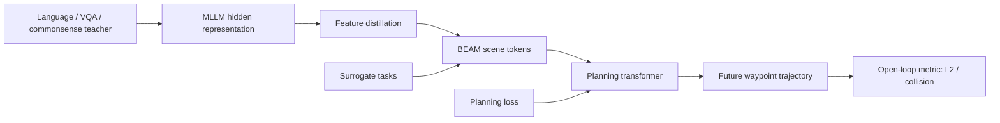
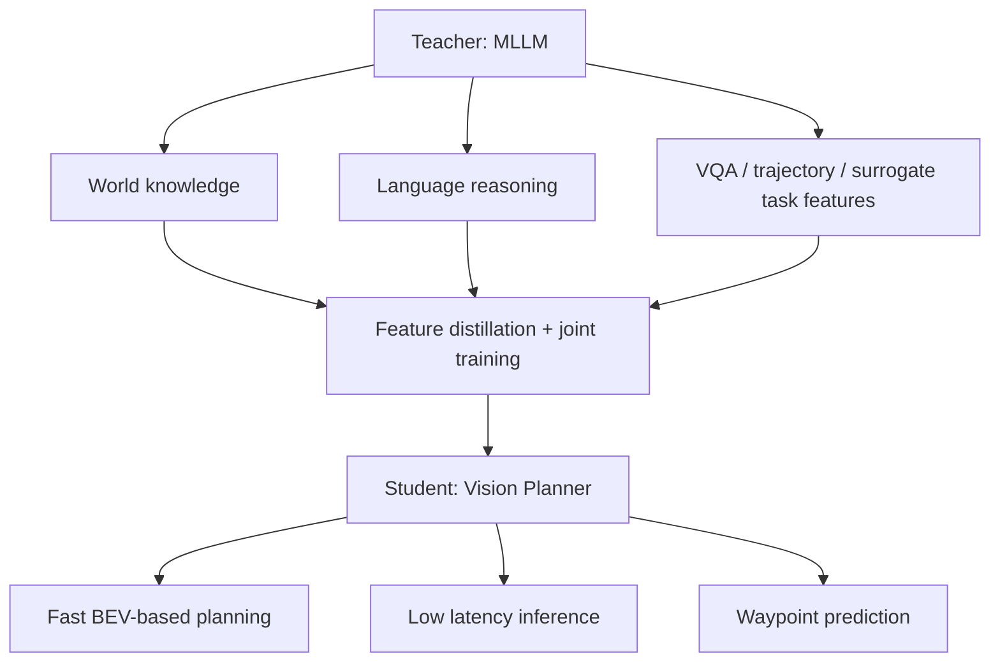
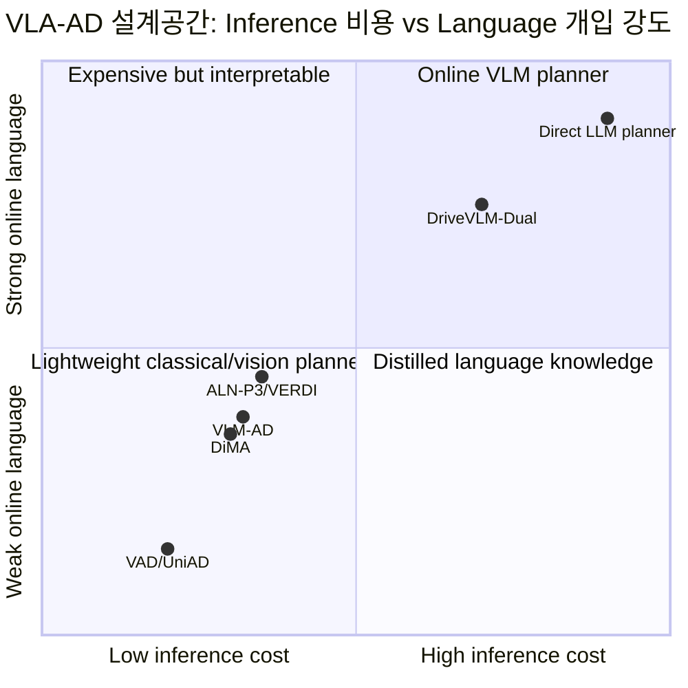
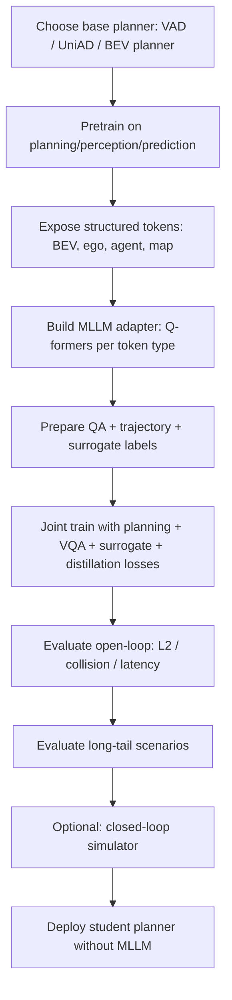

# Week 09. VLM supervision / distillation: DiMA로 보는 “추론은 학습 때, 배포는 빠르게” 전략

## Metadata

| 항목 | 내용 |
|---|---|
| Date | 2026-06-23 |
| Week | 09 / 12 |
| Original paper/source | *Distilling Multi-modal Large Language Models for Autonomous Driving* |
| Korean title | **자율주행을 위한 Multi-modal Large Language Model 증류** |
| URL | https://arxiv.org/abs/2501.09757 |
| Version read | arXiv v1 metadata + arXiv HTML full text 기반. PDF 파일은 내려받았지만 실행 환경에 `pdftotext`가 없어 HTML 본문을 주 텍스트로 사용했다. |
| Authors | Deepti Hegde, Rajeev Yasarla, Hong Cai, Shizhong Han, Apratim Bhattacharyya, Shweta Mahajan, Litian Liu, Risheek Garrepalli, Vishal M. Patel, Fatih Porikli |
| Affiliation | Johns Hopkins University, Qualcomm AI Research |
| Taxonomy | **VLM supervision / MLLM distillation for VLA-AD** / teacher-at-training / LLM-free inference / structured scene tokens / long-tail planning |
| Reading mode | Deep read: **DiMA** / skim: **VLM-AD**, **VLP**, **ALN-P3**, **VERDI** |
| 이번 주 focus | VLM as teacher, representation transfer, deployment realism |
| Output | **Direct VLA vs Distilled VLA 비교표** |

> 참고: 이번 노트는 논문 전체를 줄 단위로 번역하지 않고, arXiv abstract/HTML 본문과 관련 논문 metadata를 바탕으로 한국어 학습 노트로 재구성했다. 핵심 수치와 표는 논문 본문에 제시된 값을 요약했다.

---

## 1. 이번 주 한 문장 결론

**DiMA의 핵심은 MLLM을 “배포 시점의 거대한 운전 planner”로 쓰지 않고, 학습 중에만 teacher / co-trainer로 활용해 vision-based planner의 BEV·ego·agent·map 표현을 언어적으로 grounding한 뒤, inference에서는 LLM 없이 빠른 planner만 남기는 distilled VLA 전략이다.**

Week 08의 DriveVLM-Dual이 “느린 VLM branch + 빠른 planner branch”를 배포 시점에도 함께 운영하는 **dual-system VLA**였다면, Week 09의 DiMA는 더 과감하게 묻는다.

> **VLM의 world knowledge와 reasoning supervision은 필요하지만, 실제 차량에 7B~70B LLM을 계속 태우지 않으려면 어떻게 해야 하는가?**

DiMA의 답은 세 가지다.

1. **VLM은 inference-time actor가 아니라 training-time teacher다.**  
   MLLM은 VQA, trajectory estimation, surrogate tasks, feature distillation을 통해 scene encoder를 더 잘 학습시키지만, 기본 planning inference에서는 제거 가능하다.
2. **vision planner의 structured scene token을 MLLM 입력으로 사용한다.**  
   이미지 patch token을 그대로 LLM에 넣는 대신, planner가 이미 학습한 **BEAM tokens(BEV, Ego, Agent, Map)**을 trainable tokenizer처럼 사용한다.
3. **representation transfer가 action grounding의 중심이다.**  
   language output 자체가 trajectory가 되는 것이 아니라, 언어로 grounding된 latent representation이 최종 waypoint prediction objective와 정렬된다.

한마디로 이번 주 키워드는 **“Direct VLA가 아니라 Distilled VLA”**, 즉 **추론은 언어로 배우되, 운전은 가벼운 planner가 수행**하는 구조다.

---

## 2. 논문 제목·Abstract 한국어 번역

### 2.1 제목 번역

- **원제**: *Distilling Multi-modal Large Language Models for Autonomous Driving*
- **번역**: **자율주행을 위한 Multi-modal Large Language Model 증류**
- **시스템명**: **DiMA** = **Di**stilling **M**ulti-modal Large Language Models for **A**utonomous driving

### 2.2 Abstract 한국어 번역

자율주행은 특히 중요한 **long-tail 시나리오**에서 안전한 motion planning을 요구한다. 최근 end-to-end 자율주행 시스템들은 드문 사건에 대한 일반화 능력을 높이기 위해 Large Language Model(LLM)을 planner로 활용한다. 그러나 test time에 LLM을 사용하는 것은 높은 계산 비용을 유발한다. 이를 해결하기 위해 본 논문은 LLM-free, 또는 vision-based planner의 효율성을 유지하면서도 LLM의 world knowledge를 활용하는 end-to-end 자율주행 시스템 **DiMA**를 제안한다.

DiMA는 특별히 설계된 surrogate task들을 통해 multi-modal LLM의 정보를 vision-based end-to-end planner로 증류한다. joint training 전략 아래에서 두 네트워크가 공유하는 scene encoder는 의미적으로 grounding되어 있으면서도 최종 planning objective와 정렬된 structured representation을 생성한다. 특히 LLM은 inference 시점에 선택 사항이므로, 효율성을 희생하지 않고도 robust planning을 가능하게 한다.

DiMA로 학습하면 vision-based planner의 **L2 trajectory error가 37% 감소**하고 **collision rate가 80% 감소**하며, long-tail 시나리오에서는 **trajectory error가 44% 감소**한다. 또한 DiMA는 nuScenes planning benchmark에서 state-of-the-art 성능을 달성한다.

### 2.3 Abstract를 VLA 관점으로 다시 쓰기

**DiMA는 VLA의 “language reasoning”을 직접 action token 생성에 쓰지 않고, 학습 과정에서 MLLM이 vision planner의 scene representation을 언어·미래예측·scene editing 과제로 강화하도록 만든다. 그 결과 inference에서는 LLM을 제거해도 BEV/ego/agent/map token이 planning에 더 잘 정렬되어, long-tail maneuver와 collision metric이 개선된다.**

### 2.4 제목만 보고 오해하면 안 되는 점

| 오해 | 실제 DiMA |
|---|---|
| “LLM planner가 직접 trajectory를 생성한다” | DiMA의 기본 장점은 **LLM-free inference**다. MLLM branch는 학습 중 teacher이자 optional branch다. |
| “그냥 VQA를 추가한 multi-task model이다” | VQA뿐 아니라 masked token reconstruction, future BEV prediction, scene editing, feature distillation을 결합한다. |
| “언어 설명이 좋아지면 planning도 자동으로 좋아진다” | 논문은 language supervision을 **structured BEAM token**과 **planning loss**에 연결해야 효과가 있다고 본다. |
| “Direct VLA보다 성능이 낮을 수밖에 없다” | nuScenes open-loop에서는 TOKEN, DriveVLM 등 LLM/MLLM planner 계열과 경쟁하거나 능가하는 결과를 보고한다. |
| “closed-loop deployment까지 증명했다” | DiMA 본문 평가는 주로 nuScenes open-loop planning이며, closed-loop 실차 배포 검증은 제한적이다. 관련 후속 흐름인 VLM-AD/VERDI는 closed-loop 평가를 더 강조한다. |

---

## 3. 핵심 기여 3~5개

| # | 핵심 기여 | 왜 중요한가 |
|---:|---|---|
| 1 | **MLLM-to-vision planner distillation 프레임워크 DiMA 제안** | VLM의 world knowledge를 학습에 활용하되 inference 비용은 vision planner 수준으로 유지한다. |
| 2 | **BEAM token 기반 structured MLLM input** | BEV, Ego, Agent, Map token을 MLLM에 넣어 driving scene의 구성요소를 명시적으로 표현한다. |
| 3 | **surrogate tasks 설계** | masked token reconstruction, future BEV prediction, scene editing으로 planning에 유용한 scene representation을 강화한다. |
| 4 | **feature distillation으로 planner와 MLLM 정렬** | MLLM penultimate feature와 planning transformer feature를 KL divergence로 맞춰 언어적 reasoning signal을 planner에 주입한다. |
| 5 | **long-tail planning 성능 개선** | nuScenes full/targeted/long-tail split에서 L2 error와 collision rate 개선을 보고하며, 3-point turn 같은 zero-shot scenario에서도 강한 결과를 제시한다. |

### Contribution map



---

## 4. VLA for AD taxonomy 위치

### 4.1 Taxonomy 좌표

| 분석 축 | DiMA 위치 | 해석 |
|---|---|---|
| System type | **Distilled VLA / VLM-supervised E2E AD** | 학습 중 MLLM을 사용하지만 기본 inference는 vision-based planner다. |
| Input modality | Multi-view image sequence + question text prompt + structured scene tokens | raw image를 LLM에 직접 넣기보다 planner scene encoder가 만든 BEAM token을 사용한다. |
| Output | Future waypoints / trajectory, VQA answer, surrogate task outputs | 최종 action grounding은 trajectory prediction이고, 언어 output은 auxiliary supervision이다. |
| Language role | **Teacher signal + representation grounding** | language는 human-like explanation 자체보다 latent scene representation을 풍부하게 하는 supervision이다. |
| Action grounding | BEAM token → planning transformer → waypoint | MLLM이 직접 actuator command를 내리지 않고, planner representation을 planning objective와 맞춘다. |
| Training recipe | vision planner pretrain → MLLM joint training with LoRA + multi-task losses | 60 epoch vision-only pretrain 후 30 epoch joint training으로 보고된다. |
| Dataset/benchmark | nuScenes, DriveLM QA, generated QA, targeted split, long-tail split | open-loop planning 중심이며, DriveLM-style QA로 language supervision을 보강한다. |
| Evaluation | L2 trajectory error, collision rate, latency/FPS, ablation, long-tail split | closed-loop보다는 nuScenes open-loop planning benchmark가 중심이다. |
| Safety/long-tail | 3-point turn, resume from stop, overtake 등 rare maneuver | long-tail maneuver에서 LLM teacher의 world knowledge가 representation에 반영되는지 본다. |
| Limitation | closed-loop/real-world deployment evidence 부족, teacher quality 의존 | 학습 annotation과 QA generation quality, simulator/real deployment 검증이 다음 과제다. |

### 4.2 Week 01 taxonomy에 연결하기



### 4.3 Direct VLA vs Distilled VLA 비교표

| 관점 | Direct VLA / LLM planner | Distilled VLA / VLM supervision |
|---|---|---|
| 대표 예 | LMDrive, DriveVLM, TOKEN, 일부 MLLM planner | DiMA, VLM-AD, ALN-P3, VERDI, VLP 계열 |
| 기본 철학 | VLM/LLM이 inference 때 scene reasoning과 trajectory/planning을 직접 수행 | VLM의 reasoning을 학습 supervision으로 사용하고 inference는 작은 planner가 수행 |
| Language의 위치 | online reasoning engine | offline teacher, auxiliary target, latent alignment signal |
| Action grounding | text/action token 또는 waypoint를 VLM이 직접 생성 | vision planner의 BEV/agent/map representation을 강화해 waypoint를 생성 |
| 장점 | 해석 가능성, interactive QA, long-tail reasoning을 즉시 활용 | latency/메모리/실시간성 유리, safety decomposition 쉬움, 기존 AD stack 재사용 가능 |
| 약점 | 7B~70B 모델 inference 비용, hallucination, deterministic control 어려움 | teacher signal quality에 의존, 언어 reasoning이 실제 closed-loop 행동으로 전이되는지 검증 필요 |
| 배포 현실성 | onboard compute와 frequency가 병목 | LLM-free inference면 양산형 planner에 가까움 |
| Safety envelope | VLM output이 잘못되면 직접 action risk | planner/rule/safety checker와 결합하기 쉬움 |
| 연구 질문 | “LLM이 운전할 수 있는가?” | “LLM이 더 좋은 운전 표현을 가르칠 수 있는가?” |

---

## 5. Architecture / pipeline 시각화

### 5.1 DiMA 전체 구조



### 5.2 학습과 배포의 분리



### 5.3 DiMA의 핵심 블록 다이어그램



### 5.4 BEAM token 개념도

| Token | 의미 | planner 관점 | MLLM supervision에서의 역할 |
|---|---|---|---|
| **B: BEV** | bird’s-eye-view scene layout | drivable area, spatial occupancy, lane-level context | masked reconstruction, future BEV prediction의 핵심 대상 |
| **E: Ego** | ego vehicle state/intent | 현재 속도, 위치, 미래 waypoint query | feature distillation에서 ego-token hidden feature를 맞춤 |
| **A: Agent** | 주변 차량/보행자 등 dynamic agents | interaction, collision risk, motion prediction | scene editing에서 add/delete agent 효과 학습 |
| **M: Map** | lane/map topology | route constraint, turn/lane structure | MLLM이 driving context를 구조적으로 이해하도록 제공 |

---

## 6. Input → Reasoning → Action Grounding 분석

### 6.1 I/O map

| 단계 | 입력 | 내부 reasoning / representation | 출력 | Action grounding 수준 |
|---|---|---|---|---|
| Vision backbone | Multi-view image sequence | image feature extraction | visual feature map | 낮음: 아직 semantic/action 정보가 약함 |
| Scene encoder | visual features + learnable queries | BEV/Ego/Agent/Map 구조화 | BEAM token embeddings | 중간: driving scene component로 분해됨 |
| Planning transformer | BEAM tokens | trajectory-oriented interaction modeling | future waypoints | 높음: 직접 planning objective와 연결 |
| MLLM branch | BEAM tokens + text question | VQA, planning reasoning, future prediction | text answer, trajectory head, surrogate outputs | 보조적: inference actor라기보다 teacher |
| Distillation | MLLM hidden features + planner features | latent distribution alignment | planner representation update | 간접적이지만 중요: language-grounded feature가 waypoint 예측에 반영 |

### 6.2 Language role: “말로 운전”이 아니라 “말로 표현을 가르치기”

| Language 사용 방식 | DiMA에서의 구현 | VLA 관점 해석 |
|---|---|---|
| VQA supervision | scene perception, agent behavior prediction, ego behavior, future planning QA | 운전 장면을 language로 해석하도록 latent를 grounding |
| Generated QA | nuScenes의 numerical annotation으로 DriveLM-like QA 생성 | DriveLM subset 부족 문제 완화 |
| MLLM trajectory estimation | MLLM branch가 waypoint를 예측하는 auxiliary task | LLM도 planning 관련 signal을 학습하지만 기본 inference에는 필수 아님 |
| Surrogate task prompt | masked/future/editing task와 결합 | 단순 captioning보다 planning에 가까운 self-supervision |
| Distillation | MLLM penultimate layer와 planning transformer feature 정렬 | 언어 reasoning이 planner latent에 흡수됨 |

### 6.3 Action grounding chain



**핵심 해석**: DiMA의 action grounding은 “LLM이 문장으로 `turn left`라고 말한다”가 아니라, **turning, stopping, overtaking 같은 maneuver를 잘 설명할 수 있는 latent scene representation이 실제 waypoint loss와 함께 학습된다**는 점에 있다.

---

## 7. Training recipe

### 7.1 두 단계 학습

| 단계 | 내용 | 목적 |
|---|---|---|
| Stage 1: vision-only planner pretraining | VAD/UniAD 기반 planner를 perception, prediction, planning task로 60 epochs pretrain | BEV/agent/map/ego token이 기본 driving structure를 갖도록 함 |
| Stage 2: joint training with MLLM | scene encoder + planning transformer + MLLM을 30 epochs joint training. LLaVA-v1.5-7B LLM base는 LoRA로 fine-tuning | MLLM supervision과 planning objective를 동시에 반영 |
| Inference | 기본적으로 scene encoder + planning transformer만 사용 | LLM-free latency/FPS 유지 |

### 7.2 Loss 구성

논문은 전체 loss를 다음과 같이 요약한다.

```text
L = L_planning + L_LLM + L_recon + L_future + L_distill
```

| Loss | 역할 | VLA 관점 |
|---|---|---|
| `L_planning` | 최종 trajectory/waypoint prediction objective | action grounding의 anchor |
| `L_LLM` | VQA와 MLLM language/planning supervision | language reasoning 학습 |
| `L_recon` | masked BEV token reconstruction | scene representation 복원 능력 |
| `L_future` | future BEV token prediction | world model에 가까운 temporal anticipation |
| `L_distill` | MLLM hidden feature와 planner feature 정렬 | VLM knowledge transfer |

### 7.3 Surrogate task 3종

| Surrogate task | 무엇을 하게 하나? | 왜 planning에 유용한가? | 실패하면 생기는 문제 |
|---|---|---|---|
| **Masked token reconstruction** | BEV token 일부를 mask하고 나머지 context로 복원 | 주변 context를 이용해 spatial layout을 완성하는 능력 | occlusion/partial observation에서 scene 이해가 약해짐 |
| **Future BEV prediction** | 현재 BEV latent로 미래 BEV token을 예측 | 미래 scene evolution을 예측해야 안전한 trajectory 가능 | 정지 차량, 끼어들기, 교차로 흐름 예측이 약해짐 |
| **Scene editing** | agent를 추가/삭제하고 그 변화에 대한 QA를 구성 | 주변 agent가 ego path에 주는 causal effect를 학습 | interaction-aware planning이 약해지고 collision risk 증가 |

### 7.4 DiMA가 “distillation”인 이유



일반적인 distillation은 teacher의 output logit을 student가 따라 하게 만드는 경우가 많다. DiMA는 더 driving-specific하다.

- teacher의 text answer만 복사하지 않는다.
- teacher가 보는 입력도 raw image patch가 아니라 planner의 structured token이다.
- student가 최종적으로 잘해야 하는 것은 language QA가 아니라 **trajectory planning**이다.
- 그래서 distillation은 **semantic grounding + planning alignment**의 형태를 띤다.

---

## 8. Dataset / Benchmark / Metric 분석

### 8.1 사용 데이터

| Dataset | 사용 목적 | 규모/특징 | DiMA에서의 역할 |
|---|---|---|---|
| **nuScenes** | open-loop planning | 약 28k samples, 22k train / 6k validation split. 3D box, orientation, velocity, CAN bus trajectory 포함 | main planning benchmark |
| **DriveLM** | VQA supervision | nuScenes subset 약 4k samples, 약 300k QA pairs | perception/prediction/planning/ego behavior QA 학습 |
| **Generated QA** | DriveLM annotation이 없는 nuScenes sample 보강 | Llama3-70B in-context prompting + rule-based ego behavior categorization | language supervision coverage 확대 |
| **Targeted split** | 어려운 turning navigation 평가 | PARA-Drive 계열에서 사용한 challenging samples | 일반 validation보다 어려운 planning 확인 |
| **Long-tail split** | rare maneuver 평가 | 3-point turn, resume from stop, overtake | VLM teacher가 rare event representation에 도움 되는지 확인 |

### 8.2 평가 metric

| Metric | 의미 | 장점 | 한계 |
|---|---|---|---|
| **L2 trajectory error (m)** | 예측 waypoint와 GT waypoint의 거리 | planning 정확도를 직관적으로 측정 | GT imitation이 항상 안전/최적인 것은 아님 |
| **Collision rate (%)** | ego trajectory와 주변 object 충돌 비율 | safety proxy로 중요 | open-loop collision은 closed-loop interaction을 완전히 반영하지 못함 |
| **Latency / FPS** | inference 속도 | deployment realism 평가 | 실제 onboard stack integration latency와는 다를 수 있음 |
| **Long-tail scenario performance** | rare maneuver별 성능 | 일반 평균에 묻히는 위험을 드러냄 | split 정의가 작고 benchmark 편향 가능 |
| **VQA qualitative examples** | language reasoning 확인 | 해석 가능성 확인 | 정량 safety와 직접 연결되지는 않음 |

### 8.3 주요 결과 요약

#### nuScenes standardized evaluation: full validation split

| Method | L2 Ave 1/2/3s ↓ | Collision Ave 1/2/3s ↓ | 해석 |
|---|---:|---:|---|
| VAD-Base | 0.91 | 0.37 | 강한 vision planner baseline |
| PARA-Drive | 0.66 | 0.26 | standardized evaluation에서 강한 최신 planner |
| TOKEN | 0.81 | - | LLM planner 계열 비교 대상 |
| **DiMA (VAD-Tiny)** | **0.61** | **0.09** | tiny planner도 큰 개선 |
| **DiMA (VAD-Base)** | **0.57** | **0.07** | full split에서 강한 성능 |
| **DiMA+ (VAD-Base)** | **0.56** | **0.07** | ego status 사용 시 조금 더 개선 |

#### targeted validation split

| Method | L2 Ave 1/2/3s ↓ | Collision Ave 1/2/3s ↓ | 해석 |
|---|---:|---:|---|
| VAD-Base | 1.27 | 0.39 | 어려운 turn scenario에서 성능 저하 |
| PARA-Drive | 1.08 | 0.24 | targeted split 강한 baseline |
| **DiMA (VAD-Base)** | **0.83** | **0.08** | challenging split에서 큰 개선 |
| **DiMA+ (VAD-Base)** | **0.79** | **0.06** | ego status 사용 시 최고 수준 |

#### VAD evaluation: latency까지 포함

| Method | L2 Ave all ↓ | Collision Ave all ↓ | Latency / FPS | 해석 |
|---|---:|---:|---|---|
| VAD-Tiny | 0.78 | 0.38 | 59.5ms / 16.8 FPS | 빠르지만 성능 제한 |
| VAD-Base | 0.72 | 0.22 | 224.3ms / 4.5 FPS | 더 무겁고 성능 개선 |
| DriveVLM-Dual (VAD-Base) | 0.31 | 0.10 | - | dual-system MLLM planner 비교 대상 |
| **DiMA (VAD-Tiny)** | **0.38** | **0.15** | **59.5ms / 16.8 FPS** | VAD-Base보다 빠르면서 성능 크게 개선 |
| **DiMA (VAD-Base)** | **0.29** | **0.10** | **226ms / 4.5 FPS** | DriveVLM-Dual과 경쟁 |
| **DiMA+ (VAD-Base)** | **0.27** | **0.08** | **226ms / 4.5 FPS** | ego status 사용 시 더 강함 |
| **DiMA-Dual+ (VAD-Tiny)** | **0.29** | **0.09** | **286ms / 3.5 FPS** | MLLM branch를 쓰면 성능은 오르지만 비용도 증가 |

### 8.4 Long-tail 결과 해석

| Scenario | baseline 문제 | DiMA의 의미 |
|---|---|---|
| **3-point turn** | training에 없는 zero-shot maneuver로 보고됨 | world knowledge / structured reasoning supervision이 rare maneuver representation에 도움을 줄 수 있음을 보여줌 |
| **Resume from stop** | 정지 후 재출발은 ego intent와 주변 context 이해가 필요 | future BEV prediction과 ego/agent token 정렬이 도움 될 수 있음 |
| **Overtake** | 주변 agent interaction과 collision risk가 큼 | scene editing으로 agent의 causal impact를 학습하는 설계와 연결됨 |

### 8.5 Open-loop vs closed-loop 평가 관점

| 평가 관점 | DiMA에서의 상태 | 코멘트 |
|---|---|---|
| Open-loop planning | 매우 강함. nuScenes L2/collision 중심 | 논문 핵심 성과 |
| Closed-loop simulation | 본문에서 중심 evidence는 아님 | 실제 interactive failure는 open-loop만으로 부족 |
| Real vehicle deployment | 명시적 실차 배포 증거 제한 | Week 08 DriveVLM-Dual보다 deployment evidence는 약함 |
| Deployment realism | LLM-free inference 설계 자체는 매우 현실적 | closed-loop/real-time stack integration 검증이 후속 과제 |

---

## 9. 관련 논문 비교표

### 9.1 VLM supervision / distillation 계열 비교

| Paper | 핵심 아이디어 | VLM/LLM 사용 시점 | Alignment 대상 | 평가 포인트 | DiMA와의 차이 |
|---|---|---|---|---|---|
| **DiMA** | MLLM을 joint training teacher로 사용해 vision planner의 BEAM token을 강화 | 주로 training-time, inference optional | BEV/Ego/Agent/Map token, planning transformer feature | nuScenes open-loop, targeted, long-tail, ablation, latency | structured BEAM token과 surrogate tasks가 핵심 |
| **VLM-AD** | VLM teacher가 unstructured reasoning + structured action labels를 제공해 E2E AD 학습 강화 | training-time, inference에 VLM 불필요 | driving rationale와 action labels | nuScenes + closed-loop route completion / driving score 개선 보고 | DiMA보다 teacher supervision의 reasoning/action label 성격을 더 직접 강조 |
| **VLP** | language model을 활용해 source memory와 contextual understanding 강화 | training/integration 방식의 vision-language-planning | linguistic understanding ↔ planning | nuScenes L2/collision, long-tail/generalization | DiMA 이전 세대의 vision-language planning 흐름. DiMA는 distillation과 LLM-free inference를 더 명확히 제시 |
| **ALN-P3** | perception, prediction, planning 전 단계에서 language alignment를 수행하는 co-distillation | training-time alignment, inference cost 추가 없음 | P1A/P2A/P3A: perception/prediction/planning outputs | nuScenes, Nu-X, TOD3Cap, nuScenes QA | DiMA가 BEAM token 중심이면 ALN-P3는 stack 전체 단계별 alignment를 명시 |
| **VERDI** | VLM-generated reasoning text feature를 modular E2E AD stack의 중간 module에 정렬 | training-time, inference-time VLM 비용 없음 | perception, prediction, planning latent | open-loop + HugSim closed-loop, non-collision rate | DiMA보다 closed-loop와 safety decomposition을 더 강조 |

### 9.2 Week 08 DriveVLM-Dual과 DiMA 비교

| 관점 | DriveVLM-Dual | DiMA |
|---|---|---|
| Week taxonomy | Dual-System VLA | Distilled VLA / VLM supervision |
| VLM 역할 | inference에서도 slow reasoning branch 가능 | 기본적으로 training-time teacher, inference optional |
| Planner 역할 | fast planner가 VLM output/ref trajectory를 refine | vision planner가 최종 trajectory를 직접 예측 |
| Representation | scene description, scene analysis, hierarchical planning, 3D perception prompt | BEAM tokens + Q-former + MLLM hidden feature distillation |
| Deployment | OrinX 기반 deployment study 보고 | LLM-free inference로 latency는 유리하지만 실차 배포 evidence는 제한적 |
| 장점 | online long-tail reasoning, human-readable interface | 낮은 inference cost, 기존 vision planner latency 유지 |
| 위험 | VLM latency / hallucination / interface mismatch | teacher distillation이 closed-loop behavior로 충분히 전이되는지 불확실 |

### 9.3 Direct VLA, Dual-System, Distilled VLA의 위치 비교



> 해석: DiMA는 online language 개입 강도는 낮추되, language knowledge를 latent representation에 남기는 **quadrant-4** 전략이다.

---

## 10. 강점과 한계

### 10.1 강점

| 강점 | 설명 | 실전 의미 |
|---|---|---|
| **LLM-free inference** | MLLM을 제거해도 planning 성능 개선이 유지됨 | 차량 onboard latency/메모리 문제를 줄임 |
| **structured token design** | BEV/Ego/Agent/Map token을 분리해 MLLM 입력으로 사용 | raw image patch보다 driving-specific reasoning에 적합 |
| **planning-aligned surrogate tasks** | reconstruction, future prediction, scene editing이 모두 planning과 연결됨 | 단순 captioning보다 action grounding에 가까움 |
| **long-tail 성능 개선** | 3-point turn, resume, overtake에서 강한 결과 | VLM teacher의 commonsense/world knowledge 활용 가능성 |
| **ablation이 설계 논리를 뒷받침** | BEAM token 전체, distillation, surrogate task 추가가 단계적으로 성능 개선 | “그냥 LLM 붙인 것”이 아니라 설계 요소별 근거가 있음 |

### 10.2 한계와 비판

| 한계 | 왜 중요한가 | 후속 연구 질문 |
|---|---|---|
| **open-loop 중심 평가** | 실제 차량은 prediction이 environment를 바꾸는 closed-loop system | DiMA-style distillation이 CARLA/HugSim/real-world closed-loop에서도 안정적인가? |
| **teacher quality 의존** | Generated QA와 MLLM supervision이 틀리면 잘못된 rationale가 latent에 들어갈 수 있음 | teacher hallucination filtering, uncertainty-aware distillation이 필요한가? |
| **nuScenes 중심** | nuScenes는 planning benchmark로 유용하지만 long-horizon interactive control은 제한 | Waymo, NAVSIM, Bench2Drive, real-to-sim benchmark로 확장해야 함 |
| **language reasoning의 실제 사용 경로가 간접적** | latent distillation은 해석 가능성이 direct VLM보다 낮을 수 있음 | distilled feature가 어떤 reasoning을 내재화했는지 probing 필요 |
| **closed-loop safety envelope 미제시** | collision proxy가 낮아도 실제 planner override/rule compliance는 별도 문제 | safety checker, rule constraints, uncertainty module과 결합해야 함 |
| **MLLM training cost는 여전히 큼** | inference는 싸지만 training에는 LLaVA-v1.5-7B와 QA generation 비용이 듦 | 작은 teacher, curriculum distillation, synthetic QA 품질 평가가 필요 |

### 10.3 Safety / long-tail risk checklist

| Risk | DiMA가 완화하는 부분 | 남는 위험 |
|---|---|---|
| Rare maneuver | long-tail split과 future/scene editing task로 representation 강화 | rare event taxonomy가 제한적이면 blind spot 남음 |
| Collision | collision rate 개선 보고 | closed-loop에서 다른 actor 반응을 유발할 때의 risk는 미검증 |
| Hallucinated reasoning | inference에서 LLM 제거로 online hallucination risk 감소 | 학습 중 teacher hallucination이 latent로 증류될 수 있음 |
| Latency | VAD-Tiny latency 유지 가능 | MLLM branch를 optional로 쓰는 DiMA-Dual은 비용 증가 |
| Interpretability | VQA branch가 qualitative explanation 가능 | LLM-free inference만 사용할 때 decision explanation은 약해질 수 있음 |

---

## 11. 실전 학습 포인트

### 11.1 이번 주에 꼭 기억할 문장

> **VLM을 좋은 운전자(driver)로 만들기보다, 좋은 운전 교사(teacher)로 쓰는 편이 배포 현실성에서는 더 강력할 수 있다.**

### 11.2 연구자가 가져갈 설계 원칙

| 설계 원칙 | DiMA에서 배운 점 | 내 연구에 적용한다면 |
|---|---|---|
| Teacher at training, student at inference | VLM knowledge를 distillation하고 planner만 남김 | heavy model은 labeling/supervision 단계에 두고 deployment model은 작게 유지 |
| Structured tokens over raw pixels | BEAM token은 driving scene component를 명시 | VLA 입력을 object/BEV/occupancy/route token으로 구조화 |
| Surrogate task는 planning과 가까워야 함 | future BEV, scene editing은 action과 연결 | caption generation보다 risk/interaction/causality task를 설계 |
| Open-loop 수치만 믿지 말기 | DiMA 수치는 강하지만 closed-loop는 별도 검증 필요 | CARLA/HugSim/NAVSIM 같은 closed-loop 또는 reactive sim 평가 추가 |
| Long-tail split을 따로 볼 것 | 전체 평균보다 3-point turn/overtake가 더 중요한 신호 | rare event mining과 scenario-level metric을 설계 |

### 11.3 DiMA를 구현한다고 가정한 minimal recipe



### 11.4 내 언어로 정리한 핵심 공식

```text
좋은 Distilled VLA =
  driving-specific structured token
+ VLM/MLLM teacher supervision
+ planning-aligned surrogate tasks
+ feature distillation
+ LLM-free inference
+ long-tail/closed-loop 검증
```

### 11.5 면접/논문 토론용 질문과 답

| 질문 | 짧은 답 |
|---|---|
| DiMA는 VLA인가? | 넓은 의미에서는 VLM-supervised VLA다. 다만 inference-time direct VLA라기보다 distilled VLA다. |
| language가 action을 직접 ground하나? | 직접보다는 간접적이다. language supervision이 BEAM latent를 강화하고 planning transformer가 waypoint를 낸다. |
| 왜 BEAM token이 중요한가? | MLLM에게 driving scene을 BEV/ego/agent/map으로 구조화해 제공하므로 raw image token보다 planning과 잘 맞는다. |
| 가장 큰 실전 장점은? | LLM-free inference로 latency와 memory 부담을 줄이면서 long-tail 성능을 개선한다. |
| 가장 큰 미해결 문제는? | closed-loop/real-world에서 teacher-distilled representation이 진짜 safety를 높이는지 검증해야 한다. |

---

## 12. 다음 주 질문

Week 10의 주제는 **Dataset & Benchmark 집중**이고 deep paper는 **DriveBench**다. 이번 주 DiMA를 읽고 다음 질문을 가져간다.

1. **open-loop L2/collision 개선이 실제 closed-loop driving score로 얼마나 전이되는가?**
2. **VLA benchmark는 language reasoning, action grounding, safety, latency를 한 번에 어떻게 평가해야 하는가?**
3. **DriveLM/nuScenes QA처럼 language annotation이 있는 benchmark와 closed-loop simulator benchmark 사이의 gap은 무엇인가?**
4. **long-tail scenario split은 수동 taxonomy가 충분한가, 아니면 자동 mining/coverage metric이 필요한가?**
5. **Distilled VLA를 평가할 때 teacher의 reasoning quality를 별도 metric으로 봐야 하는가?**
6. **Direct VLA, Dual-System VLA, Distilled VLA를 공정하게 비교하려면 compute budget을 metric에 포함해야 하는가?**

### 다음 주를 위한 benchmark matrix 예고

| Benchmark 질문 | 필요한 metric |
|---|---|
| “trajectory가 GT와 가까운가?” | L2 / ADE / FDE |
| “충돌하지 않는가?” | collision rate / non-collision rate |
| “교통 규칙을 지키는가?” | red-light, lane violation, off-road |
| “closed-loop에서 목적지까지 가는가?” | route completion / driving score |
| “long-tail에 강한가?” | scenario-level success, rare event recall |
| “언어 reasoning이 맞는가?” | VQA accuracy, rationale faithfulness |
| “실시간 가능한가?” | latency, FPS, memory, onboard compatibility |

---

## 13. 참고 링크

### Deep read

- DiMA arXiv: https://arxiv.org/abs/2501.09757
- DiMA PDF: https://arxiv.org/pdf/2501.09757
- arXiv API title: *Distilling Multi-modal Large Language Models for Autonomous Driving*

### Skim / related papers

- VLM-AD: *End-to-End Autonomous Driving through Vision-Language Model Supervision* — https://arxiv.org/abs/2412.14446
- VLP: *Vision Language Planning for Autonomous Driving* — https://arxiv.org/abs/2401.05577
- ALN-P3: *Unified Language Alignment for Perception, Prediction, and Planning in Autonomous Driving* — https://arxiv.org/abs/2505.15158
- VERDI: *VLM-Embedded Reasoning for Autonomous Driving* — https://arxiv.org/abs/2505.15925
- DriveLM: *Driving with Graph Visual Question Answering* — https://arxiv.org/abs/2312.14150
- VAD: *Vectorized Scene Representation for Efficient Autonomous Driving* — https://arxiv.org/abs/2303.12077
- UniAD: *Planning-Oriented Autonomous Driving* — https://arxiv.org/abs/2212.10156

### 이번 주 요약 카드

| 카드 | 내용 |
|---|---|
| 핵심 개념 | VLM을 inference-time planner가 아니라 training-time teacher로 사용 |
| 핵심 구조 | Vision planner scene encoder → BEAM tokens → MLLM joint training → distillation → LLM-free planner |
| 핵심 성능 | L2 trajectory error 37% 감소, collision rate 80% 감소, long-tail trajectory error 44% 감소 보고 |
| 핵심 리스크 | open-loop 중심 평가, teacher hallucination, closed-loop 전이 검증 부족 |
| 한 줄 takeaway | **VLA for AD의 현실적 경로 중 하나는 “큰 VLM으로 배우고, 작은 planner로 운전하기”다.** |
