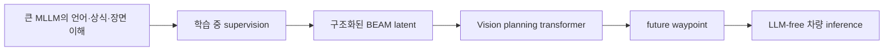
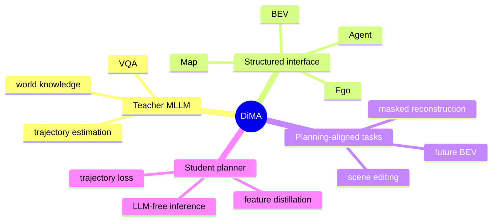
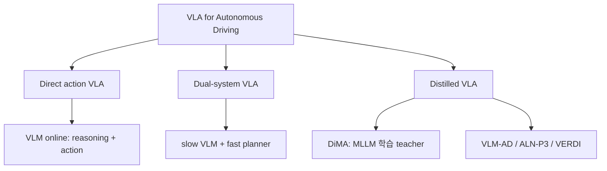
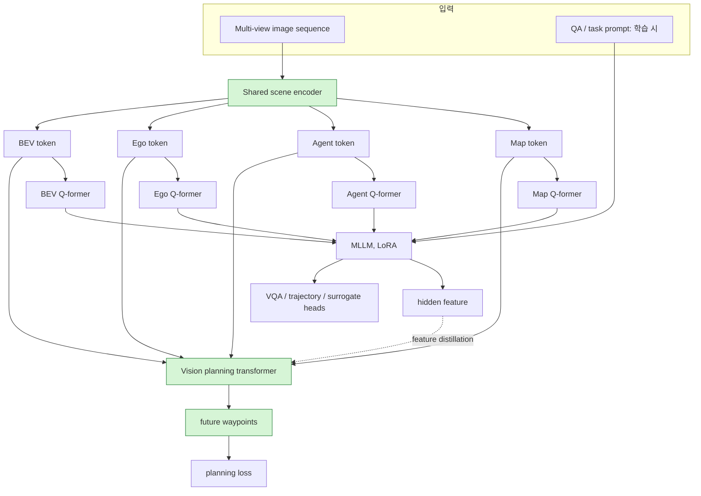
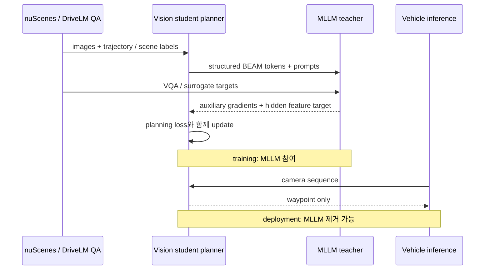
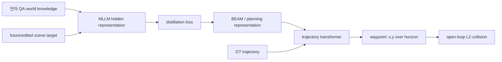
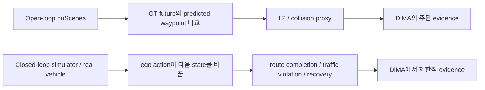
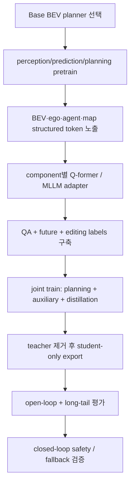

# Week 09. VLM supervision / distillation: DiMA — 큰 MLLM으로 배우고 작은 planner로 운전하기

| 항목 | 내용 |
|---|---|
| 날짜 | 2026-09-15 |
| Week | 09 / 12 |
| 원 논문 | *Distilling Multi-modal Large Language Models for Autonomous Driving* |
| 한국어 제목 | **자율주행을 위한 멀티모달 대규모 언어 모델 증류** |
| URL | https://arxiv.org/abs/2501.09757 |
| 저자 | Deepti Hegde et al. (Johns Hopkins University, Qualcomm AI Research) |
| taxonomy | **VLM supervision / distilled VLA-AD** — training-time MLLM teacher, structured representation transfer, LLM-free inference |
| Reading mode | **Deep read: DiMA** / skim: VLM-AD, VLP, ALN-P3, VERDI |
| 원문 접근 범위 | arXiv abstract 및 HTML 본문을 검토했다. PDF 전체를 줄 단위 번역하지 않고, 논문의 구조·표·실험을 한국어 학습 노트로 재구성했다. |

---

## 1. 이번 주 한 문장 결론

**DiMA는 VLM/MLLM을 배포 시점의 직접 운전자로 쓰지 않고, 학습 때 BEV·ego·agent·map 표현을 언어·미래예측·scene editing 과제로 가르치는 teacher로 사용한다. 따라서 inference에서는 빠른 vision planner만으로 waypoint를 생성하면서도 long-tail planning 성능을 끌어올리는 distilled VLA 전략이다.**

> 핵심 질문: “VLM의 world knowledge는 얻되, 차량 안에서 매 프레임 거대한 autoregressive LLM을 돌리지 않으려면?”
> DiMA의 답: **teacher는 학습에 남기고, action은 student planner가 낸다.**

---

## 2. 논문 제목·Abstract 한국어 번역

### 제목 번역

- 원제: *Distilling Multi-modal Large Language Models for Autonomous Driving*
- 번역: **자율주행을 위한 멀티모달 대규모 언어 모델 증류**
- DiMA: **Di**stilling **M**ulti-modal Large Language Models for **A**utonomous driving

### Abstract 한국어 번역

자율주행은 특히 중요한 **long-tail 시나리오**에서 안전한 motion planning을 요구한다. 최근 end-to-end 자율주행 시스템은 드문 상황에 대한 일반화를 높이기 위해 Large Language Model(LLM)을 planner로 활용한다. 그러나 test time에 LLM을 사용하는 방식은 계산 비용이 매우 높다. 이를 해결하기 위해 논문은 LLM-free vision-based planner의 효율성을 유지하면서도 LLM의 world knowledge를 이용하는 end-to-end 자율주행 시스템 **DiMA**를 제안한다.

DiMA는 특별히 설계한 surrogate task를 통해 multi-modal LLM의 지식을 vision-based end-to-end planner에 증류한다. joint training에서 양쪽 네트워크가 공유하는 scene encoder는 의미적으로 grounding되어 있으면서 최종 planning objective와 정렬된 structured representation을 만든다. MLLM은 inference에서 선택 사항이므로, 효율성을 희생하지 않고 robust planning을 목표로 한다.

논문은 DiMA가 vision-based planner 대비 **L2 trajectory error를 37%, collision rate를 80%** 낮추고, long-tail 시나리오에서는 trajectory error를 **44%** 낮췄다고 보고한다. nuScenes planning benchmark에서 강한 결과를 제시하지만, 그 핵심 평가는 open-loop이다.

### Abstract를 VLA 관점으로 다시 읽기



DiMA에서 language는 “좌회전하라”는 문장을 곧바로 control로 바꾸는 channel이 아니다. **언어적으로 설명 가능한 driving scene latent를 waypoint loss와 함께 학습시키는 supervision channel**이다. 이것이 direct VLA와 가장 큰 차이다.

---

## 3. 핵심 기여 3~5개

| # | 기여 | VLA-AD에서의 의미 |
|---:|---|---|
| 1 | **MLLM-to-planner distillation**을 제안 | online LLM의 latency·memory 비용 없이 LLM world knowledge를 planner에 전달한다. |
| 2 | **BEAM token**(BEV, Ego, Agent, Map)을 MLLM 입력으로 사용 | raw image patch보다 driving-relevant한 구조를 MLLM과 planner가 공유한다. |
| 3 | masked reconstruction, future BEV prediction, scene editing의 **surrogate task**를 설계 | captioning이 아니라 spatial completion·anticipation·agent causality를 학습시켜 planning과 가깝게 만든다. |
| 4 | MLLM hidden feature와 planning transformer feature의 **distillation alignment** | text answer 복사가 아니라 latent representation transfer를 수행한다. |
| 5 | full/targeted/long-tail split 및 latency를 함께 보고 | 작은 VAD-Tiny에도 성능을 이식할 수 있다는 deployment 가능성을 보인다. |



---

## 4. VLA for AD taxonomy 위치

| 분석 축 | DiMA의 위치 | 판정 근거 |
|---|---|---|
| 시스템 형태 | **Distilled VLA / VLM-supervised E2E planner** | MLLM과 planner를 joint training하지만 기본 deploy graph에서는 MLLM을 뺀다. |
| 입력 | multi-view camera sequence, ego/map/agent information, 학습 시 text prompt | scene encoder가 만든 structured token을 MLLM adapter에 넘긴다. |
| 출력 | future waypoint/trajectory; 보조적으로 VQA·surrogate output | 최종 action은 planner의 trajectory head가 생성한다. |
| language 역할 | **teacher signal, semantic grounding, representation transfer** | natural-language response는 inference action interface가 아니라 auxiliary target이다. |
| action grounding | BEAM token → planning transformer → waypoint | language-grounded latent가 planning loss에 의해 실제 좌표로 연결된다. |
| 시간 구조 | heavy teacher는 training-time, compact student는 test-time | 큰 VLM의 autoregressive latency를 control loop에서 제거한다. |
| 안전/long-tail | rare maneuver representation을 강화하려는 접근 | collision proxy 개선을 보고하지만 interactive safety 증명은 별개다. |
| 평가 | nuScenes open-loop L2/collision, targeted·long-tail split, latency | closed-loop simulator 및 실차 evidence는 중심 결과가 아니다. |

### Direct VLA vs Distilled VLA 비교표

| 관점 | Direct VLA / online LLM planner | Distilled VLA / DiMA |
|---|---|---|
| VLM의 위치 | inference의 reasoning·action actor | 학습 중 teacher / optional branch |
| 행동 생성 | text/action token 또는 waypoint를 VLM이 직접 생성 | vision planner가 waypoint를 직접 생성 |
| language → action | 비교적 직접적 | latent representation을 경유하는 간접 grounding |
| 장점 | interactive reasoning, explanation, 새 지식의 즉시 활용 | low latency, lower memory, 기존 AD safety stack과 결합 용이 |
| 주된 위험 | hallucination·prompt variance·decode 지연이 action에 전파 | teacher 오류가 latent에 증류될 수 있고 reasoning trace가 숨겨질 수 있음 |
| 배포 현실성 | 고성능 onboard compute와 저주기 설계가 필요 | planner-only inference라 현실적이지만 별도 closed-loop 검증 필요 |
| 대표 흐름 | LMDrive, online DriveVLM 계열 | DiMA, VLM-AD, ALN-P3, VERDI |



---

## 5. Architecture / pipeline 시각화

### 5.1 전체 pipeline



### 5.2 BEAM은 무엇을 전달하는가?

| 토큰 | 물리적/의미적 내용 | planner에서 필요한 이유 | teacher가 가르치는 것 |
|---|---|---|---|
| **B: BEV** | road layout, drivable space, 주변 공간 배치 | route와 free space를 좌표계에서 연결 | mask된 공간 복원, 미래 장면 변화 |
| **E: Ego** | ego pose, motion/state, intent query | 현재 상태에서 실행 가능한 trajectory를 고른다 | ego 행동/미래 계획 QA |
| **A: Agent** | 차량·보행자 등 동적 actor | 상호작용, 양보, collision risk | agent 추가/삭제의 causal effect |
| **M: Map** | lane topology, route constraint | 차선·교차로·회전 제약을 반영 | map-aware scene reasoning |

### 5.3 학습과 배포를 분리하는 이유



---

## 6. Input → Reasoning → Action Grounding 분석

| 단계 | Input | reasoning / representation | Output | action grounding 점검 |
|---|---|---|---|---|
| Perception | multi-view images | visual feature, scene encoding | multi-scale feature | 아직 text나 trajectory에 직접 묶이지 않음 |
| Structured scene | vision feature + learnable queries | BEV/Ego/Agent/Map token | **BEAM latent** | object·map·ego를 planning 가능한 단위로 분해 |
| Student planning | BEAM token | agent-map-ego interaction | waypoint sequence | **직접 grounding**: trajectory loss와 연결 |
| Teacher reasoning | BEAM + question/task prompt | VQA, behavior/trajectory estimation | text answer, auxiliary prediction | language는 teacher supervision이며 action actor가 아님 |
| Representation transfer | teacher hidden feature + planner feature | feature distribution alignment | 업데이트된 planner latent | **간접 grounding**: language-aware feature가 waypoint head로 전달 |

### grounding chain



**판정:** DiMA의 action grounding은 강하지만 **언어에서 action으로의 경로는 indirect**다. 즉 “언어가 말한 좌회전”을 제어하는 것이 아니라, turning·overtake·stop 상황을 더 잘 encode한 student latent가 waypoint를 내도록 한다. 이 설계는 latency와 deterministic interface에는 유리하지만, inference 시 어떤 language reasoning이 작동했는지는 덜 투명하다.

---

## 7. Training recipe

### 7.1 두 단계 recipe

| 단계 | 구성 | 목적 |
|---|---|---|
| Stage 1 | VAD/UniAD 계열 vision planner를 perception·prediction·planning으로 pretrain (논문 보고: 60 epochs) | scene encoder와 BEAM token에 기본적인 driving structure를 만든다. |
| Stage 2 | shared encoder, planning transformer, MLLM을 joint training (논문 보고: 30 epochs); LLaVA-v1.5-7B language backbone은 LoRA fine-tuning | teacher knowledge를 planner-friendly latent에 주입한다. |
| Inference | scene encoder + planning transformer만 유지 | MLLM decoding 비용 없이 waypoint를 생성한다. |

### 7.2 목적 함수의 역할 분해

```text
L_total = L_planning + L_LLM + L_reconstruction + L_future + L_distillation
```

| Loss | 감독 신호 | 막으려는 failure |
|---|---|---|
| `L_planning` | GT future waypoint/trajectory | language task만 잘하고 실제 motion이 나빠지는 현상 |
| `L_LLM` | VQA와 MLLM trajectory 관련 target | scene 의미를 language로 설명하지 못하는 latent |
| `L_reconstruction` | masked BEV token | 부분 관측/occlusion에서 공간 문맥 손실 |
| `L_future` | future BEV token | 정적 장면만 맞고 동적 변화 예측을 못하는 현상 |
| `L_distillation` | MLLM penultimate feature ↔ planner feature | teacher의 semantic signal이 planner에 전달되지 않는 현상 |

### 7.3 surrogate task와 planning의 연결

| 과제 | 조작 | representation transfer의 의도 | 안전 관련 가설 |
|---|---|---|---|
| Masked token reconstruction | 일부 BEV token을 가리고 복원 | 공간적 context completion | 가림 뒤 agent/도로 구조를 놓칠 위험 완화 |
| Future BEV prediction | 현재 latent에서 미래 BEV 예측 | short-horizon world-model-like anticipation | 끼어들기·재출발·교차로 변화 대응 |
| Scene editing | agent를 추가/삭제한 장면을 질의 | 특정 actor가 ego plan에 미치는 causal effect | interaction-aware planning, collision 감소 |

### 7.4 논문 섹션별 읽기 지도

| 논문 전개 | 한국어 요약 | 읽을 때 확인할 질문 |
|---|---|---|
| Introduction | online LLM planner의 long-tail 장점과 deployment 비용 충돌을 문제로 둔다 | 큰 모델을 없애면 무엇이 student에 남는가? |
| Method: architecture | scene encoder의 BEAM token을 Q-former로 MLLM에 연결하고 planner와 공유한다 | raw pixels가 아니라 BEAM을 택한 이유는? |
| Method: surrogate tasks | reconstruction·future·editing으로 teacher task를 planning 가까이 둔다 | caption/VQA만으로는 왜 부족한가? |
| Method: distillation | MLLM hidden feature를 planner transformer에 align한다 | output-logit imitation보다 어떤 transfer가 일어나는가? |
| Experiments | nuScenes standard/targeted/long-tail과 latency를 비교한다 | open-loop improvement가 closed-loop safety를 보장하는가? |
| Ablation/qualitative | token 종류와 task가 성능에 미치는 효과를 보인다 | 어떤 block이 실제 gain을 담당하는가? |

---

## 8. Dataset / Benchmark / Metric 분석

### 8.1 데이터와 annotation

| 데이터/분할 | 역할 | DiMA에서의 사용 | 주의점 |
|---|---|---|---|
| **nuScenes** | main planning benchmark | multi-view scene, ego trajectory, box/map/CAN-bus 계열 정보를 planning에 사용 | recorded-data 기반 open-loop라 ego action이 다른 actor를 바꾸지 않는다. |
| **DriveLM** | driving VQA | perception, prediction, planning, ego behavior QA supervision | VQA의 정답 품질이 policy safety를 직접 보장하지 않는다. |
| Generated QA | DriveLM이 없는 sample 보강 | numerical annotation과 LLM/rule 기반 QA 생성 | synthetic teacher label의 오류·편향이 증류될 수 있다. |
| Targeted split | difficult turn/navigation 검사 | 일반 평균에서 숨는 challenging case 확인 | split 정의와 표본 규모에 민감하다. |
| Long-tail split | 3-point turn, resume from stop, overtake | rare maneuver transfer 확인 | 실제 long-tail의 범위를 모두 대표하지 않는다. |

### 8.2 결과를 읽는 matrix

| 평가 축 | 대표 metric | 논문이 보여주는 것 | 말하지 못하는 것 |
|---|---|---|---|
| Trajectory imitation | L2 trajectory error ↓ | GT route 근처 waypoint를 예측하는 정확도 | GT가 유일하게 안전한 정책인지는 알 수 없다. |
| Safety proxy | collision rate ↓ | recorded actors와의 충돌 가능성 | ego의 새 행동에 대한 타 actor 반응은 없다. |
| Efficiency | latency / FPS | MLLM-free student의 배포 적합성 | full vehicle stack의 sensor·actuator latency는 포함하지 않는다. |
| Long-tail | scenario별 error/collision | 희귀 maneuver에 대한 representation gain | scenario coverage·weather·geography shift는 제한적이다. |
| Language | VQA/qualitative answer | MLLM branch가 scene semantics를 배웠는지 | rationale faithfulness와 action causality는 별도다. |

### 8.3 핵심 수치: 무엇을 의미하는가

논문 abstract는 baseline 대비 L2 error **37%**, collision rate **80%**, long-tail trajectory error **44%** 감소를 보고한다. 논문 표에서 standardized nuScenes full validation의 DiMA (VAD-Base)는 L2 average **0.57 m**, collision average **0.07**로 제시되며, targeted split의 DiMA+ (VAD-Base)는 각각 **0.79 m**, **0.06**을 보고한다. 별도 VAD evaluation 표에서는 DiMA (VAD-Tiny)가 **59.5 ms / 16.8 FPS**를 유지하며 L2 **0.38**, collision **0.15**를, DiMA+ (VAD-Base)는 **226 ms / 4.5 FPS**에서 L2 **0.27**, collision **0.08**을 제시한다.

> 수치 해석 주의: 표의 protocol/평가 split이 서로 다를 수 있으므로, 서로 다른 표의 절대 수치를 단일 ranking처럼 합쳐 비교하면 안 된다. 핵심 주장은 같은 protocol 내 baseline 대비 개선과 teacher 제거 후 latency 유지다.

### 8.4 Open-loop와 closed-loop의 경계



| 질문 | DiMA 논문의 근거 수준 | 결론 |
|---|---|---|
| teacher가 waypoint imitation을 개선하는가? | 강함 | **예**, nuScenes open-loop 표가 직접 근거다. |
| teacher가 long-tail representation을 돕는가? | 중간 | targeted/long-tail split이 긍정적 신호지만 coverage는 좁다. |
| 실제 closed-loop에서 collision을 줄이는가? | 약함 | open-loop collision proxy만으로는 확정할 수 없다. |
| 차량에 올릴 수 있는 latency인가? | 구조적으로 강함, 시스템 evidence는 제한 | MLLM-free inference는 유리하나 end-to-end vehicle stack 검증이 필요하다. |

---

## 9. 관련 논문 비교표

| Paper | teacher/언어 사용 시점 | transfer 또는 interface | action output | 평가 초점 | DiMA와의 관계 |
|---|---|---|---|---|---|
| **DiMA** | training-time MLLM, inference optional | BEAM token + Q-former + hidden feature distillation | vision planner waypoint | nuScenes open-loop, long-tail, latency | structured representation distillation의 기준점 |
| **VLM-AD** | VLM teacher는 학습에 사용, deployment에서는 제거 | unstructured reasoning과 structured action label supervision | E2E driving action/trajectory | nuScenes 및 closed-loop 결과를 보고 | reasoning/action label teacher를 더 직접적으로 강조 |
| **VLP** | vision-language planning 학습 | contextual/language understanding을 planning에 연결 | planning output | nuScenes L2/collision, generalization | DiMA 이전의 language-planning 연결 흐름 |
| **ALN-P3** | training-time language alignment | perception–prediction–planning 단계별 co-distillation | stack planning output | nuScenes, Nu-X, TOD3Cap, QA | BEAM 단일 공유 표현보다 stack 전반 alignment를 강조 |
| **VERDI** | VLM reasoning text를 offline supervision으로 사용 | modular E2E stack의 intermediate latent alignment | planner output | open-loop + HugSim closed-loop | DiMA의 open-loop 한계를 보완하는 비교 축 |
| **DriveVLM-Dual** | inference-time slow VLM + fast planner | VLM guidance와 3D planner refinement | fast planner trajectory | 실차/dual deployment 포함 | DiMA와 달리 MLLM을 online branch에 남긴다. |

### 선택 기준: 언제 어느 구조인가?

| 운영 조건 | 더 맞는 선택 | 이유 |
|---|---|---|
| low-latency fixed compute, 기존 safety stack 재사용 | **DiMA식 distilled VLA** | 큰 teacher를 learning phase로 옮길 수 있다. |
| interactive explanation/새 상황 질의가 online으로 필요 | Direct 또는 dual VLA | online language interface의 가치가 있다. |
| high-level reasoning은 필요하지만 low-level control은 검증된 planner가 담당 | Dual-system | branch 책임을 시간척도별로 분리한다. |
| perception부터 planning까지 모든 모듈에 language semantics를 주입 | ALN-P3/VERDI류 | multi-stage alignment를 명시적으로 다룬다. |

---

## 10. 강점과 한계

### 강점

1. **배포와 학습의 compute를 분리한다.** 높은 teacher 비용을 fleet inference가 아닌 offline training으로 이동한다.
2. **driving-specific interface를 둔다.** BEAM token은 language model에게 scene을 구조화해 주고, planner에는 기존 geometric bias를 유지시킨다.
3. **planning-aligned auxiliary task를 쓴다.** future/edited scene task는 단순 이미지 caption보다 action grounding에 가깝다.
4. **작은 student에도 이식 가능성을 보인다.** VAD-Tiny의 latency를 유지한 보고는 distillation의 실용적 가치다.
5. **online hallucination을 직접 control path에서 줄인다.** 기본 inference graph에서 MLLM text decoding을 제거한다.

### 한계와 비판

| 한계 | 왜 중요한가 | 필요한 보완 |
|---|---|---|
| open-loop 중심 결과 | policy가 environment를 바꿀 때의 compounding error를 보지 못한다 | CARLA/HugSim/NAVSIM류 closed-loop, route completion, intervention 측정 |
| teacher/Generated QA 품질 의존 | 틀린 VQA rationale도 student latent에 들어갈 수 있다 | uncertainty weighting, teacher ensemble, label audit, abstention |
| indirect language grounding | student가 왜 특정 action을 냈는지 language trace가 남지 않을 수 있다 | distilled-feature probing, causal intervention, explanation-faithfulness test |
| nuScenes·한정된 long-tail split | weather, geography, rare interaction의 coverage가 부족하다 | cross-domain benchmark 및 scenario mining 확대 |
| training 비용 | inference가 싸도 LLaVA-7B joint training과 QA 생성은 비싸다 | compact teacher, progressive distillation, data-efficient curriculum |
| safety envelope 미제시 | trajectory metric 개선은 traffic rule·comfort·fallback을 보장하지 않는다 | rule checker, uncertainty gate, RSS/occupancy safety layer와 통합 |

### Safety / long-tail risk matrix

| 위험 | DiMA가 줄이는 부분 | 남는 위험 |
|---|---|---|
| Rare maneuver | future BEV·editing·language world knowledge로 representation 강화 | 예시에 없는 rare event, OOD 센서 조건 |
| Collision | open-loop collision proxy 개선 | interactional closed-loop collision, stale perception |
| Hallucination | online text output을 action path에서 제거 | offline teacher hallucination의 silent transfer |
| Latency | student-only inference | full stack latency, sensor dropout, resource contention |
| Interpretability | training VQA branch | actual student action에 대한 faithful explanation 부족 |

---

## 11. 실전 학습 포인트

### 11.1 설계 원칙

| 원칙 | DiMA에서 얻는 교훈 | 구현 체크 |
|---|---|---|
| Teacher at training, student at inference | VLM의 capability와 onboard latency를 분리한다 | production graph에서 teacher dependency가 정말 제거되는가? |
| Structured before language | raw pixels를 바로 LLM에 주기보다 BEV/object/map/route token을 정리한다 | token이 metric geometry와 semantic identity를 모두 보존하는가? |
| Auxiliary task는 action 가까이 | future·interaction·counterfactual task가 caption보다 낫다 | 모든 auxiliary loss가 planning metric을 실제 개선하는가? |
| Teacher를 신뢰하지 말고 측정 | synthetic rationale는 supervision noise다 | confidence, disagreement, provenance를 loss에 반영하는가? |
| Open-loop 이후를 의무화 | 낮은 L2가 safe driving과 동의어가 아니다 | closed-loop, rule violation, recovery, latency budget을 함께 평가하는가? |

### 11.2 최소 구현 recipe



### 11.3 실무자가 피해야 할 오해

- **“distillation이면 teacher text를 imitation하면 된다”**: DiMA의 핵심은 text logit 복사가 아니라 shared structured latent와 planning-aligned task다.
- **“LLM-free면 안전하다”**: online hallucination은 줄지만 student의 perception/planning failure와 offline teacher noise는 남는다.
- **“collision rate가 낮으니 배포 가능하다”**: recorded trajectory 기반 collision은 closed-loop rule compliance나 emergency recovery를 다루지 못한다.
- **“VLM knowledge는 공짜다”**: model training, QA generation, quality filtering, update versioning 비용이 production risk의 일부다.

### 11.4 면접/리뷰용 핵심 답

> **DiMA는 VLA인가?**
> 넓게 보면 VLM-supervised VLA이지만, online direct VLA라기보다 **distilled VLA**다. language가 action을 직접 decode하지 않고 structured representation을 통해 student planner에 간접적으로 ground된다.

> **가장 강한 장점은?**
> teacher의 long-tail/semantic supervision을 사용하면서 inference graph를 vision planner 수준으로 유지하는 deployment realism이다.

> **가장 큰 증거 공백은?**
> teacher-distilled gain이 reactive closed-loop interaction과 실제 차량 safety로 전이되는지의 독립적 검증이다.

---

## 12. 다음 주 질문

다음 Week 10은 **Dataset & Benchmark 집중**, deep read는 **DriveBench**다. DiMA를 읽고 다음 질문을 가져간다.

1. open-loop L2/collision 개선과 closed-loop route completion·driving score 사이의 상관은 실제로 얼마나 강한가?
2. VLA benchmark는 perception/VQA 정답, action grounding, safety rule, latency를 어떤 공통 protocol로 묶어야 하는가?
3. language annotation이 많은 DriveLM류와 reactive simulator benchmark 사이에 어떤 annotation/behavior gap이 있는가?
4. long-tail split은 수작업 scenario 이름보다 coverage·frequency·severity를 어떻게 함께 측정해야 하는가?
5. distilled VLA의 경우 teacher rationale 품질과 student action 품질의 causal link를 어떤 metric으로 평가할 수 있는가?

| Week 10에서 만들 benchmark matrix | 필요한 지표 |
|---|---|
| imitation quality | ADE/FDE/L2, route-conditioned error |
| safety | collision, off-road, red-light, TTC, intervention |
| closed-loop success | route completion, driving score, recovery |
| language grounding | VQA accuracy, rationale faithfulness, action consistency |
| long-tail | scenario success, severity-weighted failure, OOD shift |
| deployment | latency, FPS, memory, compute/power, fallback behavior |

---

## 13. 참고 링크

### Deep read

- DiMA arXiv abstract: https://arxiv.org/abs/2501.09757
- DiMA arXiv HTML: https://arxiv.org/html/2501.09757
- DiMA PDF: https://arxiv.org/pdf/2501.09757

### Skim / 비교 읽기

- VLM-AD, *End-to-End Autonomous Driving through Vision-Language Model Supervision*: https://arxiv.org/abs/2412.14446
- VLP, *Vision Language Planning for Autonomous Driving*: https://arxiv.org/abs/2401.05577
- ALN-P3, *Unified Language Alignment for Perception, Prediction, and Planning in Autonomous Driving*: https://arxiv.org/abs/2505.15158
- VERDI, *VLM-Embedded Reasoning for Autonomous Driving*: https://arxiv.org/abs/2505.15925
- DriveLM, *Driving with Graph Visual Question Answering*: https://arxiv.org/abs/2312.14150
- VAD, *Vectorized Scene Representation for Efficient Autonomous Driving*: https://arxiv.org/abs/2303.12077
- UniAD, *Planning-Oriented Autonomous Driving*: https://arxiv.org/abs/2212.10156

| 이번 주 요약 카드 | 내용 |
|---|---|
| 핵심 개념 | **VLM을 online driver가 아니라 offline teacher로 사용한다.** |
| 핵심 구조 | scene encoder → BEAM token → MLLM joint training/distillation → planner-only waypoint inference |
| 핵심 evidence | abstract 기준 L2 37%, collision 80%, long-tail trajectory error 44% 감소 보고 |
| 핵심 한계 | open-loop 중심, teacher noise, closed-loop·실차 safety evidence 부족 |
| 한 줄 takeaway | **큰 VLM으로 표현을 배우고, 작은 planner로 안전 case 안에서 운전하라.** |
