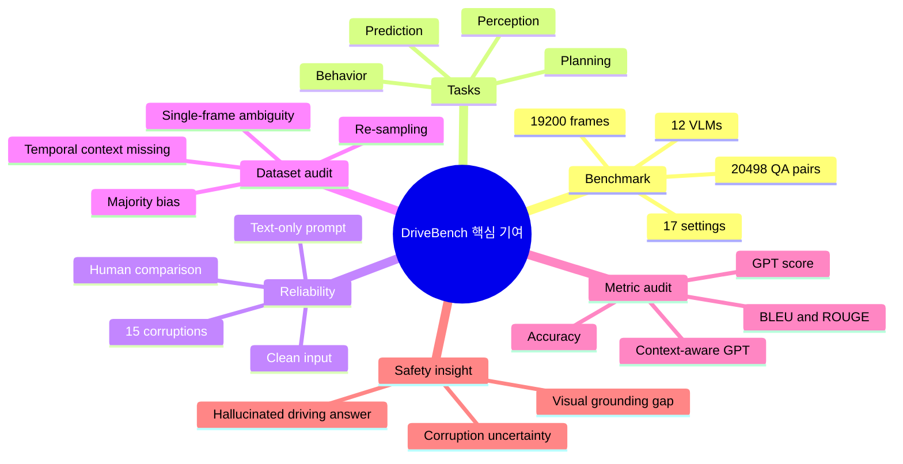
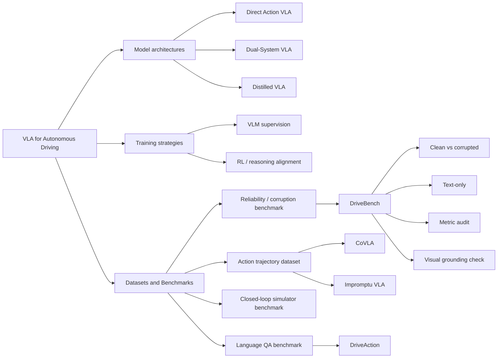
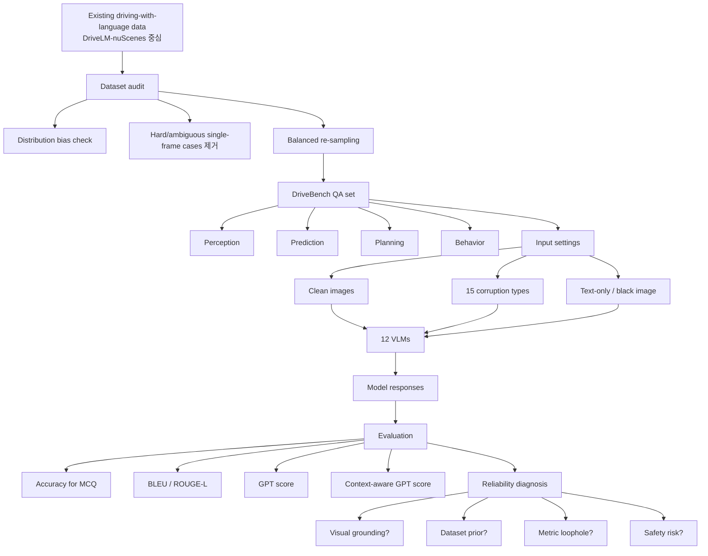
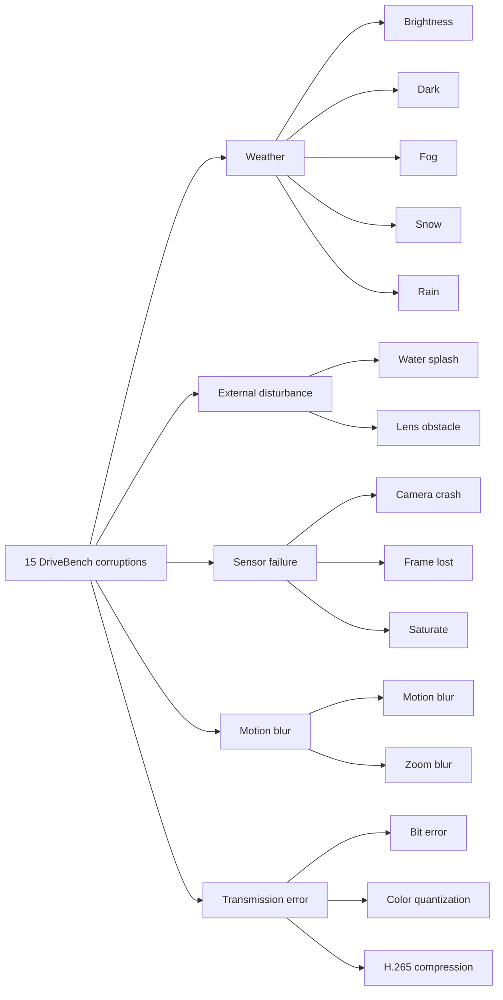
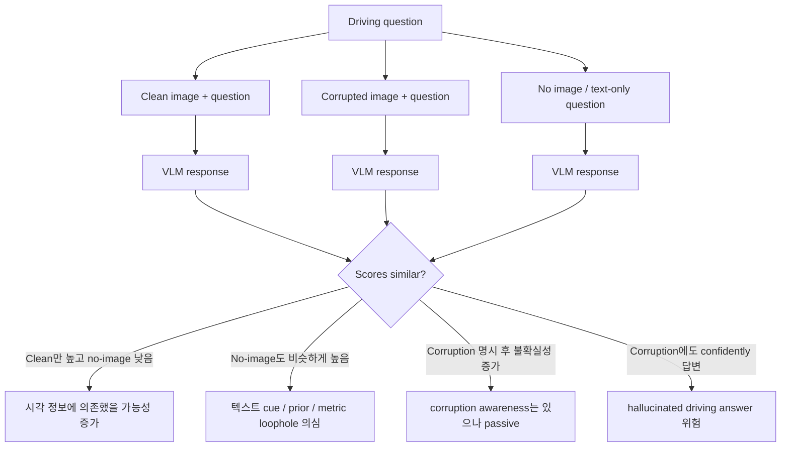
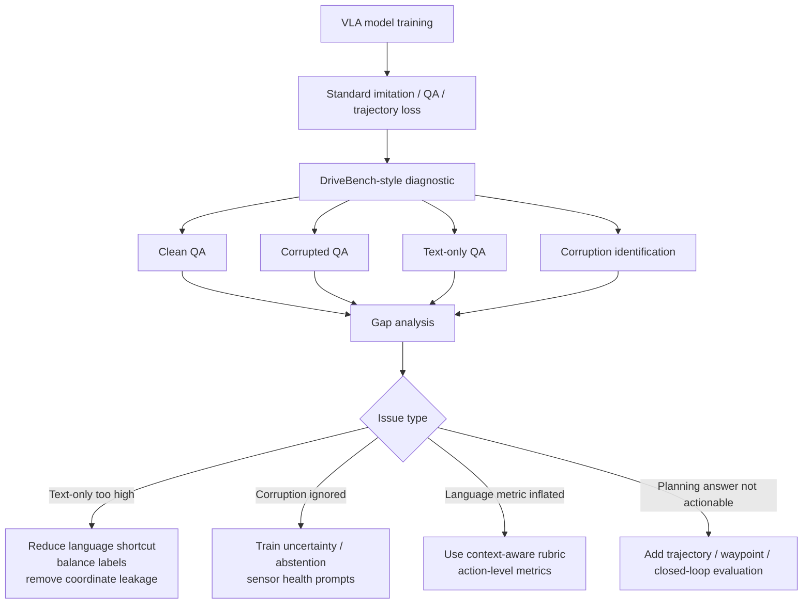
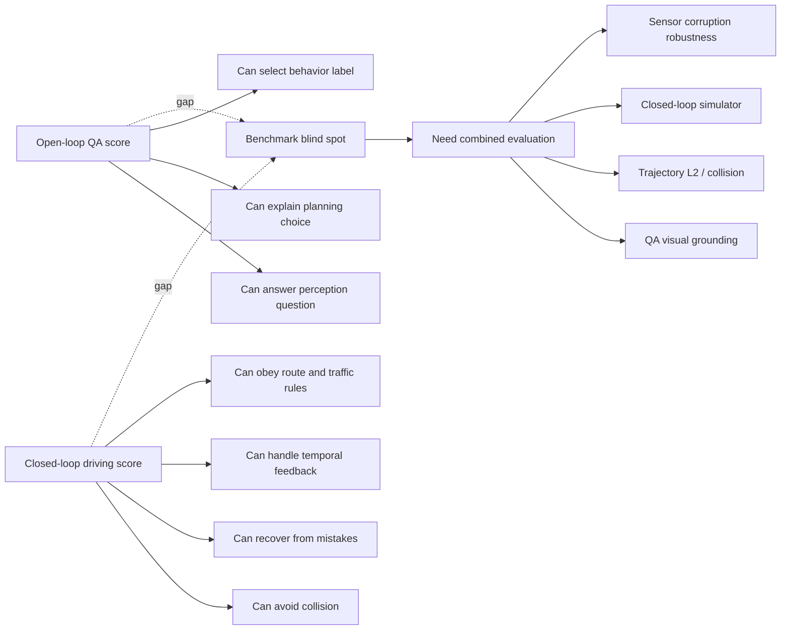
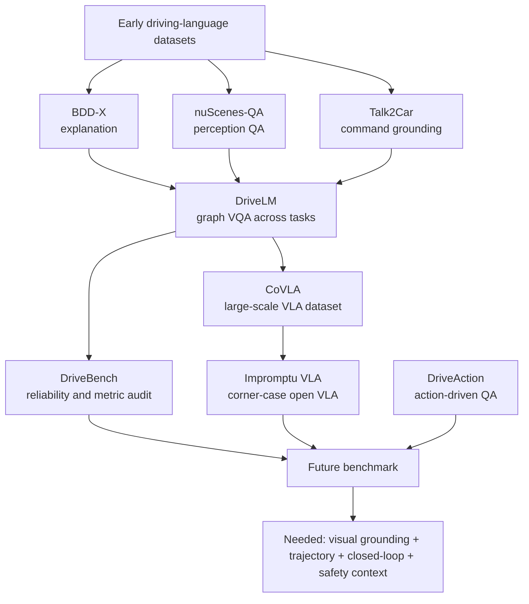
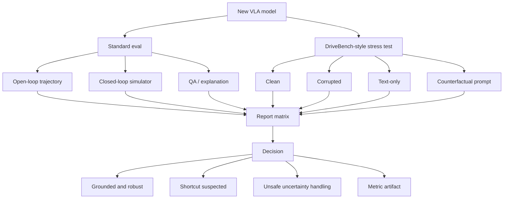
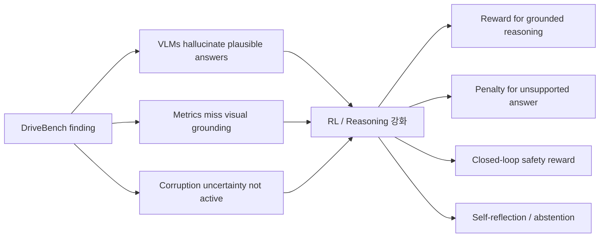

# Week 10. Dataset & Benchmark 집중: DriveBench로 보는 “VLM이 진짜 보고 운전하는가?”

## Metadata

| 항목 | 내용 |
|---|---|
| Date | 2026-06-30 |
| Week | 10 / 12 |
| Original paper/source | *Are VLMs Ready for Autonomous Driving? An Empirical Study from the Reliability, Data, and Metric Perspectives* |
| Korean title | **VLM은 자율주행에 준비되었는가? 신뢰성·데이터·메트릭 관점의 실증 연구** |
| Benchmark name | **DriveBench** |
| URL | https://arxiv.org/abs/2501.04003 |
| Project / dataset | https://drive-bench.github.io / https://huggingface.co/datasets/drive-bench/arena |
| Version read | arXiv v1 metadata + arXiv source TeX 전체 추출 기반. PDF 전체를 줄 단위 번역하지 않고, 논문 본문·표·abstract를 한국어 학습 노트로 재구성했다. |
| Authors | Shaoyuan Xie, Lingdong Kong, Yuhao Dong, Chonghao Sima, Wenwei Zhang, Qi Alfred Chen, Ziwei Liu, Liang Pan |
| Taxonomy | **VLA/Driving VLM benchmark** / reliability benchmark / visual grounding diagnostic / corruption robustness / metric audit |
| Reading mode | Deep read: **DriveBench** / skim: **CoVLA**, **Impromptu VLA**, **DriveAction** |
| 이번 주 focus | dataset modality, annotation type, closed-loop benchmark blind spot |
| Output | **VLA dataset/benchmark matrix** |

> 참고: 이번 주의 핵심은 새 VLA architecture가 아니라 **데이터셋과 벤치마크가 VLA를 어떻게 속일 수 있는가**다. DriveBench는 “VLM이 운전 장면을 이해한다”는 주장을, clean image 성능만이 아니라 **corrupted input**, **text-only prompt**, **metric 설계**, **dataset imbalance** 관점에서 재검사한다.

---

## 1. 이번 주 한 문장 결론

**DriveBench의 가장 중요한 메시지는 현재 Driving VLM/VLA 벤치마크가 “모델이 실제 visual cue를 보고 판단했는지”를 충분히 검증하지 못하며, VLM은 이미지가 망가지거나 아예 없어도 텍스트 단서와 데이터셋 prior만으로 그럴듯한 driving answer를 만들어 기존 metric을 통과할 수 있다는 점이다.**

Week 06~09에서 우리는 LMDrive, AutoVLA, DriveVLM, DiMA처럼 language/reasoning을 action과 연결하려는 방법들을 봤다. Week 10의 DriveBench는 그 흐름에 브레이크를 건다.

> **“VLA가 trajectory나 driving answer를 잘 낸다”는 점수는 정말 action grounding의 증거인가? 아니면 데이터셋 편향과 metric loophole의 결과인가?**

DriveBench가 보여주는 결론은 세 가지다.

1. **Visual grounding이 없는 plausible answer가 많다.**  
   GPT-4o 같은 강한 VLM도 text-only 조건에서 clean image와 비슷한 GPT score를 얻는 경우가 있고, 이는 실제 시각 기반 추론이 아니라 language prior와 question cue에 기대는 현상일 수 있다.
2. **Driving dataset imbalance가 VLM 평가를 왜곡한다.**  
   예를 들어 DriveLM-nuScenes의 behavior question은 `Going Straight/Going Ahead` 류 majority answer가 매우 커서, visual cue를 보지 않아도 높은 accuracy가 가능하다.
3. **Metric은 context-aware해야 한다.**  
   BLEU/ROUGE 같은 language metric은 답변 형식과 surface overlap에 민감하고, GPT score도 rubric/question/context를 충분히 주지 않으면 safety-critical 차이를 구분하지 못한다.

---

## 2. 논문 제목·Abstract 한국어 번역

### 2.1 제목 번역

- **원제**: *Are VLMs Ready for Autonomous Driving? An Empirical Study from the Reliability, Data, and Metric Perspectives*
- **번역**: **VLM은 자율주행에 준비되었는가? 신뢰성·데이터·메트릭 관점의 실증 연구**
- **벤치마크명**: **DriveBench**

### 2.2 Abstract 한국어 번역

최근 Vision-Language Model(VLM)의 발전은 자율주행, 특히 자연어를 통해 해석 가능한 운전 결정을 생성하는 활용에 대한 관심을 불러일으켰다. 그러나 VLM이 본질적으로 시각적으로 grounding되어 있고, 신뢰 가능하며, 해석 가능한 운전 설명을 제공한다는 가정은 아직 충분히 검증되지 않았다. 이 간극을 해결하기 위해 본 논문은 **DriveBench**를 제안한다. DriveBench는 clean, corrupted, text-only input을 포함한 **17개 설정**에서 VLM의 신뢰성을 평가하도록 설계된 벤치마크 데이터셋이며, **19,200개 frame**, **20,498개 question-answer pair**, **3가지 question type**, **4가지 주요 driving task**, 그리고 **12개의 대중적인 VLM**을 포함한다.

연구 결과, VLM은 특히 시각 입력이 저하되거나 사라진 상황에서 실제 visual grounding보다는 일반 지식이나 텍스트 단서에서 나온 그럴듯한 응답을 자주 생성하는 것으로 나타났다. 이러한 행동은 데이터셋 불균형과 불충분한 evaluation metric에 의해 가려질 수 있으며, 자율주행과 같은 safety-critical scenario에서 큰 위험을 초래한다. 또한 VLM은 multi-modal reasoning에 어려움을 겪고, input corruption에 민감하게 반응하여 성능 일관성이 낮아지는 모습을 보인다.

이 문제를 해결하기 위해 저자들은 robust visual grounding과 multi-modal understanding을 우선시하는 개선된 evaluation metric을 제안한다. 추가로, VLM이 corruption을 어느 정도 인식한다는 점을 신뢰성 향상에 활용할 가능성을 강조하며, 실제 자율주행 환경에서 더 신뢰 가능하고 해석 가능한 decision-making system을 개발하기 위한 roadmap을 제시한다. 벤치마크 toolkit은 공개되어 있다.

### 2.3 Abstract를 VLA 관점으로 다시 쓰기

**DriveBench는 VLA/VLM이 “언어로 그럴듯하게 설명하는 능력”과 “센서 입력에 grounded된 driving decision 능력”을 분리해 측정하려는 benchmark다. 핵심 diagnostic은 clean image 성능보다 corrupted/text-only 조건에서의 성능 유지 여부이며, 성능이 유지된다면 robustness가 아니라 hallucination, majority prior, metric loophole일 수 있음을 보여준다.**

### 2.4 제목만 보고 오해하면 안 되는 점

| 오해 | DriveBench의 실제 메시지 |
|---|---|
| “corruption에서도 점수가 유지되면 robust하다” | 인간은 corrupted input에서 성능이 크게 떨어지는데 VLM 점수는 유지되는 경우가 있다. 이는 visual grounding 부재일 수 있다. |
| “GPT score면 language answer 평가는 충분하다” | rubric, question, physical driving context를 넣지 않으면 GPT score도 homogeneous해지고 safety-critical 차이를 놓친다. |
| “DriveBench는 closed-loop driving benchmark다” | 주로 VLM의 QA/설명/시각 grounding 신뢰성을 평가하는 benchmark다. 직접 closed-loop control 성능은 별도 검증이 필요하다. |
| “VLM이 corruption을 모른다” | 일부 모델은 직접 물으면 corruption을 인식한다. 문제는 **스스로 uncertainty를 반영하지 않고 일반 지식으로 답한다**는 점이다. |
| “dataset을 키우면 해결된다” | scale뿐 아니라 modality, annotation balance, temporal context, negative sample 설계, metric context가 함께 필요하다. |

---

## 3. 핵심 기여 3~5개

| # | 핵심 기여 | 왜 중요한가 |
|---:|---|---|
| 1 | **DriveBench benchmark 제안**: 17 settings, 19,200 frames, 20,498 QA pairs, 12 VLMs | VLM/VLA의 driving reliability를 clean/corrupted/text-only 조건에서 체계적으로 비교한다. |
| 2 | **visual grounding reliability diagnostic** | 이미지가 없거나 망가져도 답변 점수가 유지되는지를 통해 “진짜 봤는가?”를 검사한다. |
| 3 | **dataset imbalance 분석** | `Going Ahead` 같은 majority answer가 high accuracy를 만드는 현상을 지적하고 re-sampling으로 완화한다. |
| 4 | **metric audit**: accuracy, BLEU/ROUGE, GPT score, context-aware GPT | language metric과 GPT-based evaluation이 driving safety 맥락 없이 얼마나 취약한지 보여준다. |
| 5 | **corruption awareness 실험** | VLM이 corruption을 직접 인지할 수는 있지만, prompt하지 않으면 답변에 uncertainty를 반영하지 않는다는 한계를 드러낸다. |

### Contribution map

---

## 4. VLA for AD taxonomy 위치

### 4.1 Taxonomy 좌표

| 분석 축 | DriveBench 위치 | 해석 |
|---|---|---|
| System type | **Benchmark / reliability probe** | VLA model 자체가 아니라 VLM/VLA의 driving visual grounding을 평가하는 도구다. |
| Input modality | single/multi-camera driving image, corrupted image, black/no-image, natural-language question | image modality를 의도적으로 제거·손상해 모델이 visual evidence에 의존하는지 본다. |
| Output | MCQ answer, open-ended answer, visual grounding answer, explanation | 직접 waypoint/trajectory를 생성하는 benchmark는 아니지만 planning/behavior question을 포함한다. |
| Language role | question prompt + explanation output + metric target | language가 모델 성능을 드러내는 동시에, 모델이 language prior로 cheating할 수 있는 통로가 된다. |
| Action grounding | high-level planning/behavior label에 간접 grounding | low-level control이 아니라 action-related QA/behavior decision의 grounding을 측정한다. |
| Training recipe | DriveBench 자체는 평가 benchmark; DriveLM/Dolphins 등 fine-tuned models도 평가 | 모델 학습법보다 dataset selection, corruption generation, evaluation protocol이 중심이다. |
| Datasets/benchmarks | DriveLM-nuScenes 기반 re-sampling + corruption suite + text-only setting | 기존 driving-with-language benchmark를 reliability 관점으로 재구성한다. |
| Open-loop vs closed-loop | **open-loop QA benchmark** | closed-loop driving success/collision rate가 아니라 QA 신뢰성·visual grounding을 본다. |
| Safety/long-tail risk | hallucinated explanation, corrupted sensor, missing visual evidence, majority-prior answer | safety-critical 환경에서 “모른다/불확실하다”를 말해야 할 때 그럴듯한 답을 내는 위험이 크다. |
| Limitation | closed-loop action validation 부족, single-frame 중심 sample selection, GPT evaluator 의존 | benchmark score와 실제 차량 안전성 사이의 gap은 여전히 남는다. |

### 4.2 Week 01 taxonomy에 연결하기

### 4.3 Benchmark가 던지는 taxonomy 질문

| 질문 | 왜 VLA에서 중요해지는가 |
|---|---|
| 입력 modality가 실제 deployment sensor와 얼마나 맞는가? | camera-only QA 성능이 LiDAR/BEV/trajectory control까지 보장하지 않는다. |
| annotation이 explanation인가, action인가, trajectory인가? | explanation alignment와 action grounding은 다르다. |
| evaluation이 open-loop인가, closed-loop인가? | open-loop answer가 맞아도 closed-loop에서 collision을 피한다는 보장은 없다. |
| corrupted/missing sensor를 테스트하는가? | 실제 차량은 weather, lens obstacle, camera crash, frame lost를 만난다. |
| text-only baseline을 두는가? | language prior만으로 맞히는 benchmark는 VLA 능력을 과대평가한다. |
| metric이 safety context를 보는가? | 같은 문장 답변도 주변 차량/보행자 위치에 따라 안전 의미가 달라진다. |

---

## 5. Architecture / pipeline 시각화

### 5.1 DriveBench 평가 파이프라인

### 5.2 Corruption suite 구조

### 5.3 “진짜 봤는가?” 평가 로직

---

## 6. Input → Reasoning → Action Grounding 분석

### 6.1 입출력 지도

| 단계 | DriveBench에서의 형태 | VLA 관점 해석 |
|---|---|---|
| Visual input | driving scene image, corrupted image, black/no-image | sensor evidence를 제거하거나 손상해 grounding 의존성을 측정한다. |
| Language input | task question, MCQ options, object coordinate/camera cue | 질문 자체가 강한 prior를 제공할 수 있어 text-only baseline이 필수다. |
| Reasoning | VLM의 perception/prediction/planning/behavior explanation | reasoning이 visual evidence에서 나온 것인지, common sense template인지 구분해야 한다. |
| Action grounding | behavior label, planning suggestion, future movement answer | low-level action은 아니지만 action-related semantic decision을 평가한다. |
| Evaluation | accuracy, language metrics, GPT/GPT-context score | metric이 answer correctness와 safety context를 얼마나 분리하는지가 관건이다. |

### 6.2 Task별 분석

| Task | 질문 예시 유형 | 필요한 visual cue | 흔한 failure / loophole | VLA 학습 시 교훈 |
|---|---|---|---|---|
| Perception | 특정 object의 moving status, 주변 환경 인식 | object 위치, orientation, motion cue, visibility | 좌표/카메라 위치 cue만으로 추정, occlusion 오판 | object-level grounding과 uncertainty가 필요하다. |
| Prediction | 주변 agent의 future movement | temporal context, heading, lane geometry | single frame만으로 어려운데 plausible future를 생성 | video/temporal input 없이 prediction QA를 과신하면 안 된다. |
| Planning | ego vehicle이 어떻게 행동해야 하는가 | drivable area, obstacles, traffic participants | “slow down / be cautious” template 답변 | planning answer는 trajectory/cost/safety checker와 연결해야 한다. |
| Behavior | ego steering/speed future label | route, velocity, lane, traffic context | majority label `Going Ahead`로 높은 점수 | class balance와 text-only baseline 없이는 action grounding 판단 불가. |

### 6.3 Language role: 도움인가, shortcut인가?

| Language의 역할 | 긍정적 효과 | DriveBench가 드러낸 위험 |
|---|---|---|
| Question specification | 어떤 object/task를 볼지 명확히 한다. | 질문에 camera/coordinate/action prior가 들어가면 이미지 없이도 추정 가능하다. |
| Explanation | decision transparency를 높일 수 있다. | explanation이 사실 기반이 아니라 plausible hallucination일 수 있다. |
| Metric target | GPT evaluator가 자연어 답변의 nuance를 볼 수 있다. | rubric/context가 부족하면 장황한 답변이 더 높은 점수를 받을 수 있다. |
| Training annotation | VLA가 scene semantics를 배울 수 있다. | annotation imbalance가 모델을 majority action memorization으로 유도한다. |

### 6.4 Action grounding checklist

| 체크 항목 | 좋은 VLA benchmark 조건 | DriveBench의 기여 |
|---|---|---|
| No-image baseline | 이미지 없이 성능이 크게 떨어져야 visual grounding 근거가 있다. | text-only setting을 명시적으로 포함한다. |
| Corruption sensitivity | 인간과 마찬가지로 심각한 corruption에서 uncertainty/성능 저하가 있어야 한다. | 15종 corruption으로 평가한다. |
| Majority-prior control | 단순 majority answer가 높은 accuracy를 만들지 않아야 한다. | DriveLM 분포 편향을 분석하고 re-sampling한다. |
| Context-aware scoring | 안전 결과가 다른 답변을 metric이 구별해야 한다. | GPT score에 rubric/question/context를 넣는 방향을 제안한다. |
| Closed-loop validation | QA answer가 실제 trajectory safety로 이어지는지 봐야 한다. | DriveBench는 이 부분이 약해 후속 benchmark와 결합이 필요하다. |

---

## 7. Training recipe

DriveBench 자체는 학습 recipe를 제안하는 model paper가 아니라, **평가 benchmark construction recipe**를 제안한다. 따라서 여기서는 “DriveBench를 만드는 절차”와 “평가 대상 모델 설정”을 분리해 정리한다.

### 7.1 Benchmark construction recipe

| 단계 | 내용 | 의도 |
|---:|---|---|
| 1 | DriveLM 등 driving-with-language benchmark 검토 | 기존 VLM driving QA의 대표 기반을 선택한다. |
| 2 | distribution bias 분석 | behavior MCQ에서 majority label이 높은 accuracy를 만드는지 확인한다. |
| 3 | challenging/ambiguous case 점검 | single frame으로 풀기 어렵거나 temporal cue가 필수인 sample을 분석한다. |
| 4 | balanced re-sampling | label imbalance로 인한 shortcut을 줄인다. |
| 5 | 4 driving tasks 구성 | perception, prediction, planning, behavior를 포함한다. |
| 6 | 15 corruption type 생성 | weather/external/sensor/motion/transmission failure를 시뮬레이션한다. |
| 7 | text-only/black-image setting 추가 | visual cue가 없는 extreme condition을 만든다. |
| 8 | metric suite 설계 | accuracy, BLEU/ROUGE, GPT score, context-aware GPT를 비교한다. |

### 7.2 평가 대상 모델과 inference setting

논문은 총 **12개 VLM**을 평가한다. open-source VLM, commercial VLM, driving-specific fine-tuned VLM을 함께 포함한다.

| 모델군 | 예시 | 평가 이유 |
|---|---|---|
| Commercial general VLM | GPT-4o | 강한 general-purpose VLM이 driving scene에서 얼마나 grounded되는지 확인한다. |
| Open general VLM | LLaVA-1.5, LLaVA-NeXT, InternVL2, Phi-3/3.5, Oryx, Qwen2-VL | 규모와 architecture가 다른 모델들의 corruption/text-only 반응을 비교한다. |
| Driving-specialized VLM | DriveLM, Dolphins | driving dataset fine-tuning이 실제 visual grounding을 개선하는지 본다. |
| Human | 일부 MCQ task | corruption이 실제로 장면 이해를 어렵게 만드는지 기준선을 제공한다. |

실험 설정은 temperature 0.2, top-p 0.2, max output token 512로 통일된다. DriveLM-Agent는 LLaMA-Adapter-V2 기반 fine-tuned model 설정을 따른다.

### 7.3 DriveBench를 VLA training에 활용할 때의 recipe

---

## 8. Dataset / Benchmark / Metric 분석

### 8.1 DriveBench 규모와 범위

| 항목 | DriveBench |
|---|---:|
| Frames | **19,200** |
| QA pairs | **20,498** |
| Input settings | **17** = clean + 15 corruptions + text-only |
| Driving tasks | perception, prediction, planning, behavior |
| Question types | multiple-choice, open-ended, visual grounding/captioning style |
| Evaluated VLMs | **12** popular VLMs |
| Metrics | accuracy, BLEU, ROUGE-L, GPT score, context-aware GPT score |
| Core diagnostic | visual grounding under corrupted/missing visual evidence |

### 8.2 기존 benchmark와 DriveBench 비교

| Benchmark | Perception | Prediction | Behavior | Planning | Robustness | 규모/특징 | 주요 metric |
|---|---:|---:|---:|---:|---:|---|---|
| BDD-X | ✅ | ❌ | ❌ | ❌ | ❌ | driving explanation 중심 | language metric |
| BDD-OIA | ✅ | ❌ | ✅ | ❌ | ❌ | explanation/action rationale | F1 |
| nuScenes-QA | ✅ | ❌ | ❌ | ❌ | ❌ | 36,114 frames / 83,337 QA | accuracy |
| Talk2Car | ✅ | ❌ | ❌ | ✅ | ❌ | command grounding | accuracy |
| DriveLM | ✅ | ✅ | ✅ | ✅ | ❌ | 4,794 frames / 15,480 QA, graph logic | language + GPT |
| **DriveBench** | ✅ | ✅ | ✅ | ✅ | ✅ | **19,200 frames / 20,498 QA, 17 settings** | **Acc + language + GPT + context GPT** |

### 8.3 Input modality matrix

| Benchmark | Camera image | Video / temporal | Text instruction/QA | Trajectory/action | Corruption | Text-only baseline | Closed-loop |
|---|---:|---:|---:|---:|---:|---:|---:|
| DriveBench | ✅ | 제한적 / single-frame 중심 | ✅ | 간접 behavior/planning QA | ✅ | ✅ | ❌ |
| CoVLA | ✅ real-world driving video | ✅ 80+ hours | ✅ detailed descriptions | ✅ driving trajectories | 명시적 robust corruption 중심은 아님 | ❌ | 제한적/주로 dataset+model eval |
| Impromptu VLA | ✅ video clips | ✅ 80k+ curated clips from 2M+ source clips | ✅ planning-oriented QA | ✅ action trajectories | unstructured corner cases 중심 | 명시적 핵심은 아님 | ✅ NeuroNCAP closed-loop report |
| DriveAction | ✅ real-world driving scenarios | scenario-level | ✅ QA pairs | ✅ high-level discrete action labels | scenario diversity 중심 | ablation식 input removal | ❌ / benchmark 중심 |

### 8.4 Annotation type matrix

| Dataset/Benchmark | Annotation type | Action grounding 수준 | 장점 | 주의점 |
|---|---|---|---|---|
| DriveBench | QA answer, MCQ/open-ended, corruption labels, context-aware evaluation rubric | **간접**: planning/behavior answer | visual grounding diagnostic이 강함 | trajectory/control 직접 검증은 약함 |
| CoVLA | natural language descriptions + driving trajectories | **직접**: trajectory paired with language | V-L-A 세 축을 대규모 real-world video에 연결 | annotation 자동화 품질과 closed-loop 검증 필요 |
| Impromptu VLA | planning-oriented QA + action trajectories for unstructured categories | **직접**: trajectory + closed-loop benchmark 활용 | corner case/unstructured scene에 강한 dataset | taxonomy coverage와 source dataset bias 점검 필요 |
| DriveAction | 16,185 QA pairs, 2,610 scenarios, driver operation 기반 high-level action labels | **중간~직접**: discrete action | human-like driving decision 평가에 적합 | discrete action이 low-level control을 완전히 대체하지는 않음 |

### 8.5 Metric blind spot 분석

| Metric | 무엇을 잘 보는가 | DriveBench가 지적한 blind spot | 개선 방향 |
|---|---|---|---|
| Accuracy | MCQ answer correctness | majority answer가 높으면 visual grounding 없이도 높게 나옴 | balanced labels, text-only baseline, class-wise score |
| BLEU / ROUGE-L | reference와의 surface overlap | driving semantics/object/safety nuance를 잘 못 봄 | semantic/action-aware metric으로 보완 |
| GPT score | explanation quality, coherence | context/rubric 없이 homogeneous score 가능 | rubric + question + physical context 제공 |
| Context-aware GPT | safety-critical context 반영 | evaluator model bias와 비용 문제 | human audit, structured scoring, scenario outcome 연결 |
| Closed-loop metric | 실제 주행 outcome | QA benchmark와 직접 연결 어려움 | simulator/real-to-sim benchmark와 병행 |

### 8.6 Open-loop vs closed-loop 관점

**DriveBench는 open-loop QA benchmark의 취약점을 매우 잘 찌르지만, VLA action grounding을 완전히 검증하려면 closed-loop benchmark와 결합해야 한다.** 예를 들어 text-only에서 planning answer가 그럴듯하더라도, closed-loop에서는 잘못된 object grounding 하나가 collision으로 이어질 수 있다.

### 8.7 주요 실험 수치 요약

| 관찰 | 논문 내 근거/수치 | 해석 |
|---|---|---|
| Human은 corruption에서 성능 하락 | perception GPT/accuracy 계열에서 human clean 47.67 → corrupted 38.32, behavior 69.51 → 54.09로 하락 보고 | corruption이 실제로 driving scene 이해를 어렵게 만든다는 기준선이다. |
| GPT-4o는 text-only에서도 높은 GPT score 유지 | GPT-4o planning clean 75.75 vs text-only 73.21, behavior clean 45.40 vs text-only 50.03 | high score가 visual grounding 증거가 아닐 수 있다. |
| No-image MCQ에서도 일부 모델 성능 유지/상승 | perception GPT-4o accuracy clean 59.0 → no-image 59.5, behavior Qwen2-VL-72B clean 23.0 → no-image 36.5 | question cue와 prior가 강하게 작동할 수 있다. |
| Explicit corruption prompt가 성능을 낮춤 | LLaVA-NeXT는 일부 corruption context에서 -20~-36pt 수준 하락 | 모델이 corruption을 인식하면 uncertainty를 표현하지만, 평소에는 스스로 반영하지 않는다. |
| Language metric은 template에 취약 | DriveLM fine-tuning은 ROUGE-L에서 크게 유리하지만 GPT 평가에서는 Qwen2-VL-72B/GPT-4o에 뒤처지는 현상 보고 | in-distribution answer format memorization과 실제 reasoning을 구분해야 한다. |

---

## 9. 관련 논문 비교표

### 9.1 이번 주 skim: CoVLA, Impromptu VLA, DriveAction

| 논문/벤치마크 | 핵심 목적 | 데이터 규모/형태 | Annotation | Evaluation | DriveBench와의 관계 |
|---|---|---|---|---|---|
| **DriveBench** (*Are VLMs Ready for Autonomous Driving?*) | VLM driving answer의 reliability, visual grounding, metric 취약점 평가 | 19,200 frames / 20,498 QA / 17 input settings | MCQ/open-ended/visual grounding QA, corruption setting | accuracy, BLEU/ROUGE, GPT, context-aware GPT | “VLM이 진짜 보고 답하는가?”를 검증하는 reliability benchmark |
| **CoVLA** (*Comprehensive Vision-Language-Action Dataset for Autonomous Driving*) | V-L-A 대규모 학습 데이터 구축 | real-world driving video 80+ hours | driving environment/maneuver language + trajectories | VLA model의 language/action output 평가 | DriveBench가 평가 진단이라면 CoVLA는 training data scale 확장 |
| **Impromptu VLA** (*Open Weights and Open Data for Driving VLA Models*) | unstructured corner case용 open data/weights | 8개 open dataset에서 2M+ clips → 80k+ curated clips | planning-oriented QA + action trajectories | NeuroNCAP closed-loop, collision rate, nuScenes L2 등 | DriveBench의 closed-loop blind spot을 보완하는 방향 |
| **DriveAction** (*Human-like Driving Decisions in VLA Models*) | human-like action decision benchmark | 2,610 scenarios / 16,185 QA pairs | driver operation 기반 high-level discrete action labels | action-rooted tree-structured evaluation | explanation보다 action decision label을 더 전면화 |

### 9.2 Dataset/benchmark selection guide

| 연구 목표 | 추천 benchmark/data | 이유 |
|---|---|---|
| VLM이 이미지를 보고 답하는지 진단 | **DriveBench** | corrupted/text-only baseline으로 shortcut을 잡아낸다. |
| VLA를 trajectory까지 학습 | **CoVLA**, **Impromptu VLA** | language와 action trajectory가 pair로 존재한다. |
| unstructured/corner case robustness | **Impromptu VLA** | unstructured category와 closed-loop NeuroNCAP 개선을 보고한다. |
| human-like high-level action decision | **DriveAction** | driver operation 기반 discrete action label과 action-rooted evaluation이 있다. |
| 실제 차량 안전성까지 주장 | closed-loop simulator + DriveBench-style corruption | QA + trajectory + feedback loop를 함께 봐야 한다. |

### 9.3 Benchmark evolution map

### 9.4 Direct VLA 평가에서 DriveBench를 끼워 넣는 방법

| 모델 유형 | 기본 평가 | DriveBench식 추가 평가 | 해석 |
|---|---|---|---|
| LMDrive/AutoVLA 계열 direct action VLA | CARLA closed-loop, route completion, collision | text-only question/action rationale, corrupted camera, no-command ablation | closed-loop 성능이 language shortcut인지 확인한다. |
| DriveVLM/Dual-system | planner metric + VLM reasoning answer | slow VLM branch에 corrupted/no-image input 제공 | VLM branch가 안전하게 uncertainty를 내는지 본다. |
| DiMA/distilled VLA | nuScenes L2/collision, long-tail split | teacher QA supervision의 no-image leakage 검사 | teacher signal이 visual grounding을 강화했는지 확인한다. |
| Dataset-only VLA | trajectory imitation accuracy | annotation balance, majority action baseline | 데이터셋 자체가 shortcut을 만들지 않는지 점검한다. |

---

## 10. 강점과 한계

### 10.1 강점

| 강점 | 설명 |
|---|---|
| **Visual grounding에 대한 날카로운 문제 제기** | clean benchmark score가 높은 VLM도 no-image에서 비슷한 답을 할 수 있음을 보여준다. |
| **데이터·모델·메트릭을 함께 본다** | 성능 문제를 모델 architecture만이 아니라 dataset imbalance와 metric design까지 연결한다. |
| **Corruption taxonomy가 실용적이다** | weather, external disturbance, sensor failure, motion blur, transmission error는 실제 차량에서 중요한 failure mode다. |
| **Human comparison을 포함한다** | corruption이 실제로 어려운 입력임을 인간 성능 하락으로 확인한다. |
| **VLA benchmark 설계의 체크리스트를 제공한다** | text-only baseline, context-aware metric, corruption awareness는 후속 연구에 바로 적용 가능하다. |

### 10.2 한계

| 한계 | 왜 중요한가 | 후속 보완 |
|---|---|---|
| **closed-loop 평가가 중심이 아니다** | 자율주행 안전성은 feedback loop에서 드러난다. | CARLA, NeuroNCAP, nuPlan, real-to-sim closed-loop와 결합 |
| **single-frame QA의 구조적 한계** | prediction/planning은 temporal context가 중요하다. | video input, history trajectory, BEV sequence 포함 |
| **GPT evaluator 의존** | GPT score 자체도 prompt/rubric/model bias에 민감하다. | human audit + structured safety rubric + deterministic checks |
| **action grounding이 간접적** | planning answer와 실제 waypoint/control은 다르다. | QA와 trajectory/action label을 함께 평가 |
| **corruption realism의 한계** | synthetic corruption이 실제 sensor degradation과 완전히 같지 않다. | real adverse weather/sensor fault 로그 수집 |
| **text-only가 모든 shortcut을 잡지는 못함** | 모델이 image를 조금 쓰면서도 대부분 prior에 기대는 혼합 전략 가능 | counterfactual image/question mismatch, object removal, causal intervention |

### 10.3 Critical commentary

DriveBench는 “VLM이 자율주행에 준비되었는가?”라는 질문에 대해 **아직은 아니다**에 가까운 답을 준다. 특히 안전 관점에서 중요한 것은 점수의 절대값보다 **점수가 유지되는 이유**다.

- corruption에서도 성능이 유지된다면, 그것은 robustness일 수도 있지만 **visual evidence를 애초에 안 본 것**일 수도 있다.
- text-only에서도 planning answer가 좋다면, 그것은 common sense일 수도 있지만 **현재 scene-specific hazard를 놓친 것**일 수 있다.
- language explanation이 그럴듯하다면, 그것은 transparency일 수도 있지만 **hallucination을 더 설득력 있게 포장한 것**일 수 있다.

따라서 VLA for AD의 다음 단계는 “더 큰 VLM을 넣기”가 아니라, **VLM이 언제 보고, 언제 모른다고 말하며, 언제 planner/safety module로 제어권을 넘기는지**를 평가하는 것이다.

### 10.4 Safety / long-tail risk 관점

| Risk | DriveBench에서 보이는 징후 | 실제 차량 위험 |
|---|---|---|
| Sensor blindness | camera crash/frame lost에서도 confident answer | 보이지 않는 pedestrian/vehicle에 대해 잘못된 판단 |
| Weather hallucination | rain/fog/snow에서 일반적 답변 생성 | visibility 저하를 반영하지 않는 speed/spacing decision |
| Majority action bias | `Going Ahead` prior | turn/stop/yield가 필요한 rare scenario에서 위험 |
| Explanation overtrust | plausible rationale | human operator나 downstream module이 잘못된 확신을 신뢰 |
| Metric gaming | ROUGE/BLEU/GPT score 통과 | benchmark SOTA가 실제 safety improvement로 이어지지 않음 |

---

## 11. 실전 학습 포인트

### 11.1 VLA dataset을 읽을 때 꼭 확인할 10가지

| # | 체크 질문 | 이유 |
|---:|---|---|
| 1 | no-image/text-only baseline이 있는가? | language shortcut을 잡는다. |
| 2 | label distribution이 공개되어 있는가? | majority action bias를 확인한다. |
| 3 | corruption/adverse condition이 있는가? | sensor reliability를 본다. |
| 4 | question이 답을 암시하지 않는가? | camera/coordinate/text cue leakage를 줄인다. |
| 5 | temporal context가 필요한 task에 video가 제공되는가? | single-frame prediction의 한계를 피한다. |
| 6 | annotation이 explanation인지 action인지 trajectory인지 명확한가? | action grounding 수준을 판단한다. |
| 7 | open-loop와 closed-loop를 분리해 보고하는가? | offline score와 주행 안전성을 혼동하지 않는다. |
| 8 | metric이 safety context를 반영하는가? | 같은 답변도 상황에 따라 위험도가 다르다. |
| 9 | human baseline 또는 oracle baseline이 있는가? | benchmark 난이도와 corruption 효과를 해석한다. |
| 10 | failure case를 공개하는가? | 모델이 무엇을 못 보는지 학습할 수 있다. |

### 11.2 연구자가 바로 써먹을 evaluation protocol

### 11.3 Benchmark matrix template

| 평가 축 | 최소 요구 | 좋은 benchmark | 매우 좋은 benchmark |
|---|---|---|---|
| Modality | image + text | multi-view/video + text | sensor suite + BEV + map + route + text |
| Action label | high-level label | waypoint/trajectory | closed-loop control + safety outcome |
| Robustness | clean only | corruption set | real adverse logs + sensor failure |
| Shortcut control | random baseline | text-only baseline | causal counterfactual + image-question mismatch |
| Metric | accuracy/language | GPT rubric | context-aware safety metric + human audit |
| Split | train/val/test | long-tail split | OOD city/weather/scenario split |
| Deployment relevance | offline QA | open-loop planning | closed-loop + latency + fallback behavior |

### 11.4 내가 앞으로 논문 읽을 때 적용할 기준

- **“language가 action을 설명한다”와 “language가 action을 ground한다”를 분리해서 읽기.**
- **closed-loop metric이 없으면 safety claim을 약하게 해석하기.**
- **text-only / no-image baseline이 없으면 VLM score를 의심하기.**
- **trajectory output이 있어도 dataset prior와 route leakage를 확인하기.**
- **corruption에서 성능이 유지되면 먼저 robustness가 아니라 shortcut 가능성을 점검하기.**

---

## 12. 다음 주 질문

Week 11 주제는 **RL / Reasoning 강화**이며 deep paper는 **Drive-R1 or DriveAgent-R1** 계열이다. DriveBench를 읽고 나면 다음 질문이 자연스럽게 이어진다.

1. **RL로 VLA reasoning을 강화하면 visual grounding도 좋아지는가, 아니면 더 그럴듯한 hallucination이 되는가?**
2. **reward design에 text-only/corruption penalty를 넣으면 VLM shortcut을 줄일 수 있는가?**
3. **self-reflection 모델은 “이미지가 안 보인다/불확실하다”를 스스로 말하도록 학습될 수 있는가?**
4. **closed-loop reward와 language reasoning reward가 충돌할 때 무엇을 우선해야 하는가?**
5. **DriveBench-style diagnostic을 RL evaluation loop에 넣으면 action grounding을 더 잘 측정할 수 있는가?**

### Week 11 preview map

---

## 13. 참고 링크

### Primary

- arXiv: https://arxiv.org/abs/2501.04003
- Project page: https://drive-bench.github.io
- Dataset: https://huggingface.co/datasets/drive-bench/arena

### Skim papers

- CoVLA: *Comprehensive Vision-Language-Action Dataset for Autonomous Driving* — https://arxiv.org/abs/2408.10845
- Impromptu VLA: *Open Weights and Open Data for Driving Vision-Language-Action Models* — https://arxiv.org/abs/2505.23757
- DriveAction: *A Benchmark for Exploring Human-like Driving Decisions in VLA Models* — https://arxiv.org/abs/2506.05667

### Related concepts to keep 연결

- DriveLM: graph VQA 기반 driving language benchmark
- LMDrive / AutoVLA: closed-loop 또는 action-generation VLA에서 language-action alignment를 보는 계열
- DiMA: VLM을 training-time teacher로 활용하는 distilled VLA 계열
- NeuroNCAP / CARLA / nuPlan: QA benchmark만으로 부족한 closed-loop safety 검증 후보

---

## Appendix. VLA dataset/benchmark matrix 요약본

| 축 | DriveBench | CoVLA | Impromptu VLA | DriveAction |
|---|---|---|---|---|
| Primary goal | reliability/visual grounding 평가 | VLA training data 구축 | unstructured corner case VLA 학습/평가 | human-like action decision 평가 |
| Main modality | image + QA + corruption | real-world video + language + trajectory | curated video clips + QA + trajectory | scenario + QA + driver action |
| Action grounding | indirect planning/behavior QA | trajectory | trajectory + closed-loop score | high-level discrete action |
| Robustness focus | 매우 강함: 15 corruptions + text-only | 제한적 | corner case 중심 | scenario/action 다양성 중심 |
| Metric focus | metric audit 자체가 핵심 | model output quality | open-loop + closed-loop | action-rooted tree evaluation |
| Best use | VLM shortcut/grounding 검사 | VLA pretraining/fine-tuning | long-tail/corner-case VLA | action decision bottleneck 분석 |
| Main blind spot | closed-loop control 직접 검증 부족 | benchmark diagnostic 약함 | dataset taxonomy와 source bias 확인 필요 | low-level trajectory/control 부족 |

**최종 takeaway:** 앞으로 VLA 논문을 읽을 때 benchmark 표에 “DriveBench식 no-image/corruption/context-aware metric”이 없으면, 높은 점수만 보고 visual grounding이 있다고 결론내리지 말자.
