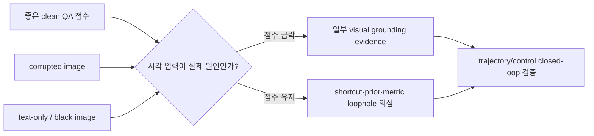
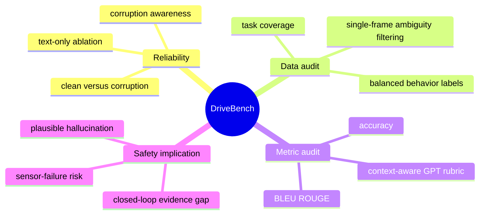
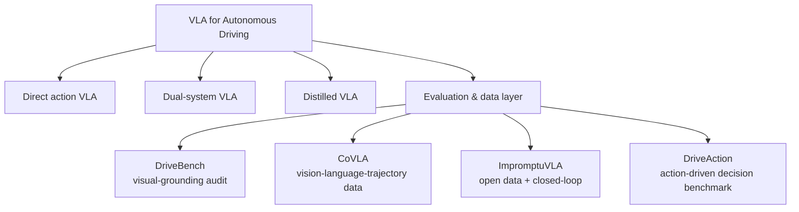
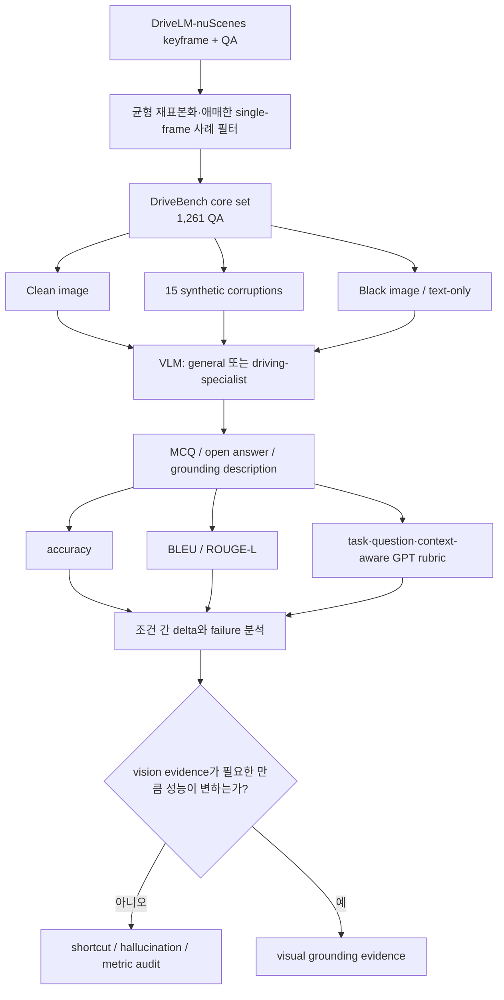
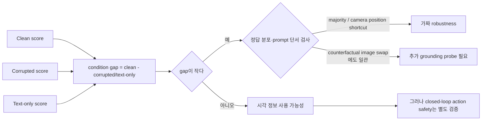
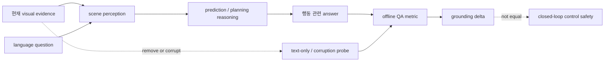
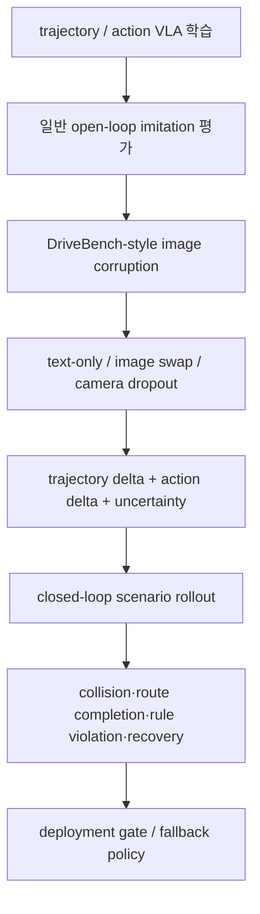
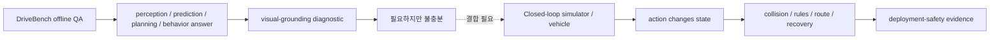
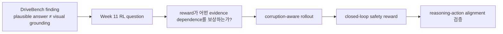

# Week 10. Dataset & Benchmark 집중: DriveBench로 보는 “VLM이 진짜 보고 운전하는가?”

| 항목 | 내용 |
|---|---|
| 날짜 | 2026-09-22 |
| Week | 10 / 12 |
| 원 논문 | *Are VLMs Ready for Autonomous Driving? An Empirical Study from the Reliability, Data, and Metric Perspectives* |
| 한국어 제목 | **VLM은 자율주행을 할 준비가 되었는가? 신뢰성·데이터·평가 지표 관점의 실증 연구** |
| URL | https://arxiv.org/abs/2501.04003 |
| 출판 | ICCV 2025 |
| 저자 | Shaoyuan Xie et al. (UC Irvine, Shanghai AI Laboratory 등) |
| taxonomy | **VLM/VLA-AD reliability benchmark** — visual grounding, corruption robustness, metric audit |
| Reading mode | **Deep read: DriveBench** / skim: CoVLA, ImpromptuVLA, DriveAction |
| 원문 접근 범위 | arXiv v1 PDF 41쪽을 추출·검토하고, 공식 프로젝트 페이지·공개 toolkit README 및 비교 논문 abstract를 교차 확인했다. 전체 PDF의 줄 단위 번역 대신 실험 설계·수치·한계 중심의 한국어 학습 노트로 재구성했다. |

---

## 1. 이번 주 한 문장 결론

**DriveBench의 핵심은 clean-image 점수가 아니라, 이미지가 망가지거나 사라졌을 때도 VLM의 답이 그럴듯하게 유지되는지를 검사하는 것이다. text-only에서도 점수가 유지된다면 그것은 robust visual grounding이 아니라 dataset prior·prompt shortcut·평가 metric의 실패일 수 있다.**

> 안전한 VLA의 최소 질문: **“정답을 냈는가?” 이전에 “그 정답은 현재 sensor evidence 때문에 나온 것인가?”**

---

## 2. 논문 제목·Abstract 한국어 번역

### 제목 번역

- 원제: *Are VLMs Ready for Autonomous Driving? An Empirical Study from the Reliability, Data, and Metric Perspectives*
- 번역: **VLM은 자율주행을 할 준비가 되었는가? 신뢰성·데이터·평가 지표 관점의 실증 연구**

### Abstract 한국어 번역

Vision-Language Model(VLM)의 최근 발전은 자연어를 통해 해석 가능한 운전 결정을 생성하는 자율주행 활용에 대한 관심을 높였다. 그러나 VLM이 본질적으로 시각적으로 grounding되어 있고, 신뢰 가능하며, 해석 가능한 운전 설명을 제공한다는 가정은 대부분 검증되지 않았다. 이 간극을 다루기 위해 저자들은 clean, corrupted, text-only 입력을 포함한 **17개 조건**에서 VLM 신뢰성을 평가하는 benchmark dataset **DriveBench**를 제안한다. 이 benchmark는 **19,200 frame, 20,498 QA pair, 세 질문 유형, 네 가지 주요 driving task, 12개 VLM**을 포괄한다.

실험 결과 VLM은 특히 visual input이 손상되거나 없을 때, 실제 시각 grounding보다 일반 상식이나 텍스트 단서에서 나온 그럴듯한 답을 자주 생성한다. dataset imbalance와 불충분한 평가 metric은 이 행동을 가려 safety-critical 자율주행에 위험을 만든다. 또한 모델은 multi-modal reasoning에 어려움을 보이고 input corruption에 민감하여 일관되지 않은 성능을 보인다. 저자들은 robust visual grounding과 multi-modal 이해를 우선하는 정교한 evaluation metric을 제안하며, VLM이 corruption을 인지하는 능력을 활용해 real-world에서 더 신뢰할 수 있고 해석 가능한 의사결정 시스템을 만드는 방향을 제시한다.

### Abstract를 VLA 관점으로 다시 읽기



DriveBench는 trajectory generator를 제안하는 논문이 아니라, **언어로 설명하는 driving VLM/VLA의 sensing-to-reasoning 연결이 실제로 존재하는지**를 audit하는 benchmark다.

---

## 3. 핵심 기여 3~5개

| # | 기여 | VLA-AD에서의 의미 |
|---:|---|---|
| 1 | **17 input setting**(clean, 15 corruption, text-only)을 가진 reliability benchmark | clean-only leader board가 놓치는 sensor failure와 shortcut을 드러낸다. |
| 2 | DriveLM-nuScenes에서 **200 keyframe**을 재표본화해 행동 label 균형을 개선 | “Going Ahead” 같은 majority answer만 내도 높은 정확도가 되는 함정을 줄인다. |
| 3 | perception·prediction·planning·behavior의 **1,261 core QA**와 corruption-aware 확장 QA를 구성 | 단일 caption이나 단일 task가 아닌 driving reasoning chain을 검사한다. |
| 4 | 12개 general/specialist VLM을 비교하고 **text-only ablation**을 수행 | 점수의 원인이 image evidence인지 prompt prior인지 분리한다. |
| 5 | accuracy, BLEU/ROUGE-L, GPT score를 비판적으로 비교하고 rubric/question/context-aware evaluation을 강조 | 유창한 explanation과 safe, grounded decision을 같은 것으로 취급하지 않게 한다. |



---

## 4. VLA for AD taxonomy 위치

| 분석 축 | DriveBench의 위치 | 해석 |
|---|---|---|
| 시스템 형태 | **evaluation-centric VLM/VLA benchmark** | 새 policy architecture나 online controller가 아니라 기존 모델을 검증한다. |
| 입력 | 단일 camera image + driving-language question; clean/corrupted/text-only 변형 | multi-view, temporal, LiDAR, map은 중심 입력이 아니다. |
| 출력 | MCQ 선택, open-ended answer, visual-grounding/description | waypoint·steering·throttle을 직접 출력하지 않는다. |
| language 역할 | **질의, explanation, high-level planning/behavior interface** | language가 action을 직접 제어하지 않고 reasoning을 관찰하는 창이다. |
| action grounding | perception→prediction→planning→behavior QA의 연결을 간접 점검 | “왜/무엇을 할까”는 평가하지만 continuous trajectory grounding은 미측정이다. |
| training recipe | benchmark 자체는 학습법이 아니라 evaluation recipe | DriveLM-Agent, Dolphins 등 fine-tuned specialist도 평가한다. |
| 안전/long-tail | sensor corruption, missing vision, hallucination을 stress test | interactional long-tail와 real-time fallback은 별도다. |
| 평가 성격 | **open-loop, offline QA** | ego action이 다음 world state를 바꾸지 않는다. |



**판정:** DriveBench는 direct VLA benchmark가 아니라 **VLM explanation/planning claim의 necessary-but-not-sufficient test**다. 여기서 통과해도 closed-loop safe driving이 보장되지 않고, 여기서 실패하면 language-mediated action claim은 더 약해진다.

---

## 5. Architecture / pipeline 시각화

### 5.1 DriveBench 평가 pipeline



### 5.2 17 settings와 failure semantics

| 계층 | 조건 | VLA에서 확인할 failure |
|---|---|---|
| 기준선 | clean image | 정상 장면 이해와 질문 해석 |
| 환경/조명 | brightness, dark, snow, fog, rain | weather shift, low-light visibility |
| 외부 가림 | water splash, lens obstacle | lens occlusion 하의 객체/차선 hallucination |
| sensor failure | camera crash, frame lost, saturate | partial/complete camera loss와 missingness awareness |
| motion artifact | motion blur, zoom blur | ego motion과 scene motion의 혼동 |
| 전송 오류 | bit error, color quantization, H.265 compression | compressed/degraded imagery에 대한 sensitivity |
| 극단 ablation | black image + text-only prompt | visual evidence 없이 answer prior로 맞히는지 |

> 1 clean + 15 corruption + 1 text-only가 논문의 17 settings다. corruption은 weather, external, sensor, motion, transmission의 다섯 family로 묶인다.

### 5.3 “점수 유지”를 해석하는 의사결정 블록



---

## 6. Input → Reasoning → Action Grounding 분석

| 단계 | Input | reasoning / representation | Output | action grounding 판정 |
|---|---|---|---|---|
| Sensor evidence | clean 또는 corrupted single frame | visual encoder의 scene/object cue | visual token | corruption에서 무엇을 잃는지 확인한다. |
| Language interface | task question, camera direction, object coordinate, choice | question-conditioned attention·language prior | answer rationale | prompt 자체가 spatial/semantic shortcut이 될 수 있다. |
| Driving reasoning | perception/prediction/planning/behavior QA | object state, future hazard, safe action 추론 | text/MCQ answer | action 관련 의미를 보지만 numerical action은 아니다. |
| Visual-grounding audit | image removal·corruption·corruption-aware prompt | evidence dependence를 조건 간 비교 | score delta, abstention 여부 | **간접 grounding test**: vision을 없앴는데 성능이 유지되면 grounding 주장을 약화한다. |
| Control consequence | DriveBench 범위 밖 | trajectory rollout, interaction, rule/fallback | waypoint/control, driving score | **미측정**: VQA 정답이 실제 행동 안전으로 이어지는지 알 수 없다. |

### language의 두 얼굴

| language 기능 | 유익 | 위험 | 필요한 통제 |
|---|---|---|---|
| driving question / instruction | 모델의 scene reasoning을 노출하고 비교 가능하게 한다 | camera name, coordinate, canonical safe phrase가 shortcut이 된다 | image swap, text-only, counterfactual prompt test |
| explanation | 사람이 failure를 탐색하고 auditing할 수 있다 | 유창함이 사실성·faithfulness로 오인된다 | cited object/region, answer-action consistency 평가 |
| high-level action label | human-intent에 가까운 decision target을 제공 | “감속/주의”만으로 low-level safety가 증명되지는 않는다 | trajectory, TTC, rule violation, closed-loop outcome 결합 |

### grounding chain



**핵심:** DriveBench의 test는 `visual evidence → textual decision` 경로를 다룬다. 실제 VLA의 `visual evidence → latent → waypoint/control → changed world state` 경로는 그 뒤에 별도 closed-loop 평가가 필요하다.

---

## 7. Training recipe

DriveBench는 model-training paper가 아니다. 따라서 여기의 recipe는 **benchmark construction 및 reproducible evaluation recipe**다.

### 7.1 데이터 구성 recipe

| 단계 | 논문에서 한 일 | 왜 필요한가 | 재현 시 점검 |
|---|---|---|---|
| 1 | 대표적인 language-driving source로 DriveLM 선택 | perception부터 planning/behavior까지 QA graph가 있다 | 원천 dataset의 license와 train/test provenance 확인 |
| 2 | DriveLM training set에서 **200 keyframe** sub-sample | cost를 제한하면서 diverse task를 포함한다 | source training data를 evaluation에 쓰므로 memorization/leakage 가능성을 기록 |
| 3 | label distribution을 균형화 | 원본 behavior MCQ에서 약 78.6%가 straight라 majority shortcut이 가능했다 | macro accuracy·class-wise confusion을 필수 보고 |
| 4 | temporal/subtle cue 또는 overlapped-coordinate 의존 사례를 제외 | single frame에서 사람과 VLM 모두 해석 불가능한 label noise를 줄인다 | 무엇을 제외했는지와 filter bias를 공개 |
| 5 | core QA에 15 corruption 및 corruption-aware QA를 확장 | observed robustness와 genuine grounding을 분리한다 | severity, random seed, camera별 적용 방식을 고정 |

### 7.2 평가 실행 recipe

```text
for each model and each QA:
  1. clean image + standardized prompt로 답과 explanation 생성
  2. 동일 QA에 corruption family/severity를 적용해 재평가
  3. black image + 동일 text prompt로 text-only baseline 측정
  4. corruption context를 명시한 prompt와 corruption recognition QA를 추가
  5. MCQ accuracy + language metric + task/context-aware rubric을 함께 산출
  6. clean 대비 delta, class-wise delta, abstention/calibration을 보고
```

논문 설정에서 open model inference는 vLLM을 사용했고, generation은 temperature **0.2**, top-p **0.2**, 최대 **512 token**으로 통일했다. DriveLM-Agent는 LLaMA-Adapter-V2를 기반으로 DriveLM-nuScenes에서 fine-tune한 설정을 따랐다. 이 값은 연구 결과의 전부가 아니라, 비교의 decoding variance를 줄이기 위한 protocol이다.

### 7.3 VLA 학습에 DriveBench-style probe를 넣는 방법



| 모델 유형 | 기본 loss/평가에 추가할 것 | 이유 |
|---|---|---|
| Textual driving VLM | no-image score, image swap consistency, cited-object correctness | fluent rationale의 visual faithfulness를 확인한다. |
| Waypoint VLA | corruption별 ADE/FDE·collision proxy와 trajectory variance | text QA가 아닌 실제 action이 sensor에 의존하는지 본다. |
| Dual-system VLA | VLM advice–planner action consistency, fallback latency | slow reasoning의 오류가 fast control에 어떻게 전달되는지 본다. |
| Distilled VLA | teacher text/feature 제거 시 student action delta | offline semantic signal의 causal contribution을 본다. |

---

## 8. Dataset / Benchmark / Metric 분석

### 8.1 DriveBench data matrix

| 요소 | 내용 | annotation type | 강점 | 주의점 |
|---|---|---|---|---|
| Source | DriveLM-nuScenes 기반, 200 keyframe 재표본화 | scene/question/answer graph | 다양한 driving task를 한 interface에서 검사 | nuScenes/DriveLM domain·single-frame 관찰에 묶인다. |
| Core set | **1,261 QA**: perception 400, prediction 61, planning 600, behavior 200 | MCQ + VQA | planning question 비중이 크고 task를 분리해 본다 | 질문 수와 task 난도가 균등하다는 뜻은 아니다. |
| Robustness set | corruption recognition 4,000, perception 5,475, prediction 799, planning 5,999, corruption description 3,000 = **19,237**(corruption 유형 합산) | corruption MCQ/VQA/caption | degradation awareness까지 probes | synthetic corruption의 real sensor failure fidelity는 제한된다. |
| 전체 headline | **19,200 frames, 20,498 QA pairs**, 17 settings | MCQ, open-ended, visual grounding | 공식 benchmark가 보고하는 규모 | headline과 appendix set 집계의 단위가 다르므로 단순 합산하지 않는다. |

### 8.2 질문/task와 annotation의 의미

| Task | 대표 질문 | action과의 거리 | 잘 보는 것 | 못 보는 것 |
|---|---|---:|---|---|
| Perception | 어떤 객체가 어디/어떻게 움직이는가? | 멂 | 객체, 위치, 상태 grounding | temporal tracking·3D uncertainty |
| Prediction | 다음 위치에서 먼저 주의할 객체는? | 중간 | hazard anticipation | ego intervention 뒤 actor reaction |
| Planning | 어떤 action이 안전한가 / collision을 피하려면? | 중간 | high-level safety reasoning | feasible trajectory, control stability |
| Behavior | ego speed·steering behavior는? | 가까움 | discrete maneuver label | continuous action and comfort |
| Corruption awareness | 어떤 corruption인가 / 손상 시 무엇을 볼 수 없나? | 메타 | sensing quality 인지 | automatic safe degradation·fallback execution |

### 8.3 metric matrix

| Metric | 무엇을 잘 보는가 | DriveBench가 드러낸 blind spot | VLA용 보완 |
|---|---|---|---|
| MCQ accuracy | 명확한 discrete answer 정합성 | class imbalance면 majority prior로 부풀려진다 | balanced/macro accuracy, class-wise score, text-only delta |
| BLEU / ROUGE-L | 문장 표면형식·reference overlap | key object/action은 틀려도 template가 비슷하면 높을 수 있다 | structured slot accuracy, object-state-relation grounding |
| GPT score | 설명의 coherence와 human-preferred nuance | rubric·question·physical context가 없으면 score가 homogeneous하거나 오판한다 | task-specific rubric + full scene context + evaluator audit |
| clean–corruption delta | sensor degradation sensitivity | 작은 delta가 genuine robustness가 아니라 visual non-use일 수 있다 | human baseline, image swap, no-image baseline |
| trajectory L2/ADE/FDE | imitation quality | environment feedback, rule compliance를 못 본다 | closed-loop success, collision, off-road, TTC |
| driving score / intervention | interactive policy safety | simulator distribution과 reward 설계 의존 | multi-simulator/real-world ODD, scenario severity reporting |

### 8.4 논문 핵심 결과를 읽는 법

| 관찰 | 보고된 근거 | 올바른 해석 |
|---|---|---|
| 인간은 corruption에서 성능이 하락 | perception accuracy **47.67→38.32**, behavior **69.51→54.09** (clean→corrupted) | corruption이 의미 없는 변형만은 아니라는 sanity check다. |
| GPT-4o GPT score가 text-only에서도 거의 유지 | perception **35.37→36.48**, planning **75.75→73.21** (clean→text-only) | 높은 language score가 visual evidence 사용을 보장하지 않는다. |
| MCQ에서도 no-image anomaly | GPT-4o perception accuracy **59.0→59.5**, 일부 모델은 behavior no-image가 clean보다 상승 | general prior와 prompt 단서가 answer를 대체할 수 있다. |
| imbalance 문제 | 원 DriveLM behavior label에서 “Going Straight” 약 **78.6%** | accuracy 하나만 leaderboard에 두면 simple policy를 보상한다. |
| corruption prompt의 효과 | corruption을 명시하면 여러 모델에서 accuracy가 하락 | 일부 모델은 손상을 인지할 수 있지만, 자발적으로 uncertainty를 반영하지 않는다. |

> **중요:** text-only의 높은 점수는 VLM이 image를 “강건하게 보았다”는 증거가 아니라, 이 benchmark/protocol에서 image가 없어도 맞힐 수 있는 부분이 남았다는 반증이다.

### 8.5 Open-loop vs closed-loop evaluation matrix



| 질문 | DriveBench 근거 수준 | 이유 |
|---|---|---|
| VLM이 image 없이도 plausible driving answer를 내는가? | **강함** | black image/text-only ablation이 직접 검사한다. |
| corruption type를 인지할 수 있는가? | 중간 | explicit prompt에서 일부 recognition evidence가 있다. |
| VLM의 explanation이 visual evidence에 faithful한가? | 중간 | corruption/text-only은 강한 diagnostic이지만 region-level causal proof는 아니다. |
| VLM이 low-level trajectory를 안전히 생성하는가? | 약함 | numerical action/control이 output이 아니다. |
| policy가 closed-loop에서 안전하게 복구하는가? | **없음/범위 밖** | ego action이 subsequent observation과 traffic interaction을 바꾸지 않는다. |

---

## 9. 관련 논문 비교표

### 9.1 이번 주 skim: dataset/benchmark matrix

| 논문/벤치마크 | modality | annotation | action grounding | 평가 중심 | closed-loop | DriveBench와의 관계 |
|---|---|---|---|---|---|---|
| **DriveBench** (ICCV 2025) | image + question; clean/corruption/text-only | MCQ, open QA, visual grounding, corruption labels | **간접**: behavior/planning answer | reliability, visual grounding, metric audit | ❌ | “진짜 보았는가?”의 diagnostic 기준점 |
| **CoVLA** (WACV 2025) | real driving video + raw in-vehicle sensors + text | environment/maneuver descriptions + trajectory | **직접**: language와 trajectory pair | VLA training 및 language/action generation | 제한적 / 논문 중심은 dataset+model | large-scale tri-modal data 측면을 보완 |
| **ImpromptuVLA** | 8개 open driving dataset의 curated clip + instruction/action | planning QA + action trajectory, open weights/data | 직접 | open VLA training과 NeuroNCAP·nuScenes 평가 | ✅ NeuroNCAP 보고 | DriveBench의 QA-only blind spot을 action rollout으로 보완하는 방향 |
| **DriveAction** (2025) | real-world scenarios + vision/language | **16,185 QA**, **2,610 scenarios**, driver operation 기반 discrete action | 중간~직접 | action-rooted tree-structured decision evaluation | ❌ / benchmark 중심 | explanation보다 human driving operation을 action label로 전면화 |
| **DriveLM** (ECCV 2024) | nuScenes multi-view + language graph | perception/prediction/planning/behavior/control QA graph | 간접 | language-driven reasoning | ❌ | DriveBench의 출발점; 원본 imbalance와 metric 취약성이 audit 대상 |

### 9.2 DriveAction의 ablation이 주는 보완 관점

DriveAction은 SOTA VLM에서 vision을 제거하면 평균 accuracy가 **3.3%**, language를 제거하면 **4.1%**, 둘 다 제거하면 **8.0%** 하락한다고 보고한다. 이는 modality removal을 action decision benchmark에 넣는 유용한 방향이다. 다만 discrete action accuracy 하락 역시 continuous control, rare-event recovery, closed-loop safety의 충분조건은 아니다.

### 9.3 선택 기준

| 확인하려는 주장 | 우선 benchmark/데이터 | 반드시 덧붙일 것 |
|---|---|---|
| VLM explanation이 image-grounded인가 | **DriveBench** | image swap, object-region counterfactual, calibration |
| language와 numerical trajectory를 함께 학습할 수 있는가 | **CoVLA** | action-label quality audit, OOD and closed-loop evaluation |
| open VLA가 실제 feedback에서 운전하는가 | **ImpromptuVLA류 + simulator** | corruption/dropout stress test, latency/fallback |
| human-like high-level decision을 내는가 | **DriveAction** | continuous trajectory feasibility와 traffic-rule outcome |
| end-to-end VLA가 배포 가능한가 | 모든 offline benchmark의 교집합 | closed-loop, compute budget, uncertainty gate, safety monitor |

---

## 10. 강점과 한계

### 강점

1. **“높은 점수=grounding”이라는 암묵적 가정을 실험으로 공격한다.** text-only는 값싼데 강력한 falsification test다.
2. **15 corruption family가 실제 sensor path의 다양한 failure mode를 명시한다.** 날씨뿐 아니라 lens, frame, codec까지 포함한다.
3. **data·model·metric을 함께 비판한다.** 모델만 탓하지 않고 imbalance, single-frame ambiguity, evaluator context를 원인으로 다룬다.
4. **specialist driving VLM도 예외가 아님을 보인다.** domain fine-tuning이 formatting/template의 이득으로 평가를 부풀릴 수 있음을 지적한다.
5. **toolkit과 dataset을 공개했다.** 동일 모델에 조건별 probe를 재현할 기반이 있다.

### 한계와 비판

| 한계 | 왜 중요한가 | 보완 방향 |
|---|---|---|
| single-frame QA 중심 | turn signal, intent, occlusion은 temporal evidence가 핵심일 수 있다 | multi-frame/video, synchronized multi-view, 3D/map context 기반 probe |
| source가 DriveLM-nuScenes에 집중 | city, weather, sensor stack, culture OOD coverage가 제한된다 | Waymo/BDD/real fleet/cross-country benchmark 확장 |
| synthetic image corruption | real lens aging, rolling shutter, synchronization error, cascading hardware fault와 다를 수 있다 | real fault log + sensor simulator + severity calibration |
| text-only가 black image 구현에 의존 | 모델별 black-image preprocessing이나 prompt behavior가 confound가 될 수 있다 | null token, masked visual token, mismatched image, image permutation을 함께 사용 |
| GPT evaluator 의존성 | evaluator model, rubric, context에 score가 흔들린다 | blind human audit, structured verifier, multi-evaluator agreement |
| continuous control 미평가 | text planning 답이 safe trajectory/fallback을 뜻하지 않는다 | CARLA/NAVSIM/NeuroNCAP류 closed-loop, vehicle test, safety constraints |
| data leakage 가능성 | source training split로부터 만든 evaluation이 fine-tuned 모델의 memorization과 얽힐 수 있다 | strict held-out scene, model-training provenance, decontamination report |

### Safety / long-tail risk matrix

| 위험 | DriveBench가 포착하는 징후 | 남는 위험 | production guardrail |
|---|---|---|---|
| 가려진 보행자/신호 | water splash, lens obstacle에서 generic object를 hallucinate | temporal occlusion과 interaction | occupancy/tracker disagreement, conservative brake envelope |
| camera outage | camera crash/frame lost에서 answer가 계속 confident | redundant sensor fusion failure | sensor-health monitor, degraded-mode planner, minimum-risk maneuver |
| weather/low light | dark/fog/snow에서 visual evidence 약화 | domain shift와 visibility estimation error | uncertainty-calibrated speed, ODD restriction |
| majority maneuver | straight prior가 MCQ 점수를 올림 | rare turn/yield/emergency behavior | class-balanced mining, severity-weighted scenario score |
| fluent explanation | BLEU/GPT score가 plausible prose를 보상 | action과 rationale의 causal 불일치 | object-action causal probe, rationale-free action baseline |
| open-loop success | QA/correct answer가 좋음 | compounding error, other-agent response, traffic violation | closed-loop route completion, collision/TTC, intervention/recovery |

---

## 11. 실전 학습 포인트

### 11.1 VLA dataset/benchmark 설계 원칙

| 원칙 | DriveBench에서 얻는 교훈 | 구현 체크 |
|---|---|---|
| **modality ablation은 필수** | no-image 점수가 높으면 visual grounding 주장을 멈춰야 한다 | clean / corrupt / no-image / image-swap가 모두 있는가? |
| **label distribution을 먼저 공개** | imbalanced action은 trivial policy를 보상한다 | macro score, per-class support, majority baseline을 보고하는가? |
| **annotation은 action 가까이** | high-level QA는 useful하지만 control evidence가 아니다 | text·discrete action·trajectory·safety outcome이 연결되는가? |
| **metric은 task context를 가져야 한다** | ROUGE/BLEU만으로 key object·risk를 판단할 수 없다 | object/state/relation, rule, safety rubric이 있는가? |
| **uncertainty는 output contract** | corruption을 알아도 모델이 알아서 안전해지지 않는다 | abstain, confidence, fallback trigger가 action stack에 연결되는가? |
| **open-loop 뒤에는 closed-loop** | answer correct가 policy safe와 같지 않다 | feedback, recovery, latency, interventions를 평가하는가? |

### 11.2 최소 VLA evaluation card

```markdown
## Visual grounding
- [ ] clean / 15+ corruption / no-image / image-swap action delta
- [ ] sensor-health input과 abstention/calibration curve

## Data
- [ ] class balance, geo/weather/sensor distribution, annotation provenance
- [ ] language rationale와 trajectory/action label의 temporal alignment

## Action
- [ ] open-loop ADE/FDE/L2 + collision/off-road proxy
- [ ] closed-loop route completion, TTC, rule violation, recovery

## Safety & deployment
- [ ] long-tail severity-weighted success and fallback activation
- [ ] latency/FPS/memory under degraded sensor conditions
```

### 11.3 실무자가 피해야 할 오해

- **“corruption에서 score가 안 떨어졌으니 robust하다”**: image를 전혀 쓰지 않아도 같은 현상이 나온다. no-image와 mismatched-image baseline 없이는 결론을 내리지 말자.
- **“GPT evaluator를 썼으니 semantic 평가다”**: rubric, question, physical context를 주지 않으면 evaluator도 그럴듯한 prose를 보상할 수 있다.
- **“explanation이 맞으니 action도 안전하다”**: text planning은 trajectory feasibility, interaction, actuator latency와 다른 problem이다.
- **“균형화 dataset이면 실제 분포를 잃는다”**: natural prevalence와 diagnostic balance는 목적이 다르다. 둘을 분리해 보고해야 한다.
- **“text-only는 비현실적이라 불필요하다”**: deployment scenario가 아니라 **causal ablation**이다. visual evidence 의존성을 검증하는 통제군이다.

### 11.4 면접/리뷰용 핵심 답

> **DriveBench는 VLA benchmark인가?**
>
> 넓게는 VLM/VLA-AD evaluation layer지만, continuous action을 직접 평가하지 않는 **visual-grounding reliability benchmark**다. VLA deployment 주장에는 action-level closed-loop benchmark를 반드시 결합해야 한다.

> **가장 중요한 metric은 무엇인가?**
>
> 단일 metric은 없다. 최소한 balanced task accuracy, clean→corrupt/no-image delta, context-aware grounding score, 그리고 trajectory/control의 closed-loop safety outcome을 함께 봐야 한다.

> **text-only 성능이 높은 것이 왜 위험한가?**
>
> 현재 sensor evidence 없이도 answer prior로 고득점할 수 있음을 뜻한다. 이런 model의 fluent explanation을 control interface로 쓰면 unseen visual event를 자신 있게 무시할 위험이 있다.

---

## 12. 다음 주 질문

다음 Week 11은 **RL / Reasoning 강화**이며 deep read는 **Drive-R1 또는 DriveAgent-R1** 계열이다. DriveBench를 읽은 뒤 다음 질문을 가져간다.

1. RL reward가 clean-image action score만 보상하면, policy도 language/dataset prior shortcut을 강화하지 않는가?
2. `clean reward − corrupt/no-image reward`를 reward 또는 evaluation constraint로 넣으면 genuine action grounding이 강화되는가?
3. reasoning token의 길이·유창함과 trajectory safety 사이에 causal relation이 있는가, 아니면 둘은 함께만 좋아 보이는가?
4. closed-loop RL에서 image corruption과 sensor-health uncertainty를 observation으로 주면 fallback policy는 실제로 더 빨리 발동하는가?
5. long-tail scenario의 frequency, severity, recoverability를 하나의 VLA reward/evaluation card에 어떻게 묶을 수 있는가?



---

## 13. 참고 링크

### Deep read

- DriveBench arXiv: https://arxiv.org/abs/2501.04003
- DriveBench PDF: https://arxiv.org/pdf/2501.04003
- DriveBench project: https://drive-bench.github.io/
- DriveBench toolkit: https://github.com/worldbench/DriveBench
- DriveBench dataset: https://huggingface.co/datasets/drive-bench/arena
- ICCV 2025 paper page: https://openaccess.thecvf.com/content/ICCV2025/html/Xie_Are_VLMs_Ready_for_Autonomous_Driving_An_Empirical_Study_from_ICCV_2025_paper.html

### Skim / 비교 읽기

- CoVLA, *Comprehensive Vision-Language-Action Dataset for Autonomous Driving*: https://arxiv.org/abs/2408.10845
- CoVLA project: https://turingmotors.github.io/covla-ad/
- ImpromptuVLA, *Open Weights and Open Data for Driving VLA Models*: https://github.com/valeoai/ImpromptuVLA
- DriveAction, *A Benchmark for Exploring Human-like Driving Decisions in VLA Models*: https://arxiv.org/abs/2506.05667
- DriveAction dataset: https://huggingface.co/datasets/LiAuto-DriveAction/drive-action
- DriveLM, *Driving with Graph Visual Question Answering*: https://arxiv.org/abs/2312.14150
- nuScenes: https://www.nuscenes.org/

| 이번 주 요약 카드 | 내용 |
|---|---|
| 핵심 개념 | **visual grounding audit** — sensor를 제거해도 정답이면 vision을 썼다는 주장을 의심한다. |
| 핵심 데이터 | DriveBench: 17 settings, 19,200 frames, 20,498 QA, 12 VLM; 15 corruption + text-only control. |
| 핵심 evidence | GPT-4o planning GPT score가 clean 75.75, text-only 73.21로 거의 유지된 사례는 plausible language score의 위험을 보여 준다. |
| 핵심 한계 | single-frame/open-loop QA이며 continuous control·feedback·closed-loop safety를 직접 측정하지 않는다. |
| 한 줄 takeaway | **VLA의 높은 점수보다 먼저, 눈을 가렸을 때도 같은 행동을 하는지 확인하라.** |
