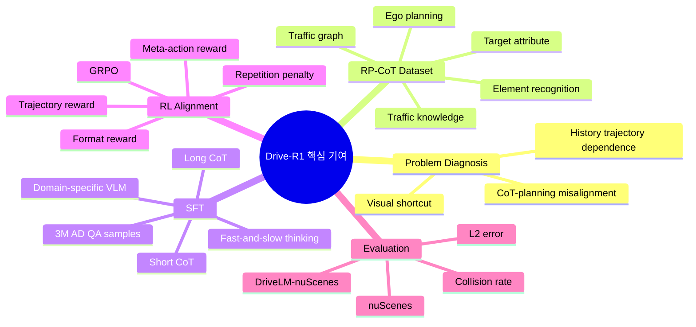
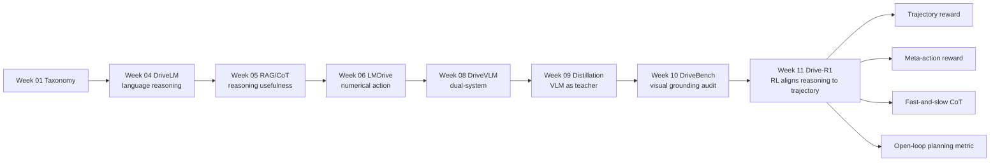
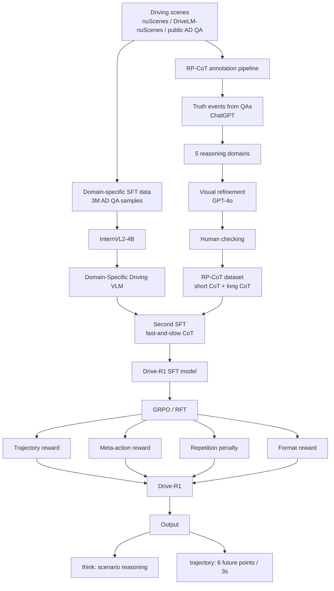
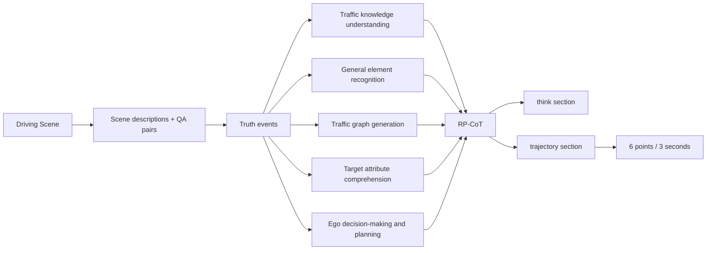
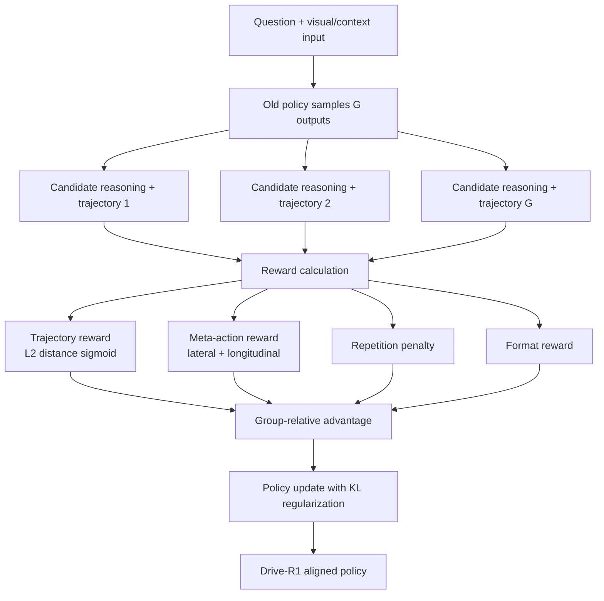
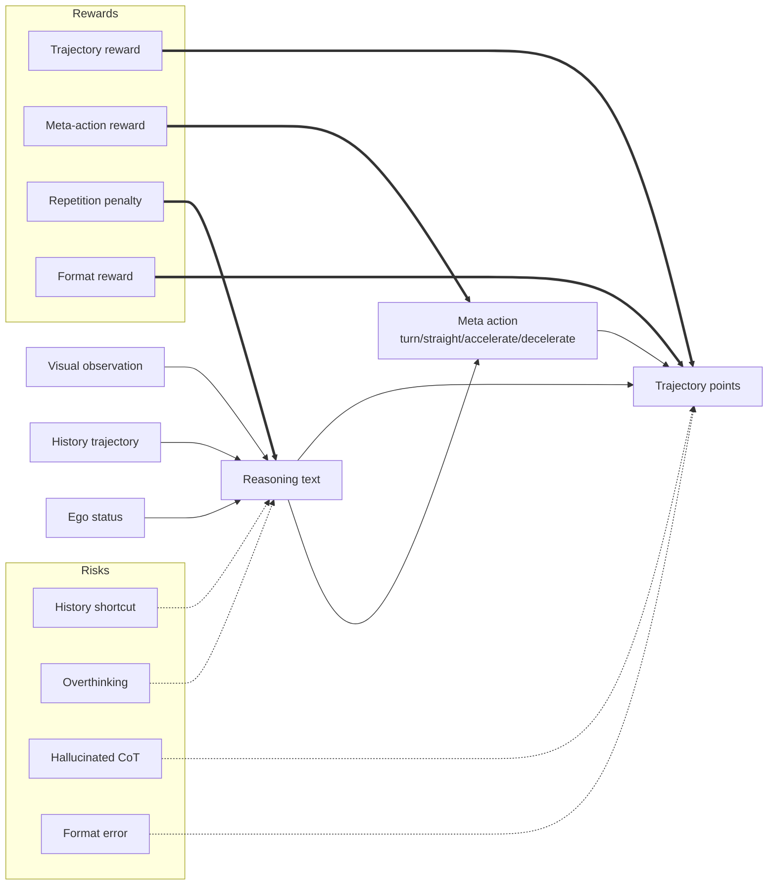
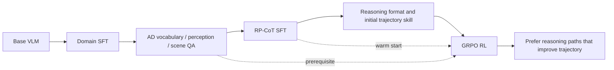
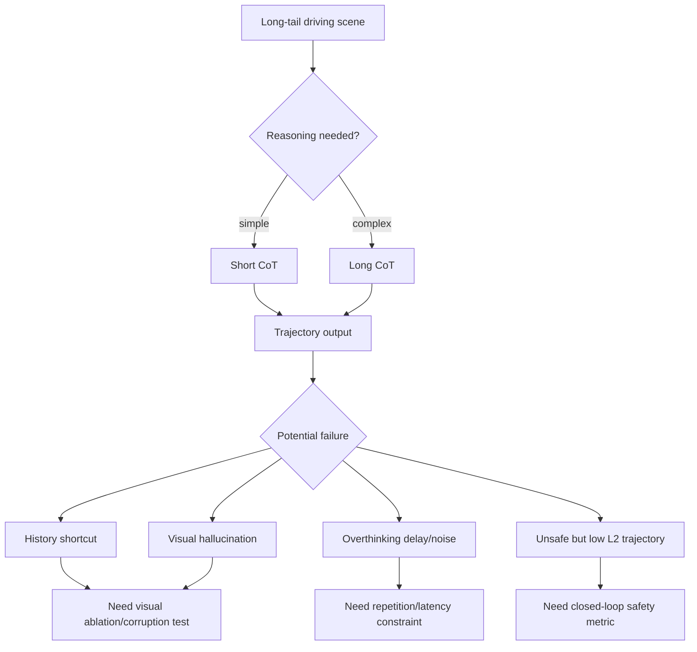

# Week 11. RL / Reasoning 강화: Drive-R1로 보는 “추론이 trajectory를 실제로 좋게 만드는가?”

## Metadata

| 항목 | 내용 |
|---|---|
| Date | 2026-07-07 |
| Week | 11 / 12 |
| Original paper/source | *Drive-R1: Bridging Reasoning and Planning in VLMs for Autonomous Driving with Reinforcement Learning* |
| Korean title | **Drive-R1: 강화학습으로 자율주행 VLM의 추론과 계획을 연결하기** |
| URL | https://arxiv.org/abs/2506.18234 |
| Authors | Yue Li, Meng Tian, Dechang Zhu, Jiangtong Zhu, Zhenyu Lin, Zhiwei Xiong, Xinhai Zhao |
| Version read | arXiv v1 abstract page + arXiv source TeX 전체 추출 기반. PDF 전체 줄 단위 번역이 아니라, 논문 구조·표·실험을 한국어 학습 노트로 재구성했다. |
| Taxonomy | **Planning-oriented Driving VLM / Direct trajectory VLA / RL-aligned reasoning / RP-CoT + GRPO** |
| Reading mode | Deep read: **Drive-R1** / skim: **AlphaDrive**, **DriveAgent-R1**, **AutoDrive-R2** |
| 이번 주 focus | reward design, reasoning-action alignment, self-reflection / fast-and-slow thinking |
| Output | **RL for VLA 분석표** |

> 참고: 이번 주 주제는 “VLM이 설명을 잘한다”가 아니라 **그 설명/CoT가 실제 motion planning, 즉 waypoint·trajectory 품질과 충돌률(collision rate)을 개선하는가**이다. Drive-R1은 `reasoning text`와 `numerical trajectory` 사이의 gap을 SFT + RL(GRPO)로 줄이려는 대표 사례다.

---

## 1. 이번 주 한 문장 결론

**Drive-R1의 핵심은 자율주행 VLM의 Chain-of-Thought를 예쁜 설명으로 남겨두지 않고, trajectory reward와 meta-action reward로 직접 압박해 “계획에 도움이 되는 추론”만 살아남게 만드는 것이다.**

Week 10의 DriveBench가 “VLM이 진짜 시각 입력을 보고 있는가?”를 의심했다면, Week 11의 Drive-R1은 그 다음 질문을 던진다.

> **“시각적으로 grounded된 reasoning이 있다면, 그것을 어떻게 numerical trajectory / waypoint planning으로 정렬할 것인가?”**

Drive-R1이 보여주는 메시지는 세 가지다.

1. **VLM planning은 history/text shortcut에 쉽게 빠진다.**  
   논문은 image를 제거해도 trajectory 성능이 비슷하거나 더 좋아지는 예비 실험을 제시한다. 이는 VLM이 visual input보다 history trajectory, ego status, textual prior에 의존할 수 있음을 뜻한다.
2. **CoT는 무조건 좋지 않다.**  
   long CoT만 넣으면 작은 VLM이 overthinking하거나 noisy reasoning을 trajectory 출력으로 전파해 성능이 떨어질 수 있다. Drive-R1은 short CoT와 long CoT를 섞는 fast-and-slow thinking을 사용한다.
3. **RL의 reward design이 reasoning-action alignment의 핵심이다.**  
   trajectory reward는 결과 품질을, meta-action reward는 reasoning 단계의 high-level decision을, repetition/format reward는 출력 안정성을 제어한다.

---

## 2. 논문 제목·Abstract 한국어 번역

### 2.1 제목 번역

- **원제**: *Drive-R1: Bridging Reasoning and Planning in VLMs for Autonomous Driving with Reinforcement Learning*
- **번역**: **Drive-R1: 강화학습으로 자율주행 VLM의 추론과 계획을 연결하기**
- **키워드 번역**
  - Bridging reasoning and planning → **추론과 계획의 연결 / 정렬**
  - Motion planning → **주행 궤적 계획 / trajectory planning**
  - Reinforcement learning → **강화학습(RL)**
  - Group Relative Policy Optimization → **그룹 상대 정책 최적화(GRPO)**

### 2.2 Abstract 한국어 번역

자율주행(AD)을 위한 대형 Vision-Language Model(VLM)은 perception과 cognition task를 넘어 motion planning으로 확장되고 있다. 그러나 이 방향에는 두 가지 중요한 문제가 있다. 첫째, VLM은 history input 정보에 과도하게 의존하는 shortcut을 학습하는 경향이 있어, visual input을 진정으로 이해하지 않고도 겉보기에는 강한 planning 결과를 낼 수 있다. 둘째, Chain-of-Thought(CoT) reasoning 과정은 motion planning 결과와 항상 잘 정렬되어 있지 않으며, 복잡한 reasoning 능력을 효과적으로 활용해 planning을 향상시키는 방법은 아직 충분히 연구되지 않았다.

본 논문은 작은 규모의 domain-specific VLM에서 출발해, 자율주행의 scenario reasoning과 motion planning을 연결하도록 설계된 **Drive-R1**을 제안한다. Drive-R1은 먼저 long CoT와 short CoT 데이터를 모두 포함하는 정교한 데이터셋으로 supervised fine-tuning을 수행한다. 이를 통해 Drive-R1은 visual input에서 최종 planning decision까지 step-by-step으로 reasoning하도록 유도된다. 이후 Drive-R1은 reinforcement learning framework 안에서 학습되며, predicted trajectory와 meta action에 기반한 reward를 통해 planning에 더 유용한 reasoning path를 발견하도록 장려된다.

nuScenes와 DriveLM-nuScenes benchmark에서의 실험 결과, Drive-R1은 기존 state-of-the-art VLM보다 우수한 성능을 달성했다. 저자들은 Drive-R1이 자율주행에서 reasoning과 planning을 연결하는 유망한 방향을 제시하며, 향후 연구와 실제 적용을 위한 방법론적 insight를 제공한다고 주장한다.

### 2.3 Abstract를 VLA 관점으로 다시 쓰기

**Drive-R1은 “설명 가능한 driving VLM”에서 한 단계 더 나아가, reasoning text가 trajectory prediction을 실제로 개선하도록 RL reward로 정렬하는 planning-oriented VLA다. 핵심 diagnostic은 CoT가 그럴듯한지보다, CoT가 visual grounding을 강화하고 L2 error·collision rate를 낮추는지다.**

### 2.4 제목만 보고 오해하면 안 되는 점

| 오해 | Drive-R1의 실제 메시지 |
|---|---|
| “CoT를 길게 쓰면 planning이 좋아진다” | long CoT만 넣으면 작은 모델에서는 overthinking/noise 때문에 trajectory가 나빠질 수 있다. |
| “RL이 새로운 driving 능력을 갑자기 만든다” | 논문은 RL을 새로운 능력 발현보다 **post-training alignment mechanism**으로 본다. SFT로 도메인 기반을 만든 뒤 RL이 잘 작동한다. |
| “좋은 reasoning이면 좋은 action이다” | 자연어 reasoning은 coarse-grained이고 trajectory는 fine-grained numerical output이다. 둘 사이에는 명시적 reward alignment가 필요하다. |
| “open-loop L2가 낮으면 안전하다” | Drive-R1은 collision rate도 낮추지만, 평가는 여전히 open-loop 중심이다. closed-loop deployment 안전성은 별도 검증이 필요하다. |
| “visual input을 넣었으니 visual grounding이다” | image ablation 결과, VLM이 visual input을 거의 쓰지 않고도 계획 성능을 내는 shortcut 가능성이 있다. |

---

## 3. 핵심 기여 3~5개

| # | 핵심 기여 | 한국어 설명 | 왜 중요한가 |
|---:|---|---|---|
| 1 | **Shortcut learning 문제 제기** | VLM planner가 visual input보다 history/text cue에 과의존할 수 있음을 image ablation으로 보인다. | Week 10 DriveBench의 visual grounding 우려를 planning task까지 확장한다. |
| 2 | **RP-CoT dataset 구축** | traffic knowledge, element recognition, traffic graph, target attribute, ego decision/planning의 5개 domain을 따라 reasoning-to-trajectory annotation을 만든다. | “설명”이 아니라 “계획으로 이어지는 reasoning”을 supervision한다. |
| 3 | **Fast-and-slow thinking SFT** | simple scenario에는 short CoT, complex scenario에는 long CoT를 사용해 overthinking을 줄인다. | CoT length를 task difficulty에 맞추는 adaptive reasoning 전략이다. |
| 4 | **GRPO 기반 RL alignment** | trajectory reward, meta-action reward, repetition penalty, format reward로 reasoning과 planning을 함께 최적화한다. | language reasoning과 numerical action 사이의 gap을 reward로 직접 다룬다. |
| 5 | **nuScenes / DriveLM-nuScenes 성능 검증** | nuScenes validation에서 Avg L2 0.31, Avg collision 0.09를 보고하며 기존 VLM planner보다 낮은 충돌률을 보인다. | VLA에서 RL이 단순 설명 품질이 아니라 planning metric을 개선할 수 있음을 보여준다. |

### Contribution map

---

## 4. VLA for AD taxonomy 위치

### 4.1 Taxonomy 좌표

| 분석 축 | Drive-R1 위치 | 해석 |
|---|---|---|
| System type | **Planning-oriented Driving VLM / Direct Action VLA** | scene reasoning과 trajectory prediction을 하나의 VLM output으로 연결한다. |
| Input modality | single-view / multi-view / sequential image + textual driving context + history trajectory + ego status | visual input이 있지만, 논문은 history cue shortcut 위험을 강하게 지적한다. |
| Output | `<think>` reasoning + `<trajectory>` future trajectory, 3초 horizon의 6개 point | 자연어 reasoning과 numerical trajectory를 같은 response 구조에 넣는다. |
| Language role | reasoning scaffold, high-level meta-action 표현, output format control | language는 설명이자 planning을 유도하는 중간 표현이다. |
| Action grounding | **trajectory-level grounding + meta-action grounding** | 최종 action은 waypoint/trajectory이며, meta-action reward가 lateral/longitudinal decision을 보조한다. |
| Training recipe | InternVL2-4B 기반 domain SFT → RP-CoT SFT → GRPO/RFT | 도메인 적응 없이 RL만 넣으면 효과가 약하다는 점을 강조한다. |
| Datasets/benchmarks | nuScenes, DriveLM-nuScenes, 3M self-collected AD QA, 4,072 RP-CoT | 공개 benchmark + 대규모 수집 QA + 자체 RP-CoT annotation을 결합한다. |
| Open-loop vs closed-loop | **open-loop trajectory prediction 중심** | L2/collision proxy metric을 사용하지만 closed-loop simulator 주행은 아니다. |
| Safety/long-tail risk | collision, complex multi-agent scene, overthinking, hallucinated reasoning | long-tail에서 reasoning이 필요하지만, 잘못된 reasoning은 trajectory noise로 증폭될 수 있다. |
| Limitations | closed-loop 검증 부족, code/data 공개 불명확, 작은 모델의 RL 안정성, in-house data 의존 | 실제 차량 적용 전에는 simulator closed-loop와 uncertainty handling이 필요하다. |

### 4.2 Week 01~10 흐름 속 위치

### 4.3 Taxonomy상 핵심 질문

| 질문 | Drive-R1의 답 |
|---|---|
| VLA인가, VLM QA인가? | trajectory를 직접 출력하므로 planning-oriented VLA에 가깝다. |
| action grounding이 있는가? | 있다. `<trajectory>`의 numerical points와 meta-action reward가 grounding 역할을 한다. |
| language가 action을 돕는가? | RL reward를 걸 때는 돕는다. 단, SFT-only long CoT는 오히려 악영향을 줄 수 있다. |
| closed-loop인가? | 아니다. open-loop nuScenes/DriveLM-nuScenes metric 중심이다. |
| 안전성은 직접 검증됐나? | collision rate proxy는 낮아졌지만, 실제 closed-loop intervention/collision 검증은 부족하다. |

---

## 5. Architecture / pipeline 시각화

### 5.1 Drive-R1 전체 pipeline

### 5.2 RP-CoT annotation map

### 5.3 GRPO reward flow

### 5.4 “설명”과 “행동” 사이의 병목

---

## 6. Input → Reasoning → Action Grounding 분석

### 6.1 Input-output map

| 단계 | Drive-R1 구성 | 구체 내용 | VLA 관점 체크 |
|---|---|---|---|
| Input: visual | camera image, multi-view/sequential image | AD scene observation | 진짜 visual grounding인지 image ablation 필요 |
| Input: text/context | scene QA, history trajectory, ego status, meta info | 과거 이동 정보와 현재 차량 상태 | shortcut source가 될 수 있음 |
| Reasoning | `<think>...</think>` | traffic knowledge → objects → graph → target attributes → ego planning | reasoning이 trajectory에 실제로 기여해야 함 |
| High-level action | meta action | lateral/longitudinal decision | meta-action reward로 process-level alignment |
| Low-level action | `<trajectory>...</trajectory>` | 3초 horizon, 6개 future points | L2/collision metric으로 outcome-level alignment |
| Evaluation | L2 error, collision rate | open-loop trajectory metric | closed-loop safety와는 gap 존재 |

### 6.2 Action grounding 수준

| 수준 | 예시 | Drive-R1 해당 여부 | 코멘트 |
|---|---|---:|---|
| Textual explanation | “앞차가 느리므로 감속해야 한다” | ✅ | CoT reasoning으로 생성 |
| Meta action | keep lane, turn, accelerate/decelerate | ✅ | meta-action reward로 직접 평가 |
| Waypoint / trajectory | `(x, y)` future points | ✅ | 핵심 output. 6 points / 3 sec |
| Low-level control | steering, throttle, brake | ❌ | controller까지 직접 내지는 않음 |
| Closed-loop actuation | simulator/vehicle에서 반복 제어 | ❌ | 본 논문 평가는 open-loop 중심 |

### 6.3 Language role 분석

| language 역할 | Drive-R1에서의 기능 | 장점 | 위험 |
|---|---|---|---|
| Reasoning scaffold | scene을 단계적으로 해석 | interpretability, complex scene handling | hallucination이 trajectory noise로 전파 |
| Difficulty-adaptive thinking | short/long CoT 선택 | simple scene overthinking 감소 | complexity classifier/proxy 품질에 의존 |
| Meta-action carrier | high-level lateral/longitudinal decision 표현 | reward로 process quality 측정 가능 | coarse action과 fine trajectory 불일치 가능 |
| Output format | `<think>`, `<trajectory>` 구조 | parsing/evaluation 쉬움 | format reward가 substance보다 과대평가될 위험 |

---

## 7. Training recipe

### 7.1 단계별 recipe

| 단계 | 이름 | 데이터 | 목적 | 핵심 포인트 |
|---:|---|---|---|---|
| 0 | Base model | InternVL2-4B | general VLM foundation | 작은 규모의 VLM에서 출발 |
| 1 | Domain-specific SFT | 3M self-collected AD QA | AD perception/cognition 적응 | visual/domain understanding 강화 |
| 2 | RP-CoT SFT | 4,072 RP-CoT samples + long/short CoT | reasoning → trajectory 구조 학습 | fast-and-slow thinking으로 CoT 길이 조절 |
| 3 | GRPO/RFT | RP-CoT subset, rollout 6 기본 | reasoning-action alignment | trajectory + meta-action + repetition + format reward |
| 4 | Evaluation | nuScenes, DriveLM-nuScenes | planning quality 검증 | L2 error와 collision rate 사용 |

### 7.2 Reward design 분석표

| Reward | 수식/정의 요약 | 무엇을 정렬하나 | 기대 효과 | 주의점 |
|---|---|---|---|---|
| Trajectory reward | predicted trajectory와 GT trajectory의 L2 distance를 sigmoid 변환 | final numerical action | L2 error 감소 | GT trajectory 하나만 최선이라고 가정하는 문제 |
| Meta-action reward | lateral/longitudinal high-level decision 각각 0.5 | reasoning process와 action intent | collision 감소, high-level consistency | meta-action label이 coarse하면 fine control과 어긋날 수 있음 |
| Repetition penalty | 반복적/장황한 CoT penalize | reasoning efficiency | overthinking 감소 | 너무 강하면 필요한 long reasoning 억제 가능 |
| Format reward | `<think>`, `<trajectory>` 등 구조 준수 | output parseability | stable training/evaluation | format만 맞고 내용이 틀린 output 위험 |

### 7.3 Fast-and-slow thinking의 의미

| Scenario | 적합한 CoT | 이유 | Drive-R1 관점 |
|---|---|---|---|
| 직선 주행, 주변 agent 적음 | Short CoT | 과도한 분석은 noise | 빠르게 trajectory 생성 |
| 복잡한 교차로, 다중 agent interaction | Long CoT | 우선순위·규칙·위험 해석 필요 | 단계별 reasoning 필요 |
| rule-intensive scene | Long CoT | 교통 규칙/표지/신호 해석 | traffic knowledge domain 중요 |
| visually ambiguous scene | Long CoT + uncertainty 필요 | sensor cue 확인 필요 | 논문은 uncertainty calibration은 약함 |

### 7.4 SFT와 RL의 역할 분리

- **SFT 없이 RL만**: reward signal을 이해할 도메인 기반이 부족해 불안정하다.
- **SFT만**: CoT와 trajectory가 느슨하게 연결되어 reasoning이 실제 planning metric을 보장하지 않는다.
- **SFT + RL**: Drive-R1의 핵심 조합. 먼저 형식을 배우고, 이후 reward로 planning에 유용한 reasoning을 선택한다.

---

## 8. Dataset / Benchmark / Metric 분석

### 8.1 Dataset 구성

| 데이터 | 역할 | 규모/특징 | 코멘트 |
|---|---|---|---|
| 3M AD QA | 1차 domain SFT | public AD sources에서 수집, single/multi-view/sequential image 포함 | domain-specific VLM 기반 형성 |
| RP-CoT | 2차 SFT + RL | 약 4,072 samples, short/long CoT | reasoning-to-planning alignment supervision |
| nuScenes | trajectory validation | 6,019 validation samples 언급 | open-loop planning metric 비교 |
| DriveLM-nuScenes | ablation/evaluation | 799 validation samples 언급 | language-rich driving benchmark |

### 8.2 Benchmark 결과 요약

| Model | Avg L2 ↓ | Avg Collision ↓ | 해석 |
|---|---:|---:|---|
| ST-P3 | 2.11 | 0.71 | 전통적 end-to-end baseline, 성능 낮음 |
| UniAD | 1.03 | 0.31 | planning-oriented baseline |
| VAD-E | 0.37 | 0.14 | strong end-to-end baseline |
| DriveVLM | 0.40 | 0.27 | VLM planning baseline |
| RDA-Driver | 0.40 | 0.10 | reasoning-enhanced driving baseline |
| OmniDrive | 0.33 | 0.30 | 낮은 L2지만 collision proxy는 높음 |
| EMMA | 0.32 | - | 강한 VLM baseline, collision 미보고 |
| **Drive-R1** | **0.31** | **0.09** | 가장 낮은 평균 L2와 collision rate 보고 |

> 해석: Drive-R1의 개선 폭은 L2 기준으로는 EMMA/OmniDrive 대비 작지만, collision rate까지 함께 보면 “reasoning alignment가 safety proxy에 기여할 수 있다”는 주장을 만든다.

### 8.3 Ablation 핵심

| 실험 축 | 관찰 | 의미 |
|---|---|---|
| Image ablation | image 없이도 성능이 비슷하거나 더 나은 setting 존재 | visual grounding 부족 / history shortcut 가능성 |
| Long CoT only | short+long 조합보다 나쁨 | 복잡한 reasoning을 모든 scene에 강제하면 overthinking |
| Short+Long CoT | SFT 성능 개선 | scenario difficulty-adaptive reasoning 필요 |
| RL on base model | 효과 제한 | domain adaptation이 선행되어야 함 |
| RL after DS + RP-CoT | L2와 collision 개선 | SFT warm-up 후 RL alignment가 유효 |
| Meta-action reward 추가 | collision rate 개선 | process-level reward가 안전 proxy에 도움 |
| rollout 증가 | 24 rollout에서 collision은 낮지만 training collapse 언급 | 작은 모델에서 RL sampling을 키우면 안정성 문제 |

### 8.4 Open-loop vs closed-loop 평가

| 평가 축 | Drive-R1 | 신뢰도 코멘트 |
|---|---|---|
| Open-loop L2 | ✅ 핵심 metric | GT trajectory와의 거리. 표준적이지만 multimodal future를 과소평가할 수 있음 |
| Open-loop collision | ✅ proxy metric | safety proxy로 유용하지만 실제 closed-loop collision과 다름 |
| Closed-loop CARLA / nuPlan | ❌ 없음 | policy feedback loop에서 error accumulation 검증 필요 |
| Human interpretability | ⚠️ CoT 제공 | CoT가 실제 causal reasoning인지 post-hoc rationalization인지는 추가 검증 필요 |
| Visual grounding | ⚠️ 문제 제기 + 개선 시도 | image ablation 진단은 좋지만, corruption/text-only benchmark는 별도 필요 |

### 8.5 Evaluation matrix

| Metric | 측정 대상 | Drive-R1에서의 역할 | blind spot |
|---|---|---|---|
| L2 distance | trajectory 정확도 | trajectory reward / main metric | safe but different trajectory를 penalize 가능 |
| Collision rate | safety proxy | meta-action reward 효과 확인 | simulator closed-loop collision이 아님 |
| Format validity | output parsing | RL 안정성 | 내용 품질과 직접 동일하지 않음 |
| Meta-action accuracy | high-level intent | reasoning process reward | fine-grained trajectory와 mismatch 가능 |
| Image ablation gap | visual dependency | shortcut 진단 | 정량적 visual grounding metric으로 더 확장 필요 |

---

## 9. 관련 논문 비교표

| 논문/시스템 | 계열 | RL 사용 | language 역할 | action 출력 | 평가 방식 | Drive-R1과의 차이 |
|---|---|---:|---|---|---|---|
| **Drive-R1** | planning-oriented VLM / VLA | ✅ GRPO | RP-CoT + meta-action | 3초 trajectory 6 points | nuScenes, DriveLM-nuScenes open-loop | trajectory reward와 meta-action reward로 reasoning-action 정렬 |
| **AlphaDrive** | RL + reasoning for VLM planning | ✅ GRPO-style rewards | planning reasoning | planning/trajectory 계열 | planning benchmark | Drive-R1보다 먼저 RL+reasoning의 가능성을 강조한 가까운 선행 흐름 |
| **DriveAgent-R1** | active perception + hybrid thinking driving agent | ✅ Cascaded RL | text-only reasoning과 tool-augmented visual reasoning을 adaptive switch | high-level behavior planning 중심 | Drive-Internal 등 | Drive-R1이 trajectory alignment에 집중한다면, DriveAgent-R1은 uncertainty 시 visual tool 호출과 active perception에 집중 |
| **RDA-Driver** | reasoning-enhanced driver | 부분/없음 | sequential reasoning으로 final trajectory 유도 | trajectory | open-loop planning | Drive-R1은 RL reward로 reasoning path를 직접 선호 학습 |
| **DriveVLM** | dual-system VLM + planner | 명시적 RL 아님 | slow reasoning / planner interface | trajectory/planning | open-loop | Drive-R1은 단일 VLM response 안에서 reasoning과 trajectory를 함께 생성 |
| **LMDrive** | language-conditioned closed-loop driving | 명시적 RL 아님 | navigation instruction + perception | control/waypoint | CARLA closed-loop | Drive-R1은 closed-loop보다 open-loop trajectory metric 중심 |
| **DriveBench** | benchmark/reliability audit | ❌ | QA/evaluation language | QA/planning answer | corrupted/text-only reliability | Drive-R1의 visual grounding 주장을 검증할 수 있는 complementary benchmark |
| **AutoDrive-R2** | curriculum skim item | 확인 제한 | 알려진 범위 제한 | 알려진 범위 제한 | 알려진 범위 제한 | 이번 자동 수집에서는 공식 원문/metadata를 안정적으로 확인하지 못해 비교를 보수적으로 남긴다. |

### 9.1 RL for VLA 비교 관점

| 비교 축 | AlphaDrive류 | Drive-R1 | DriveAgent-R1류 |
|---|---|---|---|
| 핵심 문제 | planning 성능과 reasoning 강화 | CoT-planning misalignment | passive perception과 uncertainty |
| RL reward | planning-oriented reward | trajectory + meta-action + repetition + format | cascaded / tool-use / hybrid thinking reward |
| reasoning mode | planning reasoning | short/long RP-CoT | text-only ↔ visual tool reasoning switch |
| action grounding | trajectory/planning | trajectory-level explicit | behavior planning + active visual evidence |
| 중요한 open problem | closed-loop safety | visual grounding 검증 | tool call latency와 reliability |

---

## 10. 강점과 한계

### 10.1 강점

| 강점 | 설명 | 왜 설득력 있나 |
|---|---|---|
| 문제 정의가 정확함 | visual shortcut과 CoT-planning misalignment를 분리해 제기 | Week 10의 visual grounding 문제와 직접 연결됨 |
| CoT를 맹신하지 않음 | long CoT가 오히려 나빠질 수 있음을 인정 | “reasoning = 항상 좋음”이라는 단순화를 피함 |
| reward가 action에 닿아 있음 | trajectory L2와 meta-action correctness를 reward에 포함 | language-only preference보다 VLA에 적합 |
| ablation이 풍부함 | SFT/RL, base/DS, reward, rollout, CoT length 비교 | 어떤 요소가 효과적인지 분리해서 보여줌 |
| safety proxy 개선 | Avg collision 0.09 보고 | 단순 L2뿐 아니라 collision을 함께 본 점이 중요 |

### 10.2 한계 / 비판적 코멘트

| 한계 | 설명 | 후속 연구 질문 |
|---|---|---|
| Closed-loop 부재 | open-loop trajectory prediction 중심 | CARLA/nuPlan closed-loop에서 동일한 이득이 유지되는가? |
| Visual grounding 검증 부족 | image ablation은 좋지만 corruption/text-only 체계는 제한적 | DriveBench식 corruption benchmark를 planning output에 적용하면? |
| CoT causal validity | CoT가 실제 decision causal path인지 불명확 | reasoning intervention으로 trajectory가 바뀌는지 확인 필요 |
| In-house / self-collected data 의존 | 3M AD QA의 세부 공개성·재현성 제한 가능 | 공개 데이터만으로 어느 정도 재현 가능한가? |
| Single GT trajectory reward | L2는 하나의 GT를 기준으로 함 | multiple safe trajectories를 어떻게 보상할 것인가? |
| RL stability | rollout 증가 시 training collapse 언급 | 작은 VLM에서 stable RL recipe는 무엇인가? |
| Meta-action granularity | lateral/longitudinal coarse action | lane-level, interaction-level, rule-level reward가 필요할 수 있음 |

### 10.3 Safety / long-tail risk 분석

### 10.4 가장 중요한 비판

**Drive-R1은 reasoning과 planning을 연결하는 좋은 연구지만, 아직 “자율주행 agent”라기보다는 “open-loop trajectory predictor with aligned reasoning”에 가깝다.** 실제 deployment를 주장하려면 다음이 필요하다.

1. closed-loop simulation에서 반복 제어 성능 검증
2. sensor corruption / missing camera / weather robustness
3. uncertainty-aware output: 모를 때 감속·정지·human takeover 같은 fallback
4. reward hacking 방지: format/meta-action만 맞추고 trajectory가 unsafe한 경우 탐지
5. latency와 compute cost: CoT와 rollout이 real-time driving budget에 들어가는지

---

## 11. 실전 학습 포인트

### 11.1 이번 주 반드시 기억할 개념

| 용어 | 의미 | VLA for AD에서의 중요성 |
|---|---|---|
| RP-CoT | Reasoning-Planning Chain-of-Thought | reasoning을 trajectory output으로 이어지게 만든 annotation |
| GRPO | Group Relative Policy Optimization | 여러 candidate output을 상대 비교해 policy를 업데이트하는 RL 방법 |
| Trajectory reward | GT trajectory와 predicted trajectory 간 L2 기반 reward | final action 품질을 직접 학습 신호로 제공 |
| Meta-action reward | high-level lateral/longitudinal decision reward | reasoning process가 planning intent와 맞는지 측정 |
| Fast-and-slow thinking | scenario 난이도에 따라 short/long CoT를 조절 | overthinking과 insufficient reasoning 사이 균형 |
| History shortcut | visual input 대신 과거 trajectory/context만 보고 답하는 현상 | VLA의 visual grounding을 무너뜨리는 핵심 위험 |
| Reasoning-action alignment | 자연어 추론과 numerical action의 정렬 | VLA가 “말만 잘하는 모델”을 넘어서기 위한 핵심 |

### 11.2 논문 읽을 때 체크리스트

| 체크 질문 | Drive-R1에서 확인한 내용 |
|---|---|
| action representation이 무엇인가? | 3초 future trajectory, 6 points |
| language가 실제 action에 어떻게 연결되는가? | RP-CoT + meta-action + trajectory output 구조 |
| reward가 action metric과 연결되는가? | trajectory L2와 meta-action correctness가 reward에 포함 |
| visual grounding shortcut을 검사했는가? | image ablation으로 문제를 제기함 |
| closed-loop 평가가 있는가? | 없음. open-loop 중심 |
| long-tail/safety metric이 있는가? | collision rate proxy는 있음. closed-loop long-tail은 부족 |
| 학습 데이터가 재현 가능한가? | 일부 public sources 기반이나 3M self-collected 세부 재현성은 제한 가능 |

### 11.3 연구 아이디어로 확장하기

| 아이디어 | 설명 | 기대 효과 |
|---|---|---|
| DriveBench × Drive-R1 | corruption/text-only setting에서 trajectory output도 평가 | visual grounding이 planning에서도 유지되는지 확인 |
| Closed-loop GRPO reward | CARLA/nuPlan closed-loop collision, route progress를 reward에 포함 | open-loop metric과 실제 주행 gap 축소 |
| Uncertainty reward | ambiguous/corrupted scene에서 “감속/정지/확인”을 보상 | safety fallback 학습 |
| Multi-modal future reward | 하나의 GT trajectory 대신 여러 safe trajectory set 보상 | L2의 single-answer bias 완화 |
| Causal CoT intervention | reasoning 문장을 바꿨을 때 trajectory가 합리적으로 바뀌는지 측정 | CoT가 post-hoc인지 causal인지 검증 |
| Tool-augmented Drive-R1 | DriveAgent-R1처럼 불확실 시 perception tool 호출 | passive visual input 한계 완화 |

### 11.4 RL for VLA 분석표

| 분석 축 | 좋은 설계 | 나쁜 설계 / 위험 | Drive-R1 평가 |
|---|---|---|---|
| Reward target | action metric + reasoning process 둘 다 | language preference만 보상 | ✅ trajectory + meta-action |
| Visual grounding | image ablation/corruption으로 검증 | input image를 넣었다고 끝 | ⚠️ ablation은 있으나 corruption은 제한 |
| CoT length | scene complexity에 adaptive | 모든 scene에 long CoT | ✅ short/long 조합 |
| RL warm-up | domain SFT 후 RL | base model에 바로 RL | ✅ DS + RP-CoT 후 RL 권장 |
| Evaluation | open-loop + closed-loop | open-loop L2만 | ⚠️ collision proxy는 있으나 closed-loop 없음 |
| Safety | collision/uncertainty/fallback 포함 | 평균 L2만 최적화 | ⚠️ collision 있음, uncertainty 부족 |
| Reproducibility | 공개 code/data/checkpoint | in-house data 의존 | ⚠️ 세부 재현성 확인 필요 |

---

## 12. 다음 주 질문

다음 주 Week 12는 **최신 논문 업데이트와 개인 research map**이다. Drive-R1을 읽고 다음 질문을 가져가면 좋다.

1. **World model + VLA + RL**을 결합하면, reward를 open-loop L2가 아니라 imagined closed-loop outcome에 걸 수 있을까?
2. VLA가 내는 CoT는 실제 causal reasoning인가, 아니면 trajectory를 정당화하는 post-hoc explanation인가?
3. DriveBench식 visual grounding audit을 trajectory-level VLA에 적용하면 어떤 모델이 살아남을까?
4. closed-loop safety를 위해 VLA가 반드시 직접 control을 내야 할까, 아니면 high-level intent + verified planner 구조가 더 안전할까?
5. 앞으로 읽을 최신 VLA 논문을 `data`, `architecture`, `training`, `evaluation`, `deployment realism` 축으로 어떻게 우선순위화할까?

---

## 13. 참고 링크

| 구분 | 링크 |
|---|---|
| Drive-R1 arXiv | https://arxiv.org/abs/2506.18234 |
| Drive-R1 PDF | https://arxiv.org/pdf/2506.18234 |
| AlphaDrive arXiv | https://arxiv.org/abs/2503.07608 |
| DriveAgent-R1 arXiv | https://arxiv.org/abs/2507.20879 |
| nuScenes | https://www.nuscenes.org/ |
| DriveLM | https://github.com/OpenDriveLab/DriveLM |
| InternVL | https://github.com/OpenGVLab/InternVL |
| ms-swift | https://github.com/modelscope/ms-swift |

---

## Appendix. 이번 주 30분 복습 루틴

1. **5분** — Abstract와 Section 1에서 두 문제를 표시한다: `history shortcut`, `CoT-planning misalignment`.
2. **10분** — Table 1/ablation을 보며 short CoT, long CoT, RL 조합이 왜 다른지 설명해 본다.
3. **5분** — reward 4개를 외운다: trajectory, meta-action, repetition, format.
4. **5분** — “왜 closed-loop가 아닌가?”를 스스로 비판한다.
5. **5분** — 내 연구 map에 넣을 문장 하나를 쓴다:  
   **“VLA for AD의 다음 병목은 reasoning 생성이 아니라, visual-grounded reasoning이 closed-loop-safe action으로 검증되는 training/evaluation loop다.”**
