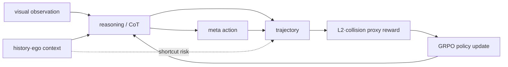
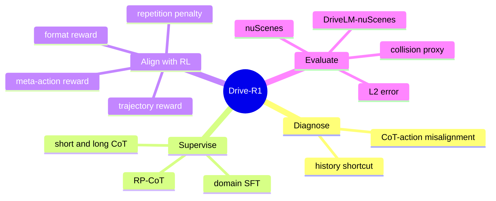
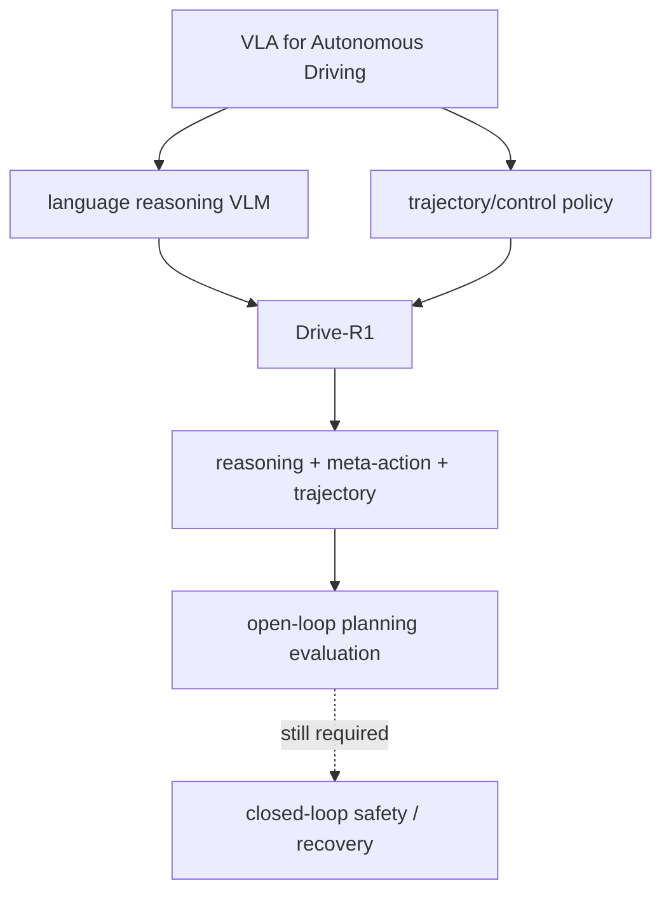
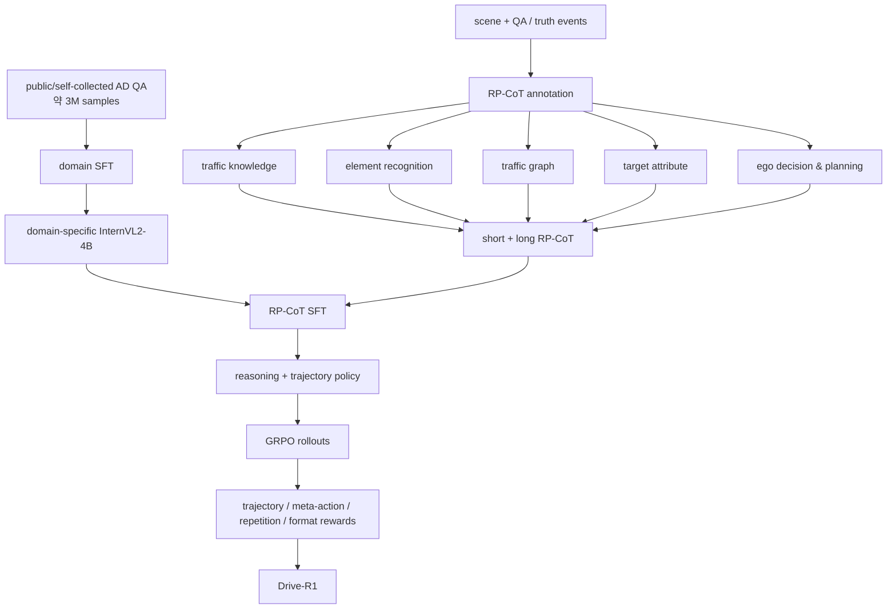
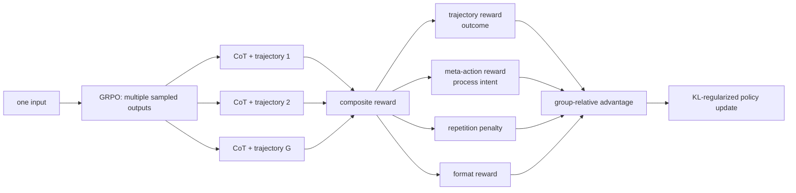
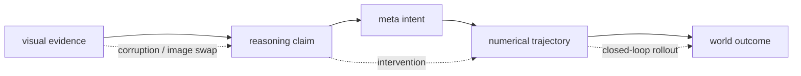
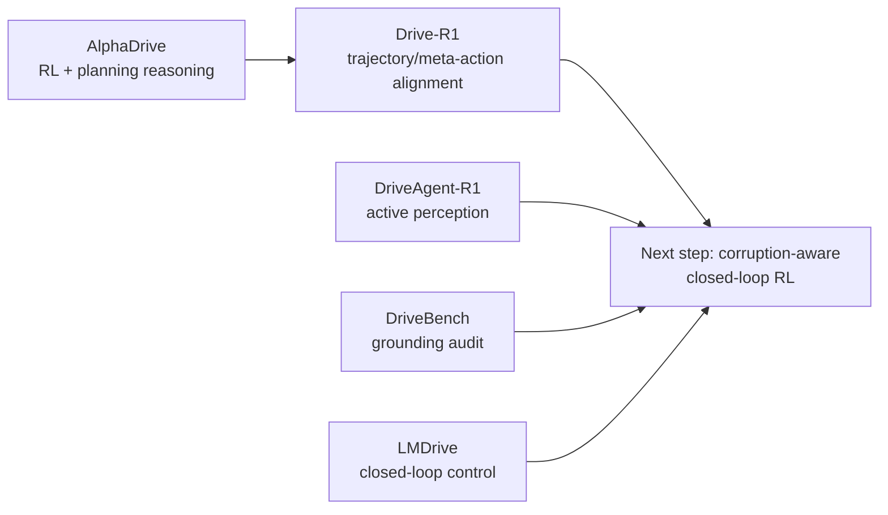
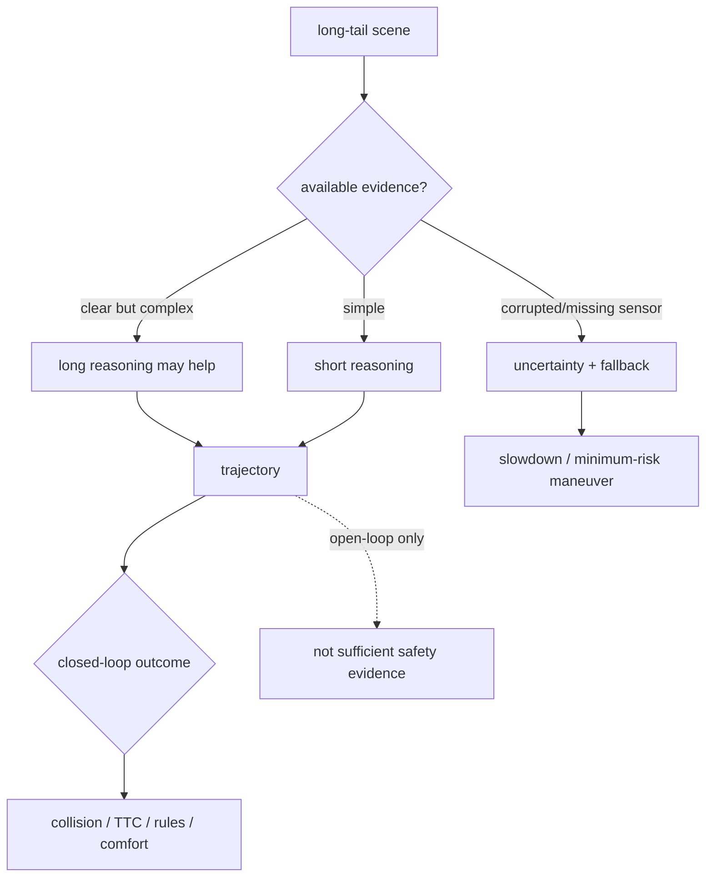
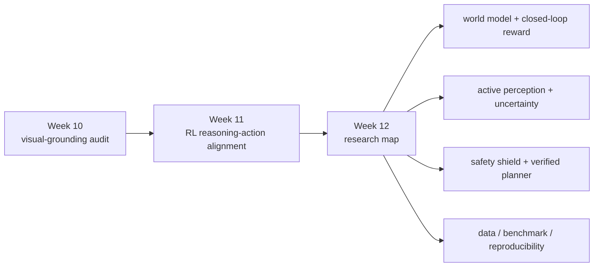

# Week 11. RL / Reasoning 강화: Drive-R1로 보는 “추론이 trajectory를 실제로 좋게 만드는가?”

| 항목 | 내용 |
|---|---|
| 날짜 | 2026-09-29 (Asia/Seoul) |
| Week | 11 / 12 |
| 원 논문 | *Drive-R1: Bridging Reasoning and Planning in VLMs for Autonomous Driving with Reinforcement Learning* |
| 한국어 제목 | **Drive-R1: 강화학습으로 자율주행 VLM의 추론과 계획을 연결하기** |
| URL | https://arxiv.org/abs/2506.18234 |
| 저자 | Yue Li, Meng Tian, Dechang Zhu, Jiangtong Zhu, Zhenyu Lin, Zhiwei Xiong, Xinhai Zhao |
| taxonomy | **planning-oriented Driving VLM / trajectory-output VLA / RL-aligned reasoning** |
| Reading mode | **Deep read: Drive-R1** · skim: AlphaDrive, DriveAgent-R1 |
| 이번 주 focus | reward design, reasoning–action alignment, self-reflection/fast-and-slow thinking |
| 원문 접근 범위 | arXiv v1 abstract와 HTML 전문(섹션·표·실험 텍스트)을 검토했다. PDF 줄 단위 완역은 하지 않았으며, 아래는 원문 근거와 비판적 해석을 분리한 학습 노트다. |

---

## 1. 이번 주 한 문장 결론

**Drive-R1의 요점은 CoT를 더 길고 그럴듯하게 만드는 데 있지 않다. trajectory 및 meta-action reward를 통해, 실제 planning 결과를 개선하는 reasoning path를 선호하도록 SFT 뒤에 GRPO 강화학습(RL)을 적용한 데 있다.**

> 안전한 VLA에서 물어야 할 질문은 “설명이 맞는가?”가 아니라 **“그 설명을 바꾸거나 없앴을 때 numerical action도 합리적으로 바뀌는가?”**다.



---

## 2. 논문 제목·Abstract 한국어 번역

### 제목 번역

- 원제: *Drive-R1: Bridging Reasoning and Planning in VLMs for Autonomous Driving with Reinforcement Learning*
- 번역: **Drive-R1: 강화학습으로 자율주행 VLM의 추론과 계획을 연결하기**
- `Bridging`은 단순히 두 출력을 함께 내는 것이 아니라, **reasoning의 품질을 planning outcome으로 학습시키는 정렬(alignment)**을 뜻한다.

### Abstract 한국어 번역

자율주행(AD)을 위한 대형 Vision-Language Model(VLM)은 perception과 cognition task를 넘어 motion planning으로 확장되고 있다. 그러나 이 방향에는 두 가지 중요한 문제가 있다. 첫째, VLM은 history input 정보에 과도하게 의존하는 shortcut을 학습하는 경향이 있어, visual input을 진정으로 이해하지 않고도 겉보기에는 강한 planning 결과를 낼 수 있다. 둘째, Chain-of-Thought(CoT) reasoning 과정은 motion planning 결과와 항상 잘 정렬되어 있지 않으며, 복잡한 reasoning 능력을 효과적으로 활용해 planning을 향상시키는 방법은 아직 충분히 연구되지 않았다.

저자들은 작은 규모의 domain-specific VLM에서 출발해 자율주행의 scenario reasoning과 motion planning을 연결하는 **Drive-R1**을 제안한다. 먼저 long CoT와 short CoT를 모두 포함한 데이터로 supervised fine-tuning(SFT)을 수행하여, visual input에서 최종 planning decision까지 단계적으로 reasoning하도록 유도한다. 이어 predicted trajectory와 meta action에 기반한 reward를 이용하는 reinforcement learning framework로 학습하여, planning에 더 유용한 reasoning path를 찾도록 한다.

nuScenes와 DriveLM-nuScenes에서의 실험에서 Drive-R1은 기존 VLM과 비교해 우수한 결과를 보고한다. 저자들은 이 접근이 자율주행에서 reasoning과 planning을 연결하는 유망한 방향이며, 향후 연구와 응용에 방법론적 insight를 준다고 주장한다.

### Abstract를 VLA 관점으로 다시 읽기

| 흔한 주장 | Drive-R1이 검증하려는 더 강한 주장 | 남는 검증 과제 |
|---|---|---|
| “VLM이 운전 장면을 설명한다” | reasoning token이 trajectory quality와 연결된다 | CoT가 실제 causal path인지 검증 |
| “CoT가 길수록 낫다” | scene 난이에 따라 short/long CoT를 섞어야 한다 | 난이도 판단과 latency 최적화 |
| “L2가 낮다” | trajectory와 high-level intent를 함께 reward한다 | closed-loop interaction·recovery |
| “이미지를 넣었다” | image shortcut을 문제로 명시한다 | corruption/no-image trajectory audit |

---

## 3. 핵심 기여 3~5개

| # | 기여 | VLA for AD에서의 의미 |
|---:|---|---|
| 1 | **visual/history shortcut 진단** | image를 제거해도 경쟁력 있는 결과가 나오는 setting을 보이며, VLM planner가 history/text cue에 의존할 위험을 드러낸다. |
| 2 | **RP-CoT(Reasoning–Planning CoT) annotation** | traffic knowledge → 객체/요소 → traffic graph → target attribute → ego planning의 reasoning을 trajectory에 연결한다. |
| 3 | **fast-and-slow SFT** | 모든 scene에 long CoT를 강제하지 않고 short/long CoT를 함께 학습해 overthinking을 줄인다. |
| 4 | **GRPO 기반 composite reward** | trajectory, meta-action, repetition, format 신호를 결합해 reasoning과 numerical planning을 함께 정렬한다. |
| 5 | **planning metric 중심 ablation** | SFT/RL 단계, CoT 길이, rollout 수, reward 성분을 비교해 어떤 요소가 trajectory·collision proxy에 영향을 주는지 조사한다. |



---

## 4. VLA for AD taxonomy 위치

| 분석 축 | Drive-R1의 위치 | 해석 |
|---|---|---|
| system type | **planning-oriented driving VLM / direct trajectory VLA** | VLM response 안에서 reasoning과 trajectory를 함께 생성한다. |
| input | visual observation + textual driving context + history trajectory + ego status | visual input이 있지만, history가 shortcut source가 될 수 있음을 논문도 지적한다. |
| output | `<think>` reasoning + `<trajectory>` | 3초 horizon의 6개 future point trajectory를 output contract로 둔다. |
| language 역할 | reasoning scaffold, meta-action carrier, format interface | language는 설명만이 아니라 planning의 중간 표현이다. |
| action grounding | **trajectory-level + meta-action-level** | final action은 numerical trajectory이고 lateral/longitudinal intent를 별도로 보상한다. |
| training recipe | InternVL2-4B domain SFT → RP-CoT SFT → GRPO | RL은 cold start가 아니라 post-training alignment로 쓴다. |
| dataset/benchmark | self-collected AD QA, RP-CoT, nuScenes, DriveLM-nuScenes | 공개 benchmark와 내부/수집 데이터의 재현성 차이를 분리해 봐야 한다. |
| evaluation | **open-loop** L2 및 collision proxy 중심 | ego action이 다음 observation을 바꾸는 closed-loop roll-out은 논문의 직접 증거가 아니다. |
| safety/long-tail | collision, multi-agent complexity, reasoning noise를 다룸 | sensor fault·uncertainty·fallback·실시간 budget은 충분히 다루지 않는다. |



**판정:** Drive-R1은 text-only VQA보다 action grounding이 강하지만, 실제 actuator control 또는 반복 환경 interaction까지 포함한 end-to-end driving agent는 아니다.

---

## 5. Architecture / pipeline 시각화

### 5.1 학습 pipeline



### 5.2 inference input-output map

| 단계 | 입력/표현 | 출력 | failure mode |
|---|---|---|---|
| observation | camera image(s), scene context | visual token | image가 있어도 실제로 쓰지 않는 shortcut |
| context | ego state, history trajectory, prompt | context token | past motion이 future answer를 과도하게 결정 |
| reasoning | `<think>` RP-CoT | scene/agent/rule/intent explanation | hallucination, 장황함, post-hoc rationale |
| high-level action | lateral + longitudinal meta action | keep/turn, accelerate/decelerate 등 | coarse intent와 fine trajectory의 불일치 |
| numerical action | `<trajectory>` 6 future points / 3s | future waypoint trajectory | safe alternative trajectory를 L2가 벌점 |

### 5.3 reward가 닿는 곳



---

## 6. Input → Reasoning → Action Grounding 분석

| 축 | Drive-R1의 설계 | 강점 | 확인해야 할 위험 |
|---|---|---|---|
| visual evidence | scene image/sequence | language-only planner보다 현재 scene을 읽을 통로가 있다 | image ablation에서 history shortcut 가능성이 나타났다. |
| reasoning | structured RP-CoT | object·relation·rule·ego decision을 드러내어 audit 가능 | reasoning text가 action의 원인인지, 행동 뒤의 설명인지 불명확하다. |
| meta action | lateral/longitudinal high-level decision | trajectory 전에 intent를 평가하는 process reward가 된다 | meta label이 coarse하면 lane-level·interaction-level risk를 놓친다. |
| action | 3초, 6-point trajectory | numerical action을 직접 보상한다 | steering/throttle/brake, vehicle dynamics는 직접 output이 아니다. |
| feedback | offline GT trajectory comparison | 빠르고 재현 가능한 open-loop 비교 | ego 행동 뒤 타 차량이 어떻게 반응하는지는 보지 못한다. |

### reasoning–action alignment의 최소 조건



Drive-R1은 `R → I → A`를 reward로 조이려 한다. 그러나 배포 수준의 causal evidence에는 최소한 다음 세 test가 추가되어야 한다.

1. **image swap/no-image**에서 trajectory가 필요한 만큼 달라지는가?
2. reasoning의 critical object·rule을 바꾸면 meta action과 trajectory도 일관되게 바뀌는가?
3. 바뀐 action이 simulator closed-loop에서 collision, TTC, rule violation, recovery를 개선하는가?

---

## 7. Training recipe

### 7.1 단계별 학습

| 단계 | 데이터/구성 | 목적 | 논문의 교훈 |
|---:|---|---|---|
| 0 | InternVL2-4B | general VLM initialization | RL 전에 visual/language foundation이 필요하다. |
| 1 | 약 3M AD QA | domain-specific SFT | AD vocabulary, scene understanding, output convention을 적응시킨다. |
| 2 | 4,072 RP-CoT sample | short + long reasoning과 trajectory format SFT | planning을 향한 reasoning prior를 만든다. |
| 3 | GRPO/RFT rollouts | composite reward post-training | 후보 간 상대 비교로 planning에 더 유익한 출력을 선호한다. |
| 4 | nuScenes / DriveLM-nuScenes | L2, collision proxy 및 ablation | offline planning quality를 비교한다. |

### 7.2 reward design 분석표

| reward | 무엇을 보나 | 기대 효과 | reward hacking / 한계 |
|---|---|---|---|
| trajectory reward | predicted–GT trajectory L2를 sigmoid 형태로 변환 | numerical planning accuracy 개선 | 하나의 GT만 정답으로 보므로 여러 safe future를 억제할 수 있다. |
| meta-action reward | lateral·longitudinal decision, 각 0.5 기여 | reasoning intent와 action 방향을 연결 | coarse label을 맞추고 fine trajectory는 불안전할 수 있다. |
| repetition penalty | 반복적/불필요하게 긴 CoT | overthinking·token 낭비 완화 | 과도하면 어려운 scene의 필요한 deliberation도 억제한다. |
| format reward | `<think>`, `<trajectory>` 등 구조 준수 | parsing과 training 안정성 | 내용 없이 format만 맞추는 보상 해킹 위험이 있다. |

### 7.3 fast-and-slow thinking

| scenario | 권장 CoT | 이유 | deployment 관점 |
|---|---|---|---|
| 단순 직선·낮은 interaction | short CoT | 불필요한 reasoning은 noise와 latency가 된다 | 빠른 policy path가 필요하다. |
| 교차로·다중 agent | long CoT | right-of-way, relative motion, intent를 분해해야 한다 | reasoning budget을 허용하되 deadline을 둬야 한다. |
| 시야 불량·sensor anomaly | long CoT만으로 충분하지 않음 | 정보가 없으면 생각을 길게 해도 관측이 생기지 않는다 | uncertainty, sensor-health, fallback이 필요하다. |

> 논문의 핵심은 “긴 CoT를 강제”하는 것이 아니라 **SFT로 가능한 reasoning 형식을 만들고 RL로 planning에 유익한 path를 선택**한다는 데 있다.

---

## 8. Dataset / Benchmark / Metric 분석

### 8.1 데이터와 benchmark

| 데이터/평가 | 논문에서의 역할 | 관찰/주의점 |
|---|---|---|
| self-collected AD QA | 1차 domain SFT, 약 3M sample | 규모는 크지만 세부 provenance·공개성에 따라 재현성이 달라진다. |
| RP-CoT | 2차 SFT와 RL, 4,072 sample | long/short reasoning-to-planning supervision의 핵심이다. |
| nuScenes validation | open-loop trajectory 비교 | 논문은 6,019 validation sample 비교를 보고한다. |
| DriveLM-nuScenes | shortcut/ablation 및 language-rich driving evaluation | 논문은 799 sample의 preliminary/ablation setting을 사용한다. |

### 8.2 보고된 결과를 읽는 법

| model | Avg L2 ↓ | Avg collision ↓ | 해석 |
|---|---:|---:|---|
| ST-P3 | 2.11 | 0.71 | end-to-end planning baseline |
| UniAD | 1.03 | 0.31 | planning-oriented baseline |
| VAD-E | 0.37 | 0.14 | 강한 end-to-end baseline |
| DriveVLM | 0.40 | 0.27 | VLM planning baseline |
| RDA-Driver | 0.40 | 0.10 | reasoning-enhanced baseline |
| OmniDrive | 0.33 | 0.30 | 낮은 L2와 collision proxy가 항상 같이 움직이지 않음을 보인다. |
| EMMA | 0.32 | – | 강한 trajectory baseline, 표의 collision 미보고 |
| **Drive-R1** | **0.31** | **0.09** | 논문이 보고한 최저 평균 L2 및 collision proxy |

**중요한 해석:** 0.31과 0.09는 논문 setting의 open-loop table 값이다. `collision rate`는 useful safety proxy이지만, policy가 계속 action을 내고 다른 agent와 상호작용하는 closed-loop collision rate와 동일하지 않다.

### 8.3 Open-loop vs closed-loop 평가 매트릭스

| 질문 | Drive-R1 증거 수준 | 이유 | 필요한 보완 |
|---|---|---|---|
| GT trajectory에 가깝게 예측하는가? | 강함 | L2로 직접 평가 | multi-modal future set 평가 |
| high-level intent가 맞는가? | 중간 | meta-action reward/ablation | rule·interaction·lane-level label |
| reasoning이 trajectory와 정렬되는가? | 중간 | reward 연결과 ablation은 있다 | causal CoT intervention |
| visual grounding이 충분한가? | 약~중간 | shortcut을 진단했지만 comprehensive corruption test는 제한적 | DriveBench-style corruption/no-image trajectory test |
| 반복 제어가 안전한가? | 약함 | closed-loop evaluation 부재 | CARLA/nuPlan/NAVSIM/vehicle closed-loop |

---

## 9. 관련 논문 비교표

| 시스템 | RL / training | language 역할 | action grounding | 평가 및 Drive-R1과의 차이 |
|---|---|---|---|---|
| **Drive-R1** | domain SFT + RP-CoT SFT + **GRPO** | reasoning, meta action, format | 3초/6-point trajectory | nuScenes·DriveLM-nuScenes open-loop; trajectory+intent reward 정렬 |
| **AlphaDrive** | SFT + GRPO 기반 planning reward 4개 | planning reasoning | planning output | RL과 reasoning을 AD planning에 적용한 선행 흐름; abstract는 SFT-only/무-reasoning 대비 planning·training efficiency 개선을 주장 |
| **DriveAgent-R1** | 3-stage training + **Cascaded RL** | text-only reasoning과 tool-augmented visual reasoning을 adaptive switch | high-level behavior planning 및 active perception | long-tail Drive-Internal과 nuScenes를 사용; Drive-R1보다 불확실 상황의 evidence-seeking/active perception에 초점 |
| **LMDrive** | 주로 supervised language-conditioned policy | navigation instruction/scene context | waypoint/control 계열 | CARLA closed-loop로 가는 축; Drive-R1의 open-loop RL alignment와 대조적 |
| **DriveBench** | 학습법이 아닌 reliability audit | QA/explanation interface | 간접적 | Drive-R1의 visual shortcut 주장을 corruption/text-only control로 더 엄격히 시험할 수 있음 |



> `AutoDrive-R2`는 이번 실행에서 신뢰할 수 있는 공식 원문 metadata를 안정적으로 확인하지 못했다. 따라서 비교표에는 확인 가능한 Drive-R1·AlphaDrive·DriveAgent-R1만 사실 주장으로 넣었다.

---

## 10. 강점과 한계

### 강점

1. **문제 설정이 정확하다.** visual shortcut과 CoT–planning misalignment를 별개의 문제로 명시한다.
2. **action-facing reward를 쓴다.** language preference만 보상하지 않고 numerical trajectory와 meta action을 reward에 넣는다.
3. **CoT 만능주의를 피한다.** long CoT only가 항상 좋은 것이 아니라는 ablation이 중요하다.
4. **SFT와 RL의 역할을 분리한다.** SFT는 domain/format warm start, RL은 output selection/alignment라는 설계가 현실적이다.
5. **L2 외 collision proxy를 함께 본다.** trajectory distance 하나만 최적화하는 위험을 일부 완화한다.

### 한계와 비판

| 한계 | 왜 중요한가 | 보완 방향 |
|---|---|---|
| closed-loop 부재 | open-loop trajectory가 좋아도 feedback error가 누적될 수 있다 | simulator/vehicle roll-out에서 collision, route progress, recovery 평가 |
| visual grounding 검증 제한 | image가 있어도 history shortcut이 가능하다 | image swap, no-image, sensor corruption, camera dropout action test |
| CoT causal validity 불명 | output reasoning이 action의 원인보다 post-hoc explanation일 수 있다 | counterfactual reasoning intervention과 trajectory consistency |
| one-GT L2 reward | 여러 안전한 maneuver를 하나의 reference만으로 벌점 줄 수 있다 | multi-modal future, rule/safety/comfort-aware reward |
| reward hacking | format·coarse meta action만 맞출 수 있다 | independent verifier, constraint violation penalty, adversarial scenario |
| latency/compute 미검증 | long CoT와 multi-rollout RL은 training/inference cost와 다르다 | deadline, FPS, memory, fallback latency 보고 |
| data 재현성 | large self-collected QA의 provenance가 결과에 영향을 준다 | 공개 split, decontamination, ablation release |

### Safety / long-tail risk map



---

## 11. 실전 학습 포인트

### 11.1 RL for VLA 분석표

| 분석 축 | 좋은 설계 | 위험한 설계 | Drive-R1 평가 |
|---|---|---|---|
| reward target | action outcome + intermediate intent | fluent rationale만 선호 | **강점:** trajectory + meta action |
| RL warm start | domain SFT와 structured output 후 RL | base model에 즉시 RL | **강점:** 2단계 SFT 후 GRPO |
| CoT budget | scene 난이도·deadline에 adaptive | 모든 scene에 long CoT | **강점:** short/long 혼합, 단 inference gating은 별도 필요 |
| visual grounding | corruption/no-image/action delta | image를 넣었다고 grounding이라 가정 | **미흡:** shortcut 제기는 했으나 stress test 확장 필요 |
| evaluation | open-loop + closed-loop + fallback | L2만 최적화 | **부분적:** collision proxy는 있으나 closed-loop 없음 |
| safety | uncertainty, ODD, minimum-risk policy | confident trajectory만 반환 | **미흡:** uncertainty/fallback contract 부족 |
| reproducibility | data/code/checkpoint/provenance 공개 | in-house source에 의존 | **주의:** 데이터 세부 공개 범위를 확인해야 함 |

### 11.2 실무 설계 체크리스트

```markdown
## Reasoning → action
- [ ] reasoning의 critical object/rule을 바꾸면 trajectory도 예측 가능한 방향으로 바뀌는가?
- [ ] meta action과 numerical trajectory가 모순되지 않는가?

## Reward
- [ ] outcome reward에 collision, off-road, TTC, comfort, rule violation을 포함하는가?
- [ ] one-GT imitation reward가 여러 safe maneuver를 부당하게 벌점 주지 않는가?
- [ ] format reward가 task reward를 압도하지 않는가?

## Grounding / safety
- [ ] no-image, image-swap, fog/rain/occlusion/dropout에서 action delta를 측정하는가?
- [ ] uncertainty가 감속·fallback·human takeover 같은 실행 계약으로 연결되는가?
- [ ] closed-loop에서 latency와 recovery까지 측정하는가?
```

### 11.3 기억할 핵심 용어

| 용어 | 의미 |
|---|---|
| **RP-CoT** | reasoning을 trajectory planning으로 이어지게 annotation한 Reasoning–Planning Chain-of-Thought |
| **GRPO** | 한 input에서 여러 candidate output을 상대적으로 비교해 policy를 업데이트하는 Group Relative Policy Optimization |
| **trajectory reward** | predicted trajectory와 GT trajectory 차이를 바탕으로 final action 품질을 보상하는 신호 |
| **meta-action reward** | lateral/longitudinal high-level intent에 대한 process-level reward |
| **history shortcut** | 현재 visual evidence보다 history/context prior로 답·trajectory를 만드는 현상 |
| **reasoning–action alignment** | 자연어 reasoning, high-level intent, numerical trajectory가 서로 일관되고 결과에 기여하도록 만드는 것 |

---

## 12. 다음 주 질문

다음 Week 12는 **최신 논문 업데이트와 개인 research map**이다. Drive-R1을 읽은 뒤에는 다음 질문을 중심으로 최신 연구를 분류하면 좋다.

1. world model을 붙이면 GRPO reward를 one-step L2가 아니라 imagined **closed-loop outcome**에 걸 수 있는가?
2. DriveBench식 no-image/corruption probe에서 trajectory가 크게 변하지 않는 모델은 robust한가, 아니면 visual evidence를 쓰지 않는가?
3. VLA의 CoT가 causal한지 평가하는 가장 간단한 intervention protocol은 무엇인가?
4. direct trajectory VLA와 `high-level intent + verified planner + safety shield` 중 어느 구조가 long-tail deployment에 더 유리한가?
5. RL reward에 safety severity, uncertainty, recovery time, compute deadline을 함께 넣으면 trade-off를 어떻게 측정할 수 있는가?



---

## 13. 참고 링크

### Deep read

- Drive-R1 arXiv: https://arxiv.org/abs/2506.18234
- Drive-R1 HTML full text: https://arxiv.org/html/2506.18234
- Drive-R1 PDF: https://arxiv.org/pdf/2506.18234
- nuScenes: https://www.nuscenes.org/
- DriveLM: https://github.com/OpenDriveLab/DriveLM
- InternVL: https://github.com/OpenGVLab/InternVL

### 비교 읽기

- AlphaDrive, *Unleashing the Power of VLMs in Autonomous Driving via Reinforcement Learning and Reasoning*: https://arxiv.org/abs/2503.07608
- AlphaDrive project/code: https://github.com/hustvl/AlphaDrive
- DriveAgent-R1, *Advancing VLM-based Autonomous Driving with Active Perception and Hybrid Thinking*: https://arxiv.org/abs/2507.20879
- DriveBench: https://arxiv.org/abs/2501.04003
- LMDrive: https://arxiv.org/abs/2312.07488

| 이번 주 요약 카드 | 내용 |
|---|---|
| 핵심 주장 | CoT의 유창함이 아니라, trajectory/meta-action reward로 reasoning을 planning 결과에 정렬한다. |
| 핵심 recipe | domain SFT → RP-CoT short/long SFT → GRPO composite reward. |
| 핵심 evidence | 논문은 nuScenes에서 Avg L2 0.31, Avg collision proxy 0.09를 보고한다. |
| 핵심 위험 | history shortcut, post-hoc CoT, one-GT L2 bias, reward hacking, closed-loop gap. |
| 한 줄 takeaway | **VLA의 RL은 “더 많이 생각하게” 하는 기술이 아니라, sensor-grounded reasoning이 안전한 action으로 이어졌는지 보상하는 기술이어야 한다.** |
