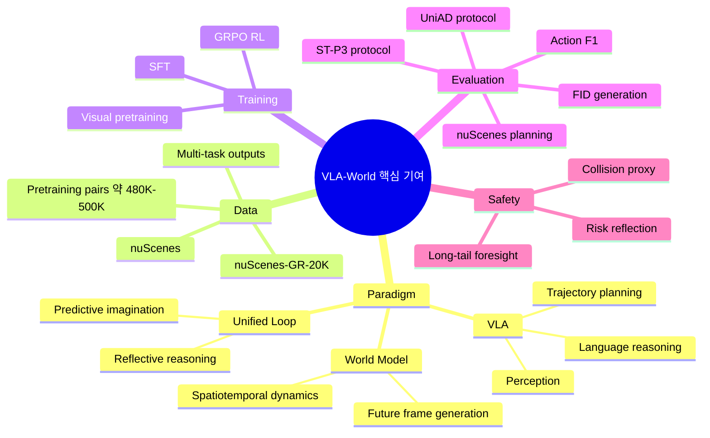
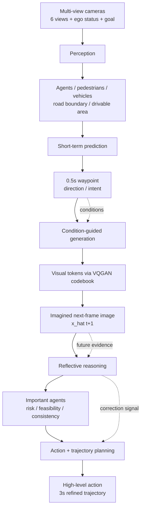
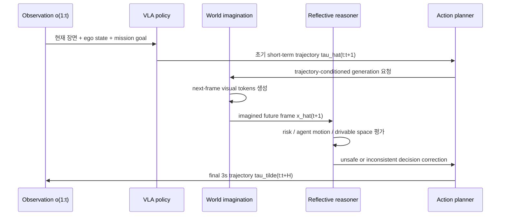
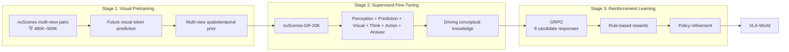
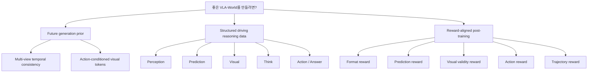
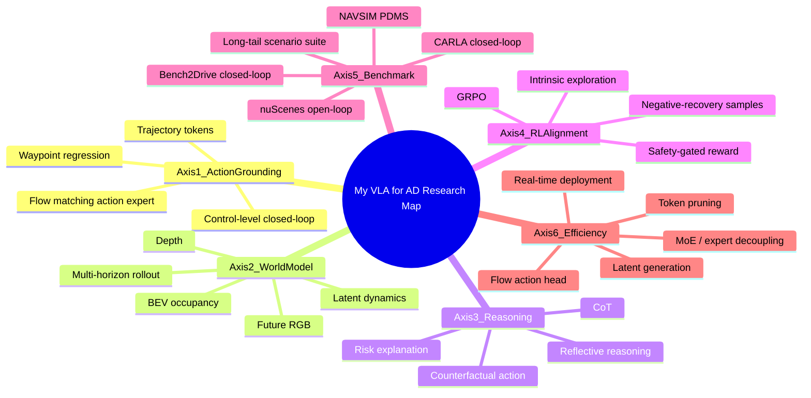
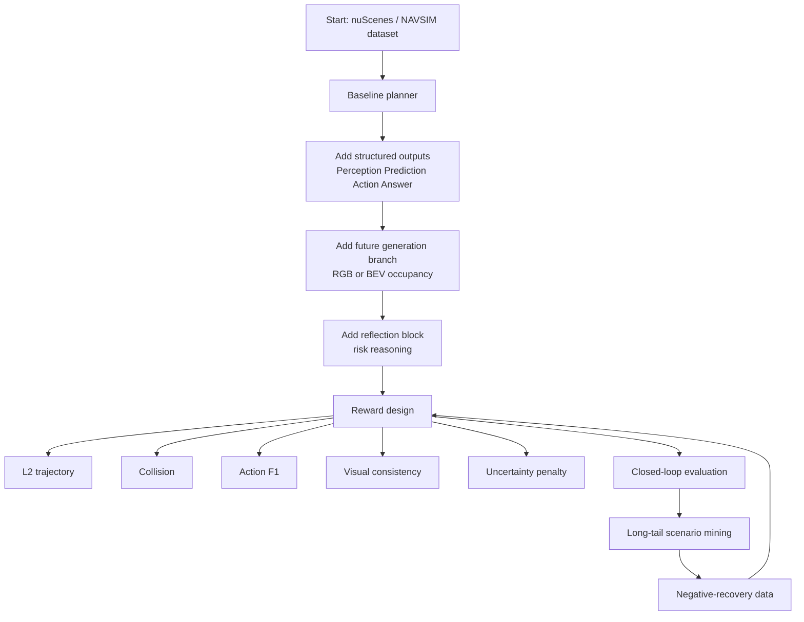

# Week 12. 최신 논문 업데이트와 개인 research map: VLA-World로 보는 “world model + VLA”의 다음 국면

## Metadata

| 항목 | 내용 |
|---|---|
| Date | 2026-07-14 |
| Week | 12 / 12 |
| Original paper/source | *Learning Vision-Language-Action World Models for Autonomous Driving* |
| Korean title | **자율주행을 위한 Vision-Language-Action World Model 학습** |
| URL | https://arxiv.org/abs/2604.09059 |
| Project page | https://vlaworld.github.io |
| Authors | Guoqing Wang, Pin Tang, Xiangxuan Ren, Guodongfang Zhao, Bailan Feng, Chao Ma |
| Version read | arXiv abstract page + arXiv source TeX 전체 추출 기반. PDF 전체 줄 단위 번역이 아니라, 논문 구조·수식·표·supplement를 한국어 학습 노트로 재구성했다. |
| Taxonomy | **VLA World Model / action-conditioned future generation / reflective reasoning / GRPO-aligned planning** |
| Reading mode | Deep read: **VLA-World** / skim: **SpanVLA**, **OneDrive**, **ExploreVLA**, **UniDriveVLA** |
| 이번 주 focus | 2026 최신 흐름, world model + VLA, open problems, 개인 research map |
| Output | **읽을 논문 20개 우선순위, open problems 5개, research map** |

> Week 12의 핵심 질문은 단순히 “VLA가 trajectory를 잘 예측하는가?”가 아니다. 이제 질문은 **VLA가 자신이 선택한 action의 가까운 미래를 상상하고, 그 상상된 미래를 다시 읽어 안전한 trajectory로 고칠 수 있는가**로 이동한다.

---

## 1. 이번 주 한 문장 결론

**VLA-World의 핵심은 `trajectory → future frame generation → reflective reasoning → refined trajectory`라는 루프를 한 모델 안에 넣어, VLA의 language reasoning과 world model의 temporal imagination을 처음으로 강하게 결합하려는 시도다.**

이 논문은 Week 03의 world model, Week 06~07의 numerical action VLA, Week 11의 GRPO/RL reasoning alignment를 한 줄로 잇는다.

1. **VLA만으로는 미래 dynamics가 약하다.**  
   기존 VLA는 perception·reasoning·action을 통합하지만, surrounding agents의 temporal dynamics와 global world consistency를 명시적으로 모델링하지 못한다.
2. **World model만으로는 반성이 약하다.**  
   future frame을 그럴듯하게 생성할 수 있어도, 그 미래가 안전한지·행동에 적절한지 평가하는 reflective reasoning이 부족하다.
3. **2026년 흐름은 “생성 자체”보다 “action-conditioned generation을 planning reward에 연결”하는 방향이다.**  
   VLA-World, ExploreVLA, SpanVLA 모두 GRPO/RL 또는 reward-based alignment를 사용해, 단순 imitation learning의 한계를 넘으려 한다.

---

## 2. 논문 제목·Abstract 한국어 번역

### 2.1 제목 번역

- **원제**: *Learning Vision-Language-Action World Models for Autonomous Driving*
- **번역**: **자율주행을 위한 Vision-Language-Action World Model 학습**
- **핵심 키워드 번역**
  - Vision-Language-Action World Model → **시각-언어-행동 월드 모델 / VLA World Model**
  - Predictive imagination → **예측적 상상 / 미래 장면 생성**
  - Reflective reasoning → **반성적 추론 / 생성된 미래에 대한 재평가**
  - Action-derived feasible trajectory → **action에서 유도된 실행 가능 trajectory**
  - Future-frame generation → **다음 프레임 생성**

### 2.2 Abstract 한국어 번역

Vision-Language-Action(VLA) 모델은 최근 perception, reasoning, control을 하나의 unified multimodal framework 안에 통합함으로써 end-to-end autonomous driving에서 주목할 만한 발전을 보였다. 그러나 이러한 모델은 종종 temporal dynamics와 global world consistency를 명시적으로 모델링하지 못하며, 이로 인해 foresight와 safety가 제한된다. 반대로 world model은 그럴듯한 미래 장면을 simulate할 수 있지만, 자신이 생성한 imagined future에 대해 reasoning하거나 평가하는 데에는 일반적으로 약하다.

본 연구에서는 driving foresight를 개선하기 위해 predictive imagination과 reflective reasoning을 통합하는 단순하지만 효과적인 VLA world model인 **VLA-World**를 제시한다. VLA-World는 먼저 action에서 유도된 feasible trajectory를 사용해 next-frame image 생성을 가이드한다. 이 과정은 주변 환경이 어떻게 변화하는지를 설명하는 풍부한 spatial·temporal cue를 포착한다. 그 다음 모델은 스스로 생성한 future imagined frame 위에서 reasoning을 수행하여 predicted trajectory를 refine하며, 더 높은 성능과 더 나은 interpretability를 달성한다.

이 pipeline을 지원하기 위해 저자들은 nuScenes에서 파생한 generative reasoning dataset인 **nuScenes-GR-20K**를 구축하고, pretraining, supervised fine-tuning, reinforcement learning을 포함하는 3-stage training strategy를 사용한다. 광범위한 실험은 VLA-World가 planning benchmark와 future-generation benchmark 모두에서 최신 VLA 및 world-model baseline을 일관되게 능가함을 보여준다.

### 2.3 Abstract를 VLA for AD 관점으로 다시 쓰기

**VLA-World는 “trajectory를 바로 내는 VLA”와 “미래 이미지를 생성하는 world model” 사이에 reflection loop를 넣는다. 첫 trajectory는 next-frame generation의 condition이 되고, 생성된 next-frame은 다시 trajectory refinement의 evidence가 된다. 따라서 action grounding은 단순 waypoint regression이 아니라 `상상된 결과를 보고 고친 waypoint`로 확장된다.**

### 2.4 제목만 보고 오해하면 안 되는 점

| 오해 | 실제 메시지 |
|---|---|
| “World model이면 long-horizon video generation이 핵심이다” | VLA-World는 긴 video rollout보다 **0.5초 next-frame**을 reflective cue로 쓰는 데 초점이 있다. |
| “미래 이미지를 잘 만들면 곧바로 planning이 좋아진다” | 생성 품질만으로는 부족하다. 생성된 frame을 읽고 위험을 평가하는 **reflective reasoning**이 필요하다. |
| “VLA-World는 closed-loop simulator에서 검증된 시스템이다” | 주 평가는 nuScenes 기반 open-loop trajectory planning, collision proxy, FID generation metric이다. 실제 closed-loop robustness는 추가 검증이 필요하다. |
| “Language는 설명용 부속품이다” | 여기서 language는 `<Perception>`, `<Prediction>`, `<Visual>`, `<Think>`, `<Action>`, `<Answer>` 형태의 structured reasoning interface다. |
| “RL은 부가 튜닝이다” | GRPO reward가 trajectory, action, visual token validity, format을 함께 압박하므로 planning-aligned post-training의 핵심이다. |

---

## 3. 핵심 기여 3~5개

| # | 핵심 기여 | 한국어 설명 | 왜 중요한가 |
|---:|---|---|---|
| 1 | **VLA + World Model 통합 paradigm** | VLA의 reasoning/action과 world model의 future imagination을 한 autoregressive framework로 묶는다. | VLA는 미래 dynamics가 약하고, world model은 consequence reasoning이 약하다는 상호 보완 문제를 직접 겨냥한다. |
| 2 | **Action-conditioned next-frame generation** | 초기 short-term trajectory와 direction을 condition으로 0.5초 뒤 future frame visual token을 생성한다. | action이 실제 세계 변화를 어떻게 만들지 “시각적 scratchpad”로 펼쳐 action grounding을 강화한다. |
| 3 | **Reflective reasoning over imagined future** | 생성된 future frame을 다시 읽어 salient agent, risk, feasibility를 판단하고 최종 3초 trajectory를 refine한다. | 단순 imitation/regression이 아니라 `imagine-then-reflect` 루프를 만든다. |
| 4 | **nuScenes-GR-20K dataset** | nuScenes 기반 generation + reasoning 조건부 20K sample을 구축한다. | future generation, perception, prediction, reasoning, action planning을 한 output sequence 안에서 학습시키는 데이터 기반을 제공한다. |
| 5 | **3-stage training + GRPO** | visual pretraining → multi-task SFT → GRPO RL로 generation·reasoning·trajectory를 정렬한다. | Week 11의 RL reasoning alignment가 world model token까지 확장되는 사례다. |

### Contribution map



---

## 4. VLA for AD taxonomy 위치

### 4.1 Taxonomy 좌표

| 분석 축 | VLA-World 위치 | 해석 |
|---|---|---|
| System type | **End-to-end VLA World Model** | perception, short-term prediction, generation, reasoning, action planning을 하나의 structured autoregressive output으로 구성한다. |
| Input | six camera multi-view image, ego status, history, mission goal | nuScenes의 6-camera 360도 observation과 velocity/acceleration/yaw rate/CAN signal류 ego state를 사용한다. |
| Intermediate output | perception description, 0.5s waypoint/direction, visual tokens for next frame, think block | 중간 단계가 모두 text/token sequence로 드러나 interpretability를 제공한다. |
| Final output | high-level action + 3초 horizon trajectory / waypoint sequence | action grounding은 최종적으로 numerical trajectory에 걸린다. |
| Language role | structured reasoning scaffold + reflective risk assessment | language는 “설명”이 아니라 미래 frame을 읽고 trajectory를 고치는 cognitive layer다. |
| Action grounding | **trajectory-conditioned generation + refined trajectory planning** | 초기 action이 next-frame generation을 condition하고, 생성된 미래가 다시 action을 수정한다. |
| Training recipe | visual pretraining → SFT → GRPO | generation knowledge, driving conceptual knowledge, reward-aligned reasoning을 단계적으로 주입한다. |
| Dataset/benchmark | nuScenes, nuScenes-GR-20K, generation pretraining pairs, ST-P3/UniAD metrics, FID | open-loop planning과 image generation quality를 동시에 평가한다. |
| Open-loop vs closed-loop | **주로 open-loop** | collision rate가 포함되지만 closed-loop simulator intervention은 핵심 실험이 아니다. |
| Safety/long-tail risk | collision proxy, future risk reflection, generated-frame hallucination 위험 | safety-aware라고 주장할 근거는 있지만, OOD/closed-loop/uncertainty 검증은 아직 부족하다. |
| Limitations | generated future fidelity, reward hacking, visual-token cost, 0.5s horizon 한계, real-time latency | “상상해서 반성”하는 구조가 실제 운전에서 안정적으로 반복될지는 추가 검증이 필요하다. |

### 4.2 12주 커리큘럼 안에서의 위치

```mermaid
flowchart LR
  W1[Week 01<br/>VLA taxonomy] --> W2[Week 02<br/>End-to-End AD / UniAD]
  W2 --> W3[Week 03<br/>World Model / Drive-WM]
  W3 --> W4[Week 04<br/>DriveLM / Explainable driving]
  W4 --> W5[Week 05<br/>CoT / RAG / instruction]
  W5 --> W6[Week 06<br/>LMDrive / numerical action]
  W6 --> W7[Week 07<br/>AutoVLA / efficiency]
  W7 --> W8[Week 08<br/>Dual-System VLA]
  W8 --> W9[Week 09<br/>VLM supervision]
  W9 --> W10[Week 10<br/>Dataset & Benchmark]
  W10 --> W11[Week 11<br/>RL reasoning alignment]
  W11 --> W12[Week 12<br/>VLA-World + research map]

  W3 -. world imagination .-> W12
  W6 -. trajectory grounding .-> W12
  W11 -. GRPO / reward .-> W12
```



### 4.3 VLA-World의 taxonomy상 핵심 질문

| 질문 | VLA-World의 답 |
|---|---|
| VA인가 VLA인가? | language reasoning과 action trajectory를 같이 내므로 VLA다. |
| World model인가 planner인가? | 둘 다다. next-frame generation은 world model, refined trajectory는 planner다. |
| Action이 world model에 영향을 주는가? | 그렇다. predicted short-term trajectory가 future frame generation의 condition이다. |
| Language가 action을 실제로 바꾸는가? | 논문은 `<Think>` reasoning과 GRPO reward가 final trajectory를 refine한다고 주장하며 ablation으로 reasoning 제거 시 성능 저하를 보인다. |
| closed-loop인가? | 아니다. 주로 nuScenes open-loop benchmark다. ExploreVLA/OneDrive류와 비교할 때 closed-loop 평가 축을 별도로 봐야 한다. |

---

## 5. Architecture / pipeline 시각화

### 5.1 VLA-World 전체 pipeline



### 5.2 “상상하고 반성하는” 정보 흐름



### 5.3 Training recipe 시각화



### 5.4 Structured output block

```text
<Perception>
  surrounding agents, road shoulder distance, drivable area, semantic layout
</Perception>
<Prediction>
  0.5s short-term waypoint + direction
</Prediction>
<Visual>
  generated visual tokens for next-frame image
</Visual>
<Think>
  imagined future frame을 보고 risk / interaction / feasibility 판단
</Think>
<Action>
  high-level action: keep / accelerate / decelerate / stop / turn...
</Action>
<Answer>
  refined 3-second trajectory waypoints
</Answer>
```

---

## 6. Input → Reasoning → Action Grounding 분석

### 6.1 Input-output map

| 단계 | 입력 | 출력 | Action grounding과의 관계 |
|---|---|---|---|
| Perception | six camera images, ego state, mission goal | object/agent, road boundary, drivable region, scene description | trajectory를 직접 만들기 전의 spatial grounding |
| Short-term prediction | perception result, history ego state, goal | 0.5s waypoint, direction | world model generation을 condition하는 action prior |
| Generation | current observation + predicted trajectory | next-frame visual tokens / future image | “내가 이 trajectory를 따르면 어떤 장면이 될까?”를 시각화 |
| Thinking | current observation + imagined future frame + trajectory | risk, salient agents, feasibility 판단 | unsafe trajectory를 language reasoning으로 발견 |
| Planning | reflective reasoning result | high-level action + 3s trajectory | 최종 numerical action grounding |

### 6.2 VLA-World의 action grounding 특징

| 축 | 일반 VLA | 일반 World Model | VLA-World |
|---|---|---|---|
| Action representation | trajectory / control token 직접 출력 | action을 조건으로 future state rollout | trajectory를 먼저 내고, 그 결과를 생성한 뒤 다시 refine |
| Future dynamics | 암묵적 | 명시적 generation/latent transition | next-frame image로 명시화 |
| Reasoning | language CoT 가능 | 보통 약함 | generated future에 대한 reflective reasoning |
| Safety signal | collision/L2 reward 또는 imitation | simulation fidelity 중심 | trajectory, action, visual validity, format reward 결합 |
| 해석 가능성 | text가 있으면 높음 | latent/video는 해석 어려움 | `<Visual>` + `<Think>`로 action consequence를 추적 가능 |

### 6.3 핵심 수식 직관

논문은 VLA-World를 다음 joint distribution으로 본다.

```text
p(trajectory, next_frame | observation_history, goal)
= p(trajectory | observation_history, goal)
  × p(next_frame | observation_history, short_term_trajectory)
```

한국어로 풀면:

1. 먼저 현재 장면과 goal을 보고 **어떤 trajectory가 가능한지** 예측한다.
2. 그 trajectory를 실행하면 **다음 frame이 어떻게 보일지** 생성한다.
3. 생성된 frame이 위험하거나 모순적이면 **trajectory를 고친다**.

이 구조가 중요한 이유는 pure VLA와 pure world model의 약점을 각각 피하기 때문이다.

| 모델 | 최적화하는 것 | 빠지는 정보 |
|---|---|---|
| Pure VLA | `p(trajectory | observation, goal)` | action consequence가 명시적이지 않음 |
| Pure World Model | `p(next_frame | observation, action)` | generated future가 안전한지 판단하는 policy reasoning |
| VLA-World | `p(trajectory, next_frame | observation, goal)` | 둘을 하나의 reward-aligned token sequence로 묶음 |

---

## 7. Training recipe

### 7.1 Stage 1 — Visual pretraining

| 항목 | 내용 |
|---|---|
| 목적 | VLA backbone에 **visual understanding + visual generation** 능력을 활성화 |
| 데이터 | nuScenes 기반 multi-view current/future image pair, 논문 본문 기준 약 480K sample pair, supplement 표현 기준 약 500K |
| 입력 | 현재 multi-view image set, ego status, view/instruction |
| 출력 | 지정 camera view의 0.5초 뒤 visual token sequence |
| tokenizer | VQGAN codebook 기반 discrete visual token |
| 차별점 | FSDrive가 front-view 중심이었다면, VLA-World는 **multi-view consistency**를 강조 |

### 7.2 Stage 2 — Supervised fine-tuning

| 학습 task | 설명 | 기대 효과 |
|---|---|---|
| Perception | vehicles/pedestrians, 3D position, road shoulder, drivable area 추정 | spatial grounding |
| Short-term prediction | 0.5s waypoint와 direction 예측 | generation condition 안정화 |
| Condition-guided generation | predicted trajectory를 조건으로 next frame visual token 생성 | action consequence 시각화 |
| Thinking with visual tokens | generated future를 보고 risk·interaction·feasibility 판단 | reflection 능력 확보 |
| Action and trajectory planning | high-level action과 3초 waypoint trajectory 출력 | 최종 action grounding |

### 7.3 Stage 3 — GRPO reinforcement learning

VLA-World는 SFT checkpoint에서 시작해 GRPO를 1 epoch 수행한다. 각 prompt마다 8개 candidate response를 sampling하고, rule-based reward로 상대 advantage를 계산한다.

| Reward | 역할 | 한국어 해석 |
|---|---|---|
| `R_fmt` | output format 준수 | `<Perception>`, `<Prediction>`, `<Visual>`, `<Think>`, `<Action>`, `<Answer>` 구조를 깨지 않게 함 |
| `R_pred` | short-term prediction 정확도와 long-term trajectory consistency | 0.5s prediction과 최종 3s trajectory가 따로 놀지 않게 함 |
| `R_vis` | visual token 길이와 codebook validity | 생성 frame이 decode 가능한 유효 token이 되게 함 |
| `R_act` | high-level action F1 | keep/accelerate/decelerate/stop/turn 등의 decision을 ground truth에 맞춤 |
| `R_traj` | 3s trajectory accuracy + kinematic consistency | waypoint L2와 acceleration smoothness를 압박 |

### 7.4 Training hyperparameter 요약

| 항목 | 값 / 설명 |
|---|---|
| Backbone | Qwen2-VL-2B 기반. supplement에는 Qwen2-VL-7B scaling도 제시 |
| Hardware | 본문: 8×80GB GPU, supplement: 8×A100 training 및 4×A100 inference 언급 |
| Pretraining | 30 epochs, AdamW, lr 5e-4, per-device batch size 16 |
| SFT | 12 epochs, AdamW, lr 1e-4 |
| RL | GRPO 1 epoch, lr 1e-6, global batch size 16, 8 candidate responses |
| KL regularization | supplement 기준 KL coefficient 1e-2 |
| Framework | supplement: LLaMA Factory for pretrain/SFT, Easy-R1 for RL |

### 7.5 학습 recipe에서 배울 점



---

## 8. Dataset / Benchmark / Metric 분석

### 8.1 Dataset

| Dataset | 용도 | 구성 / 특징 | 해석 |
|---|---|---|---|
| nuScenes | planning/generation 평가 및 학습 기반 | 1,000 scenes, 각 약 20초, 6 cameras, LiDAR, CAN/ego state | VLA for AD의 표준 open-loop 실험장 |
| Visual pretraining pairs | next-frame generation pretraining | nuScenes에서 current/future image pair 약 480K~500K | world imagination prior 학습 |
| nuScenes-GR-20K | SFT/RL용 generation-reasoning dataset | 20K samples, generated future + reasoning conditioned task | VLA-World의 핵심 데이터셋 |

### 8.2 Planning metric

| Metric | 의미 | 장점 | 한계 |
|---|---|---|---|
| L2 error | predicted waypoint와 ground truth trajectory 거리 | trajectory fidelity 측정이 간단 | multimodal future에서 하나의 GT만 정답으로 보는 문제 |
| Collision rate | predicted trajectory의 collision proxy | safety와 더 직접 연결 | open-loop proxy라 실제 closed-loop recovery를 보장하지 않음 |
| ST-P3 protocol | 평균 timestep 누적 방식 | 기존 planner와 비교 가능 | protocol에 따라 수치 해석이 달라짐 |
| UniAD protocol | 각 timestep 별 평가 | UniAD 계열과 비교 가능 | 동일 model도 protocol에 따라 성능 인상이 달라짐 |

### 8.3 Generation metric

| Metric | 의미 | VLA-World 결과 | 해석 |
|---|---|---|---|
| FID ↓ | generated future frame의 visual distribution quality | VLA-World FID 9.8 | FSDrive 10.1, Drive-WM 15.8, DriveDreamer 52.6 등보다 좋다고 보고 |
| Qualitative visualization | 0.5s future frame coherence | FSDrive보다 object coherence와 sharpness가 좋다고 주장 | qualitative는 cherry-pick 가능성이 있어 benchmark 확대 필요 |

### 8.4 주요 결과 요약

| 평가 축 | VLA-World 결과 | 비교 포인트 |
|---|---|---|
| ST-P3 L2 avg | VLA-World 0.30, VLA-World* 0.26 | FSDrive* 0.28와 근접/개선, non-autoregressive BEV-Planner* 0.35보다 좋음 |
| ST-P3 Collision avg | VLA-World 0.10, VLA-World* 0.08 | FSDrive* 0.10, RDA-Driver* 0.10과 경쟁적 |
| UniAD L2 avg | VLA-World 0.83, VLA-World* 0.42 | VLA-World*가 UniAD* 0.46보다 낮다고 보고 |
| UniAD Collision avg | VLA-World 0.16, VLA-World* 0.12 | FSDrive* 0.16보다 낮음 |
| Action F1 | forward 95.88, left 74.22, right 75.06, stop 81.24 | Qwen2-VL-2B†보다 전반 향상 |
| FID | 9.8 | FSDrive 10.1 대비 소폭 향상 |

### 8.5 Evaluation matrix — open-loop와 closed-loop 관점

| 방법 | Open-loop L2/Collision | Closed-loop | Generation | Reasoning | 주의점 |
|---|---:|---:|---:|---:|---|
| VLA-World | 강함 | 제한적/미제시 | 강함 | 강함 | 실제 simulator policy recovery는 추가 필요 |
| ExploreVLA | NAVSIM/nuScenes 강함 | NAVSIM PDMS/EPDMS 제시 | RGB+depth dense world modeling | RL exploration | uncertainty reward가 safety-gated라 흥미로움 |
| OneDrive | nuScenes 0.28 L2 / 0.18 collision 보고 | NAVSIM 86.8 PDMS 보고 | multi-modal generation 유지 | multi-task structured decoder | unified decoder와 latency 40% 감소가 포인트 |
| UniDriveVLA | nuScenes open-loop SOTA 주장 | Bench2Drive closed-loop | generation보다 perception/action 중심 | expert decoupling | perception-reasoning conflict 해결에 초점 |
| SpanVLA | NAVSIM v1/v2 경쟁력 | NAVSIM 중심 | generation보다는 flow action expert | negative-recovery RL | latency와 robustness 중심 |

---

## 9. 관련 논문 비교표

### 9.1 2026 skim papers

| 논문 | 핵심 아이디어 | Input/Output | Training | Benchmark | VLA-World와의 관계 |
|---|---|---|---|---|---|
| **SpanVLA** | autoregressive reasoning + flow-matching action expert를 결합해 action generation latency를 줄임. negative-recovery sample로 robustness 강화 | VLM reasoning → flow policy trajectory | GRPO post-training, mReasoning dataset, positive + negative-recovery samples | NAVSIM v1/v2 | VLA-World가 future imagination이라면 SpanVLA는 **fast action expert + recovery learning** 축 |
| **OneDrive** | single causal transformer decoder 안에서 text generation, object detection, trajectory regression 등 heterogeneous decoding을 통합 | visual/structured query tokens → language + detection + trajectory | pretrained VLM attention 재사용, structured trajectory queries | nuScenes, NAVSIM closed-loop PDMS 86.8 | VLA-World가 world-model loop라면 OneDrive는 **unified decoder architecture** 축 |
| **ExploreVLA** | future RGB+depth generation을 dense world modeling objective로 사용하고, prediction uncertainty를 intrinsic reward로 삼음 | trajectory prediction + RGB/depth future generation | safety-gated intrinsic reward + GRPO | NAVSIM PDMS 93.7, EPDMS 88.8, nuScenes | VLA-World와 가장 가까운 형제. 둘 다 world model + RL이지만 ExploreVLA는 **exploration reward**가 핵심 |
| **UniDriveVLA** | understanding, perception, action planning expert를 Mixture-of-Transformers로 decouple | driving understanding + 3D perception + planning | masked joint attention, sparse perception, 3-stage progressive training | nuScenes, Bench2Drive closed-loop | VLA-World가 imagination-reasoning 결합이라면 UniDriveVLA는 **perception-reasoning conflict decoupling** 축 |

### 9.2 기존 주요 논문과의 위치 비교

| 축 | UniAD | Drive-WM / OccWorld | DriveLM | LMDrive | DriveVLM | Drive-R1 | VLA-World |
|---|---|---|---|---|---|---|---|
| Main goal | planning-oriented end-to-end AD | future scene/world dynamics | graph VQA reasoning | language-conditioned closed-loop driving | dual-system reasoning+planner | RL aligns reasoning to trajectory | imagination + reflection loop |
| Language | 없음/약함 | 없음/약함 | 강함 | 명령/설명 | 강함 | 강함 | 강함 |
| Action output | trajectory/planning | future occupancy/image; planning 보조 | QA 중심 | waypoint/control | planner output | trajectory | trajectory + generated future |
| World modeling | BEV task 통합 | 핵심 | 없음 | 약함 | 일부 | 없음/약함 | 핵심 |
| RL/post-training | 아님 | 보통 아님 | 아님 | imitation 중심 | 일부 아님 | GRPO/RL | GRPO/RL |
| Closed-loop | 제한적 | 제한적 | 아님 | CARLA | 일부 | 아님 | 아님/제한적 |
| 가장 큰 lesson | perception-planning 통합 | 미래 예측 필요 | 설명은 가능 | action grounding 필요 | slow/fast interface | reward가 reasoning을 고쳐야 함 | 미래를 상상하고 반성해야 함 |

### 9.3 20개 논문 우선순위 reading list

| 우선순위 | 논문 / 프로젝트 | 읽는 목적 | 추천 깊이 |
|---:|---|---|---|
| 1 | **Learning Vision-Language-Action World Models for Autonomous Driving / VLA-World** | 2026 world model + VLA 통합의 기준점 | Deep |
| 2 | **ExploreVLA** | world modeling을 dense supervision과 exploration reward로 쓰는 방법 | Deep |
| 3 | **OneDrive** | heterogeneous decoding을 single causal decoder로 통합하는 architecture | Deep |
| 4 | **UniDriveVLA** | perception-reasoning conflict를 expert decoupling으로 푸는 접근 | Deep |
| 5 | **SpanVLA** | latency와 negative-recovery learning을 동시에 다루는 최신 VLA | Deep |
| 6 | **FSDrive / FutureSightDrive** | VLA-World의 직접 baseline, future frame generation 연결고리 | Deep |
| 7 | **AutoVLA** | adaptive reasoning / efficient VLA trajectory generation 흐름 | Medium |
| 8 | **OpenDriveVLA** | open-source VLA driving stack과 numerical action grounding | Medium |
| 9 | **Drive-R1** | GRPO로 reasoning-action alignment를 만드는 방법 | Deep |
| 10 | **DriveAgent-R1** | agentic/RL reasoning for driving의 대안 축 | Medium |
| 11 | **AlphaDrive** | RL 또는 self-improvement 계열 driving reasoning | Medium |
| 12 | **DriveBench** | VLM/VLA benchmark의 blind spot와 visual grounding audit | Deep |
| 13 | **UniAD** | planning-oriented end-to-end AD의 classical anchor | Deep |
| 14 | **VAD / VADv2** | vectorized planning과 end-to-end trajectory metric 이해 | Medium |
| 15 | **BEV-Planner** | ego-state 사용과 BEV planning baseline 비교 | Medium |
| 16 | **Drive-WM** | image/video world model for driving의 기본 | Deep |
| 17 | **OccWorld** | occupancy-based world model과 planning coupling | Deep |
| 18 | **DriveDreamer / WorldDreamer** | generative driving simulation의 장단점 | Medium |
| 19 | **DriveLM** | language reasoning benchmark와 graph VQA foundation | Medium |
| 20 | **LMDrive** | closed-loop CARLA에서 language-conditioned waypoint driving | Deep |

---

## 10. 강점과 한계

### 10.1 강점

| 강점 | 설명 | 연구적으로 중요한 이유 |
|---|---|---|
| **명확한 paradigm gap 정의** | VLA는 foresight 부족, world model은 reflection 부족이라고 문제를 잘 나눈다. | 2026 research map의 큰 축을 제공한다. |
| **Action-conditioned generation** | trajectory가 future frame을 condition한다. | action consequence를 시각적으로 펼치므로 action grounding이 강해진다. |
| **Reflective reasoning loop** | 생성된 frame을 보고 trajectory를 refine한다. | 단순 explanation이 아닌 decision correction으로 language를 사용한다. |
| **Training stage 설계가 합리적** | pretrain/SFT/RL이 각각 generation, driving knowledge, reward alignment 역할을 맡는다. | VLA post-training recipe의 blueprint로 쓸 수 있다. |
| **다중 metric 평가** | L2, collision, action F1, FID, ablation을 제시한다. | planning과 generation을 동시에 보려는 시도다. |

### 10.2 한계 / critical commentary

| 한계 | 왜 문제인가 | 후속 연구 질문 |
|---|---|---|
| **Closed-loop 검증 부족** | open-loop L2와 collision proxy가 실제 주행 recovery를 보장하지 않는다. | CARLA, NAVSIM, Bench2Drive에서 intervention/recovery를 평가하면 어떨까? |
| **0.5초 next-frame의 horizon 한계** | 너무 짧은 미래는 long-tail hazard anticipation에 부족할 수 있다. | multi-horizon imagination: 0.5s, 1.5s, 3s를 계층적으로 생성할 수 있을까? |
| **Generated image hallucination risk** | 틀린 future frame을 믿고 trajectory를 고칠 수 있다. | uncertainty-aware reflection 또는 ensemble world model이 필요하다. |
| **Visual token cost / latency** | autoregressive visual token generation은 real-time driving에 부담이 될 수 있다. | SpanVLA식 flow action expert나 latent-space generation으로 줄일 수 있을까? |
| **Reward hacking 가능성** | format/token validity reward가 실제 safety와 어긋날 수 있다. | human preference보다 rule-based safety verifier와 closed-loop reward를 결합해야 한다. |
| **Dataset dependency** | nuScenes-GR-20K의 annotation quality와 scene diversity가 성능 상한을 결정한다. | adverse weather, rare pedestrian behavior, construction zone 데이터를 어떻게 넣을까? |
| **Interpretability의 착시** | `<Think>`가 있어도 실제 internal causal mechanism을 완전히 설명하지는 않는다. | generated frame ablation, counterfactual action test, causal intervention이 필요하다. |

### 10.3 Safety / long-tail risk 관점 checklist

| Risk scenario | VLA-World가 도움 되는 부분 | 아직 약한 부분 |
|---|---|---|
| 갑자기 끼어드는 차량 | 0.5s future frame에서 relative motion cue를 포착할 수 있음 | 0.5s보다 긴 anticipation 필요 |
| 횡단보도 보행자 | generated future에서 pedestrian drift를 볼 수 있음 | rare intent 예측은 데이터 의존 |
| occlusion 뒤 객체 | world model imagination이 가설을 만들 수 있음 | hallucination과 실제 hidden object 구분 필요 |
| 비정상 교통 규칙 위반 | reflective reasoning이 위험을 설명할 수 있음 | rule-based reward가 모든 규칙 위반을 커버하지 못함 |
| OOD weather/night | generation prior가 도움이 될 수도 있음 | visual fidelity와 calibration 불확실 |

---

## 11. 실전 학습 포인트

### 11.1 개인 research map



### 11.2 2026 최신 흐름을 한 장으로 정리

| 흐름 | 대표 논문 | 핵심 질문 | 내가 봐야 할 포인트 |
|---|---|---|---|
| **World model + VLA** | VLA-World, ExploreVLA | action consequence를 어떻게 imagination으로 만들고 planning에 연결할까? | generation이 planning metric을 실제로 올리는지 ablation 확인 |
| **Efficient action generation** | SpanVLA, AutoVLA, FastDriveVLA | VLM reasoning은 느린데 real-time action은 어떻게 만들까? | flow-matching action expert, token pruning, adaptive reasoning |
| **Unified architecture** | OneDrive, UniDriveVLA | perception, text, trajectory decoder를 나누지 않고 통합할 수 있을까? | structured query token, MoT/MoE, masked joint attention |
| **RL/reasoning post-training** | Drive-R1, ExploreVLA, VLA-World | CoT와 trajectory를 reward로 정렬할 수 있을까? | GRPO reward design, reward hacking, SFT cold start |
| **Closed-loop benchmark** | NAVSIM, Bench2Drive, CARLA | open-loop L2가 실제 주행 안전을 반영하는가? | PDMS/EPDMS, intervention, recovery, long-tail scenario |

### 11.3 Open problems 5개

| # | Open problem | 구체적 research question | 가능한 실험 |
|---:|---|---|---|
| 1 | **Closed-loop imagination validation** | generated future frame이 closed-loop policy recovery에 실제로 도움 되는가? | VLA-World 스타일 model을 NAVSIM/Bench2Drive에서 ablation: no-generation vs generation vs uncertainty-generation |
| 2 | **Uncertainty-aware world model** | hallucinated future를 reasoner가 얼마나 믿어야 하는가? | visual token likelihood, ensemble disagreement, depth/RGB consistency를 risk score로 변환 |
| 3 | **Multi-horizon reflective planning** | 0.5초 next-frame만으로 3초 trajectory가 충분히 안전한가? | 0.5s/1.5s/3s hierarchical generation과 planning L2/collision 비교 |
| 4 | **Fast action expert + slow reflection interface** | reflective VLA는 느린데 real-time driving action을 어떻게 보장할까? | SpanVLA식 flow policy를 VLA-World의 refined trajectory head로 교체 |
| 5 | **Long-tail negative-recovery learning** | 실패 trajectory와 recovery behavior를 world model + RL에 어떻게 넣을까? | negative samples를 생성하고, collision-imagined frame에서 recovery action reward 설계 |

### 11.4 실전 구현 blueprint



### 11.5 내가 다음에 직접 만들 수 있는 mini-project

| Mini-project | 목표 | 최소 구현 |
|---|---|---|
| **World-model ablation notebook** | future frame/BEV prediction이 trajectory L2를 줄이는지 확인 | nuScenes sample에서 current frame + ego trajectory → simple future BEV occupancy predictor |
| **Reflective verifier** | generated future와 planned trajectory의 collision/rule violation을 text로 지적 | VLM에게 image + trajectory overlay를 주고 risk checklist 출력 |
| **Uncertainty-gated planner** | world model confidence가 낮으면 conservative action 선택 | generation likelihood/variance 기반 slow-down heuristic |
| **Negative-recovery dataset slice** | failure trajectory와 recovery action pair 수집 | NAVSIM/CARLA에서 collision-near miss scenario mining |
| **Latency benchmark** | VLA token generation과 action head latency 비교 | autoregressive trajectory token vs flow matching head vs MLP head |

---

## 12. 다음 주 질문

이번 12주 curriculum은 한 바퀴를 완료했고, `next_week`는 1로 돌아간다. 다음 주는 다시 **Week 01: VLA for AD 지형도와 taxonomy**로 시작하되, 이제는 초기 taxonomy를 2026년 논문 흐름으로 업데이트해서 읽는 것이 좋다.

### 다음 cycle에서 던질 질문

1. **VLA for AD taxonomy를 2026년 기준으로 다시 그리면 어떤 축이 추가되어야 하는가?**  
   기존 `VA vs VLA`, `end-to-end vs dual-system`에 더해 `world-model loop`, `RL post-training`, `closed-loop benchmark`, `latency architecture` 축이 필요하다.
2. **“설명 가능한 VLA”와 “반성해서 action을 고치는 VLA”는 어떻게 구분할 것인가?**  
   DriveLM식 QA reasoning과 VLA-World식 reflective planning은 같은 language를 쓰지만 평가 metric이 다르다.
3. **open-loop L2/collision과 closed-loop PDMS/EPDMS 사이의 gap을 어떻게 줄일 것인가?**  
   앞으로는 nuScenes만 보지 말고 NAVSIM, Bench2Drive, CARLA closed-loop를 함께 봐야 한다.
4. **World model의 output은 RGB, depth, BEV occupancy, latent token 중 무엇이 planning에 가장 유용한가?**  
   VLA-World는 RGB next-frame이고, ExploreVLA는 RGB+depth dense modeling이다. OccWorld는 occupancy 축을 제공한다.
5. **개인 연구 주제는 무엇으로 좁힐 것인가?**  
   추천: **uncertainty-aware VLA world model for closed-loop long-tail recovery**.

### 다음 cycle의 추천 첫 산출물

| 산출물 | 내용 |
|---|---|
| Updated taxonomy map | VLA, world model, RL, benchmark, efficiency를 포함한 2차원/3차원 taxonomy |
| Paper matrix v2 | 이번 주 20개 논문을 축별로 다시 분류 |
| Research proposal 1-page | problem, hypothesis, dataset, method, metric, risk를 한 페이지로 정리 |

---

## 13. 참고 링크

### Main paper

- arXiv: https://arxiv.org/abs/2604.09059
- PDF: https://arxiv.org/pdf/2604.09059
- Project page: https://vlaworld.github.io

### 2026 skim papers

- SpanVLA: https://arxiv.org/abs/2604.19710
- OneDrive: https://arxiv.org/abs/2604.17915
- OneDrive GitHub: https://github.com/Z1zyw/OneDrive
- ExploreVLA: https://arxiv.org/abs/2604.02714
- ExploreVLA project: https://zihaosheng.github.io/ExploreVLA/
- UniDriveVLA: https://arxiv.org/abs/2604.02190
- UniDriveVLA GitHub: https://github.com/xiaomi-research/unidrivevla

### 연결해서 다시 볼 이전 주제

- Week 03: World Model 기초 — Drive-WM / OccWorld
- Week 06: Numerical Action Generator — LMDrive
- Week 08: Dual-System VLA — DriveVLM
- Week 10: Dataset & Benchmark — DriveBench
- Week 11: RL / Reasoning 강화 — Drive-R1

---

## Appendix. 한 줄 요약 카드

| 카드 | 내용 |
|---|---|
| 논문 한 줄 | VLA-World는 trajectory로 미래 frame을 생성하고, 그 미래를 다시 읽어 trajectory를 refine하는 VLA world model이다. |
| 가장 중요한 그림 | `Observation → Prediction → Generation → Reflection → Action` loop |
| 가장 중요한 metric | open-loop L2/collision + FID + action F1, 그러나 closed-loop는 아직 부족 |
| 가장 중요한 후속 질문 | generated future의 uncertainty를 어떻게 planning safety로 연결할 것인가? |
| 개인 연구 후보 | uncertainty-aware VLA world model for closed-loop long-tail recovery |
