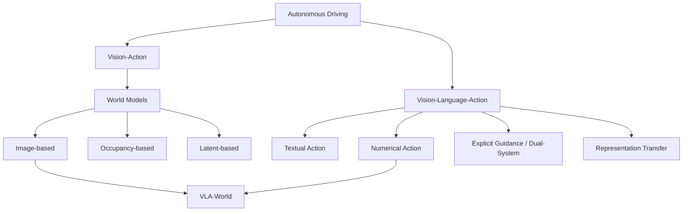
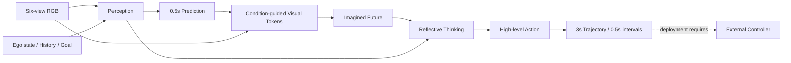
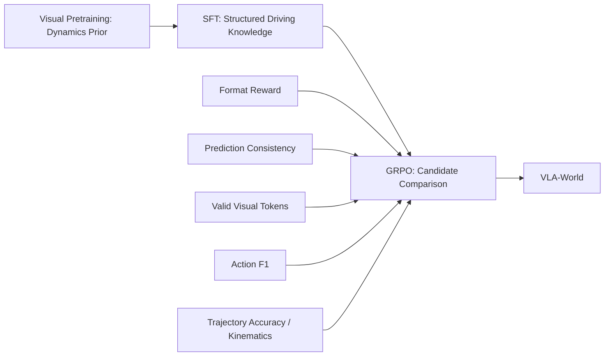
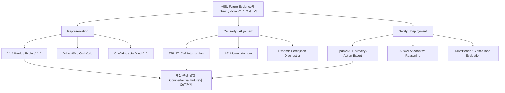

# Week 12. 최신 논문 업데이트와 개인 research map

- 날짜: 2026-10-06 (Asia/Seoul)
- 주차: 12 / 12 — 두 번째 순환의 종합 정리
- Deep-read: **Learning Vision-Language-Action World Models for Autonomous Driving** (VLA-World)
- 한국어 제목: **자율주행을 위한 Vision-Language-Action world model 학습**
- 원문: https://arxiv.org/abs/2604.09059 ; 읽은 본문: https://arxiv.org/html/2604.09059v1
- 저자: Guoqing Wang, Pin Tang, Xiangxuan Ren, Guodongfang Zhao, Bailan Feng, Chao Ma
- 원문 버전: v1, 2026-04-10
- Taxonomy: End-to-End VLA / Numerical Action Generator + image-based world model
- Reading mode: arXiv HTML 본문 및 Appendix A/B 상세 읽기; SpanVLA·OneDrive·ExploreVLA·UniDriveVLA는 arXiv API Abstract skim; 최신 논문은 API Abstract 탐색
- 근거 구분: **[원문]**은 논문 보고, **[해석]**은 학습용 설명, **[제안]**은 개인 연구 설계입니다. 수치는 독립 재현 결과가 아닙니다.
- 범위 제한: PDF 전체 줄별 번역이나 모델 실행은 수행하지 않았습니다. HTML 수식은 중복 렌더링될 수 있어 서술과 표를 교차 확인했습니다. 비교 논문의 본문 미확인 정보는 추정하지 않습니다.

## 1. 이번 주 한 문장 결론

**미래를 그리는 능력보다 중요한 것은, 그 미래가 action을 실제로 개선하는지와 잘못된 imagination에도 안전한지를 검증하는 일입니다.**

[원문] VLA-World는 `현재 관찰 → 0.5초 계획 → 미래 이미지 생성 → 위험 추론 → 3초 trajectory`를 하나의 autoregressive 모델로 연결합니다. [해석] 이는 설명을 덧붙이는 VLA가 아니라, 생성된 미래를 의사결정 중간 표현으로 사용하는 VLA입니다. 그러나 논문 실험은 nuScenes open-loop 중심이므로 실차 closed-loop 안전성까지 입증했다고 읽으면 안 됩니다.

## 2. 논문 제목·Abstract 한국어 번역

### 제목

**자율주행을 위한 Vision-Language-Action world model 학습**

### Abstract 번역

Vision-Language-Action(VLA) 모델은 지각, 추론, 제어를 통합된 multimodal framework에 결합하면서 최근 end-to-end 자율주행에서 주목할 만한 진전을 이루었습니다. 그러나 시간에 따른 dynamics와 전역적인 world consistency를 명시적으로 모델링하지 않는 경우가 많아, 미래를 내다보는 능력과 안전성이 제한됩니다. 반면 world model은 그럴듯한 미래 장면을 시뮬레이션할 수 있지만, 자신이 생성한 미래를 추론하거나 평가하는 데 일반적으로 어려움을 겪습니다.

이 연구에서는 예측적 imagination과 reflective reasoning을 통합하여 주행의 foresight를 개선하는, 단순하지만 효과적인 VLA world model인 VLA-World를 제안합니다. VLA-World는 먼저 action에서 도출한 실행 가능한 trajectory를 사용하여 다음 프레임 이미지 생성을 유도합니다. 이 이미지는 주변 환경이 어떻게 변화하는지를 설명하는 풍부한 공간·시간 단서를 담습니다. 이어 모델은 자신이 생성한 미래 프레임을 추론하여 예측 trajectory를 보정하고, 더 높은 성능과 해석 가능성을 얻습니다.

이 pipeline을 지원하기 위해 nuScenes에서 추출한 생성·추론 데이터셋 nuScenes-GR-20K를 구성하고, pretraining, supervised fine-tuning, reinforcement learning으로 이루어진 3단계 학습 전략을 사용합니다. 다양한 실험에서 VLA-World는 planning 및 미래 생성 benchmark 모두에서 기존 최신 VLA와 world-model baseline을 일관되게 능가합니다.

> 마지막 문장은 저자의 Abstract 주장입니다. 이 노트에서 확인한 실험 범위는 nuScenes이며, 모든 환경에서의 우월성을 의미하지 않습니다.

## 3. 핵심 기여 3~5개

1. **예측과 반성의 통합:** 단기 trajectory를 조건으로 미래 이미지를 생성하고, 그 이미지의 위험 요소를 추론하여 최종 trajectory를 보정하는 VLA-World를 제안합니다.
2. **생성·추론 학습 데이터:** nuScenes-GR-20K를 구성하여 perception, prediction, visual generation, thinking, action, trajectory의 구조화된 학습을 지원합니다.
3. **3단계 학습:** visual pretraining → SFT → GRPO로 생성 능력, 주행 개념, 의사결정 최적화를 단계적으로 학습합니다.
4. **생성·planning 동시 평가:** nuScenes에서 trajectory L2, collision rate, action F1, 이미지 FID와 ablation을 보고합니다.

[해석] 가장 중요한 변화는 생성 프레임을 단순한 부가 출력이 아니라 **다음 의사결정을 위한 evidence 후보**로 사용한다는 점입니다. 다만 모델이 만든 evidence는 실제 관측과 다릅니다.

## 4. VLA for AD taxonomy 위치

| 축 | VLA-World의 위치 | 읽을 때 주의할 점 |
|---|---|---|
| VA vs VLA | 시각 입력·언어 reasoning·수치 trajectory가 연결되는 VLA | 프레임 생성만 하는 VA world model과 구분 |
| Action 유형 | high-level maneuver + ego-centric 2D waypoints | 직접 steering/throttle 출력을 입증한 모델은 아님 |
| 시스템 구조 | 단일 autoregressive transformer 기반 End-to-End VLA | 내부 단계가 여러 개라고 Dual-System은 아님 |
| World representation | VQGAN codebook을 이용한 image tokens | occupancy/BEV world model과 다른 표현 |
| 언어 역할 | instruction, perception 서술, 위험 판단, maneuver 선택 | 말이 맞는지와 행동이 바뀌는지는 별개 |
| 평가 | nuScenes open-loop planning 및 생성 품질 | 내부 imagination–reflection loop ≠ 환경 closed-loop |



[원문 위치] Sec. 1–2는 VLA의 temporal modeling 부족과 world model의 reflective reasoning 부족을 문제로 설정합니다. [비판] 모든 기존 VLA가 dynamics를 무시하거나 모든 world model이 reasoning을 하지 못한다고 일반화할 수는 없습니다. taxonomy의 경계가 아니라 이 논문의 문제 설정입니다.

## 5. Architecture / pipeline 시각화

### Inference pipeline



```text
공유 backbone: Qwen2-VL-2B autoregressive transformer
  <Perception> 주변 agent와 공간 관계
  <Prediction> 0.5초 waypoint와 진행 방향
  <Visual>     VQGAN codebook의 future-image tokens
  <Think>      미래 장면의 위험과 충돌 가능성 판단
  <Action>     횡방향·종방향 maneuver
  <Answer>     최종 ego-centric trajectory
```

[원문] visual pretraining은 여러 camera view의 미래 생성 능력을 학습합니다. [주의] 이것을 inference 때 항상 여섯 미래 프레임을 동시에 생성한다는 뜻으로 읽지 않습니다. 원문은 필요한 viewpoint의 다음 프레임 생성을 설명합니다.

### 수식의 직관

`initial short plan → imagined image conditioned on plan → refined long plan`

- Short plan은 가능한 미래의 범위를 좁히는 geometric prior입니다.
- 생성 이미지는 ego motion뿐 아니라 주변 agent 변화에 관한 단서를 담는다는 것이 저자의 의도입니다.
- Reflection은 이 가정된 장면을 해석하여 최종 계획을 수정합니다.
- 원문 Eq. 2의 joint factorization은 설계 동기를 제공하지만, learned image가 현실의 causal dynamics와 같다는 보증은 아닙니다.

### Section별 읽기 지도

| 원문 section | 한국어 요약 | 확인해야 할 질문 |
|---|---|---|
| 1 Introduction | 직접 행동 예측과 미래 생성의 장점을 결합 | foresight를 어떻게 측정하는가? |
| 2 Related Work | VLA, world model, FSDrive 계열 비교 | 생성 프레임을 읽는 추가 reasoning이 차이인가? |
| 3.1–3.2 | joint imagination-policy 및 refinement 설계 | 수정된 action에도 생성 미래가 유효한가? |
| 3.3 | multi-view 미래 visual-token pretraining | 공간·시간 consistency의 정량 근거는? |
| 3.4 | 구조화된 multitask imitation learning | annotation 품질과 leakage는? |
| 3.5 | format·prediction·visual·action·trajectory reward로 GRPO | reward가 실제 안전과 얼마나 연결되는가? |
| 4 | nuScenes planning·생성·action 및 ablation | ego-state와 metric protocol을 맞췄는가? |
| 5 | 통합 VLA-world model의 가능성 제시 | open-loop 결과를 과대 해석하지 않는가? |
| Appendix A | GRPO, short-term kinematics, 이론적 동기 | 표현력 확대가 성능 보증은 아님 |
| Appendix B | 데이터·학습·resolution·model-size 비교 | inference 비용과 deployment gap은? |

## 6. Input → Reasoning → Action Grounding 분석

| 단계 | 입력 | 출력 | 언어의 역할 | Action grounding / 실패 위험 |
|---|---|---|---|---|
| Observe | 6-camera RGB, ego kinematics, history, goal | multimodal context | 좌표·단위·목표 instruction | 시간 정렬과 ego 상태 오류 |
| Perceive | context | 주변 agent, 위치, 도로 경계 서술 | scene-level grounding | 작은 보행자 누락 |
| Predict | perception, history, goal | 0.5초 waypoint·방향 | 조건화된 짧은 계획 | 잘못된 geometric prior |
| Imagine | 관찰 + short plan | 미래 visual tokens | 요청 camera view와 의도 | 생성 장면에서 위험 agent 삭제 |
| Reflect | generated future, context | 위험 판단 | 명시적 reasoning | self-confirming hallucination |
| Act | 위험 판단·goal | maneuver + 3초 waypoints | maneuver와 trajectory 연결 | 설명–trajectory 불일치 |
| Execute | waypoints | 제어 입력 | 원문 실험에서 검증하지 않음 | controller tracking·latency·동역학 |

### 예시: 가려진 보행자가 나타나는 교차로

[해석용 가상 예시, 논문 실험 결과 아님]

1. 현재 프레임에서 보행자가 부분적으로 보이고, ego는 직진 중입니다.
2. 모델이 현재 속도로 움직이는 short plan을 만듭니다.
3. 생성 미래에서 보행자와 ego의 간격이 줄어들면 `<Think>`가 감속 필요성을 표현할 수 있습니다.
4. `<Action>`은 감속, `<Answer>`는 더 짧은 이동량의 trajectory를 출력해야 합니다.
5. 하지만 생성기가 보행자를 지웠다면 reasoning이 아무리 유창해도 위험을 놓칩니다.

**핵심 검증:** 같은 관찰에서 위험 agent만 제거한 generated future와 원래 future를 각각 주었을 때, trajectory가 안전한 방향으로 달라지는지 확인해야 합니다.

## 7. Training recipe

### 원문 학습 설정

| Stage | 데이터/목적 | Epoch | Learning rate | 기타 |
|---|---|---:|---:|---|
| Visual pretraining | 약 500k visual-generation samples, 미래 tokens 예측 | 30 | 5e-4 | AdamW, per-device batch 16 |
| SFT | 약 20k structured generation-reasoning samples 및 multitask mixed training | 12 | 1e-4 | AdamW, perception부터 answer까지 imitation |
| GRPO | SFT checkpoint에서 rule-based reward 최적화 | 1 | 1e-6 | global batch 16, prompt당 후보 8개, KL coefficient 1e-2 |

[원문] Appendix B.2: 학습 8 A100 GPUs, inference 4 A100 GPUs; gradient accumulation 2, cosine scheduler, warm-up ratio 0.1. 본문은 학습 GPU당 80GB를 명시합니다. **inference GPU 수를 latency 수치로 바꿔 해석할 수 없습니다.**



| Reward | 원문 목표 | 비판적 체크 |
|---|---|---|
| Format | 필수 tag와 구조 준수 | tag가 맞는다고 reasoning이 맞는 것은 아님 |
| Prediction | short waypoint·방향 정확도, long trajectory와 consistency | self-consistency와 reality-consistency 구분 |
| Visual | token 수와 codebook 유효성 | decodable image ≠ 위험 객체 보존 |
| Action | ground-truth maneuver에 대한 F1 | 가능한 안전 행동이 여러 개인 장면 |
| Trajectory | 위치 정확도·kinematic consistency | log imitation과 counterfactual safety 구분 |

[주의] 여기서 RL은 offline prompt에서 여러 output을 생성하고 평가하는 GRPO입니다. 실차 또는 CARLA 환경을 반복 주행하며 state transition을 수집하는 online RL이라고 쓰지 않습니다. Appendix A는 collision checking 등의 verifier를 언급하지만, 본문 reward 목록이 완전한 deployment safety specification을 제공하는 것은 아닙니다.

### Ablation 읽는 법

[원문 Table 4, ST-P3 average L2, m]

| 조건 | Avg. L2 |
|---|---:|
| Full VLA-World | 0.30 |
| w/o Pretraining | 0.57 |
| w/o SFT | 0.85 |
| w/o RL | 0.71 |
| w/o Generation | 0.68 |
| w/o Reasoning | 0.85 |

모든 구성요소 제거 시 성능이 악화됩니다. 다만 retraining ablation은 **동일한 모델에 inference-time 중간 표현을 개입하는 causal test와 다릅니다.** 생성 자체의 인과적 기여를 분리하려면 compute-matched 대조 실험이 필요합니다.

## 8. Dataset / Benchmark / Metric 분석

[원문] nuScenes는 1,000개 장면, 장면당 약 20초, 6 cameras와 LiDAR 등을 포함합니다. 논문의 모델은 camera 기반 입력을 사용하며, dataset에 LiDAR가 존재한다는 사실과 모델의 LiDAR 사용은 다릅니다. Appendix B는 28,130 train, 6,019 validation, 193,082 unlabeled samples를 기재합니다.

| 평가 축 | 사용 데이터/metric | 원문 결과/범위 | 증명하지 못하는 것 |
|---|---|---|---|
| Open-loop planning | nuScenes; L2, collision | Table 1에 ST-P3와 UniAD protocol 각각 보고 | agent 상호작용·rollout error 누적 |
| Future generation | nuScenes; FID | VLA-World 9.8, FSDrive 10.1 | 객체별 물리 정확도·안전 보존 |
| Maneuver | nuScenes; class별 F1 | forward 95.88, left 74.22, right 75.06 | 실제 제어 성공률 |
| Internal components | nuScenes; ablation L2 | generation/reasoning/training 제거 비교 | 장기 closed-loop reliability |
| Closed-loop environment | 해당 본문에서 결과 미보고 | CARLA/Bench2Drive/실차 rollout 표 없음 | 실주행 collision rate |
| Long-tail / OOD | 독립 평가표 미확인 | 정성 예시와 평균 metric 중심 | 희귀 사건 위험의 상한 |
| Runtime | inference 4 A100 | 명시적인 latency profile 미확인 | 차량 hardware의 p99 deadline |

### Table 1에서 protocol을 분리한 결과

| VLA-World 설정 | ST-P3 Avg. L2(m) | ST-P3 Avg. collision(%) | UniAD Avg. L2(m) | UniAD Avg. collision(%) |
|---|---:|---:|---:|---:|
| 기본 | 0.30 | 0.10 | 0.83 | 0.16 |
| 추가 ego-state 사용(*) | 0.26 | 0.08 | 0.42 | 0.12 |

**서로 다른 protocol의 숫자를 섞어 순위를 만들지 않습니다.** Appendix B.2에 따르면 UniAD는 각 시점에서 metric을 계산하고 ST-P3/VAD는 앞선 시점들을 포함하는 평균을 보고합니다. Ego-state 입력 유무도 분리해야 합니다.

FID 비교도 resolution이 다릅니다. VLA-World와 FSDrive는 128×192이지만 다른 baseline은 더 큰 resolution을 사용합니다. 낮은 FID가 곧 더 좋은 driving policy라는 결론은 나오지 않습니다.

### 개인 재현 평가 matrix [제안]

| Test | 공정성 조건 | 주요 관찰 |
|---|---|---|
| No-imagination | 동일 backbone·데이터·compute budget | 이미지 생성 없이도 가능한가? |
| Blank/shuffled future | inference-time intervention | 생성 미래를 실제 사용하는가? |
| Oracle future | 미래 ground truth를 진단용으로만 사용 | generation error의 상한 영향 |
| Agent deletion/insertion | 동일한 나머지 scene | 위험 agent에 action이 반응하는가? |
| Latent/occupancy future | 동일한 action head와 예산 | 픽셀보다 싸고 안전한가? |
| Closed-loop rollout | 고정 route·seed·controller·조건 | collision, progress, comfort, intervention |
| Latency stress | 차량 수준 compute budget | p50/p95/p99, deadline miss |

Oracle future는 deployment 입력으로 사용하면 미래 정보 leakage입니다. 오직 오류 분해용 진단으로 명시해야 합니다.

## 9. 관련 논문 비교표

### 2026년 4월 curriculum의 네 편 — Abstract skim

| 논문 | Taxonomy / I→O | Language·action grounding | Training | Dataset·평가 | Safety·long-tail / 한계 |
|---|---|---|---|---|---|
| SpanVLA | numerical VLA; vision·reasoning·history → trajectory | autoregressive reasoning을 flow-matching action expert에 bridge | GRPO post-training; positive 및 negative-recovery samples | mReasoning; NAVSIM v1/v2 | recovery 학습이 강점; Abstract에서 완전 interactive closed-loop와 latency 수치는 미확인 |
| OneDrive | unified numerical VLA; visual/query tokens → text·detection·trajectory | 하나의 causal decoder에서 structured trajectory queries 사용 | heterogeneous multitask joint optimization; 세부 loss 미확인 | nuScenes open-loop; NAVSIM PDMS | backbone 공유·효율화; Abstract는 NAVSIM을 closed-loop로 표현하지만 로그 기반 simulator 평가는 실차 interactive rollout과 구분 |
| ExploreVLA | world-model-enhanced VLA; context → trajectory·future RGB/depth | understanding/generation과 planning 결합; 세부 언어 입력 미확인 | dense generation supervision + safety-gated uncertainty reward + GRPO | NAVSIM, nuScenes; Abstract PDMS 93.7 / EPDMS 88.8 | novelty exploration; uncertainty가 위험/잡음일 수 있음, safety gate의 본문 검증 필요 |
| UniDriveVLA | numerical unified VLA; driving context → understanding·perception·planning | 세 expert를 masked joint attention으로 조정 | sparse perception + 3-stage progressive training | nuScenes open-loop; Bench2Drive closed-loop | 공간·semantic 충돌 완화; real-world safety와 실제 latency 미확인 |
| VLA-World | numerical VLA + image world model; RGB/state/goal → future image·maneuver·trajectory | visual imagination을 reflective reasoning에 사용 | visual pretrain + SFT + GRPO | nuScenes open-loop; FID, L2, collision, F1 | 명시적 foresight; self-confirming hallucination과 runtime gap |

**NAVSIM의 PDMS/EPDMS를 완전한 환경 closed-loop와 동일시하지 않습니다.** Abstract의 명칭을 그대로 신뢰하기보다 simulator의 배경 agent 반응, rollout horizon, ego policy 반복 실행 여부를 본문에서 확인해야 합니다. 위 다섯 모델의 점수를 직접 순위화하지 않습니다.

### 이번 실행의 최신 업데이트

2026-10-06 arXiv API에서 `all:"vision-language-action" AND all:"driving"`, submittedDate descending, 상위 8건을 확인했습니다. 로봇 manipulation만 다루는 MobiAgent·ATI-VLA·TacEx는 AD 대표 논문 목록에 넣지 않았습니다. 이 검색은 최신 전체 문헌의 exhaustive survey가 아닙니다.

| 새 후보 | Taxonomy / I→O·언어 역할 | Training / grounding | 평가 근거 | Safety와 미확인 사항 |
|---|---|---|---|---|
| TRUST / When Reasoning Helps Action (2610.00601, 9/30 제출) | VLA runtime reasoning steering; partial CoT → correctness value·선택적 CoT 보정 → 기존 policy action | offline value model, frozen VLA steering | Alpamayo 1.5 / AlpaSim 어려운 subset; 저자 보고 collision 상대 감소 30.4% | correctability와 actionability 분리; 전체 분포 안전 개선으로 일반화 금지, 원 policy 데이터 recipe 본문 미확인 |
| AD-Memo (2609.38641, 9/29 제출) | memory-augmented VLA; visual context+language memory → driving output+updated memory | SFT + Da Capo semi-closed-loop RL; trajectory-level/step-level credit assignment | all-way stop와 일반 주행; Abstract에 상세 dataset·수치 미기재 | 장기 기억 개선; memory 오류 누적·삭제 정책·정확한 action representation 확인 필요 |
| Speed in the Blind Spot (2609.37046, 9/29 제출) | VLM/VLA diagnostic, policy 제안이 아님; frames → verbal speed·latent probes | temporal perturbation·ego-speed hints·linear probes·QLoRA | nuScenes 속도 이해·Alpamayo 1.5 분석; closed-loop driving 성과 미보고 | plausible plan이 temporal grounding을 보장하지 않음; 위험 분석이지 새로운 action grounding recipe는 아님 |

보조 후보 GroundingPI와 truck VLA adaptation도 API에서 확인했습니다. 이번 주 backlog는 reasoning intervention, memory, dynamic grounding에 우선순위를 둡니다. **최신 흐름은 4월의 world model 결합에서 9월 말의 reasoning causality·memory·temporal grounding 진단까지 확장됩니다.**

## 10. 강점과 한계

### 강점

- 생성–추론–planning을 하나의 학습 가능한 sequence로 만들어 중간 결과를 검사할 수 있습니다.
- visual pretraining과 SFT cold start를 분리하여 긴 multimodal output의 학습 난도를 관리합니다.
- action metric과 생성 metric을 함께 보여주고 reward·stage·pipeline ablation을 제공합니다.
- 부록의 short-term kinematic prior는 world generation이 ego motion과 완전히 분리되지 않도록 합니다.

### 한계와 비판

1. **상상은 관측이 아닙니다.** 위험 객체가 생성 프레임에서 사라지면 reflection은 잘못된 evidence에 자신감을 가질 수 있습니다.
2. **수정 후의 미래는 다시 검증됐는가?** 처음 trajectory로 생성한 장면이 최종 수정 trajectory와 일치한다는 보장은 없습니다. 반복 re-generation의 비용과 안정성도 별도 문제입니다.
3. **0.5초 foresight와 3초 planning의 간격:** 한 프레임의 short horizon으로 장기 interaction을 충분히 설명하는지 확인해야 합니다.
4. **Reward proxy:** 유효한 token, 정확한 maneuver label, ground-truth에 가까운 trajectory는 필요한 조건이지만 완전한 안전 규격은 아닙니다.
5. **Open-loop gap:** 로그의 주변 agent 움직임은 ego가 새로운 행동을 취했을 때의 반응을 보여주지 않습니다.
6. **Runtime:** inference에 4 A100을 사용하는 설정은 차량 compute에서의 실시간성 증거가 아닙니다.
7. **Causal claim:** joint factorization과 ELBO 설명은 설계 동기입니다. 더 표현력이 큰 모델이라고 finite-data 일반화, 안전, bound tightness가 자동으로 개선되지 않습니다.
8. **Gradient competition:** 저자도 많은 generation tokens가 optimization을 지배할 수 있다고 설명합니다. 픽셀 정확도가 action utility보다 중요해지는 위험이 있습니다.

### Open problems 5개와 검증 가능한 research question [제안]

| # | Open problem | 가설 | 최소 실험 / 실패 기준 |
|---|---|---|---|
| 1 | Imagination의 causal usefulness | 위험 관련 미래 표현만으로 full-image의 action 개선을 유지할 수 있다 | full/latent/occupancy/no-future를 compute-matched 비교; closed-loop 개선 없으면 기각 |
| 2 | Hallucination-aware safety | 미래 생성의 불확실성을 감지하면 위험 장면에서 fallback을 선택할 수 있다 | object deletion·OOD corruption; risk coverage와 collision/progress 함께 평가 |
| 3 | Reasoning–action alignment | CoT의 올바른 위험 수정이 trajectory를 의도대로 바꾼다 | factual/counterfactual CoT 개입; 말만 바뀌고 trajectory 유지되면 실패 |
| 4 | Memory와 temporal grounding | persistent agent memory가 순서·속도 판단을 개선한다 | all-way stop·occlusion·frame shuffle; stale memory에서 악화되는지 평가 |
| 5 | Deployable foresight | selective reasoning과 작은 action expert가 deadline 내 안전 이득을 유지한다 | 동일 데이터로 p99 latency·deadline miss·closed-loop Pareto 비교 |

## 11. 실전 학습 포인트

### 개인 research map



**개인 우선 방향:** 새로 대형 모델을 pretrain하기보다, 기존 policy의 future/reasoning 인터페이스를 개입하여 **actionability를 검증하는 작은 평가 도구**부터 만드는 것이 좋습니다. 사용자의 연구 자원·hardware는 이번 실행에서 확인하지 않았으므로 아래 계획은 자원 확정이 아닌 제안입니다.

### 실행 가능한 작은 실험 [제안]

1. Scenario-disjoint split으로 보행자·합류·교차로 장면을 정리합니다.
2. 현재 RGB/state/goal은 고정하고 future를 original / blank / shuffled / risk-agent-deleted로 바꿉니다.
3. 같은 sampling seed 및 token/latency budget으로 trajectory를 출력합니다.
4. L2만 보지 말고 위험 agent와의 minimum distance, feasible motion, progress도 기록합니다.
5. 가능한 simulator에서 closed-loop로 반복하고, controller·background agent 방식·route·seed를 함께 저장합니다.
6. future 품질과 action 변화의 관계를 조사한 뒤에만 uncertainty-gated fallback을 학습합니다.

```text
record = {
  scenario_id, split, seed, observation_timestamp,
  future_intervention, reasoning_intervention,
  trajectory, risk_object_preserved, minimum_distance,
  progress, collision, latency_ms, deadline_miss
}
```

이 schema는 실험 제안이며 이번 실행에서 해당 데이터를 생성하지 않았습니다.

### 읽을 논문 20개 우선순위

다음 목록은 **backlog**입니다. 이번 주에 20편을 모두 분석했다는 뜻이 아닙니다. 1–8은 이번 실행에서 본문 또는 Abstract를 확인했고, 나머지는 awesome list의 제목·링크와 기존 curriculum의 학습 연결에 근거한 후속 읽기입니다.

| 순위 | 논문 / 링크 | 우선 읽을 이유 / 산출물 |
|---:|---|---|
| 1 | [VLA-World](https://arxiv.org/abs/2604.09059) | imagination→reflection→action을 정확히 그리기 |
| 2 | [When Reasoning Helps Action / TRUST](https://arxiv.org/abs/2610.00601) | correctability와 actionability 평가 checklist |
| 3 | [ExploreVLA](https://arxiv.org/abs/2604.02714) | world-model uncertainty와 safety-gated exploration 비교 |
| 4 | [SpanVLA](https://arxiv.org/abs/2604.19710) | flow action bridge와 negative-recovery data recipe |
| 5 | [AD-Memo](https://arxiv.org/abs/2609.38641) | memory update·credit assignment map |
| 6 | [Speed in the Blind Spot](https://arxiv.org/abs/2609.37046) | frame shuffle와 speed probing 진단 설계 |
| 7 | [UniDriveVLA](https://arxiv.org/abs/2604.02190) | expert decoupling과 Bench2Drive 평가 읽기 |
| 8 | [OneDrive](https://arxiv.org/abs/2604.17915) | causal attention과 structured query 연결 |
| 9 | [AutoVLA](https://arxiv.org/abs/2506.13757) | adaptive reasoning의 compute–quality 관계 |
| 10 | [OpenDriveVLA](https://arxiv.org/abs/2503.23463) | 재현 가능한 numerical VLA baseline 후보 |
| 11 | [Drive-WM](https://arxiv.org/abs/2311.17918) | multiview forecasting과 planning interface |
| 12 | [OccWorld](https://arxiv.org/abs/2311.16038) | image vs occupancy future의 비교 기준 |
| 13 | [LMDrive](https://arxiv.org/abs/2312.07488) | 언어 지시의 closed-loop 평가 기준 |
| 14 | [SimLingo](https://arxiv.org/abs/2503.09594) | language-action alignment와 closed-loop |
| 15 | [ORION](https://arxiv.org/abs/2503.19755) | language-instructed action 생성 구조 |
| 16 | [DriveVLM](https://arxiv.org/abs/2402.12289) | slow reasoning–fast planning interface |
| 17 | [Drive-R1](https://arxiv.org/abs/2506.18234) | reward와 reasoning/planning 연결 |
| 18 | [DriveBench](https://arxiv.org/abs/2501.04003) | reliability·data·metric의 맹점 |
| 19 | [CoVLA](https://arxiv.org/abs/2408.10845) | language/action annotation 재현 조건 |
| 20 | [UniAD](https://arxiv.org/abs/2212.10156) | planning-oriented 기본기와 metric protocol 복습 |

### 읽기 완료 기준

- 각 논문에서 `input → intermediate representation → executable output`을 직접 그릴 수 있어야 합니다.
- language는 설명·instruction·reasoning·supervision 중 무엇인지 표시합니다.
- training recipe와 evaluation split, ego-state 유무, closed-loop 수준을 분리합니다.
- 논문별 가장 위험한 failure mode 하나와 이를 드러낼 intervention 하나를 적습니다.
- 다른 benchmark나 hardware의 점수를 하나의 순위표로 합치지 않습니다.

## 12. 다음 주 질문

12주 순환을 마쳤으며, state의 `next_week`는 curriculum 지시에 따라 **1**로 돌아갑니다. 다음 주 주제는 **VLA for AD 지형도와 taxonomy**이며, 중심 source는 *Vision-Language-Action Models for Autonomous Driving: Past, Present, and Future*입니다.

1. End-to-End와 Dual-System 구분을 backbone 수가 아니라 실행 책임과 interface 기준으로 설명할 수 있습니까?
2. World-model-enhanced VLA를 numerical action, explicit guidance, latent transfer와 어떻게 교차 분류해야 합니까?
3. TRUST와 AD-Memo 같은 inference interface·memory 연구를 기존 taxonomy에 어디에 놓겠습니까?
4. NAVSIM 평가와 Bench2Drive/AlpaSim interactive rollout의 차이를 정확히 기술할 수 있습니까?
5. 앞으로 논문을 읽을 때 최소 공통 rubric에 temporal grounding·actionability·p99 latency를 추가해야 할까요?

[제안] 다음 순환은 논문 이름을 다시 외우기보다, 이번 주 research map의 다섯 open problem을 taxonomy에 매핑하는 방식으로 복습합니다. 이는 새 cron 설정이나 curriculum 변경이 아닙니다.

## 13. 참고 링크

### 상세 분석 원문
- VLA-World Abstract: https://arxiv.org/abs/2604.09059
- 읽은 HTML 본문 및 부록: https://arxiv.org/html/2604.09059v1
- PDF: https://arxiv.org/pdf/2604.09059
- 원문이 제시한 project page: https://vlaworld.github.io (이번 실행에서 페이지 본문은 별도 확인하지 않음)

### Skim 원문
- SpanVLA: https://arxiv.org/abs/2604.19710
- OneDrive: https://arxiv.org/abs/2604.17915
- ExploreVLA: https://arxiv.org/abs/2604.02714 (API에서 v2 Abstract 확인)
- UniDriveVLA: https://arxiv.org/abs/2604.02190
- 위 네 편 API 조회: https://export.arxiv.org/api/query?id_list=2604.19710,2604.17915,2604.02714,2604.02190

### 최신 검색과 taxonomy
- TRUST: https://arxiv.org/abs/2610.00601
- AD-Memo: https://arxiv.org/abs/2609.38641
- Speed in the Blind Spot: https://arxiv.org/abs/2609.37046
- 최신 검색: https://export.arxiv.org/api/query?search_query=all:%22vision-language-action%22+AND+all:%22driving%22&sortBy=submittedDate&sortOrder=descending&max_results=8
- Taxonomy anchor: https://worldbench.github.io/vla4ad
- Awesome list: https://github.com/worldbench/awesome-vla-for-ad
- Survey / 다음 주: https://arxiv.org/abs/2512.16760

조회 기준일: 2026-10-06. 수치·주장은 위 원문의 저자 보고이며 독립 재현은 수행하지 않았습니다.
