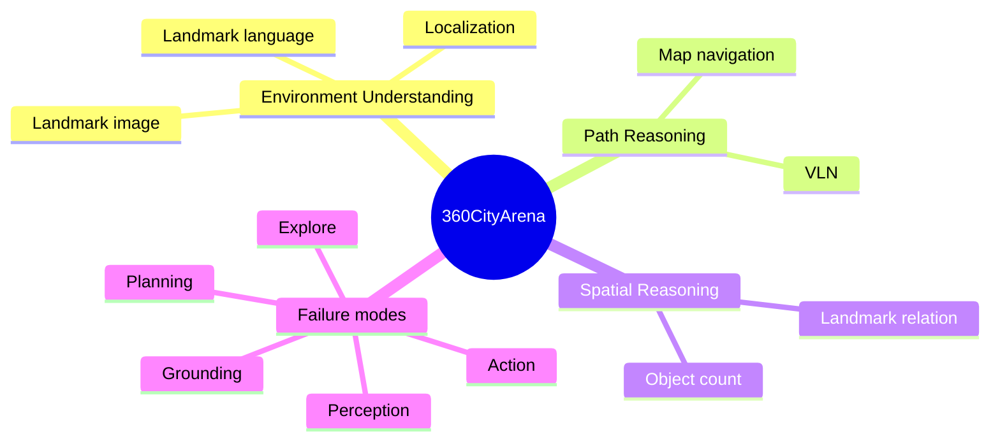

## Summary
이 학습 노트는 [[360CityArena]]를 [[POMDP]] 기반의 도시 embodied 탐색 문제로 정리한다.

- 주요 선수 지식은 [[POMDP]], [[PoseGraph]], [[Vision-Language Navigation (VLN)]], open-loop/closed-loop 구분이다.
- benchmark는 `Environment Understanding`, `Path Reasoning`, `Spatial Reasoning`의 3축을 통해 `Localization`, `Landmark language`, `Landmark image`, `Map navigation`, `VLN`, `Landmark relation`, `Object count`를 동시에 점검한다.
- 핵심은 single-shot 정답 예측이 아니라 observation-history, 메모리, action 결정을 반복 갱신하는 루프 기반이다.
- 결과 메시지는 map navigation, route reasoning, spatial grounding의 병목이 크고, 지도 prior가 항상 이점이 아니라는 점이다.
- 따라서 본 소스는 photorealistic 도시 탐색이 전체 AD 자유도 전부를 대체하지 않고, spatial intelligence 스트레스 테스트로 기능한다는 점을 정리한다.

## Key Claims
- [[360CityArena]]는 360° video로 구성된 photorealistic 도시 환경에서 도시 규모 embodied navigation 성능을 점검한다.
- task는 `Localization`, `Landmark search`, `Map navigation`, `VLN`, `Relational reasoning`, `Object count`를 포함한다.
- closed-loop를 전제로 하되, `observation -> memory -> route decision -> next observation` 구조를 중심 축으로 둔다.
- map navigation은 현재 모델군에서 극심한 실패 구간으로 반복되며 map-to-egocentric 정합이 병목임을 시사한다.
- metric을 `exact match`, `coordinate match`, `fuzzy match`, `MRA`로 나누어 해석해야 한다.
- image-goal 성능 이점은 안정적인 것은 아니며 데이터 가시성·표현 정합이 큰 영향 변수다.
- map prior는 잘못된 좌표계 정렬 시 오히려 성능을 저하한다.

## Key Quotes
> "360CityArena는 단순 답안 정확도보다 observation과 memory가 action 결정을 어떻게 갱신하는지로 성능이 갈린다."  
> "Map navigation이 0%인 구간은 표현 정합 실패와 route 계획 단절을 가장 잘 보여 준다."

## Connections
- [[360CityArena]] — 학습/분석 대상 benchmark.
- [[POMDP]] — partial observation 환경의 추론 프레임.
- [[PoseGraph]] — 도시 이동 상태를 이산 node/edge로 표현.
- [[ObservationToActionLoop]] — 본 노트의 핵심 구조.
- [[ReflectionMemory]] — route, hallucination 제어를 위한 증거 보존 메모리 개념.
- [[Vision-Language Navigation (VLN)]] — instruction-following 기반 경로 추론 맥락.
- [[AutonomousDrivingVLA]] — route-level spatial intelligence 병목 연결.
- [[Benchmark]] — 측정 항목/메트릭 정합 관점.

## Contradictions
- 이 소스는 [[360CityArena]]를 물리 동역학 중심의 AD 시뮬레이터 대체재로 보기보다, 관측-경로-메모리 인터페이스를 시험하는 도시 시각 스트레스 테스트로 본다.
- `open-loop` 추론 중심의 해석은 [[ObservationToActionLoop]]의 memory 갱신 요구를 충분히 반영하지 못한다.

## 선수 지식

- **POMDP:** 상태 전체를 직접 관측하지 못하고 observation history와 memory로 action을 결정하는 decision framing.
- **Pose graph:** place/viewpoint node와 이동 가능한 transition edge로 구성한 navigation graph.
- **VLN:** natural-language instruction을 visual observation에 ground해 이동하는 비전-언어 내비게이션.
- **open-loop vs closed-loop:** 한 번 예측을 고정하는 방식과 action이 다음 observation을 바꾸는 반복 방식을 구분.

## benchmark 지형도

## environment와 action loop

`360CityArena`는 부분 관측 transition을 다음처럼 본다.

$$s_t\xrightarrow{\text{render}}o_t,\qquad a_t=\pi(o_t,M_t,g),\qquad s_{t+1}=T(s_t,a_t).$$

- $s_t$: pose graph의 위치·heading.
- $o_t$: 현재 360° viewpoint와 map/location marker.
- $M_t$: 이전 visual cue와 가설을 보존하는 [[ReflectionMemory]].
- $g$: task goal(언어/이미지/map).
- $a_t$: move, rotate, tilt, reset, answer.

이 전개는 car control과 동일하지는 않지만, observation → belief/memory → route decision → next observation 루프를 통해 [[VLA]]/[[AutonomousDrivingVLA]]의 핵심 interface를 정리한다.

## task별 무엇을 측정하는가

| task | 핵심 latent variable | 흔한 실패 | AD/VLA 대응물 |
|---|---|---|---|
| Localization | map pose·heading | visual cue↔grid mismatch | ego localization / HD-map alignment |
| Landmark language | object/landmark semantic grounding | 이름은 이해하지만 시각 단서 미탐지 | route landmark grounding |
| Landmark image | appearance matching | viewpoint/scale/occlusion mismatch | target observation association |
| Map Navigation | topological route plan | branch 선택·progress tracking 실패 | route planning |
| VLN | instruction state machine | turn/stop condition 누락 | natural-language route command |
| Relation | landmark topology | camera-relative vs world-relative 혼동 | scene graph/BEV reasoning |
| Object Count | temporal/spatial coverage | double count·missed region | object inventory / occupancy reasoning |

## 평가 metric을 읽는 법

- **exact match**는 output syntax와 discrete localization error를 엄격히 본다.
- **coordinate match**는 target 도달 판정의 epsilon 설정에 민감하며, 이 소스는 map navigation에서 20m를 사용했다.
- **fuzzy match**는 relation 표현 다양성 처리에 유리하지만 judge model calibration이 중요하다.
- **MRA**는 count 오차 크기를 반영한다. threshold curve 분석이 필요하다.
- 본 benchmark의 closed loop는 pose graph 기반의 loop여서, 연속 다이내믹/충돌/법규 준수 지표가 빠진 상태로 AD 전체 safety score로 확장하면 오해가 생긴다.

## 실험 결과에서 배울 점

1. **visual cue의 가치:** target의 appearance가 언어보다 유리할 수 있다.
2. **map은 자동 해결책이 아니다:** map prior가 성능을 떨어뜨리는 경우는 map-to-egocentric 정합 실패를 뜻한다.
3. **reasoner만 강화해도 부족하다:** 탐색 실패는 harness, stopping policy, 저수준 컨트롤러 결합 설계가 필요하다.
4. **난이도 scaling:** 더 긴 경로·다수 decision point·낮은 landmark 가시성에서 memory error가 누적된다.

## 구현/배포 체크리스트

- observation마다 place recognition confidence와 heading uncertainty를 기록한다.
- memory를 observation fact, pose hypothesis, next-action rationale, disconfirming evidence로 분리한다.
- planner에 loop/stagnation detector와 route-progress monitor를 둔다.
- image goal은 멀티뷰 feature matching, language goal은 grounded scene graph와 결합한다.
- map prior는 calibrated coordinate transform과 uncertainty-aware correspondence로 제공한다.
- safety-critical AD 연동에서는 continuous trajectory optimizer, 동적 장애물 예측, 충돌/규칙 shield를 하위에 둔다.

## 자가 점검 질문과 답

**Q1. 360CityArena가 CARLA를 대체하는가?**  
A. 아니다. CARLA는 vehicle dynamics·sensor/traffic interaction 중심이고, 360CityArena는 photorealistic 도시 시각 환경 기반의 spatial intelligence 스트레스 테스트에 가깝다.

**Q2. image-goal이 language-goal보다 항상 좋은가?**  
A. 아니다. 이득은 target visibility·alignment·visual grounding 품질에 따라 달라진다.

**Q3. map position이 성능을 떨어뜨리는 이유는?**  
A. map의 north/heading/scale과 first-person 시점 정합이 깨지면 경쟁 가설이 늘어나고 혼선이 커진다.

**Q4. action grounding을 평가하는가?**  
A. 이 benchmark는 discrete navigation action 수준이며 steering/acceleration/trajectory safety는 직접 평가하지 않는다.

## 75분 읽기 로드맵

1. **10분:** teaser와 task taxonomy를 보고 7개 subtask를 input/goal/metric으로 정리한다.
2. **15분:** [[PoseGraph]]와 [[POMDP]] formulation에서 observation·memory·action 인터페이스를 그린다.
3. **20분:** difficulty/failure 분석으로 map navigation 실패 가설을 3개 제안한다.
4. **15분:** map position ablation을 읽고 map-to-view alignment 모듈을 설계한다.
5. **15분:** CARLA/CV benchmark와 비교해 해당 benchmark가 다루지 못하는 safety metric을 목록화한다.