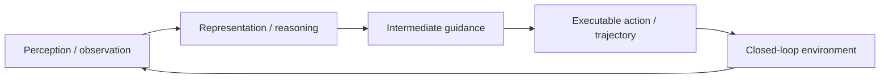

## Summary
ABot-N1 학습 노트는 slow-fast VLN(Vision-Language Navigation) foundation model의 선수 지식, 핵심 용어, 아키텍처, 단계별 이해 방법, 구현 메모, Study Q&A, Reading roadmap을 제공한다. Pixel goal 기반 intermediate representation으로 point/object/POI/instruction/person-following 통합 navigation을 달성하며, POI arrival 77.3%, indoor 95.4%, outdoor 92.9% success rate를 보인다.

## Key Claims
- VLN(Vision-Language Navigation)은 언어/목표와 visual observation으로 navigation action을 결정하는 문제다.
- Pixel goal은 이미지 공간에서 다음 이동 목표를 지정하는 anchor point로, task-agnostic compact interface 역할을 한다.
- Slow-fast architecture는 느린 reasoning system과 빠른 action/control system을 분리하는 구조다.
- Waypoint는 controller가 따라갈 연속 공간의 중간 목표점이다.
- Goal-conditioned policy는 `π(a_t | o_<=t, g, h)`로 표현된다.
- Intermediate guidance `z_t = f_VLM(o_t, g)` 또는 flow action sample `u_t`로 pixel goal에서 executable action으로 변환된다.
- Closed-loop rollout `s_next = T(s_t, a_t)`에서 모델의 `a_t`가 다음 observation distribution을 바꾼다.

## Architecture

## Key Quotes
> "VLN: Vision-Language Navigation. 언어/목표와 visual observation으로 navigation action을 결정하는 문제."

> "Pixel goal은 task-agnostic compact interface라 여러 navigation task를 묶고 fast controller가 높은 주기로 실행 가능한 waypoint를 만들 수 있다."

## 단계별 이해
1. **문제 정의**: 단일 observation-action mapping이 왜 일반화/안전/다양성에서 부족한지 확인한다.
2. **중간 표현 확인**: pixel goal, flow action, waypoint 같은 action grounding bridge가 무엇인지 찾는다.
3. **closed-loop 조건 확인**: 예측이 다음 입력을 바꿀 때 어떤 error가 누적되는지 본다.
4. **metric 분해**: success/arrival/realism/diversity가 각각 무엇을 보상하고 무엇을 놓치는지 나눈다.
5. **배포 제약**: latency, edge memory, control frequency, safety monitor가 실제 적용의 병목인지 확인한다.

## 구현/배포 메모
- [[SlowFastArchitecture]] reasoning module과 action module을 분리하면 해석성과 latency control이 좋아질 수 있다.
- 중간 guidance coordinate가 sensor calibration/BEV map과 맞지 않으면 drift가 생긴다.
- closed-loop simulator는 diversity를 보존해야 rare scenario coverage를 늘릴 수 있다.

## Study Questions

### Q1: 왜 VLM이 직접 action을 출력하지 않고 pixel goal을 거치나?
Pixel goal은 task-agnostic compact interface라 여러 navigation task를 묶고 fast controller가 높은 주기로 실행 가능한 waypoint를 만들 수 있다.

### Q2: 자율주행으로 옮기면 무엇이 달라지나?
Pixel coordinate 대신 BEV/map/route anchor를 써야 하며, collision checking과 traffic-rule constraint가 필수다.

## Reading Roadmap
1. [[DriveVLM]], [[Senna]], [[DualAD]] 같은 dual-system AD-VLA 논문과 비교한다.
2. [[LMDrive]], [[ORION]]의 waypoint/action-token 방식과 output representation을 비교한다.
3. ABotN-POIBench의 metric을 자율주행 POI/route following benchmark와 연결해 본다.

## Connections
- [[ABot-N0]] — predecessor model
- [[VLA]] — foundation model category
- [[PixelGoal]] — intermediate representation concept
- [[WaypointNavigation]] — navigation method
- [[ActionGrounding]] — core research problem
- [[SlowFastArchitecture]] — architecture paradigm
- [[Qwen-RobotNav]] — related VLN navigation research
- [[VisualThink-VLA]] — related VLA reasoning research
- [[RoboSemanticBench]] — related semantic grounding benchmark
