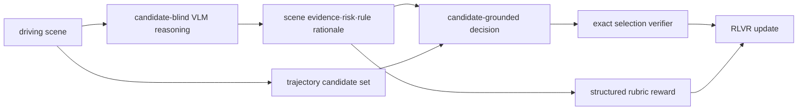

## 요약
본 분석은 자율주행 VLA에서 **GT 미래 trajectory를 사전 노출할 때 생기는 합리화 편향**을 줄이기 위해, 추론과 선택을 분리하는 [[DEFT]] 설계를 정교하게 정리한다. 핵심은 GT trajectory를 먼저 숨긴 뒤, 장면 근거 중심으로 먼저 reasoning을 만들고, 이후 후보 집합을 주어 **근거-후보 정합성**을 평가해 후보를 고르는 방식이다.

핵심 아키텍처는 크게 두 개의 정렬 축으로 구성된다.
1) 후보가 없는 상태의 장면 기반 reasoning으로 [[TrajectoryAnchoringBias|trajectory anchoring bias]]를 줄이는 것
2) 후보를 노출한 뒤 [[AD-MCQ]]의 이산 선택에서 결과와 근거를 RLVR 보상과 결합해 정합하도록 학습하는 것

[[DEFT-RLVR]]는 후보 노출 지연을 통해 **이유 텍스트=행동 근거**가 되도록 만든다.

## 한 줄 결론
future trajectory를 reasoning 전에 공개하면 CoT가 사후 합리화로 흐를 위험이 커지므로, 후보 노출을 지연하고 후보-grounded decision을 마지막에 수행해야 verifiable decision 성능이 좋아진다.

## 문제 정의
- GT future를 미리 보여주는 teacher supervision은 모델이 결과 정합이 아니라 **원래 정답 맞춤 설명**을 학습하게 만들 수 있다.
- 논문 분석에서 사람 평가 기반으로 `severe hallucination`이 GT 노출 조건에서 높아짐을 보고한다.
- VLM 텍스트의 유창성은 grounding 보장으로 이어지지 않으며, [[Hallucination|환각]] 구분이 성능보다 먼저 관리되어야 한다.

## 아키텍처/파이프라인

## 단계별 정리
| 단계 | 입력 | 출력 | 역할 |
|---|---|---|---|
| reasoning | scene / AD question | 근거·위험·maneuver rationale | future/candidate shortcut 차단 |
| decision | rationale + scene-specific candidates | 후보 선택 | 검증 가능한 action grounding |
| optimization | 선택 정합성 + rubric 보상 | 정책 업데이트 | decision/rationale 동시 정렬 |

## 평가 요약
- AD-MCQ는 scene별 후보군을 통해 **candidate 선택 정답성**을 정확히 측정한다.
- `severe hallucination`은 GT 노출이 높고 노출 금지 조건이 상대적으로 낮다(예: 50.0% 대 29.0%).
- 실험 축은 in-domain AD task와 nuScenes OOD, 그리고 일반 비전 성능 축을 함께 다룬다.
- 구조화 rubric은 긴 텍스트 생성 자체보다 **reasoning 방향 정합성**을 보상신호로 연결해 training 효율성/품질을 함께 높인다.
- 코멘트: 본 실험의 핵심 성능 평가는 ACC, CFS 중심이며 full closed-loop 실차/장거리 안전성 결과는 별도 검증이 필요.

## 강점
1. GT trajectory 정보 누출 편향을 계측 가능한 방식으로 문제 제기.
2. 후보 선택을 action-level verifiable target로 고정해 reasoning과 decision 경로 분리.
3. AD 특화 지표(ACC/CFS/HLD)와 general vision 지표를 함께 제시해 trade-off를 확인.
4. candidate-grounded RLVR이 template 기반 CoT 유창성 비중을 줄이고 rubric 탐색 폭을 안정화.

## 한계 및 안전성/배포 함의
- 후보 생성기가 나쁘면 정답 후보 자체가 비합리적일 수 있어 선택 신뢰성이 깨질 수 있다.
- continuous control의 세밀도는 이산 후보 집합으로 제약된다.
- CFS와 rubric이 충돌·안전성·승차감/규칙 위반을 완전 보장하지 않는다.
- 배포에서는 VLM reasoning latency, 후보 freshness, verifier/rubric 적대적 실패에 대한 독립 점검이 필요하다.

## 기존 지식과 연결
- 이 분석은 [[DEFT]]의 기본 아이디어를 [[DEFT-RLVR]]로 확장해 [[RLVR]] 보상에서 추론 trace와 결정의 인과 정합을 함께 맞추는 경로를 제시한다.
- 즉, “설명문 존재”와 “grounded action selection”을 분리해 검증 가능한 시스템 설계로 이동한다.

## Key Claims
- GT 미래 trajectory 노출은 CoT post-hoc 정당화 경로를 강화해 성능과 근거 간 일치성을 떨어뜨릴 수 있다.
- [[AD-MCQ]]는 다중 후보 기반으로 정답 선택 정합성을 직접 측정 가능한 benchmark로 기능한다.
- [[DEFT]]는 reasoning 단계에서 candidate를 숨기고, decision 단계에서만 공개해 shortcut bias를 줄인다.
- [[DEFT-RLVR]]는 structured rubric reward를 결합해 selection 정확도와 reasoning 정합도를 동시에 개선한다.
- nuScenes OOD에서 training-free DEFT 대비 성능/일치성 개선 신호가 보고되었다.

## Key Quotes
> "trajectory를 사전 노출하면 grounding보다 post-hoc rationalization이 강화될 수 있다."

> "DEFT는 reasoning을 먼저 만들고 candidate를 나중에 노출하는 순서를 통해 causal scene grounding을 훼손하지 않은 상태로 후보 선택을 검증 가능하게 만든다."

## Connections
- [[TrajectoryAnchoringBias]] — GT 노출이 초래하는 정답 중심 추론 정렬 편향
- [[DEFT]] — 미래 trajectory 노출 지연 설계
- [[DEFT-RLVR]] — reasoning+decision 통합 보상 학습
- [[AD-MCQ]] — 후보 기반 검증 가능한 선택 benchmark
- [[RLVR]] — 보상 기반 decision alignment 프레임
- Qwen3-VL-8B-Instruct — 베이스라인 backbone 계열
- [[AutonomousDrivingVLA]] — 적용 도메인
- [[ClosedLoopPlanning]] — 후보 노출/선택이 연결되는 추론-행동 인터페이스

## Contradictions
- 없음: 기존 위키의 핵심 주장과 충돌하지 않으며, 대신 Vision-Language-Action에서 근거 텍스트만으로 grounding을 가정하는 해석을 제한하는 반례를 강화한다.
