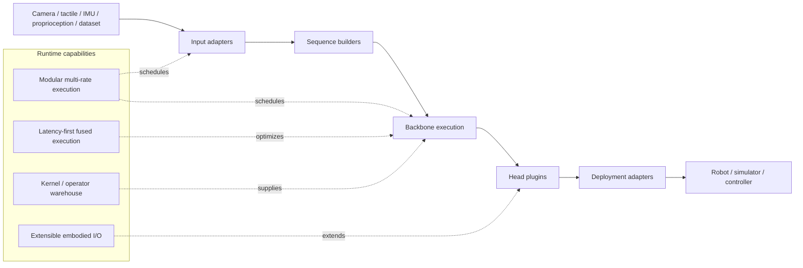

## Summary
Embodied.cpp는 VLA(Vision-Language-Action)와 WAM(World Action Model)을 로봇 edge에 배포하기 위한 C++ five-layer runtime contract를 제안하는 논문이다. Multi-rate execution, latency-first batch-1 optimization, extensible I/O 세 축으로 실제 robot closed-loop inference의 실행 가능성을 입증한다.

## Key Claims
- VLA/WAM 배포의 핵심 병목은 "Python research stack 불일치", "LLM serving runtime의 미지원", "batch-1/low jitter 요구사항 충족 어려움"이다
- Five-layer runtime (input adapters → sequence builders → backbone execution → head plugins → deployment adapters)이 공통 실행 경로를 제공한다
- Multi-rate execution으로 perception, backbone, prediction branch, action head를 각각 다른 refresh rate로 스케줄링할 수 있다
- HY-VLA로 100.0% success rate, π0.5로 91.0% success rate 달성
- LingBot-VA WAM block GGUF Q4_K quantization으로 VRAM 312.2→88.1 MiB 감소 (cosine similarity >0.9997 유지)

## Architecture

## Input-Output Representation

| Category | Content |
|---|---|
| Inputs | RGB/multi-view image, language instruction, proprioception, force/tactile, IMU, simulator state, history |
| Intermediate states | subgoal, buffered context, predicted future, latent future, action feature |
| Outputs | discrete action token, continuous action vector, action chunk, world prediction, intermediate control representation |
| Target models | [[VLA]], [[WAM]], hierarchical VLA, asynchronous VLA, latent-space WAM |

## Key Quotes
> "VLA와 WAM 연구는 빠르게 발전했지만 실제 배포는 여전히 모델마다 Python research stack과 custom wrapper가 다르다" — 문제 정의

> "일반 LLM/VLM serving runtime은 token request-response를 가정하며 robot closed-loop를 직접 지원하지 않는다" — 기존 런타임의 한계

## Models Evaluated

| Model | Environment | Success Rate | VRAM |
|---|---|---|---|
| [[HY-VLA]] | RoboTwin place_empty_cup | 100.0% | 6850 MiB |
| [[π0.5]] | C++ deployment config | 91.0% | 6546 MiB |
| [[LingBot-VA]] block | random input 100개 | MAE/cosine benchmark | 312.2→88.1 MiB (Q4_K) |

## Connections
- [[HY-VLA]] — deployment target model
- [[π0.5]] — deployment target model
- [[LingBot-VA]] — WAM block benchmark target
- [[VLA]] — core model category
- [[WAM]] — core model category with predicted future runtime representation
- [[GGUFQuantization]] — WAM memory reduction technique

## Safety & Deployment Implications
- Runtime은 단순 inference server가 아니라 safety-critical control loop의 일부가 된다
- Latency 평균뿐 아니라 jitter, worst-case latency, watchdog/recovery behavior가 중요하다
- NPU/edge accelerator에서 action head, perception encoder, world prediction branch를 서로 다른 device에 나누는 heterogeneous scheduling이 핵심
- WAM이 predicted future를 생성하면 prediction cache, latent future validity, stale prediction invalidation 처리 필요

## Contradictions
- None identified with existing wiki content
