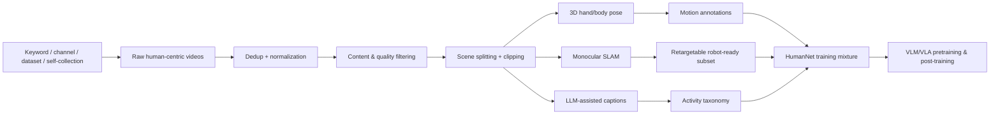

## Summary
HumanNet은 "로봇 데이터가 부족하면 인간 중심 비디오를 물리적으로 구조화해 VLA pretraining substrate로 쓰자"는 데이터 중심 논문이며, [[VLA]]의 action grounding을 robot log 밖에서 확장하는 방향을 제시한다. 100만 시간 규모의 human-centric video corpus를 제안하고, egocentric/exocentric view를 명시적으로 taxonomy화하며, [[Qwen]]/[[LingBot-VLA]] post-training ablation으로 인간 비디오의 transfer value를 검증한다.

## Key Claims
- Robot teleoperation data는 비싸고, embodiment/platform/control interface별로 분절되어 있으며, long-tail physical interaction coverage가 작다
- 100만 시간 human-centric video corpus 제안으로 [[Embodied AI]] 데이터 부족 문제를 해결
- First-person/third-person viewpoint를 명시적 taxonomy로 분류하여 physical relevance 보장
- Pose, motion, caption, activity label, retargetability 등 interaction-centric annotation 제공
- Architecture 고정, data source 변화만으로 validation loss 비교 — 데이터 혼합의 효과 입증
- Egocentric human video vs real-robot data 비교가 실용적

## Key Quotes
> "VLA/embodied learning의 scaling bottleneck을 data side에서 직접 공략" — 강점 분석

> "human-to-robot embodiment gap은 여전히 큼" — 한계 분석

## Architecture / Pipeline

## Input / Output / Action Representation

| 항목 | HumanNet 관점 | VLA 연결 |
|---|---|---|
| Input | first-person/third-person human video | visual observation prior |
| Supervision | captions, motion descriptions, hand/body pose, SLAM, retargeting signal | language + motion grounding |
| Output | dataset/metadata/subsets | direct action은 아님; representation/action prior 제공 |
| Action grounding | hand-object contact, body motion, state change, procedural order | robot action expert가 배울 수 있는 physical structure |

## Validation Results
- 비교: generic [[Qwen]] VLM, 100h real-robot CoBot, 1,000h HumanNet egocentric, 20,000h LingBot real-robot
- Metric: held-out task group validation loss
- 이 논문은 closed-loop robot deployment 성능을 직접 보고하지 않음

## 강점
- [[VLA]]/[[Embodied AI]]의 scaling bottleneck을 data side에서 직접 공략
- Viewpoint diversity와 physical relevance를 명시적 설계 원칙으로 둠
- Egocentric human video vs real-robot data 비교가 실용적
- Privacy/ethics를 limitation에 명확히 포함

## 한계와 리스크
- Human-to-robot embodiment gap은 여전히 큼
- Dataset noise, geographic/social bias, label ambiguity 가능성
- 공개 데이터의 privacy/license risk
- Closed-loop robot success까지는 아직 직접 증명하지 않음

## Connections
- [[VLA]] — 주요 타겟 모델이며 HumanNet으로 pre-training/post-training
- [[Qwen]] — VLM backbone으로 사용
- [[LingBot-VLA]] — 실험 검증에 사용된 VLA 모델
- [[Embodied AI]] — 핵심 응용 도메인
- [[HumanNet]] — 제안하는 데이터셋/방법론

## Contradictions
- 기존 [[EmbodiedMidtrain]]이 VLM-VLA 간 분포 정렬에 집중하는 반면, HumanNet은 데이터 소스 자체를 확장하는 접근 — 상호 보완적 관계로 모순 없음
- [[Tesla]]의 [[EndToEndAutonomy]]가 closed-loop 성능 직접 보고하는 것과 달리, HumanNet은 validation loss 기반 — 방법론 차이, 직접적 모순 아님
