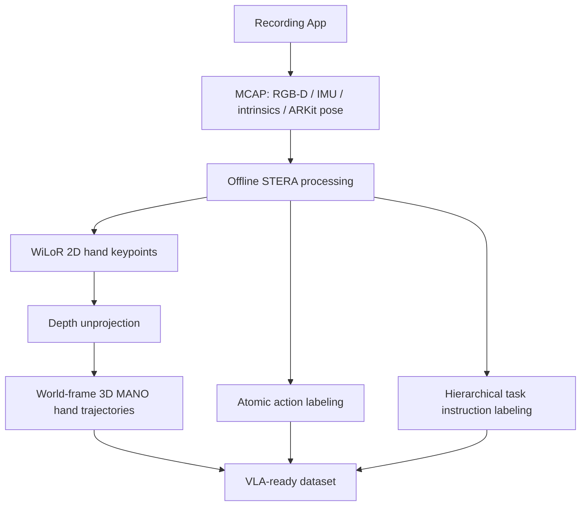

## Summary
MobileEgo Anywhere는 VLA 정책 학습의 데이터 병목을 해결하기 위해 범용 스마트폰(iPhone) 기반으로 RGB-D, IMU, 6-DoF pose, hand trajectory를 수집하는 STERA 파이프라인을 제안하며, 200시간 354세션의 household egocentric dataset을 공개한다.

## Key Claims
- VLA 정책 학습에는 수십 분 단위의 long-horizon stateful interaction 데이터가 필요하며, 기존 egocentric dataset은 robot policy 요구를 충족하지 못함
- commodity hardware(iPhone + ARKit)만으로 specialized robotics hardware 없이 전 세계 기여자가 참여 가능한 데이터 수집 인프라 구축 가능
- STERA 파이프라인으로 3D hand trajectory, atomic action labels, hierarchical instruction tree를 자동 생성하여 VLA-ready dataset으로 변환
- ArUco revisited 기준 pose drift가 대부분 <1cm, trajectory 길이 대비 <0.1%로 실용적 품질 확보
- hand pose 평가: 86.2% detection success rate, median bone CV <1.5%

## Key Quotes
> "VLA policy가 complex robotic task를 수행하려면 짧은 clip이 아니라 수십 분 단위의 stateful interaction이 필요하다." — Problem statement

> "specialized robotics hardware 없이 global contributors가 데이터를 모을 수 있는 open infrastructure." — Contributions

## Pipeline Architecture

## Input → Output
| 항목 | 내용 |
|---|---|
| Input | head-mounted RGB-D video, IMU, ARKit camera pose, intrinsics, depth map |
| Intermediate | world-frame camera trajectory, 3D hand keypoints/MANO pose, action spans |
| Output | VLA pretraining용 egocentric trajectory dataset + hierarchical language labels |
| Action representation | hand trajectory + atomic/hierarchical action label이 action grounding proxy 역할 |

## Training Recipe
1. RGB-D/pose/hand trajectory로 visual-spatial representation pretraining
2. atomic action labels로 short-horizon manipulation primitive 학습
3. hierarchy labels로 instruction following, sub-goal planning, long-horizon memory 학습
4. robot dataset과의 alignment/IK mapping으로 human hand trajectory를 robot end-effector action prior로 전이

## Dataset Statistics
- 200 hours, 354 sessions, 16 contributors, household activities
- Session 평균 21.2분, 최대 ~108분
- 98 sessions / 1.19M frames / 25.2h hand pose 평가 완료

## Connections
- [[VLA]] — 핵심下游 활용처: policy pretraining용 데이터 소스
- [[HumanNet]] — 같은 egocentric video 데이터셋으로 VLA 학습용 경쟁/보완 관계
- [[Ego4D]] — 기존 egocentric dataset과의 기술적 차이점(장기성, 6-DoF, depth)
- [[EPIC-KITCHENS]] — household 환경 egocentric 데이터셋 관련성
- [[OpenX-Embodiment]] — robot data alignment/IK mapping 대상
- [[R3M]] — visual-spatial representation 학습 방식 연관성
- [[GR00T]] — VLA 학습용 human egocentric trajectory 데이터 소스

## Contradictions
- 없음 (신규 인프라 논문으로 기존 Wiki 내용과 직접적 충돌 없음)
