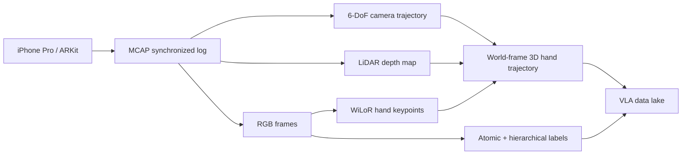

## Summary
MobileEgo Anywhere는 commodity smartphone(iPhone Pro) 기반으로 200시간规模的 egocentric dataset을 수집하는 오픈 인프라를 제안하는 논문의 학습 가이드다. ARKit의 6-DoF pose, LiDAR depth, IMU 데이터를 synchronized MCAP log로 기록하고, STERA 파이프라인으로 3D hand trajectory와 hierarchical language instruction을 추출하여 [[VLA]] 학습용 long-horizon trajectory를 구축한다.

## 선수 지식

- [[VLA]]: visual observation + language instruction/reasoning + executable action
- Egocentric vision: first-person camera로 사용자의 손·도구·환경을 관측하는 방식
- [[VIO]]/[[SLAM]]: visual frame과 IMU를 결합해 camera pose를 추정
- RGB-D / LiDAR depth: 2D point를 3D world coordinate로 unproject하는 기반
- [[MANO]] hand model: 21-joint hand pose / mesh 표현

## 핵심 용어 (Glossary)

| 용어 | 설명 |
|---|---|
| long-horizon trajectory | 수십 분 이상 이어지는 연속 행동/상태 경로 |
| persistent state tracking | object/scene state가 시간에 따라 끊기지 않도록 추적 |
| MCAP | robotics/logging에 쓰이는 serialization-agnostic log container |
| action grounding | 언어·시각 reasoning을 실제 행동 표현으로 연결하는 과정 |
| hierarchical instruction | atomic action → episode → sub-goal → session 형태의 다층 instruction |
| STERA | MobileEgo의 3D hand trajectory + language hierarchy extraction 파이프라인 |
| WiLoR | World-coordinate hand keypoint detection 모델 |

## 핵심 클레임 (Key Claims)

- [[VLA]] scaling은 model scale뿐 아니라 data coverage가 핵심 병목이다
- Robot teleoperation data는 비싸고, internet video는 action/pose 정보가 약하다
- Smartphone은 RGB-D, IMU, camera pose를 동시에 제공하는 commodity sensor suite다
- MobileEgo dataset은 [[VLA]] pretraining과 human-to-robot retargeting의 bridge가 된다
- smartphone 기반 데이터 수집은 privacy guardrail(face blur, consent, pause policy)을 필수로 구현해야 한다

## 단계별 이해

1. [[VLA]] scaling은 model scale뿐 아니라 data coverage가 병목이다
2. robot teleoperation data는 비싸고, internet video는 action/pose가 약하다
3. smartphone은 RGB-D, IMU, camera pose를 동시에 줄 수 있는 commodity sensor suite다
4. MobileEgo는 app으로 raw stream을 MCAP에 기록하고, STERA로 3D hand trajectory와 language hierarchy를 만든다
5. 이렇게 만들어진 dataset은 [[VLA]] pretraining과 human-to-robot retargeting의 bridge가 된다

## 아키텍처 (Mermaid)

## 구현/배포 메모

- 실제 재현 시 핵심은 timestamp synchronization, dropped-frame handling, depth zero filtering, camera-pose drift monitoring이다
- robot policy로 전이하려면 hand trajectory를 end-effector waypoint/trajectory로 retargeting하는 별도 module이 필요하다
- 데이터 수집 app은 privacy guardrail(face blur, consent, pause policy)을 기본 기능으로 가져야 한다

## Study Questions & Answers

**1. 왜 짧은 egocentric clip으로는 부족한가?**

장기 task는 object state와 sub-goal dependency가 누적되므로, 몇 초짜리 clip만으로는 planning/memory/action grounding을 학습하기 어렵다.

**2. ARKit pose가 VLA에 왜 중요한가?**

hand/object observation을 global frame으로 정렬해야 trajectory, depth, reachability를 action supervision으로 바꿀 수 있다.

**3. MobileEgo의 가장 큰 약점은?**

human hand trajectory와 robot embodiment 사이의 morphology/control gap이다.

## Reading Roadmap

1. 논문 Figure 4 pipeline 먼저 확인
2. Dataset/Evaluation의 drift와 hand consistency metric 확인
3. [[UMI]], [[EgoScale]], [[Ego4D]]와 비교해 data collection trade-off 정리
4. VLA policy 학습에 넣는다면 어떤 action representation으로 바꿀지 설계해보기

## Connections

- [[VLA]] — primary use case
- [[Ego4D]] — 비교 대상 데이터셋
- [[EgoScale]] — 비교 대상 데이터셋
- [[UMI]] — 비교 대상 데이터셋
- [[WiLoR]] — 2D hand keypoint detection에 사용
- [[MANO]] — 3D hand model
- [[MCAP]] — 데이터 포맷/컨테이너
- [[SLAM]]/[[VIO]] — camera pose 추정에 활용

## Related Sources

- [[mobileego-anywhere-2605-05945]] — 원본 논문 소스 페이지
- [[mobileego-anywhere-2605-05945-analysis]] — 분석 소스 페이지
- [[mobileego-anywhere-2605-05945-references]] — 레퍼런스 소스 페이지
