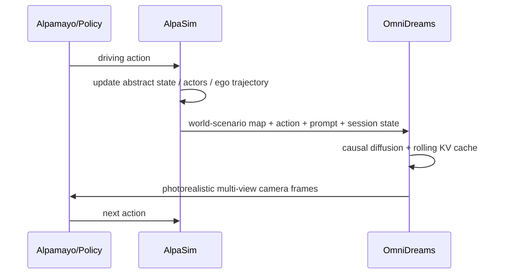

## Summary
OmniDreams는 자율주행 closed-loop 평가에서 reconstruction simulator의 한계를 넘어, policy action에 반응하는 실시간 action-conditioned generative world model이다. Cosmos-Predict 2.5를 백본으로 21k hours driving data로 fine-tuning하며, WAM(World Action Model) backbone으로 VLA 대안을 제시한다.

## Key Claims
- Real-time multi-view sensor generation: 2B single-camera 68 FPS(GB300 1개), 4-camera 105 FPS(GB300 16개)
- WAM backbone으로 Alpamayo 1.5 VLA보다 더 적은 parameter로 collision metric 개선 가능
- Closed-loop reactivity가 open-loop video quality보다 핵심 지표
- Action/state-conditioned generation으로 novel event와 dynamic interaction 생성 가능

## Architecture / Pipeline

## Key Quotes
> "OmniDreams post-trained WAM이 Alpamayo 1.5 VLA 대비 더 적은 parameter로 collision metric 개선" — WAM 가능성 제시

> "VLA가 모든 것을 language reasoning으로 해결해야 하는가?" — driving에서는 language보다 world dynamics와 closed-loop simulator fidelity가 더 직접적인 병목

## Input / Output
| 항목 | 내용 |
|---|---|
| 입력 | first-frame RGB, text prompt, abstract world scenario, history KV cache, policy/user action |
| 출력 | next camera sensor frames, single-view or multi-view video |
| downstream | simulator, policy backbone(WAM), diffusion fixer |

## Training Recipe
- RDS 16,600h + RDS-HQ-1M 4,944h 사용
- Cosmos-Predict 2.5에서 multi-view adaptation
- Causal masking + Diffusion Forcing으로 autoregressive generation
- Self Forcing + DMD로 exposure bias와 long rollout drift 감소

## Datasets / Benchmarks
- RDS: 16,600h, 3M clips, 15 countries
- RDS-HQ-1M: 4,944h, 1.14M clips
- Held-out eval: 5,000 clips (long-tail slice-balanced), 300 clips 60s long-term consistency
- Closed-loop: AlpaSim + Alpamayo policy
- WAM metric: collision total/front/lateral/rear

## Connections
- [[WorldActionModel]] — 핵심 개념: VLA 대신 world model을 action backbone으로 활용
- [[AlpaSim]] — closed-loop 루프의 시뮬레이터 컴포넌트
- [[Alpamayo]] — policy 모델
- [[CosmosPredict]] — 백본 모델 (Cosmos-Predict 2.5)
- [[NVIDIA]] — 개발사
- [[ClosedLoopSimulation]] — autonomous driving 평가 패러다임
- [[GenerativeWorldModel]] — 생성형 world model 개념
- [[VLA]] — WAM과의 비교 대상

## Contradictions
- 기존 VLA 중심 연구(TBD-VLA, VisualThink-VLA, RoboSemanticBench)와 달리, driving에서는 language reasoning보다 world dynamics가 더 중요한 병목임을 주장. 이 관점差异는 VLA 연구 커뮤니티에서의 주요 debate를 반영함.
