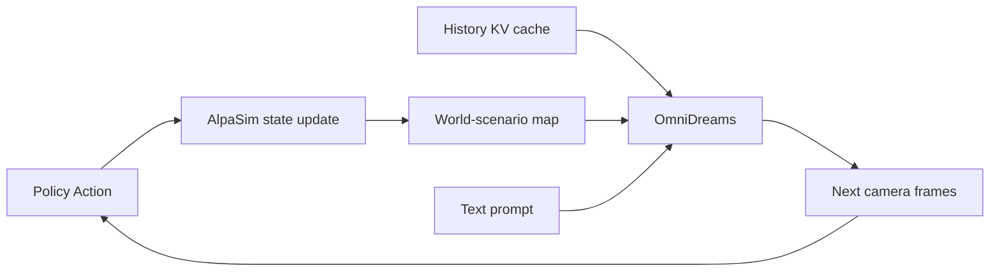

## Summary
OmniDreams는 NVIDIA의 Cosmos-Predict 2.5 기반 generative world model로, 자율주행 정책의 closed-loop 평가를 위한 real-time sensor observation 생성기다. [[Closed-Loop Simulation]] 환경에서 policy action에 조건화된 photorealistic 비디오를 720p 68~105 FPS로 생성하며, [[World-Action Model]] backbone으로도 활용 가능하다.

## Key Claims
- Generative world model이 reconstruction-only simulator보다 novel/dynamic scenario를 더 잘 다룸
- 2B parameter [[World-Action Model]]이 VLA 기반 [[Alpamayo 1.5]](약 10B)의 1/5 규모로 collision rate 6.9% → 4.2%로 개선
- Single-camera 2B model: GB300 1대에서 720p 68 FPS, 4-camera model: GB300 16대에서 720p 105 FPS
- KV cache 재사용로 long rollout consistency 확보

## Key Quotes
> "OmniDreams는 Cosmos diffusion model에서 mid-training/post-training된 foundation generative world model로, action-conditioned video를 real time autoregressive하게 생성한다."

> "Policy가 갑자기 braking/steering을 바꾸면 다음 generated observation이 그 action을 반영해야 한다."

## Architecture Overview

## Key Components

### Input Conditioning
1. **First-frame RGB**: simulation session 초기화용 clean latent token
2. **Text prompt**: weather, lighting, time-of-day, traffic description ([[Qwen2.5-VL-7B]]로 caption 생성)
3. **Abstract world scenario**: HD map (lane, boundary, stop line, pole, crosswalk), dynamic actor 3D box, policy/user action
4. **Memory cache**: 이전 generated token의 streaming KV cache

### Lightweight Control Branch
[[ControlNet]] 방식 대신 작은 MLP로 structured simulator state를 compact control token에 encoding. Visual latent token과 concatenate하여 transformer에 입력.

### Multi-view Generation
Factorized attention으로 complexity를 `O(N²T²)` → `O(NT²) + O(N²)`로 축소:
- Temporal attention: 각 view 내 causal KV cache로 과거 frame attention
- Cross-view attention: 동일 time step에서 view 간 geometry/object/motion 정렬

## Training Pipeline

1. **Multi-view Adaptation**: Cosmos-Predict 2.5에서 view embedding 추가, cross-view attention layer 학습
2. **World-Scenario Control**: zero-initialized branch, flow-matching objective, 93-frame → 189-frame 확장
3. **Mid-training for AR Generation**: [[Diffusion Forcing]] + causal masking으로 bidirectional → causal 변환
4. **Self Forcing**: [[Self-Forcing]]으로 self-rollout 학습 포함
5. **Distillation**: [[DMD]]로 generated video distribution을 real data manifold로 정렬

## Datasets

| 데이터 | 규모 | 용도 |
|---|---|---|
| [[RDS]] | 16,600 hours, 3M 20s clips | mid-training |
| [[RDS-HQ-1M]] | 4,944 hours, 1,142,285 clips | post-training/finetuning |
| [[PAI AV NuRec]] | - | WAM evaluation |

## Connections
- [[NVIDIA]] — 개발사
- [[Cosmos]] — foundation model
- [[AlpaSim]] — world state orchestrator
- [[Alpamayo 1]] — policy model
- [[WorldModel]] — 상위 개념
- [[ClosedLoopSimulation]] — 사용 사례
- [[WorldActionModel]] — WAM 변형
- [[VLA]] — 비교 대상 (VLA vs WAM)
- [[DiffusionForcing]] — training 기법
- [[SelfForcing]] — training 기법
- [[DMD]] — distillation 기법
- [[KVCache]] — inference 최적화
- [[MultiViewGeneration]] — 핵심 기술
- [[ControlNet]] — 유사 기술 (대비)
- [[Qwen2.5-VL-7B]] — caption 생성용 VLM

## Contradictions
- 기존 wiki에 [[VLA]] 관련 [[RoboSemanticBench]] 소스가 존재하나, OmniDreams는 VLA보다 [[WorldActionModel]]이 더 효율적임을 주장. 이는 VLA 우월성에 대한 기존 전제와 대비되나 직접적 모순은 아님 (상황별 효율성 차이).
