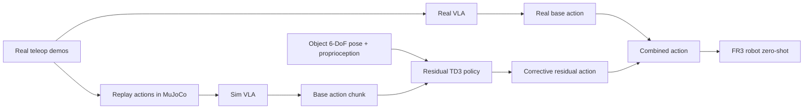

## Summary
Simulation에서 학습한 object-centric residual policy를 frozen [[VLA]] action 위에 더하면, real-world VLA manipulation success rate를 zero-shot으로 42%에서 76%까지 높일 수 있다. 이 방법은 [[CompoundingError]] 누적 문제를 residual correction으로 보완하며, [[ImageBasedSimToReal]] gap을 object pose abstraction으로 우회한다.

## Key Claims
- **Zero-shot sim-to-real transfer**: real robot fine-tuning 없이 평균 success rate 42%→76% 달성
- **Object-centric residual architecture**: object 6-DoF pose + proprioception + base VLA action을 입력으로 받는 [[TD3]] residual policy
- **Paired sim/real VLA training**: 같은 teleoperation action을 현실과 simulation에 적용해 base failure mode를 맞춘다
- **Robustness 기법**: pose noise injection, pose dropout, deployment confidence gating으로 [[PoseEstimator]] error에 견딤
- **Self-improvement loop**: residual-corrected rollout으로 base VLA SFT 데이터 생성 가능

## Architecture / Pipeline

## Input / Output / Action Representation
- **Base VLA input**: RGB observation + language instruction
- **Residual input**: `s_t = [object pose, proprioception, base action]`
- **Output**: corrective action added to base VLA action chunk
- **Action grounding**: language/vision reasoning은 base [[VLA]]가 담당하고, residual은 object-centric physical correction을 담당한다

## Training Recipe
- **Base VLA**: teleoperation data로 imitation/SFT
- **Sim VLA**: 같은 teleoperation action을 simulation replay로 paired training
- **Residual**: [[TD3]] off-policy RL, dense shaped reward, clipped exploration noise
- **Robustness**: pose noise injection, pose dropout, deployment confidence gating

## Key Quotes
> "VLA는 broad generalization을 갖지만 imitation learning 특성상 precise contact, grasp, placement에서 compounding error가 누적된다."

> "Image-based sim-to-real gap을 object pose abstraction으로 우회한다."

## Connections
- [[VLA]] — base policy backbone
- [[ResidualRL]] — residual correction methodology
- [[TD3]] — residual policy algorithm
- [[SimToRealTransfer]] — zero-shot deployment 핵심 메커니즘
- [[FR3]] — real robot platform
- [[MuJoCo]] — simulation environment
- [[PoseEstimation]] — 6-DoF object pose estimator (병목 가능성)
- [[π0.5]] — 다른 VLA backbone으로 적용 가능 확인
- [[ClosedLoopControl]] — residual policy의 closed-loop RL
- [[ConfidenceGating]] — safety를 위한 confidence 기반 fallback

## Contradictions
- None identified with existing wiki content

## Limitations
- 6-DoF pose estimator와 task-relevant object specification에 의존
- Full occlusion, clutter, specular reflection에서 실패 가능
- Dynamics gap은 완전히 해결하지 못함
- Open-world manipulation에서는 object discovery/attention이 추가로 필요
