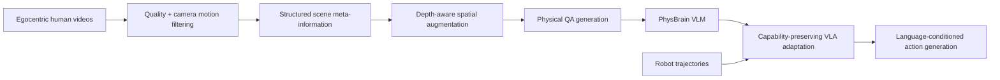

## Summary
PhysBrain 1.0은 VLA(Vision-Language-Action) 정책 학습에서 robot trajectory imitation만으로 physical reasoning을 습득하는 한계를 극복하기 위해, 인간의 first-person(egocentric) 비디오에서 물리 상식 supervision을 추출하여 VLM에 주입한 뒤 capability-preserving adaptation을 통해 VLA policy로 전이하는 프레임워크를 제안한다.

## Problem
- Robot trajectory collection은 비싸고 platform-specific하다
- Trajectory fitting은 physical regularity 학습을 보장하지 않는다
- VLA policy가 viewpoint, scene layout, object state, task composition 변화에 강하려면 action imitation 이전에 physical commonsense가 필요하다

## Key Claims
- Human egocentric video를 structured physical QA로 변환해 base VLM에 물리 상식을 주입할 수 있다
- [[VLM]] capability를 보존하면서 [[VLA]] policy로 전이하는 capability-preserving adaptation이 가능하다
- Limited robot data로도 human-derived physical prior가 downstream control에 도움이 된다
- VLM benchmark와 VLA benchmark를 함께 측정하여 "action grounding에도 도움이 되는가?"를 확인한다

## Key Quotes
> "PhysBrain 1.0은 VLA를 robot trajectory imitation만으로 키우는 대신, human egocentric video를 structured physical QA로 변환해 base VLM에 물리 상식을 주입한 뒤 VLA policy로 전이하는 'physical prior → action grounding' 접근이다"

## Architecture / Pipeline

## Training Recipe
1. Egocentric video clip filtering
2. Structured meta-information extraction: scene elements, spatial dynamics, action execution
3. Depth-aware augmentation과 QA rendering
4. Physically informed VLM training
5. General multimodal retention data mixing
6. Robot trajectory 기반 VLA adaptation with capability preservation and language sensitivity

## Benchmarks / Metrics
- VLM benchmarks: [[ERQA]], [[PhysBench]], MME, MMMU, OCRBench, RealWorldQA, TextVQA
- VLA benchmarks: SimplerEnv-WidowX, SimplerEnv-GoogleRobot, [[LIBERO]], [[RoboCasa]]-GR1
- Metrics: benchmark score, robot task success rate, out-of-domain performance

## Open-loop vs Closed-loop
VLM QA benchmark는 open-loop understanding evaluation에 가깝다. VLA simulation/robot benchmark는 rollout success를 보기 때문에 closed-loop 성격이 강하다.

## Strengths
- Human video의 scale과 robot control의 action grounding을 연결한다
- Generic caption이 아닌 structured physical supervision을 사용한다
- Catastrophic forgetting과 language shortcut 문제를 설계 목표로 다룬다
- VLM benchmark와 VLA benchmark를 함께 제시해 bridge claim을 강화한다

## Limitations / Safety
- LLM/VLM 기반 annotation pool이 만든 QA에는 hallucination/bias가 들어갈 수 있다
- Human egocentric physical prior가 모든 robot embodiment에 그대로 맞지 않는다
- Benchmark success가 real-world safety를 보장하지 않는다
- Capability-preserving adaptation은 latency/compute overhead를 가질 수 있어 edge robot deployment 검토가 필요하다

## Connections
- [[VLA]] — 핵심 연구 대상: physical commonsense → action policy transfer
- [[VLM]] — physical reasoning prior로 사용
- [[Ego4D]] — Source data 중 하나
- [[LIBERO]] — VLA benchmark
- [[RoboCasa]] — VLA benchmark
- [[PhysicalCommonsense]] — 핵심 개념: 물리 상식 추출 및 전이
- [[CapabilityPreservingAdaptation]] — 핵심 기법: VLM→VLA adaptation
- [[EgocentricVideo]] — 핵심 데이터 소스

## Contradictions
- None identified with existing wiki content
