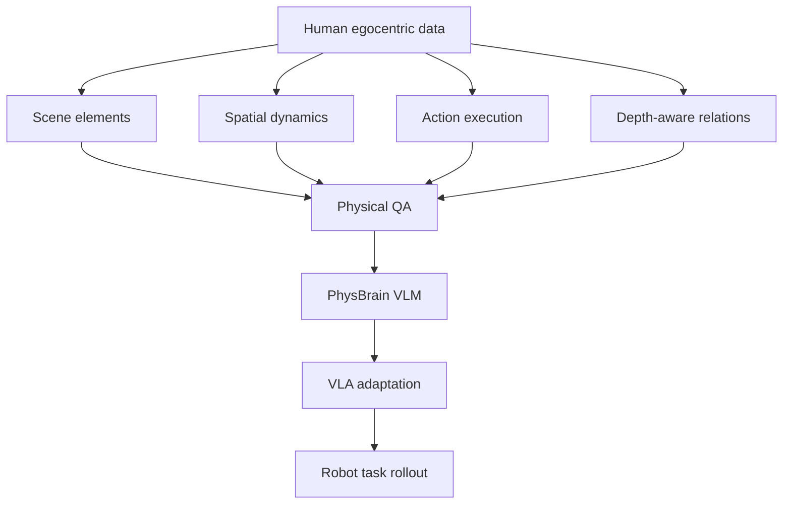

## Summary
PhysBrain 1.0은 인간 egocentric video에서 [[PhysicalCommonsense]] supervision을 추출하여 [[VLA|Vision-Language-Action]] 정책으로 전이하는 기술 프레임워크다. Raw video가 아닌 structured meta-record(JSON-like physical representation)를 [[PhysicalQA]] 형태로 변환해 VLM이 물리적 추론을 학습하게 하며, [[CapabilityPreservingAdaptation]]을 통해 VLM의 일반적 능력을 유지하면서 robot action policy로 전이한다.

## Key Claims
- Robot trajectory만으로는 platform coverage와 physical reasoning이 부족하다
- Human egocentric video에는 contact, reachability, state change 등 [[PhysicalCommonsense]] prior가 풍부하다
- Raw video/caption은 약한 supervision이므로 structured meta-record가 필수적이다
- [[PhysicalQA]]를 통해 VLM이 물리적 reasoning을 학습한다
- [[CapabilityPreservingAdaptation]]으로 VLM prior를 유지하면서 VLA로 전이한다

## Key Quotes
> "annotation model이 만든 physical QA의 오류가 VLM/VLA에 체계적으로 주입될 수 있다" — 핵심 리스크로 annotation quality의 중요성 강조

> "language를 제거해도 성능이 비슷하다면 policy가 visual shortcut에 빠졌을 수 있다" — language ablation의 필요성

## Architecture

## Key Representations
- `scene_elements`: object, material, geometry, state
- `spatial_dynamics`: initial layout, relation changes, depth ordering
- `action_execution`: local manipulation, sub-action order, task objective
- `physical QA`: 위 record를 자연어 Q&A supervision으로 rendering한 학습 target

## Study Questions & Answers

1. **PhysBrain이 generic caption을 피하는 이유는?**
   Caption은 physical feasibility와 action order를 충분히 담지 못해 VLA action grounding supervision으로 약하다. Structured meta-record + [[PhysicalQA]]가 더 강력한 supervision을 제공한다.

2. **왜 human video가 robot data를 완전히 대체하지 못하는가?**
   Robot embodiment, gripper dynamics, control frequency, action space가 다르기 때문에 robot-specific adaptation은 여전히 필요하다.

3. **이 논문의 핵심 리스크는?**
   Annotation model이 만든 [[PhysicalQA]]의 오류가 VLM/VLA에 체계적으로 주입될 수 있다는 점이다.

## Implementation Notes
- QA 생성 전 structured record validation이 중요하다. Schema validation 없이 바로 caption-to-QA를 만들면 hallucination이 policy supervision으로 굳을 수 있다
- Retention data를 섞어 VLM의 general capability를 유지해야 한다
- Language ablation을 꼭 해야 한다. Language를 제거해도 성능이 비슷하다면 policy가 visual shortcut에 빠졌을 수 있다

## Reading Roadmap
1. Figure 1 system overview로 전체 pipeline 파악
2. Data engine schema를 읽고 어떤 physical factor를 명시하는지 정리
3. VLM benchmark와 VLA benchmark가 각각 어떤 claim을 지지하는지 분리
4. [[OpenVLA]]/[[Pi0]]/[[GR00T-N1]]와 비교해 adaptation philosophy 차이를 정리

## Connections
- [[VLA]] — 핵심 타겟 모델
- [[PhysicalCommonsense]] — 핵심 추출 대상
- [[OpenVLA]] — comparison target
- [[Pi0]] — comparison target  
- [[GR00T-N1]] — comparison target
- [[SimplerEnv]] — robot manipulation benchmark
- [[LIBERO]] — robot manipulation benchmark
- [[RoboCasa]] — robot manipulation benchmark
- [[Ego4D]] — human egocentric video dataset

## Contradictions
- 없음 (동일 논문의 learning 가이드로 기존 analysis/pages와 일관성 유지)
