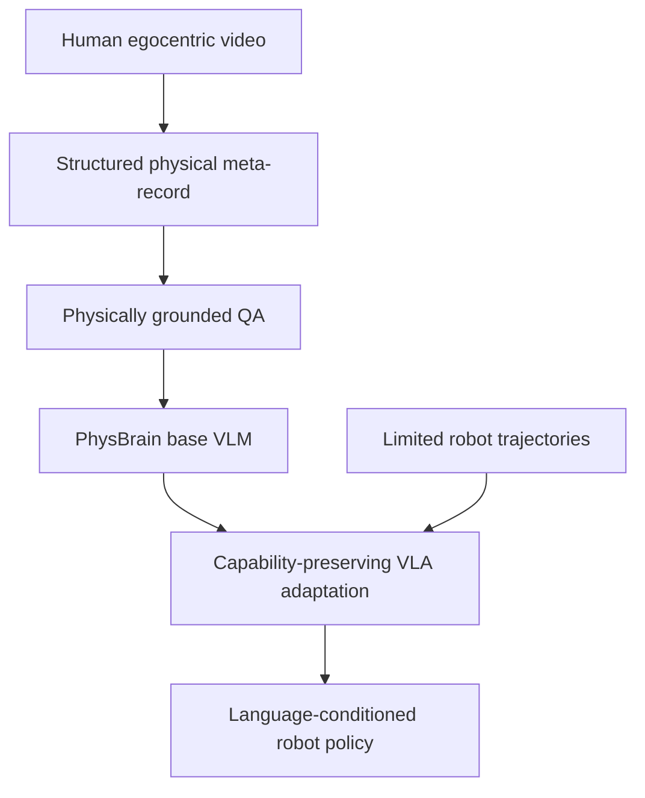

## Summary
PhysBrain 1.0은 대규모 human egocentric video를 [[PhysicalCommonsenseSupervision]]으로 변환하여 [[VLA]] 모델에 전이하는 방법을 제안한다. Data engine은 scene elements, spatial dynamics, action execution, depth-aware relations를 구조화된 meta-record로 추출하고, 이를 [[PhysicallyGroundedQA]]로 변환해 PhysBrain VLM을 학습시킨다. Capability-preserving adaptation을 통해 robot control로 전이되어 SimplerEnv-WidowX, LIBERO, RoboCasa 등 benchmark에서 SOTA 수준의 성능을 보인다.

## Key Claims
- Robot trajectory만으로는 넓은 물리 이해를 학습하기에 coverage가 제한적이다
- Human egocentric video는 contact, reachability, object state change, tool use, spatial constraint, multi-step task structure를 자연스럽게 포함한다
- Physical commonsense prior를 먼저 학습하면 limited robot adaptation data로도 downstream control 성능을 끌어올릴 수 있다
- VLA adaptation 시 catastrophic forgetting과 language-action alignment 문제를 동시에 해결해야 한다

## Key Quotes
> "PhysBrain 1.0 transforms large-scale human egocentric interaction videos into structured physical supervision... The learned physical priors are then transferred to robot control through capability-preserving VLA adaptation, supporting language-conditioned action generation across simulated and real-world embodied tasks."

> "VLM-to-VLA adaptation이 imitation-dominated training으로 일반 vision-language capability를 지워버리거나, language input을 무시하고 visual shortcut에 빠지는 것"이 핵심 우려이다.

## Architecture

## Data Engine Pipeline
1. Raw video → 2. Explicit physical record (JSON-style) → 3. Augmentation/checking → 4. QA supervision
- **Data sources**: Ego4D, BuildAI, EgoDex, EPIC, SEA-Small
- **Filtering**: Visual quality + camera-motion score (VGGT-derived)
- **Schema fields**: scene_elements, spatial_dynamics, action_execution, depth-aware relations

## Benchmark Results
- **VLM evaluation**: ERQA, PhysBench, MME, MMMU, RealWorldQA
- **VLA evaluation**: SimplerEnv-WidowX, SimplerEnv-GoogleRobot, LIBERO, RoboCasa-GR1
- **Comparisons**: Octo, OpenVLA, OpenVLA-OFT, RoboVLM, TraceVLA, SpatialVLA, CogACT, VideoVLA, π0, π0.5, Isaac-GR00T-N1.6-Bridge, Xiaomi-Robotics-0

## Connections
- [[HumanNet]] — 100만 시간规模的 human-centric video corpus로 VLA pretraining
- [[MobileEgoAnywhere]] — smartphone 기반 egocentric 데이터 수집 인프라
- [[EmbodiedMidtrain]] — VLM과 VLA 사이의 간극을 Mid-training으로 잇는 연구
- [[VLA]] — Vision-Language-Action 모델링 패러다임
- [[Ego4D]] — 주요 학습 데이터 소스
- [[PhysicalCommonsenseSupervision]] — 핵심 학습 방법론
- [[CapabilityPreservingAdaptation]] — catastrophic forgetting 방지 기법

## Contradictions
- 없음 (신규 기술 보고서)
