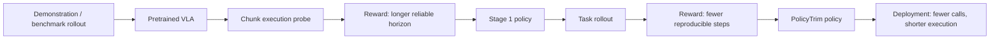

## Summary
PolicyTrim은 [[ActionChunk]]의 tail degradation와 redundant steps를 줄여 [[VLA]] 실행 호출 수를 감소시키는 RL 기반 2단계 post-training 프레임워크다. pretrained VLA를 추가 demonstration 없이 fine-tuning하여 action chunk utilization 3배, physical steps 51.4% 감소, 최대 5.83배 speedup을 달성한다.

## Key Claims
- VLA deployment의 실제 병목은 model inference latency가 아니라 [[PolicyEfficiency]]의 부재다
- action chunk prediction의 tail 부분이 불안정해 실제 실행 시 chunk를 짧게 잘라 사용하거나 자주 재추론한다
- 성공 가능한 task에서도 redundant physical steps가 많아 deployment 속도가 떨어진다
- [[PolicyEfficiency]]를 compute efficiency와 분리하여 정의하고 RL로 최적화한다
- reliable action chunk length를 점진적으로 확장하는 2-stage curriculum을 제안한다
- redundancy-aware reward로 성공률을 유지하면서 physical steps를 감소시킨다

## Key Quotes
> "한 번 예측한 trajectory를 얼마나 오래 믿을 수 있는가"와 "불필요한 control correction을 줄일 수 있는가"는 핵심 deployment 문제다

## Architecture / Pipeline

## Training Recipe
1. pretrained VLA policy를 준비한다
2. chunk horizon을 변화시키며 rollout한다
3. 긴 chunk를 성공적으로 실행하면 reward를 부여한다 (Stage 1)
4. task success를 유지하며 step 수가 줄어드는 rollout을 보상한다 (Stage 2)
5. shortcut/불안정 행동은 penalty로 억제한다
6. 여러 benchmark/model에서 SR과 speedup을 함께 검증한다

## Benchmark / Metrics
- LIBERO subsets
- ManiSkill, Meta-World
- real-world robot manipulation tasks
- Metrics: SR (Success Rate), average physical steps, action chunk execution length, end-to-end speedup

## Key Results
| Metric | Improvement |
|--------|-------------|
| Action chunk utilization | 3× increase |
| Physical steps reduction | 51.4% decrease |
| Maximum speedup | 5.83× |

## Cross-Architecture Validation
- [[π0.5]] — 적용 검증 완료
- [[OpenVLA-OFT]] — 적용 검증 완료  
- [[GR00T]] — 적용 검증 완료

## Limitations / Risks
- reward 설계가 benchmark/task에 민감할 수 있다
- step 수 감소가 safety margin 감소로 이어지지 않도록 verifier가 필요하다
- driving으로 확장 시 comfort, traffic rule, collision risk, jerk/acceleration constraint를 reward에 포함해야 한다

## Connections
- [[VLA]] — target architecture
- [[ActionChunk]] — 핵심 최적화 대상
- [[PolicyEfficiency]] — 새로 정의하는 최적화 목표
- [[RLPostTraining]] — methodology
- [[π0.5]], [[OpenVLA-OFT]], [[GR00T]] — 적용 대상 VLA 모델
- [[ClosedLoopControl]] — deployment scenario와 관련

## Contradictions
- None identified with existing wiki content
