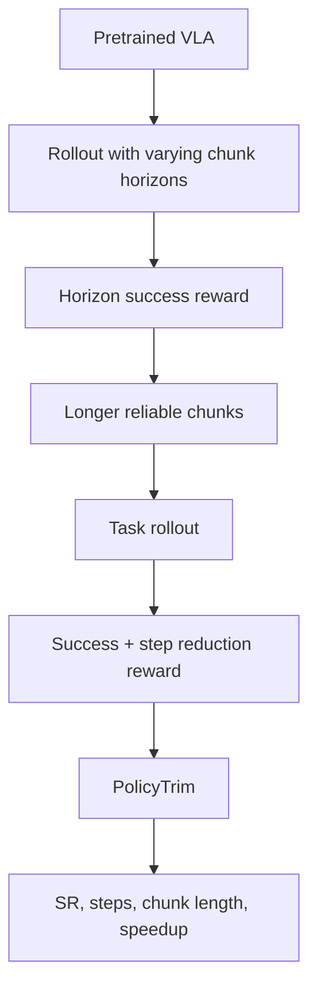

## Summary
PolicyTrim은 VLA(Vision-Language-Action) 모델의 **intrinsic policy efficiency**를 RL post-training으로 향상시키는 2단계 프레임워크다. Phase 1에서는 [[ActionChunk]]의 reliable horizon을 점진적으로 늘리고, Phase 2에서는 task 성공을 유지하면서 불필요한 [[PhysicalSteps]]를 줄이는 redundancy-aware reward를 적용한다. 실험 결과 action chunk utilization 3배 향상, physical steps 51.4% 감소, 5.83배 배포 속도 개선을 달성했다.

## Prerequisites

- VLA policy와 [[ActionChunk]]
- Closed-loop rollout evaluation
- [[ReinforcementLearning]] / reward design
- Robot manipulation benchmark — [[LIBERO]], [[ManiSkill]], [[MetaWorld]]

## Glossary

| 용어 | 설명 |
|---|---|
| [[IntrinsicPolicyEfficiency]] | model architecture가 아니라 policy behavior 자체가 task를 효율적으로 끝내는 정도 |
| [[ActionChunk]] | 한 번의 inference로 예측하는 여러 step의 action sequence |
| [[TailDegradation]] | action chunk 뒤쪽 action의 신뢰도가 떨어지는 현상 |
| [[PhysicalSteps]] | 실제 robot/environment에서 수행되는 action step 수 |
| [[RedundancyAwareReward]] | 성공을 유지하면서 불필요 step을 줄이도록 설계한 reward |

## Architecture Diagram



## Step-by-step 설명

1. baseline VLA가 [[ActionChunk]]를 얼마나 길게 안전하게 실행할 수 있는지 측정한다.
2. chunk horizon을 늘려 성공한 rollout에 보상을 준다 — Phase 1: **[[HorizonSuccessReward]]**
3. policy가 더 긴 chunk tail을 신뢰할 수 있게 된다.
4. 이후 task 완료 step 수를 줄이는 reward를 추가한다 — Phase 2: **[[RedundancyAwareReward]]**
5. 단순 shortcut이 아니라 재현 가능한 짧은 trajectory를 선호하게 만든다.
6. [[SuccessRate]]가 유지되는지 반드시 함께 확인한다.

## Key Equations

개념적으로 전체 실행 비용은 다음처럼 볼 수 있다.

```text
Total inference calls ≈ Total physical steps / Effective executable chunk length
Deployment speed ∝ fewer physical steps + longer reliable chunks
```

즉 VLA가 한 번에 더 긴 [[ActionChunk]]를 안정적으로 실행하고, task 자체를 더 적은 step으로 끝내면 forward pass 수와 wall-clock execution time이 함께 줄어든다.

## Implementation / Deployment Notes

- reward가 safety margin을 줄이지 않도록 collision/contact/constraint penalty를 같이 넣어야 한다.
- real robot에서는 dynamic perturbation에서도 success를 확인해야 한다.
- autonomous driving 적용 시 jerk, acceleration, lane rule, collision risk, comfort metric을 reward에 포함해야 한다.
- [[ActionChunk]]가 길어질수록 monitoring/fallback controller가 필요하다.

## Study Questions

**Q1. PolicyTrim이 pruning/quantization과 다른 점은?**  
A. pruning/quantization은 한 번의 inference를 빠르게 하지만, PolicyTrim은 필요한 inference 횟수와 [[PhysicalSteps]] 수를 줄인다. 즉 **deployment efficiency** 측면의 병목(forward pass 수 × 매 inference 비용)을 직접적으로 타겟한다.

**Q2. [[ActionChunk]]를 무조건 길게 실행하면 좋은가?**  
A. 아니다. [[TailDegradation]]이 있으면 실패한다. PolicyTrim은 성공 가능한 reliable horizon을 찾아 점진적으로 늘린다.

**Q3. 자율주행에 적용할 때 가장 조심할 점은?**  
A. step 수나 재계획 횟수 감소가 safety margin 감소로 이어질 수 있다. closed-loop safety verifier와 fallback planner가 필수다.

## Reading Roadmap

- **Day 1**: Abstract, Figure 1로 policy inefficiency 이해
- **Day 2**: Method 3.1–3.3으로 두 단계 RL objective 분석
- **Day 3**: Tables로 SR/steps/speedup trade-off 확인
- **Day 4**: driving trajectory planner에 reward를 어떻게 바꿀지 설계

## Connections
- [[VLA]] — 대상 모델 클래스
- [[ActionChunk]] — 핵심 조작 단위
- [[ReinforcementLearning]] — 학습 방법론
- [[LIBERO]] — robot manipulation benchmark
- [[ManiSkill]] — robot manipulation benchmark
- [[MetaWorld]] — robot manipulation benchmark
- [[PolicyTrim]] — 이 학습 자료의 주제인 방법론
- [[IntrinsicPolicyEfficiency]] — 타겟 지표
- [[TailDegradation]] — phase 1이 해결하려는 문제
- [[PhysicalSteps]] — phase 2가 줄이는 대상

## Contradictions
- 기존 wiki에 PolicyTrim 관련 source page(policytrim-2606-22540.md)가 존재하며 해당 페이지는 5.83배 속도 개선, 51.4% step 감소를 보고함. 본 learning 문서 내용과 일치하며 모순 없음.
