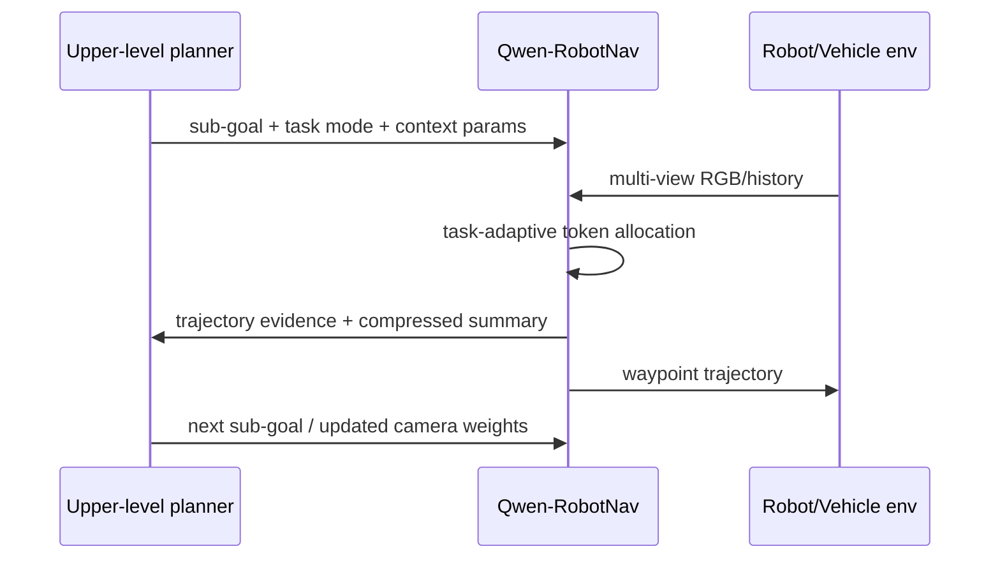

## Summary
This learning guide covers the Qwen-RobotNav paper, a [[Qwen3VL]]-based scalable navigation model that achieves VLN-CE 76.5% and NAVSIM 91.4 PDMS using task-adaptive observation encoding. The document provides prerequisites, terminology, step-by-step understanding, architecture diagrams, and study questions.

## Prerequisites
- Vision-language navigation (VLN), ObjectNav, PointNav
- VLM backbone: SigLIP, [[Qwen3VL]], multimodal tokenization
- Waypoint trajectory planning
- Closed-loop autonomous-driving metrics (TTC, drivable area, progress)

## Key Terminology

| Term | Description |
|------|-------------|
| Task-adaptive observation encoding | Method that adjusts visual history/token allocation based on task mode and context parameters |
| Temporal decay γ | Weighting factor determining how much weight to give to newer vs older frames |
| Camera weight w_c | Importance weighting for each multi-view camera |
| Action grounding | Converting VLM hidden states to waypoint trajectories |
| PDMS | NAVSIM's Progress/Distance/Safety metric; a closed-loop metric combining progress, safety, and rule compliance |

## Step-by-Step Understanding

1. Navigation tasks have varying observation history requirements
2. Instead of fixed context, `B, γ, w_c` are specified externally
3. Vision encoder creates tokens per frame/camera, with natural-language tags providing viewpoint/time identity
4. LLM backbone integrates instruction + visual context
5. MLP action head outputs 8-step waypoints
6. Upper planner calls [[QwenRobotNav]] with different context strategies per sub-goal

## Architecture

## Implementation Notes
- For edge deployment, visual token budget and quantization are key bottlenecks
- For AD extension, route command, map prior, ego state, traffic-light state can be added as prompt or structured input
- Closed-loop safety metric is more important than open-loop trajectory loss

## Key Questions and Answers

### Why is trajectory-only training dangerous?
Language/scene reasoning can be lost, turning the model into a reactive mapper rather than a reasoning agent.

### Why is camera weight important in autonomous driving?
Camera importance varies by situation: lane following, intersection, merge, rear vehicle awareness each require different camera priorities.

### Is this model a pure VLA?
Unlike robot manipulation VLAs, this is a navigation/action trajectory model, but with a vision-language backbone generating executable waypoints, it is very close to VLA/AD research.

## Next Papers to Read
- [[ABot-N0]]: VLA foundation model for embodied navigation
- TrackVLA / EVT-Bench: active visual tracking
- NAVSIM and planning-aligned token compression for long-context AD

## Connections
- [[QwenRobotNav]] — the main model this guide studies
- [[Qwen3VL]] — VLM backbone
- [[AgenticNavigation]] — dual-system interface approach
- [[NAVSIM]] — benchmark for closed-loop autonomous driving
- [[ABot-N0]] — recommended next paper
