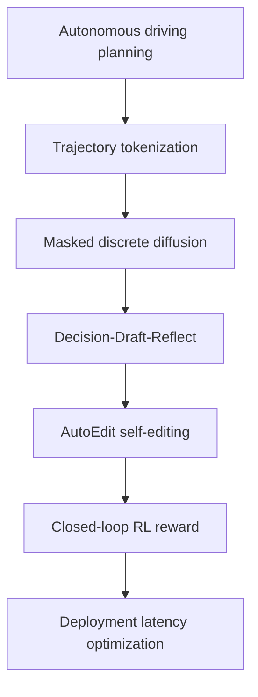

## Summary
ReflectDrive-2 학습 노트는 [[DecisionDraftReflectPipeline]], [[MaskedDiscreteDiffusion]], [[AutoEdit]], [[ClosedLoopReward]]를 자율주행 trajectory planning 관점에서 단계적으로 설명한다. 학습 목표는 discrete trajectory token이 왜 editable action representation이 되는지, RL-aligned self-editing이 open-loop imitation을 어떻게 보완하는지, 그리고 NVIDIA Thor latency 최적화가 실제 배포 가능성과 어떻게 연결되는지 이해하는 것이다.

## Key Claims
- ReflectDrive-2를 이해하려면 자율주행 planning, discrete tokenization, diffusion/denoising, RL reward credit assignment를 함께 봐야 한다.
- [[AutoEdit]]는 별도 refinement network가 아니라 같은 token space에서 draft trajectory 일부를 rewrite하는 방식이므로 correction path가 단순하다.
- [[ClosedLoopPlanning]] metric은 imitation loss보다 실제 driving quality에 가깝지만, benchmark reward가 현실 safety case를 완전히 대체하지는 못한다.
- Shared-prefix KV reuse, Alternating Step Decode, fused unmasking은 reasoning-heavy VLA planner를 실시간 제약에 맞추기 위한 핵심 배포 기술이다.

## Learning Map

## Study Questions
1. 왜 continuous trajectory를 그대로 회귀하지 않고 discrete token으로 바꾸는가?
   - token rewrite와 masked parallel decoding이 가능해져 planning correction을 모델 내부 operation으로 만들 수 있기 때문이다.
2. supervised AutoEdit만으로 충분하지 않은 이유는 무엇인가?
   - editor가 expert recovery는 배워도 drafter와 editor의 공동 rollout이 closed-loop reward를 최대화하도록 정렬되지는 않기 때문이다.
3. best-of-6 oracle score를 어떻게 읽어야 하는가?
   - policy posterior 안에 더 좋은 trajectory 후보가 존재한다는 diagnostic이며, 실제 배포 성능과 동일하게 해석하면 안 된다.

## Connections
- [[ReflectDrive2]] — 본 논문/모델의 entity page
- [[ReflectDrive2]] — 원문 번역 source page
- [[MaskedDiscreteDiffusion]] — trajectory draft 생성 방식
- [[AutoEdit]] — self-editing correction module
- [[DecisionDraftReflectPipeline]] — 전체 architecture
- [[NAVSIM]] — closed-loop benchmark
- [[VLA]] — vision-language-action driving planner 맥락
- [[E2EAutonomousDriving]] — end-to-end autonomous driving 배경

## Contradictions
- 없음
