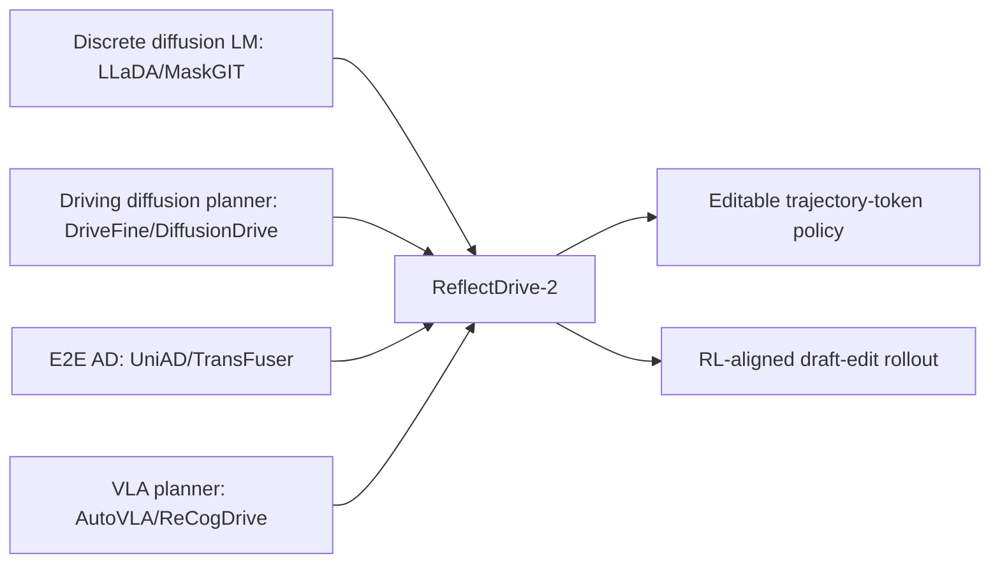

## Summary
ReflectDrive-2의 관련 연구를 주요 10개 레퍼런스로 정리한 페이지이다. [[MaskGIT]] 기반 discrete diffusion LM([[LLaDA]])에서 [[VLA]] planning에 이르기까지, E2E 자율주행의 trajectory generation 및 refinement 파이프라인을 뒷받침하는 연구들을 관계도 형태로 정리한다.

## Key References

| Reference | 관계 |
|---|---|
| [[DriveFine]] (2602.14577) | 가장 가까운 선행 연구. masked diffusion driving VLA에 refinement 추가, drafter/editor joint RL coupling 약함 |
| Unleashing Diffusion Models for E2E AD (2602.22801) | diffusion planner를 E2E AD에 적용하는 배경 |
| [[LLaDA2.1]] (2602.08676) | token-to-token editing 아이디어의 language diffusion 계열 기반 |
| [[LLaDA2.0]] (2512.15745) | discrete diffusion LM scaling 및 serving optimization 배경 |
| From Denoising to Refining (2510.19871) | denoising을 correction/refinement로 확장하는 multimodal diffusion 관점 |
| [[NAVSIM]] (2406.15349) | nuPlan 기반 closed-loop planning benchmark. ReflectDrive-2 주요 평가 환경 |
| [[UniAD]] (2212.10156) | perception/prediction/planning 통합 E2E AD baseline |
| [[TransFuser]] (2205.15997) | camera/LiDAR fusion 기반 E2E planner baseline |
| [[AutoVLA]] | 자율주행 VLA planner 비교군 |
| [[ReCogDrive]] | camera-only VLA planner peer로 ReflectDrive-2가 비교하는 대상 |

## 관계도

## Connections
- [[ReflectDrive2]] — parent paper this references page belongs to
- [[DriveFine]] — closest prior work
- [[LLaDA]] — discrete diffusion LM foundation
- [[NAVSIM]] — evaluation benchmark
- [[UniAD]] — E2E AD baseline
- [[TransFuser]] — fusion-based E2E planner baseline
- [[VLA]] — Vision-Language-Action model category
- [[E2EAutonomousDriving]] — end-to-end autonomous driving domain

## Contradictions
- None identified. This is a references page that contextualizes ReflectDrive-2 within existing literature.
