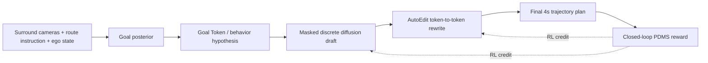

## Summary
ReflectDrive-2는 자율주행 planning을 discrete trajectory token의 masked diffusion 문제로 재정의하고, Decision–Draft–Reflect 파이프라인을 제안한다. Goal Token이 behavior hypothesis를 고정하고, masked discrete diffusion이 trajectory draft를 병렬 생성한 뒤, AutoEdit가 같은 token space에서 일부 token을 직접 rewrite한다. Draft와 edit 전체 rollout에 terminal driving reward를 부여하는 RL fine-tuning을 적용하여 NAVSIM에서 camera-only 91.0 PDMS, best-of-6 oracle 94.8 PDMS를 달성하며, NVIDIA Thor에서 약 30ms latency를 보인다.

## Key Claims
- Masked discrete diffusion은 trajectory token의 어떤 subset이라도 다시 rewrite할 수 있어 planning correction에 적합
- Supervised perturbation recovery만으로는 self-editing gain이 작으므로, draft-and-edit 전체 rollout에 terminal reward를 주는 RL이 필수적
- Drafter는 editor가 개선할 수 있는 revisable draft를 내는 방향으로, editor는 reward-seeking correction 방향으로 공동 학습됨
- Shared-prefix KV reuse, Alternating Step Decode, fused on-device unmasking으로 NVIDIA Thor에서 약 30ms latency 달성

## Key Quotes
> "Imitation-learned driving policy의 planning error는 무작위가 아니다. 주로 longitudinal speed misjudgment(overshoot, under-progress, late braking)와 lateral heading drift(lane deviation, clipped turn, drivable-area violation)에 집중된다."

> "Self-correction이 supervised editor만으로는 충분하지 않고, draft와 edit 전체 rollout을 terminal reward로 공동 최적화해야 한다."

## Method Overview

## AutoEdit Perturbation Strategy
- **Longitudinal progress perturbation**: arc length progress를 rescale해 under-progress 또는 overshoot를 생성
- **Lateral heading perturbation**: ego frame에서 trajectory를 회전시켜 lane drift나 clipped turn과 유사한 오류 생성

## Experiments
- **Benchmark**: [[NAVSIM]] (nuPlan 기반 closed-loop planning)
- **Camera-only performance**: 91.0 PDMS
- **Best-of-6 oracle**: 94.8 PDMS
- **Latency**: NVIDIA Thor에서 약 30ms

## Connections
- [[NAVSIM]] — 평가 benchmark
- [[MaskedDiscreteDiffusion]] — 핵심生成 패러다임
- [[AutoEdit]] — trajectory correction 모듈
- [[DecisionDraftReflectPipeline]] — 전체 아키텍처
- [[VLA]] — 관련 planning 접근법
- [[ReinforcementLearning]] — RL fine-tuning 기법
- [[NVIDIA]] — 배포 타겟 하드웨어 Thor
- [[ViT]] — Visual backbone

## Contradictions
- 없음
