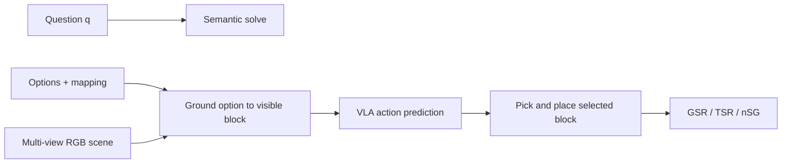

## Summary
VLA(Vision-Language-Action) 모델의 action prediction에서 semantic grounding 실패를 진단하는 RoboSemanticBench benchmark 학습 가이드. 선수 지식부터 수식/구현 메모, study questions까지 VLA action grounding 병목 분석에 필요한 핵심 학습 자료를 체계적으로 정리한다.

## 선수 지식 (Prerequisites)
- [[VLA]]/[[VLM]] 기본 구조
- Imitation learning과 action token/trajectory prediction
- Closed-loop robot control과 latency budget
- Benchmark metric 설계(GSR, TSR, success rate 등)

## 핵심 용어 Glossary
- **VLA**: Vision/Language 입력을 executable action으로 변환하는 모델
- **Action Grounding**: 언어/시각 reasoning 결과가 실제 waypoint, trajectory, gripper action으로 연결되는 과정
- **Closed-loop**: 모델 action이 환경 상태를 바꾸고, 다음 observation/action에 다시 반영되는 실행 방식
- **Shortcut Behavior**: 진짜 semantic understanding 없이 색/위치/분포 편향으로 성공하는 행동
- **GSR (Gross Success Rate)**: Grasp 성공 조건의 전체 성공률
- **TSR (Target Success Rate)**: Semantic target 선택 성공률
- **nSG (normalized Semantic Grounding)**: Grasp 성공 조건에서 semantic target 선택이 random baseline 대비 성능

## Architecture / Benchmark Map

Benchmark 설계 핵심: Semantic decision → Physical action interface 정의 → motor execution과 semantic selection 분리 metric

## 단계별 이해

1. **Semantic decision 경계 설정**: 무엇을 semantic decision으로 볼지 정의
2. **Interface 정의**: decision이 physical target/action으로 변환되는 interface 설계
3. **Metric 분리**: motor execution과 semantic selection을 분리하는 metric 배치
4. **동시 분석**: latency와 safety-critical failure mode 함께 분석

핵심 Focus:
- [[SemanticGrounding]] vs standalone VQA 구분
- GSR/TSR/nSG metric 해석
- Instruction-action shortcut 감지
- [[VLA]] safety benchmark 설계

## 핵심 수식/표현

nSG는 grasp 성공 조건에서 semantic target 선택이 random baseline 대비 성능을 정규화한 점수:
- High GSR + Low TSR = Motor skill은 있으나 semantic action grounding 실패
- nSG = (TSR - TSR_random) / (1 - TSR_random)

## 구현/배포 메모

### 자율주행 확장
- Block target → lane/object/route/trajectory candidate로 대체
- Language reasoning을 action head가 소비 가능한 structured state로 보존 필수

### 실시간 시스템 고려사항
- Textual CoT 직접 decode보다 compact visual/BEV evidence 사용 권장
- Verified symbolic state 활용이 더 안전

## Study Questions

### Q1: VLA가 VQA를 잘하면 action grounding도 잘 될까?
**A**: 아니다. Semantic answer가 action pathway에 전달되지 않으면 행동은 [[ShortcutBehavior]]를 따를 수 있다.

### Q2: Closed-loop에서 latency가 왜 중요한가?
**A**: 늦은 reasoning은 환경 변화 후 실행되어 unsafe action을 만들 수 있다.

### Q3: Benchmark는 어떤 confound를 제거해야 하는가?
**A**:
- Grasp/motor success와 target semantic selection 분리
- Color/position shortcut 감지
- Train-test question memorization 방지

## Reading Roadmap

1. 원문 Abstract/Introduction으로 문제의식 파악
2. Method/Benchmark section에서 input-output-action interface 파악
3. Results table은 metric 정의와 함께 읽기
4. References의 [[OpenVLA]]/[[Pi0]]/[[CoT-VLA]]/benchmark 관련 논문으로 확장

## Connections
- [[VLA]] — 핵심 대상 모델 클래스
- [[SemanticGrounding]] — 진단 대상 병목 현상
- [[OpenVLA]] — 벤치마크 비교 대상 VLA
- [[GR00T]] — 벤치마크 비교 대상 VLA
- [[Pi0]] — 벤치마크 비교 대상 VLA
- [[CoT-VLA]] — 관련 reasoning 기반 VLA 연구
- [[ActionPrediction]] — 태스크 유형
- [[ShortcutBehavior]] — 진단 대상 실패 모드
- [[ClosedLoopControl]] — 실행 패러다임
- [[BenchmarkMetrics]] — 평가 체계(GSR/TSR/nSG)

## Contradictions
- 없음 — 신규 학습 자료로 기존 wiki 내용과 충돌 없음
