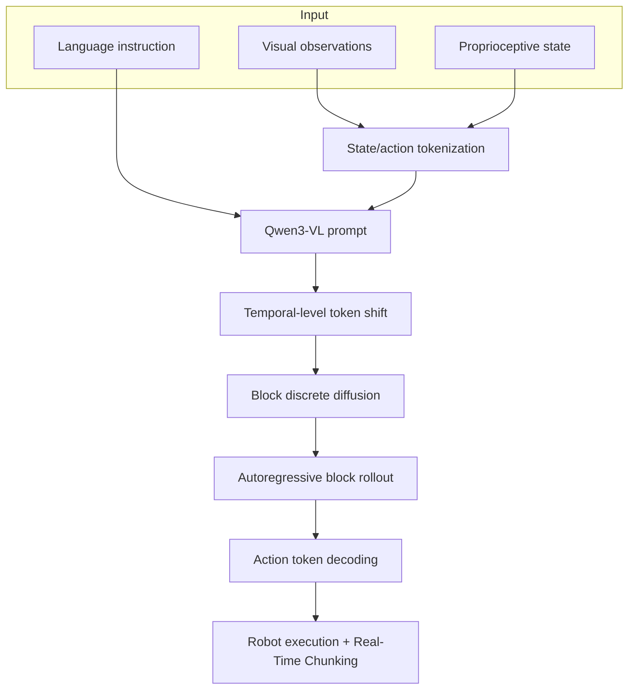

## Summary
TBD-VLA는 discrete VLA의 핵심 병목인 autoregressive action-token latency를 block discrete diffusion으로 해결하면서, block-level autoregression으로 trajectory temporal dependency를 보존하는 framework이다. Real-Time Chunking(RTC)을 통해 실행 중 prefix 이후 미래 action block을 temporal in-painting처럼 갱신할 수 있어 closed-loop robot manipulation에 적합하다.

## Problem Definition
VLA policy가 visual observation과 language instruction을 받아 action sequence를 생성할 때:
- **Continuous action expert**: 빠르고 매끄러운 control이지만 해석성 부족
- **Discrete action token (VLM directly decodes)**: action grounding 해석성 좋지만 token-by-token generation이 느림
- TBD-VLA는 discrete action token의 장점을 유지하면서 latency를 줄이는 것이 목표

## Key Contributions
1. **Temporal block diffusion**: action sequence를 block으로 나누고 block 내부는 masked discrete diffusion으로 병렬 생성
2. **Block-level autoregression**: block 간 이전 block을 조건으로 두어 trajectory의 시간적 일관성 유지
3. **Temporal-level token shift**: diffusion objective를 pretrained VLM의 next-token objective와 정렬
4. **Real-Time Chunking 호환성**: 이미 실행 중인 prefix 이후 미래 action block을 temporal in-painting처럼 갱신
5. **Latency/성능 균형**: SimplerEnv Google Robot 88.7% success, 0.086s inference time

## Architecture

## Input/Output Specification

| 항목 | 내용 |
|---|---|
| 입력 | RGB visual observation, proprioceptive state, language instruction |
| Backbone | [[Qwen3VL]] 2B |
| Action 표현 | action feature를 bin으로 discretize한 token sequence |
| 생성 단위 | temporal block |
| 출력 | 미래 robot action chunk |
| 실행 | closed-loop robot manipulation, [[RealTimeChunking]] 가능 |

## Training Recipe
- Proprioception과 action feature를 shared discrete vocabulary로 token화
- corrupted block의 masked tokens를 복원하도록 학습
- token shift로 current block logits가 next action block을 예측
- 최종 inference: `m=4`, `n_d=2`, expectation sampling

## Evaluation Results

| 평가 환경 | 결과 |
|---|---|
| LIBERO / LIBERO-Plus | multiple task suite에서 strong performance |
| SimplerEnv | Widow-X/Google Robot에서 discrete VLA baseline 대비 우수한 성능 |
| Real-world FR3 | 평균 67.1% success (π0.5 50.0% 대비 우세) |
| Latency | 최종 inference 0.086s |
| RTC 효과 | without RTC 60.0% → with RTC 67.1% |

## Strengths
- Discrete action token의 interpretability와 VLM 직접 decoding 장점 유지
- Block 내부 parallelism으로 latency 감소
- Block 간 temporal AR로 순수 병렬 diffusion보다 temporal coherence 보존 가능
- Auxiliary action expert 없이 VLM backbone이 action generation에 직접 관여

## Limitations
- 아직 manipulation 중심, autonomous driving trajectory planning에 직접 검증되지 않음
- Camera viewpoint OOD처럼 visual fidelity가 중요한 조건에서 실패
- VLM 내부 representation이 어떻게 action grounding으로 변환되는지 해석 부족
- OpenVLA-OFT 같은 극단적 parallel method보다 latency 자체는 느릴 수 있음

## Connections
- [[ReflectDrive2]] — trajectory tokenization 흐름과 직접 연결
- [[Qwen3VL]] — backbone으로 사용
- [[BlockDiscreteDiffusion]] — 핵심 기술
- [[TemporalBlockDiffusion]] — block-level temporal modeling
- [[RealTimeChunking]] — closed-loop control 지원
- [[VisionLanguageAction]] — 전반적인 VLA framework

## Related Sources
- [[tbd-vla-2606-07895]] — 원본 소스
- [[reflectdrive-2-2605-04647]] — discrete diffusion driving과 연결
- [[visualthink-vla-2605-30011]] — VLA reasoning과 연결
