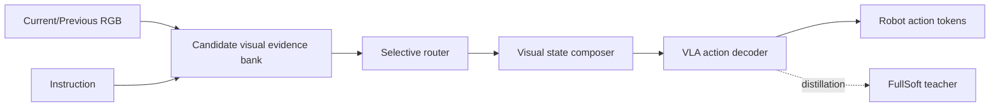

## Summary
VLA(Vision-Language-Action) 정책에서 textual Chain-of-Thought 대신 visual evidence states를 사용해 action grounding 문제를 해결하는 VisualThink-VLA의 학습 가이드. Visual intermediate reasoning으로 latency를 22.8× 감소(8.377s→0.367s)시키며, semantic decision과 motor execution을 분리하여 closed-loop robot control에 적합한 [[SelectiveRouting]] 기반 접근법을 설명한다.

## Key Claims
- VQA 성능이 높다고 action grounding이 잘 된 것은 아님 — semantic answer가 action pathway에 전달되지 않으면 [[ShortcutBehavior]] 발생
- Textual CoT를 실시간 시스템에 그대로 사용하면 환경 변화 후 실행되어 [[UnsafeAction]] 발생 가능
- Latency budget 안에서 semantic selection과 motor execution을 분리해야 함
- Teacher-student distillation으로 sparse routed interface가 dense evidence teacher의 성능을 보존
- [[ActionGrounding]] 실패의 핵심 원인: semantic reasoning 결과가 executable action으로 변환되는 interface 설계 부재

## Architecture

## Core Components
- **Candidate Visual Evidence Bank**: RGB 입력을 기반으로 후보 시각적 evidence 수집
- **Selective Router**: instruction 기반 relevant evidence 선택
- **Visual State Composer**: 선택된 evidence를 action decoder가 소비 가능한 형태로 구성
- **Teacher (FullSoft)**: 전체 teacher distribution p_T^τ로 student、指导
- **Student**: sparse routed interface로 동작하는 경량 모델

## Key Formulas
Teacher-student distillation은 teacher action-token distribution p_T^τ와 student distribution p_S^τ 사이의 divergence를 최소화하여 [[ActionGrounding]] 성능을 보존한다.

## Study Questions

### Q1: VLA가 VQA를 잘하면 action grounding도 잘 된다고 볼 수 있는가?
**A**: 아니다. Semantic answer가 action pathway에 전달되지 않으면 행동은 [[ShortcutBehavior]]를 따른다. 색/위치/분포 편향으로 성공할 수 있어 진짜 semantic understanding이 없다.

### Q2: Closed-loop에서 latency가 왜 중요한가?
**A**: 늦은 reasoning은 환경 변화 후 실행되어 [[UnsafeAction]]을 만들 수 있다. Closed-loop에서는 observation→reasoning→action 주기가 연속적으로 돌며, latency가throughput과 안전 모두에 영향.

### Q3: Benchmark는 어떤 confound를 제거해야 하는가?
**A**: Grasp/motor success와 target semantic selection, color/position shortcut, train-test question memorization을 분리해야 한다. [[GSR]], [[TSR]] 등의 metric으로 semantic grounding 격차를 측정.

## Connections
- [[VisualThink-VLA]] — 메인 페이지
- [[VLA]] — Vision-Language-Action 모델 프레임워크
- [[ActionGrounding]] — reasoning 결과가 action으로 변환되는 과정
- [[VisualReasoning]] — textual CoT 대비 visual evidence 기반 추론
- [[ClosedLoop]] — 환경 피드백 기반 연속적 제어
- [[SelectiveRouting]] — instruction 기반 evidence 선택 메커니즘
- [[ShortcutBehavior]] — semantic understanding 없는 근본적 행동
- [[TeacherStudentDistillation]] — teacher distribution → student 경량화

## Contradictions
- 없음 — 기존 wiki의 VisualThink-VLA 소스와 일치하며 학습 가이드로 보완하는 형태
