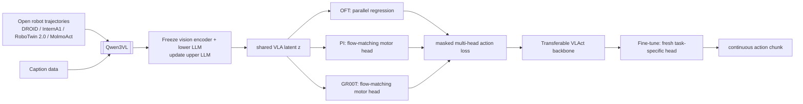

## 한 문장 결론

[[VLAct]]는 robot trajectory를 단순히 action target으로 맞추는 방식이 아니라, **VLM prior 보존 + multiple continuous action head + 부분 공유 action space**로 [[VisionLanguageAction|VLA]] 표현력을 유지하면서 새로운 task에 이식 가능한 backbone을 만든다.

## 문제와 기여

1. Robot trajectory는 web-scale image-text 데이터처럼 풍부하지 않아 data 효율성이 병목이다.
2. Action-only full update는 [[VisionLanguageModel|VLM]]의 broad visual-language prior를 좁은 robot 데이터 분포로 끌고 가는 **catastrophic representation drift**를 유발한다.
3. 단일 action head는 decoder lock-in을 만들고 다른 action 표현으로의 이식이 약해질 수 있다.
4. VLAct는 shallow-layer freeze/caption mixing, [[OFT]], [[PI]], [[GR00T]] multi-head co-supervision, masked partially unified action layout을 결합한다.
5. downstream에서는 새 task-specific action head만 붙여 representation 기여를 분리해 평가한다.

## 아키텍처/파이프라인

| 요소 | 입력 | 출력 | 역할 |
|---|---|---|---|
| VLM backbone | image + language instruction | multimodal latent z | visual/semantic grounding |
| shallow protection | pretrained parameter groups | protected lower features | narrow robot data로 인한 prior drift 완화 |
| caption mixing | caption/image auxiliary data | VLM loss | representation anchor |
| multi-head action learner | z, action chunk | OFT/PI/GR00T losses | one-decoder collapse 억제 |
| partial unified layout | embodiment-native actions | masked 20-D target | 공유 가능한 gripper semantics 정렬 |
| downstream head | z | continuous control chunk | task-specific grounding |

## 입력 → action grounding → taxonomy

- 입력: robot camera observation + language instruction, task에 따라 proprioception/action history.
- 출력: embodiment-native continuous action chunk.
  - Franka는 delta end-effector + gripper, AgileX는 absolute joint + gripper 등을 사용.
- Language는 chain-of-thought action 생성을 위한 지시문이 아니라 action grounding의 조건으로 사용.
- VLM latent에서 selected continuous action head로 이어져 최종 motor chunk가 생성.
- 분류: [[VisionLanguageAction]]의 representation transfer / distillation 축 + continuous action generation의 backbone recipe.
- 자율주행 확장: vehicle trajectory/action head로 prior transfer할 때 동일한 catastrophic drift 및 head-lock-in 이슈가 재현될 수 있다는 점을 시사.

## Training recipe와 핵심 표현

\[
\mathcal L=\sum_h\lambda_h\mathcal L_{\mathrm{action}}^{(h)}+\lambda_{\mathrm{vlm}}\mathcal L_{\mathrm{caption}}+\lambda_{\mathrm{wrap}}\mathcal L_{\mathrm{wrap}}.
\]

- Pretraining: vision encoder + lower LLM freeze, upper LLM과 action heads 업데이트.
- Caption mixing: action supervision 밖의 dense semantic/spatial gradient를 줘 VLM feature를 anchor.
- Multi-head: OFT, PI, GR00T가 동일 z에서 각기 decode해 head-agnostic access 강제.
- Action layout: active dimension만 mask-loss 적용, gripper 좌표 같은 공통 물리 semantics만 공유.
- Wrap-aware loss: periodic joint angle의 \(\operatorname{wrap}(\hat a-a)\) residual에 L1 penalty.
- Fine-tuning: pretraining head를 재사용하지 않고 fresh downstream head로 protocol 통일.

## 데이터/벤치마크/평가지표

| 항목 | 성격 | 주요 metric | 주의점 |
|---|---|---|---|
| [[LIBERO-Plus]] | robustness simulation | success rate | open-loop 예측이 아닌 policy rollout 지표가 핵심 |
| [[RoboTwin 2.0]] | dual-arm simulation | clean/random success | domain randomization protocol 일치 비교 필요 |
| [[VLA-Arena]] | suite benchmark | weighted success | 11 suite 가중치 분포와 task 분포 민감성 |
| [[DOMINO]] | dynamic manipulation | SR, Manipulation Score | dynamic object에 대한 짧은 proxy proxy |
| [[RoboCasa-GR1]] | cross-embodiment | success vs data fraction | held-out humanoid transfer가 핵심 |
| [[RoboDojo]] | broad sim/real leaderboard | partial score, success | leaderboard 데이터 스플릿이 상이 |
| [[Franka]] real tasks | real robot | 10-rollout success/task | sample 수 적고 industrial safety evidence 아님 |

## 강점

- **공정한 representation 주장:** 동일 downstream head/data/budget 비교로 pretraining head 재사용 효과를 줄임.
- **실용적 모듈성:** one universal action head를 강제하지 않고 action head를 task/latency 요구에 맞게 교체.
- **multi-embodiment alignment:** full coordinate alignment 강제 오류를 피하고 공유 가능한 물리 semantics만 공유.
- **data-efficient transfer:** GR-1을 continual pretraining에 쓰지 않고도 20% 데이터에서 전이 성능 제시.
- **개방성:** public data, 16-GPU 설정, 공개 계획 및 코드/weights 공개 예고로 접근성 개선.

## 한계·안전·배포 함의

- VLM freeze 비율, caption mixing 비율, angle wrap/normalization 안정성은 model-dependent.
- multi-head는 메모리/연산 오버헤드를 증가, PI/GR00T는 one-shot 회귀보다 latency 증가 가능.
- normalization/그리퍼 좌표 계약/angle wrap가 틀리면 shared representation 대신 artifact 학습 리스크.
- benchmark success는 contact force, collision, emergency stop, hardware delay, sensor dropout을 충분히 반영 못함.
- 자율주행 전이에서는 action semantics를 waypoint/trajectory/control 포맷으로 다시 정의해야 하며, closed-loop simulation + road safety validation이 별도 필요.

## 왜 중요한가

VLA scaling의 병목을 데이터 양 확장에서 \"제한된 robot 데이터가 foundation representation을 얼마나 유지한 채 action-aware하게 바꾸는지\"로 이동시킨다. 즉, robot 사전학습은 scale보다 **표현 보존·action-space 정렬·오버헤드-안전 타협**의 균형 문제다.