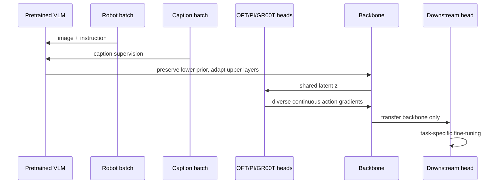

## 요약

이 학습 노트는 [[VLAct]]의 핵심 설계를 구현 관점에서 정리한다. 핵심 메시지는 **표현 중심 지속 학습**이다. 즉, robot 데이터만으로 [[VisionLanguageModel|VLM]] 백본을 뒤틀기보다, [[VisionLanguageAction]]의 표현력을 유지하면서 action 지향 표현을 추가하는 방식으로 [[cross-embodiment transfer]]의 재사용성을 높이는 방법을 다룬다.

학습에서 중요한 축은 네 가지다.
- continued pretraining 시 데이터 편향을 막는 prior 보존
- [[decoder lock-in]] 완화를 위한 다중 continuous action head
- 로봇 간 비교 가능한 물리 의미를 살리는 [[PartiallyUnifiedActionLayout|partial unification]]
- deployment 단계에서 head를 교체 가능한 구조

특히 periodic joint 각도에서는 일반 L1 회귀가 실패할 수 있어 [[WrapAwareLoss]]가 필요하다.

## 선행 지식

1. [[VisionLanguageModel|VLM]]의 vision encoder-LLM 구조와 instruction tuning
2. [[VisionLanguageAction|VLA]]의 observation/language → action chunk 매핑
3. continuous regression, diffusion/flow matching, action tokenization의 차이
4. catastrophic forgetting / representation drift와 transfer learning
5. 로봇 action convention: delta end-effector, absolute joint angle, gripper command

## 용어집

| 용어 | 뜻 |
|---|---|
| [[ContinuedPretraining]] | pretrained VLM을 broad robot trajectory로 target task fine-tuning 이전에 추가 학습하는 단계 |
| VLM prior | web-scale image-text 학습에서 얻은 object, relation, language 정렬 표현 |
| [[DecoderLockIn]] | 단일 action head가 latent를 특정 path에만 최적화해 다른 표현 형태로의 전환이 약해지는 현상 |
| [[OFT]] | action query token에서 continuous chunk를 병렬 회귀하는 head |
| [[PI]] | conditional flow matching으로 action chunk를 학습하는 action expert |
| [[GR00T]] | vision-language stream과 [[FlowMatching]] 스타일 motor stream을 결합한 head |
| partial unification | 물리적으로 비교 가능한 차원만 공유하고 나머지는 action별로 분리하는 layout 설계 |
| [[WrapAwareLoss]] | joint angle 주기성(
$2\pi$)을 반영한 residual loss |

## 단계별 이해

1. **시작점:** generic [[VisionLanguageModel]]은 vision-language generality는 좋지만 직접적인 action 생성에 최적화되지 않다.
2. **보존:** vision encoder와 lower LLM을 freeze하고 [[CaptionMixing|caption batch]]를 섞어 robot-only gradient가 broad prior를 덮어쓰지 않게 한다.
3. **다양화:** 동일 latent를 OFT / [[PI]] / [[GR00T]]로 decode한다. 하나의 decoder만 과도하게 좋아지는 shortcut을 줄인다.
4. **정렬:** 로봇별 native action을 유지하되 물리적으로 대응되는 gripper coordinate만 공유한다.
5. **전이 검사:** continued pretraining head는 버리고 fresh downstream head를 붙인다. 여전히 성능이 좋으면 reusable backbone이라는 주장이 강화된다.

## 핵심 표현

다중 head objective는 다음 형태로 요약할 수 있다.

$$z=f_\theta(o,\ell),\qquad \mathcal L_{action}=\sum_h\lambda_h\mathcal L_h(g_h(z),a).$$

여기서 $o$는 observation, $\ell$은 instruction, $g_h$는 head-specific decoder다. 단일 head가 아닌 이유는 latent가 여러 action decoder에 유효해야 한다는 점 때문이다.

periodic angle에서는

$$\operatorname{wrap}(x)=((x+\pi)\bmod 2\pi)-\pi,$$
$$\mathcal L_{wrap}=\|\operatorname{wrap}(\hat a-a)\|_1,$$

형태의 loss가 $+\pi$/ $-\pi$ 경계의 유클리드 오차 오류를 줄여 준다.

## 구현·배포 메모

- 데이터셋별 frame rate, action scale, gripper sign/range, absolute-vs-delta convention을 `manifest`로 명시하고 normalization을 unit test해야 한다.
- mask는 padded inactive coordinate뿐 아니라 loss reduction/metric에도 일관 적용해야 한다.
- freeze ratio는 ablation이 필수다. 너무 많이 freeze하면 action adaptation 부족, 너무 적게 freeze하면 visual-language drift 발생.
- head 다중화는 target semantic이 다르면 오히려 노이즈가 될 수 있다. 동일한 action meaning 공유가 전제.
- deployment에서는 all-head serving이 반드시 필요 없다. latency/quality/safety에 맞게 one-shot regression 또는 flow/diffusion planner 중 하나를 선택해 적재한다.
- [[autonomous driving]] 적용 시 shared coordinate는 waypoint, velocity, steering, acceleration, trajectory polynomial 중 어떤 target을 shared 할지 차량 동역학 마스크를 분리 설계해야 한다.

## Q&A 정리

**Q1. Caption mixing은 robot data 증가와 어떻게 다르나?**

A. Caption은 action target이 아니라 object/attribute/relation을 밀도 있게 supervision해 VLM의 operating regime을 유지한다. 목표는 coverage 양뿐 아니라 representation drift 억제다.

**Q2. 여러 action head가 항상 좋은가?**

A. 아니오. head가 같은 action semantics을 서로 보완하고 loss scale이 일치할 때만 유리하다. 서로 다른 target이나 불균형한 gradient는 negative transfer를 만든다.

**Q3. Fully unified action space는 위험한가?**

A. 그렇다. coordinate index가 같아도 물리 의미가 다르면 false alignment가 발생한다. VLAct는 shared gripper처럼 비교 가능한 부분만 공유한다.

**Q4. VLAct가 autonomous driving VLA에 직접 쓰이나?**

A. 직접 성능 표는 manipulation이지만, prior 보존, head diversity, embodiment drift 완화는 VLA 기반 차량 제어로 확장 가능한 레시피다.

## 읽기 roadmap

1. 본문 §1–2: data scaling vs decoder lock-in 분리
2. §3.2–3.4: prior 보호, multi-head objective, partial layout 인과 구조
3. §4.1–4.4: robustness, dual-arm, real deployment, unseen embodiment 결과의 일반화 축
4. Appendix F/H/I: angle wrapping, data cleaning, action-head 정의
5. [[RoboDojo]]/[[VLA-Arena]] 비교 시 leaderboard 점수와 실배포 안전성은 분리해 해석
