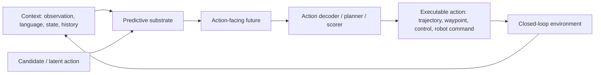

## Summary
WAM 서베이는 [[WorldActionModel]]을 단순 video generation이 아닌 "예측된 미래 표현이 action 선택 경로 안에 남아 제어 의사결정에 쓰이는 predictive-action model"로 재정의하고, [[VLA]]와 video world model과의 경계를 명확히 정리한다. 세 가지 설계 철학(Render-and-Decode, Latent-Only, Video-Generation-Free)과 네 축 해부(taxonomy: predictive substrate, backbone, action coupling, deployment regime)를 제시한다.

## 핵심 기여
- [[WorldActionModel]]을 "action-facing predictive model"로 정의하여 VLA, video world model, broad world model과의 용어 혼선 해소
- Render-and-Decode, Latent-Only, Video-Generation-Free의 3분류 taxonomy 제시
- predictive substrate, backbone, action coupling, deployment regime의 4축 anatomy 제시
- 평가를 visual quality(FVD)가 아닌 action utility, causality, latency, generalization으로 재정렬
- [[VLA]]와 world model 연구를 robotics/autonomous driving deployment 관점에서 연결

## Architecture / Pipeline

## Input / Output / Action Representation

| 항목 | 내용 |
|---|---|
| 입력 | observation, language/instruction, state/history, candidate action |
| 중간 표현 | rendered future, latent future, language/geometric state, action-conditioned rollout |
| 출력 | action score, action chunk, trajectory, waypoint, low-level control |
| 핵심 질문 | 미래 표현이 action selection에 실제로 쓰이는가? |

## Training / Evaluation 관점

- video generation pretraining을 action-conditioned setting으로 재사용 가능
- [[VLM]]/[[LLM]] backbone은 video 없이도 action-relevant reasoning substrate가 될 수 있음
- 평가는 FVD/visual fidelity보다 closed-loop success, policy speed, safety, causal intervention, latency를 중시해야 함

## 강점
- [[VLA]] for [[AutonomousDriving]]/world model 연구를 정리할 taxonomy 제공
- "영상 생성이 좋다 = control이 좋다"는 단순화 경계
- latency와 action-label cost를 taxonomy 안에 포함

## 한계
- 서베이 특성상 새 benchmark 실험 미제공
- WAM의 경계가 실제 구현에서는 여전히 모호할 수 있음
- autonomous driving 전용 benchmark보다 robotics/[[VLA]]/world model 전반을 폭넓게 다룸

## Connections
- [[ReflectDrive]] — autonomous driving VLA planner 비교 기준축 제공
- [[OmniDreams]] — Cosmos 기반 generative world model과 WAM backbone 제안 관련
- [[TBD-VLA]] — 시간 블록 Diffusion 기반 VLA와 WAM architecture 비교
- [[VisualThink-VLA]] — visual intermediate reasoning과 WAM predictive substrate 관련
- [[VLA]] — WAM 정의로 VLA와 world model 경계 재정립
- [[WorldActionModel]] — 본 서베이의 핵심 정의 개념
- [[AutonomousDriving]] — WAM의 주요 deployment regime

## Contradictions
- 기존 "world model = video generation" 인식을 경계하며, future representation이 action decision path 안에 남아있어야 WAM으로 인정하는 엄격한 정의를 제시.
