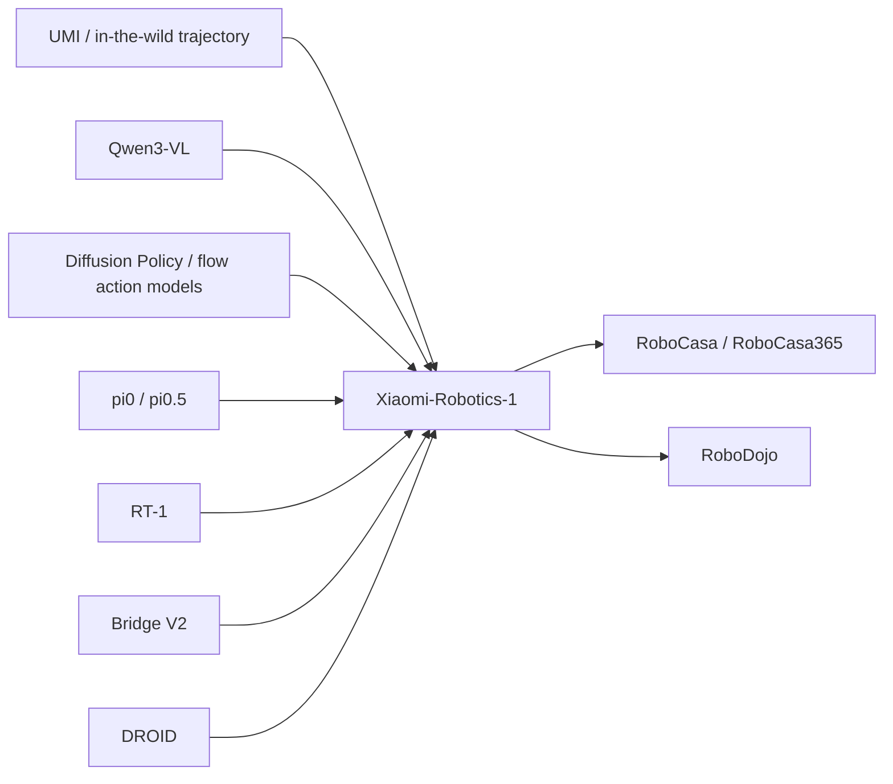

# Xiaomi-Robotics-1 참고 레퍼런스 요약

> Semantic Scholar references endpoint는 실행 중 429 rate limit이 발생해 arXiv HTML references를 기준으로 핵심 문헌을 선별했다. 가능하면 arXiv ID/URL을 함께 병기했다.

## 1. π0: A Vision-Language-Action Flow Model for General Robot Control

- 인용: Kevin Black et al., 2024
- arXiv: <https://arxiv.org/abs/2410.24164>
- 관계: [[Xiaomi-Robotics-1]]이 직접 비교/참조하는 대표적인 VLA flow/action 모델 계열. Continuous robot action을 language-conditioned policy로 생성.
- 차이: [[pi0]]는 general robot control을 위한 VLA flow model 선행연구이고, Xiaomi는 [[UMI]] 100K+ trajectory 기반 pre-training 및 cross-embodiment post-training scaling을 더 강화한 프레임.

## 2. π0.5: A Vision-Language-Action Model with Open-World Generalization

- 인용: Kevin Black et al., 2025
- arXiv: <https://arxiv.org/abs/2504.16054>
- 관계: [[Xiaomi-Robotics-1]]의 downstream fine-tuning baseline 후보. Open-world generalization을 강조하는 VLA policy.
- 차이: Xiaomi는 [[StateTransitionCaptioning]] 기반의 대규모 사전 학습(`100K+ hours`)과 cross-embodiment 정렬을 통해 데이터/모델 확장을 중심으로 성능 향상을 강조.

## 3. RT-1: Robotics Transformer for Real-World Control at Scale

- 인용: Anthony Brohan et al., 2022
- arXiv: <https://arxiv.org/abs/2212.06817>
- 관계: [[RT-1]]은 대규모 real-world 데이터로 transformer policy를 학습한 핵심 baseline.
- 차이: RT-1은 trajectory 자체를 직접 transformer policy로 학습하는 흐름이며, Xiaomi는 [[Qwen3-VL]] 기반의 VLM+DiT 구조와 state transition language supervision을 결합.

## 4. Universal Manipulation Interface: In-the-Wild Robot Teaching without In-the-Wild Robots

- 인용: Cheng Chi et al., 2024
- arXiv: <https://arxiv.org/abs/2402.10329>
- 관계: [[UMI]]의 데이터 수집 핵심 기반.
- 왜 중요함: Xiaomi의 100K+ hours scale은 전통적 teleoperation 만으로는 어려우며, UMI-style data collection이 병목 완화에 핵심.

## 5. Diffusion Policy: Visuomotor Policy Learning via Action Diffusion

- 인용: Cheng Chi et al., 2024
- 저널: International Journal of Robotics Research
- 관계: 연속 action generation을 diffusion/denoising 계열로 처리한 중요한 선행연구.
- 차이: Diffusion Policy는 action diffusion 계열로 action generation 자체를 다루고, Xiaomi는 VLM backbone + flow/action generation을 결합해 scaling 관점으로 확장.

## 6. Qwen3-VL Technical Report

- 인용: Shuai Bai et al., 2025
- arXiv: <https://arxiv.org/abs/2511.21631>
- 관계: [[Xiaomi-Robotics-1]]의 VLM backbone.
- 시사점: VLA 성능은 low-level action generator뿐 아니라 VLM 인코더의 multimodal 표상 품질 의존이 큼.

## 7. Xiaomi-Robotics-0: An Open-Sourced Vision-Language-Action Model with Real-Time Execution

- 인용: Rui Cai et al., 2026
- arXiv: <https://arxiv.org/abs/2602.12684>
- 관계: Xiaomi 팀 이전 VLA baseline/선행작.
- 차이: Xiaomi-Robotics-1은 100K+ trajectory scaling, cross-embodiment scaling recipe, data/model scaling 실험 폭을 넓혀 확장 버전 성격.

## 8. Bridge V2

- 관계: Xiaomi의 post-training 데이터 구성에 사용되는 공개 로봇 데이터셋 중 하나.
- 시사점: proprietary robot log만으로는 embodiment 다양성이 제한될 수 있어, [[Bridge V2]]와 같은 공개 데이터가 generalization에 중요.

## 9. DROID: A Large-Scale In-the-Wild Robot Manipulation Dataset

- 관계: Xiaomi post-training에 포함되는 공개 궤적 데이터.
- 시사점: UMI pre-training은 비로봇/휴대형 데이터 scaling을 보완하고, DROID/Bridge 계열은 실제 robot embodiment alignment을 강화.

## 10. RoboCasa / RoboCasa365

- 관계: Xiaomi의 주요 simulation benchmark.
- 결과 맥락: Xiaomi는 [[RoboCasa365]]에서 57.6% success rate로 이전 최고치(46.6%)를 상향, simulation generalization 및 pre-training scaling 효과를 입증.

## 참고 문헌 맵

## 읽기 우선순위

1. **UMI** — Xiaomi 데이터 scaling의 전제.
2. **π0 / π0.5** — VLA flow/action model의 직접 선행 흐름.
3. **RT-1 / DROID / Bridge V2** — robot data scaling 및 cross-embodiment 정렬 맥락.
4. **Diffusion Policy** — continuous action generation을 generative 방식으로 다루는 기초.
5. **RoboCasa365 / RoboDojo** — foundation policy benchmark 해석 우선순위.

## Key Claims

- [[Xiaomi-Robotics-1]]의 pre/post-training 연결성은 [[pi0]], [[pi0.5]], [[RT-1]] 및 open dataset 생태계를 중심으로 정렬된다.
- [[UMI]]는 단순 데이터 수집 프레임이 아니라, 대규모 pre-training의 실용적 scaling 기반이다.
- 행동 생성의 generative 계열은 [[Diffusion Policy]]와 유사 분기를 공유하지만, Xiaomi는 [[Qwen3-VL]]+DiT 방식으로 구조를 결합했다.
- 공개 데이터셋([[Bridge V2]], [[DROID]])은 embodiment 정합성 확보에 여전히 핵심이며, simulation 평가는 [[RoboCasa365]], [[RoboDojo]]로 이어진다.

## Connections

- [[Xiaomi-Robotics-1]] — 현재 문헌의 전체 맥락 중심축.
- [[UMI]] — Xiaomi 데이터 수집 병목 완화의 핵심 인터페이스.
- [[pi0]] / [[pi0.5]] / [[RT-1]] — 상위 VLA flow/action 선행군.
- [[Qwen3-VL]] — 모델 backbone으로 언급됨.
- [[Diffusion Policy]] / [[DiffusionTransformer]] — action generation 계열 비교 대상.
- [[Bridge V2]], [[DROID]] — post-training 공개 데이터 축.
- [[RoboCasa]] / [[RoboCasa365]] / [[RoboDojo]] — 성능 검증 축.

## Contradictions

- 기존 문헌과 정면 충돌하는 주장 없음. 기존 [[ScalingLaws]], [[VLA]] 기반 일반화 서사와 정합됨.

## Sources

- references: arXiv HTML references 섹션 기반 수기 정리
- source metadata: <https://arxiv.org/html/2607.15330#bib>
